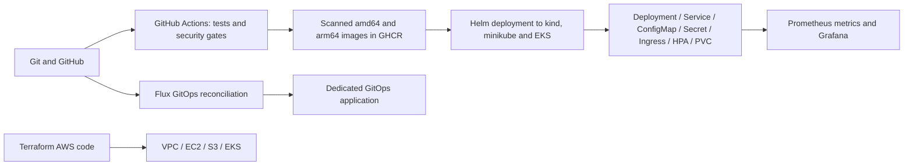

# Final DevOps Project - Operations Notes

**Name:** Rajasurya J

**Enrollment number:** 24BCS10086

## Project overview

I built Operations Notes, a web application for deployment checks and incident notes.
The HTML frontend calls a Python HTTP API with GET, POST, PUT and DELETE operations.
SQLite stores notes on a Docker volume or Kubernetes PVC. The application exposes health
checks and Prometheus metrics. I deployed it locally with Docker and minikube, configured
CI/CD in GitHub Actions, and deployed it to EKS using Terraform and Helm.



## Technologies and execution environment

The host is macOS 26.7.1 arm64 with Docker Desktop 29.2.1, minikube 1.39.0, kubectl 1.37.0,
Helm 3.22.0, Terraform 1.16.4, AWS CLI 2.36.41 and Flux 2.9.6. GitHub Actions uses Ubuntu runners
with Python 3.13 and an isolated kind cluster. Docker containers and minikube's containerd 2.3.4 run Linux.

Sessions 9/13/14/15 used the `minikube` vfkit VM. Its 3 GB allocation was insufficient
for the complete monitoring stack, so I used a separate `devops-completion` vfkit VM
with 4096 MB and 3 CPUs for the final project. Its address was `192.168.64.3`;
`minikube -p devops-completion ip` returns the address for another run.

The AWS deployment uses `devops-homework` in `ap-southeast-2`, EKS Kubernetes 1.36
and one amd64 Amazon Linux 2023 worker with containerd 2.2.7. Kubeconfig, authentication
caches, local variable files and Terraform state stay outside Git.

## Application setup

Run from `final-devops-project`:

```bash
python3 -m unittest discover -s application/tests -v
DB_PATH=/tmp/ops-notes.db python3 application/app.py
curl http://127.0.0.1:8080/health
```

All nine API tests passed locally and remotely. SQL uses bound parameters; the frontend renders notes with
`textContent`; requests enforce body/text limits. `/health` tests the process and `/ready` tests the database.
`/api/config` reports a boolean for Secret injection, never the Secret value. This classroom Secret is not
an application login mechanism. The UI has no authentication and is intended for this local lab.

## Docker setup

The normal reproducible build is:

```bash
docker compose -p devops-homework -f docker/compose.yaml up -d --build
curl http://127.0.0.1:18080/health
```

Local registry metadata and the Trivy database download stalled. I built and scanned the image
in Actions, then downloaded it for the local deployment. The `ops-notes-arm64` artifact was downloaded
from the successful run, imported with `docker load -i ops-notes-arm64.tar`, then started locally:

```bash
OPS_NOTES_IMAGE=ghcr.io/rajasurya-rjs/devops-heros/ops-notes:e1b3f65fc09b6226b28141fc6748c03ceda87c93-arm64 \
  docker compose -p devops-homework -f docker/compose.yaml up -d --no-build
docker compose -p devops-homework -f docker/compose.yaml ps
```

The running image uses UID/GID 10001 and a named SQLite volume. [Compose output](evidence/compose.txt)
and [local scanner output](evidence/security-local.txt) retain the execution details.
GHCR access may require an authorized package login; the Actions image artifact also enables local import.

## Kubernetes and Helm deployment

Host commands used the dedicated homework cluster:

```bash
minikube start -p devops-completion --driver=vfkit --memory=4096 --cpus=3 --kubernetes-version=v1.37.0
kubectl config use-context devops-completion
minikube -p devops-completion addons enable ingress
minikube -p devops-completion addons enable metrics-server
minikube -p devops-completion image load ops-notes-arm64.tar
./kubernetes/deploy.sh \
  --set image.repository=ghcr.io/rajasurya-rjs/devops-heros/ops-notes \
  --set image.tag=e1b3f65fc09b6226b28141fc6748c03ceda87c93-arm64
kubectl get pods,svc,pvc,hpa,ingress -n final-homework
curl -H 'Host: ops.homework.local' http://192.168.64.3/health
```

The chart creates two replicas, ClusterIP Service, ConfigMap, Secret references, nginx Ingress,
CPU HPA (2–5 replicas, 50% target), startup/readiness/liveness probes and a 256 Mi PVC.
`deploy.sh` creates a random temporary demo Secret outside Git without printing it. A ConfigMap checksum
triggers rollouts. Ingress health, CRUD, configuration injection, metrics and persistence across Pod replacement
were verified in [runtime output](evidence/runtime-verification.txt).
[Helm deployment output](evidence/helm-deployment.txt) records the release.

SQLite on a single-node RWO PVC is a homework demonstration; it is not a distributed production database.
Session 13 independently demonstrates HPA scale-up under load and scale-down.

## Terraform infrastructure

[Terraform configuration](terraform/) reuses the Session 19 VPC/EC2/S3 project and adds an EKS
control plane, managed worker group, IAM roles, control-plane logs, Pod Identity and EBS CSI add-ons.
The VPC has two public subnets in separate availability zones, routing and restricted HTTP ingress;
EC2 EBS and private S3 are encrypted. The EKS public API endpoint is restricted to `web_cidr` and the
private endpoint is enabled. The example CIDR is a documentation address and must be replaced with the
operator's IPv4/32. This is a small public-subnet lab design.

`terraform init`, `fmt`, `validate` and the [configuration tests](evidence/terraform-mock-tests.txt)
passed. After the cloud fixes, I reran [validation](evidence/aws-configuration-validation.txt)
and [the mock-provider test](evidence/aws-configuration-mock-tests.txt).
The first plan attempt failed because credentials were missing
([error output](evidence/terraform-plan-attempt.txt)). I authenticated with `devops-homework`
and supplied the selected Region and deployment variables in a local file.

The [initial plan](evidence/aws-plan.txt) selected 26 resources. Terraform provisioned the VPC,
EC2 web server, private S3 bucket, IAM service roles and Kubernetes 1.36 EKS control plane.
[Resource checks](evidence/aws-infrastructure-verification.json) confirm EKS `ACTIVE`,
restricted public API access, enabled private endpoint, EC2 status checks passing, S3 AES256 encryption
and all four public-access blocks. The [EC2 HTTP check](evidence/aws-web-http.txt) returned HTTP 200
and the expected Terraform web page. [Terraform outputs](evidence/aws-outputs.json) record resource IDs.

The first worker type, `t3.medium`, was rejected by the project's Free plan before any worker launched.
The [worker launch error](evidence/aws-node-launch-failure.json) and [first apply log](evidence/aws-first-apply.txt)
show the error. AWS's [eligible instance-type API](evidence/aws-free-tier-instance-types.json) identified
`c7i-flex.large` (2 vCPUs / 4 GiB); I updated the node group to use this eligible type.
The [corrected plan](evidence/aws-corrected-plan.txt) first
attempted deletion; AWS left the empty group in `DELETING`, recorded in the
[interrupted deletion log](evidence/aws-worker-delete-attempt.txt). The
[replacement plan](evidence/aws-replacement-plan.txt) creates `homework-workers-free` before
removing the failed group. The [worker/add-on attempt](evidence/aws-ebs-apply-attempt.txt) records
the successful worker creation and the storage dependency error. The
[final refreshed plan](evidence/aws-final-plan.txt) reports **No changes**, and the
[successful final apply](evidence/aws-apply.txt) confirms zero remaining resource changes.
The [cluster API checks](evidence/aws-cluster-verification.json) confirm the eligible worker and all
three add-ons `ACTIVE`, with the failed group absent. The worker uses encrypted gp3 storage and IMDSv2.
The cluster's pre-existing CloudWatch log group was [imported](evidence/aws-log-group-import.txt)
into Terraform and configured with one-day retention.

Terraform commands from the repository root:

```bash
export AWS_PROFILE=devops-homework AWS_REGION=ap-southeast-2
aws freetier get-account-plan-state --region ap-southeast-2 --profile devops-homework
terraform -chdir=final-devops-project/terraform init -input=false
terraform -chdir=final-devops-project/terraform fmt -check
terraform -chdir=final-devops-project/terraform validate
terraform -chdir=final-devops-project/terraform plan \
  -var-file="$HOME/.aws/devops-homework-final-vars.json" -out=homework.tfplan
terraform -chdir=final-devops-project/terraform apply -input=false homework.tfplan
terraform -chdir=final-devops-project/terraform output
```

The variable file contains `region`, a unique `bucket_name`, my IPv4/32 `web_cidr`,
`cluster_version="1.36"` and `web_ami_id`. For another deployment, use the example variable
file and set these values. The final refreshed plan reports **No changes**; the final apply
reports zero additions, changes or removals.

The shared Session 19 module uses Standard CPU credits for its `t3.micro` web server.
A later [plan](evidence/aws-ami-drift-plan.json) selected a newly published Amazon Linux AMI,
which would replace that server. I added the optional `ami_id` module input and pinned
`web_ami_id="ami-0720cb7af233b0529"` for this deployment. Leaving `ami_id` unset uses the
latest-image lookup.

The project uses public subnets and ClusterIP Services, without a NAT gateway or public
LoadBalancer Service. The plan-state check returned **FREE / ACTIVE / $120 remaining credits**
at the recorded check. AWS usage consumes credits; the
[Free-plan FAQ](https://aws.amazon.com/free/free-tier-faqs/) explains the billing conditions.

## AWS Kubernetes deployment

I use a separate kubeconfig for EKS: `~/.kube/devops-homework-eks.json`.
[kubernetes/deploy-aws.sh](kubernetes/deploy-aws.sh) adds the encrypted gp3 StorageClass and the
open-source NGINX controller (v5.6.3, chart 2.7.3), then runs the application and monitoring
scripts. NGINX is a ClusterIP Service accessed through localhost port forwarding. The tested multi-platform
GHCR image is used, so the amd64 worker does not receive the local arm64-only tag.

The Helm client stalled fetching NGINX's external JSON schema. Downloading the identical official schema
and resolving it locally allowed schema validation and chart linting to pass.
The [deployment log](evidence/aws-kubernetes-deployment.txt) records NGINX and the application
Helm releases, plus successful Prometheus and Grafana rollouts. Commands used from the repository root
with the separate kubeconfig were:

```bash
export KUBECONFIG="$HOME/.kube/devops-homework-eks.json"
./final-devops-project/kubernetes/deploy-aws.sh
kubectl port-forward -n ingress-nginx svc/aws-ingress-nginx-ingress-controller 28080:80
# In separate terminals, with the same KUBECONFIG:
kubectl port-forward -n final-homework svc/prometheus 29090:9090
kubectl port-forward -n final-homework svc/grafana 23000:3000
NOTE_RECORD=/tmp/aws-note.json \
  python3 final-devops-project/kubernetes/verify-aws-runtime.py
```

I set `NGINX_CHART` to the downloaded official chart. The deployment helper also supports
downloading the chart and resolving its schema. Wait for port-forward to print
`Forwarding from 127.0.0.1` before accessing the application.

[API checks](evidence/aws-runtime-verification.txt) verifies health/readiness, GET/POST/PUT/DELETE,
ConfigMap values, Secret injection as a boolean and application metrics.
[Pod replacement verification](evidence/aws-persistence-verification.txt) records both old and new Pod
UIDs and HTTP 200 with the unchanged saved note after replacing both replicas. The 1 GiB RWO PVC is
bound to encrypted gp3 volume `vol-0f0d12f858647d5dd`, confirmed by the AWS volume check.
[Kubernetes checks](evidence/aws-kubernetes-verification.txt) record two Ready replicas, all three probes,
the image SHA, HPA CPU readings, Helm releases and JSON request logs.

Cloud [Prometheus targets](evidence/aws-prometheus-targets.json) report the application **UP**; the
[deliberate unavailable-target alert](evidence/aws-prometheus-alerts.json) is **firing**.
[Grafana health](evidence/aws-grafana-health.json) reports database `ok`; the dashboard is shown below.

Flux was [installed](evidence/aws-flux-install.txt) with source and kustomize controllers:

```bash
flux install --namespace hw-gitops --components=source-controller,kustomize-controller
kubectl apply -f final-devops-project/gitops/eks/source.yaml
flux reconcile source git homework -n hw-gitops
flux reconcile kustomization notes -n hw-gitops --with-source
flux get all -n hw-gitops
```

The [EKS overlay](gitops/eks/) changes only the image tag to the tested multi-platform manifest.
The local cluster uses `gitops/app/`; EKS uses `gitops/eks/`.
[Cloud reconciliation](evidence/aws-gitops-verification.txt) shows both Flux resources Ready at commit
`c0da73ba`, two Ready GitOps replicas and `/api/config` response `gitops-v2`.
The GitOps copy deliberately has no Secret; the persistent Helm application separately verified Secret injection.

## Cleanup

The final project remains deployed. The [cleanup plan](evidence/aws-cleanup-plan.txt)
contains 28 Terraform resources and has not been applied. To remove the project, first delete
the application's PVC while EBS CSI is running and check that its dynamic volume is removed,
then apply the Terraform destroy plan. Sessions 18 and 19 were destroyed after their checks.

## CI/CD and DevSecOps

The [executable root workflow](../.github/workflows/devops-homework.yml) runs nine API tests, Bandit SAST,
pip-audit SCA, redacted Gitleaks, Docker builds and Trivy image scans. The application has no third-party
runtime requirements, so pip-audit has no runtime packages to scan. Trivy rejects fixable
HIGH/CRITICAL vulnerabilities with `--ignore-unfixed`.
The successful build pushes both architectures and their multi-platform SHA manifest to GHCR. CD loads the
tested image into kind, installs Helm and verifies HTTP, CRUD, metrics and Kubernetes resources.

[Successful Actions run](https://github.com/rajasurya-rjs/devops-heros/actions/runs/37272214475) has all three jobs
passing. [Run metadata](evidence/ci-run.json), [complete runner log](evidence/ci-run.log), [security reports](evidence/)
and [CD output](evidence/ci-deployment.txt) contain the runner results.
`GITHUB_TOKEN` stays in runner secrets; temporary Kubernetes credentials are never committed.

The first image gate rejected unused installer dependencies. I removed those unnecessary packages and reran the pipeline successfully.
[Security gate error](evidence/pipeline-failures/security-gate.txt)

The project-local `.github/workflows/README.md` links the root workflow because GitHub executes root workflows.

## Monitoring and GitOps

[Monitoring manifests](monitoring/) run Prometheus v3.15.0 and Grafana 13.2.3 with a provisioned data source
and four dashboard panels: HTTP responses/errors, cumulative CPU seconds and Linux peak RSS.
`kubectl top` provides current Pod CPU/memory. JSON request logs supply event context.
The application target is **UP**; `TargetUnavailable` is **firing** for a separately labelled deliberately
unavailable target. [Targets](evidence/prometheus-targets.json), [alerts](evidence/prometheus-alerts.json)
and [commands/output](evidence/monitoring-gitops.txt) show those results.

```bash
./monitoring/deploy.sh
kubectl port-forward -n final-homework svc/prometheus 19090:9090
# In another terminal:
kubectl port-forward -n final-homework svc/grafana 13000:3000
```

Open `http://127.0.0.1:19090/targets` and
`http://127.0.0.1:13000/d/ops-homework/operations-notes-homework`.
Grafana's anonymous Viewer access is scoped to this local lab through ClusterIP and localhost port forwarding.
The application exposes metrics and JSON logs. Session 20 explains how distributed tracing
connects requests across services.

In the minikube deployment, Flux watches this repository's `main` branch and reconciles
only `gitops/app/` into `gitops-homework`.
A Git commit changed the configuration from `gitops-v1` to `gitops-v2`; the Pod template annotation
caused replacement Pods to consume the updated ConfigMap. Both Flux resources became Ready, and the application
returned `gitops-v2`. A deliberate live scale from 2 replicas to 1 was automatically restored to 2 by Flux.
[Git rollout](evidence/gitops-rollout.txt) and [drift recovery](evidence/gitops-drift.txt) show the rollout and recovery.
This GitOps copy uses temporary data; the Helm-managed main application owns the persistent PVC.

## Final troubleshooting challenge

[Runnable drill](kubernetes/troubleshooting/verify.sh) intentionally changes the homework application
and restores the correct image, selector and probe with an exit trap. [Full output](evidence/troubleshooting.txt)
records resource inspection, errors, fixes and final health checks.

| Issue | Investigation / root cause | Fix and verification |
|---|---|---|
| Wrong Service selector | EndpointSlice loses backend addresses; nginx Ingress eventually returns 503. | Restore selector `app=ops-notes`; endpoint propagation and HTTP 200 verified. |
| Nonexistent image | Pod Events report ErrImagePull / ImagePullBackOff; old replicas remain available during rollout. | Restore the scanned SHA image; Deployment rollout and HTTP 200 verified. |
| Wrong readiness URL | Running replacement Pod gets HTTP 404 from the probe and cannot become Ready. | Restore `/ready`; rollout and HTTP 200 verified. |

The first selector check ran before ingress cache convergence and still returned 200; that attempt is
retained in [first-attempt output](evidence/troubleshooting-first-attempt.txt). Bounded retries then observed
the 503 before fixing it. Other troubleshooting included the memory-limited Grafana startup,
minikube resource pressure, installer vulnerabilities and registry download stalls.

Cloud deployment exposed an EBS CSI dependency error: the association originally depended on a healthy
driver, but the driver needed that association to pass its EC2 health check. The
[driver error log](evidence/aws-ebs-initial-failure.txt) showed `UnauthorizedOperation` under the node role.
The dedicated Pod Identity association was [created](evidence/aws-ebs-identity-creation.json) and
[imported](evidence/aws-ebs-identity-import.txt) into Terraform; the dependency now creates it before the driver.
After restarting only the driver Deployment, its rollout succeeded and
[the AWS API](evidence/aws-ebs-recovery.json) reported `ACTIVE` with no health issues.
Terraform's interrupted-create marker was [cleared](evidence/aws-ebs-preserve-verified-addon.txt) only after
checking that the add-on was healthy.
The final plan reports no changes.
[Provider import documentation](https://registry.terraform.io/providers/hashicorp/aws/latest/docs/resources/eks_pod_identity_association)
specifies the comma-separated cluster/association identifier used.

## Screenshots


## Observations

A healthy old ReplicaSet can keep an application available while a replacement fails; inspect rollout and
Pod conditions rather than only the homepage. Endpoint and ingress changes converge asynchronously, so
verification needs bounded retries. A Running container can still lack an HTTP listener; resource limits and
readiness checks matter. Preserve security gates and remove unnecessary vulnerable runtime dependencies.
An architecture-matched tested artifact provides reproducible deployment when local registry downloads fail.
Finally, offline Terraform tests prove configuration assertions, not AWS provisioning.

## Result

Operations Notes runs locally and on EKS. The checks cover the API, configuration injection,
health probes, PVC persistence, HPA metrics, CI/CD security gates, Prometheus/Grafana and
Flux reconciliation. The troubleshooting drill restores the application after each failure.
