# Final DevOps Project - Operations Notes

**Name:** Rajasurya J

**Enrollment number:** 24BCS10086

## Project overview and status

Operations Notes is an original web application for deployment checks and incident notes.
The HTML frontend calls a Python HTTP API with GET, POST, PUT and DELETE operations.
SQLite persists notes on a Docker volume or Kubernetes PVC. The application exposes health checks and
Prometheus metrics. The local application, remote CI/CD, security gates, Helm, monitoring and GitOps have
been executed and verified. **The real AWS Terraform and EKS deployment is also complete:** the
worker, encrypted EBS storage, application, monitoring and Flux reconciliation passed actual cloud checks.
Offline Terraform validation and mock tests are documented separately from real AWS execution.

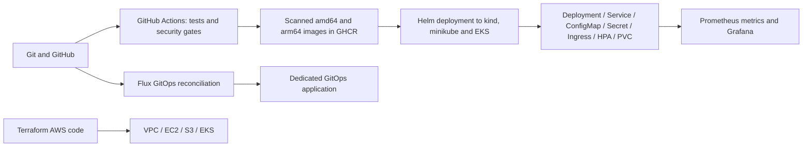
```mermaid
flowchart LR
  Git[Git and GitHub] --> CI[GitHub Actions: tests and security gates]
  CI --> Image[Scanned amd64 and arm64 images in GHCR]
  Image --> Helm[Helm deployment to kind, minikube and EKS]
  Helm --> K8s[Deployment / Service / ConfigMap / Secret / Ingress / HPA / PVC]
  K8s --> Monitor[Prometheus metrics and Grafana]
  Git --> Flux[Flux GitOps reconciliation]
  Flux --> Demo[Dedicated GitOps application]
  Terraform[Terraform AWS code] --> Cloud[VPC / EC2 / S3 / EKS]
```

## Technologies and execution environment

The host is macOS 26.7.1 arm64 with Docker Desktop 29.2.1, minikube 1.39.0, kubectl 1.37.0,
Helm 3.22.0, Terraform 1.16.4, AWS CLI 2.36.41 and Flux 2.9.6. GitHub Actions uses Ubuntu runners
with Python 3.13 and an isolated kind cluster. Docker containers and minikube's containerd 2.3.4 run Linux;
Linux output here is not attributed to the macOS host.

The existing `minikube` vfkit VM was preserved. Sessions 9/13/14/15 ran there. Its 3 GB allocation became
insufficient for the complete monitoring stack, so it was stopped without deleting it. The final project
runs in a separate `devops-completion` vfkit VM with 4096 MB and 3 CPUs. Its verified address is
`192.168.64.3`; use `minikube -p devops-completion ip` rather than assuming a fixed address on another machine.
The class repository was inspected for requirements and structure; no reference implementation was copied.
The cloud run uses the separate `devops-homework` AWS project in `ap-southeast-2`, EKS Kubernetes 1.36
and one amd64 Amazon Linux 2023 worker. Its observed runtime is containerd 2.2.7.
AWS CLI authentication/MCP configuration, kubeconfig, variable files and Terraform state are outside Git.

## Application setup

Run from `final-devops-project`:

```bash
python3 -m unittest discover -s application/tests -v
DB_PATH=/tmp/ops-notes.db python3 application/app.py
curl http://127.0.0.1:8080/health
```

All nine API tests passed locally and remotely. SQL uses bound parameters; the frontend renders notes with
`textContent`; requests enforce body/text limits. `/health` tests the process and `/ready` tests the database.
`/api/config` reports a boolean for Secret injection, never the Secret value. This classroom Secret is not
an application login mechanism. The UI has no authentication and is intended for this local lab.

## Docker setup

The normal reproducible build is:

```bash
docker compose -p devops-homework -f docker/compose.yaml up -d --build
curl http://127.0.0.1:18080/health
```

Registry metadata and the local Trivy database download stalled during this execution. The final image
was built and scanned successfully in Actions instead. The genuine `ops-notes-arm64` artifact was downloaded
from the successful run, imported with `docker load -i ops-notes-arm64.tar`, then started locally:

```bash
OPS_NOTES_IMAGE=ghcr.io/rajasurya-rjs/devops-heros/ops-notes:e1b3f65fc09b6226b28141fc6748c03ceda87c93-arm64 \
  docker compose -p devops-homework -f docker/compose.yaml up -d --no-build
docker compose -p devops-homework -f docker/compose.yaml ps
```

The running image uses UID/GID 10001 and a named SQLite volume. [Actual Compose output](evidence/compose.txt)
and [local scanner output](evidence/security-local.txt) retain the execution details.
GHCR access may require an authorized package login; the Actions image artifact also enables verified local import.

## Kubernetes and Helm deployment

Host commands used the dedicated homework cluster:

```bash
minikube start -p devops-completion --driver=vfkit --memory=4096 --cpus=3 --kubernetes-version=v1.37.0
kubectl config use-context devops-completion
minikube -p devops-completion addons enable ingress
minikube -p devops-completion addons enable metrics-server
minikube -p devops-completion image load ops-notes-arm64.tar
./kubernetes/deploy.sh \
  --set image.repository=ghcr.io/rajasurya-rjs/devops-heros/ops-notes \
  --set image.tag=e1b3f65fc09b6226b28141fc6748c03ceda87c93-arm64
kubectl get pods,svc,pvc,hpa,ingress -n final-homework
curl -H 'Host: ops.homework.local' http://192.168.64.3/health
```

The chart creates two replicas, ClusterIP Service, ConfigMap, Secret references, nginx Ingress,
CPU HPA (2–5 replicas, 50% target), startup/readiness/liveness probes and a 256 Mi PVC.
`deploy.sh` creates a random temporary demo Secret outside Git without printing it. A ConfigMap checksum
triggers rollouts. Ingress health, CRUD, configuration injection, metrics and persistence across Pod replacement
were verified in [runtime output](evidence/runtime-verification.txt).
[Helm deployment output](evidence/helm-deployment.txt) records the release.

SQLite on a single-node RWO PVC is a homework demonstration; it is not a distributed production database.
Session 13 independently demonstrates actual HPA scale-up under load and scale-down.

## Terraform infrastructure

[Terraform configuration](terraform/) reuses the original Session 19 VPC/EC2/S3 project and adds an EKS
control plane, managed worker group, IAM roles, control-plane logs, Pod Identity and EBS CSI add-ons.
The VPC has two public subnets in separate availability zones, routing and restricted HTTP ingress;
EC2 EBS and private S3 are encrypted. The EKS public API endpoint is restricted to `web_cidr` and the
private endpoint is enabled. The example CIDR is a documentation address and must be replaced with the
operator's actual IPv4/32. This is a small public-subnet lab design.

`terraform init`, `fmt`, `validate` and the [initial mock configuration test](evidence/terraform-mock-tests.txt) passed.
The corrected configuration also passed [validation](evidence/aws-configuration-validation.txt) and
[its offline mock test](evidence/aws-configuration-mock-tests.txt).
The mock test creates no AWS resources. The [earlier credential failure](evidence/terraform-plan-attempt.txt)
is preserved as historical evidence. Subsequent commands used the authorized `devops-homework` profile,
selected Region `ap-southeast-2`, and an external variable file outside Git.

The [real initial plan](evidence/aws-plan.txt) selected 26 resources. Terraform provisioned the VPC,
EC2 web server, private S3 bucket, IAM service roles and Kubernetes 1.36 EKS control plane.
[Actual API verification](evidence/aws-infrastructure-verification.json) confirms EKS `ACTIVE`,
restricted public API access, enabled private endpoint, EC2 status checks passing, S3 AES256 encryption
and all four public-access blocks. The [EC2 HTTP check](evidence/aws-web-http.txt) returned HTTP 200
and the expected Terraform web page. [Actual outputs](evidence/aws-outputs.json) record resource IDs.

The first worker type, `t3.medium`, was rejected by the project's Free plan before any worker launched.
The [real launch failure](evidence/aws-node-launch-failure.json) and [first apply log](evidence/aws-first-apply.txt)
are retained. AWS's [eligible instance-type API](evidence/aws-free-tier-instance-types.json) identified
`c7i-flex.large` (2 vCPUs / 4 GiB); the corrected configuration keeps the healthy control plane and
replaces only the failed node group. The [corrected plan](evidence/aws-corrected-plan.txt) first
attempted deletion; AWS left the empty group in `DELETING`, recorded in the
[interrupted deletion log](evidence/aws-worker-delete-attempt.txt). The
[replacement plan](evidence/aws-replacement-plan.txt) creates `homework-workers-free` before
removing the failed group. The [worker/add-on attempt](evidence/aws-ebs-apply-attempt.txt) records
the successful worker creation and the storage dependency error. The
[final refreshed plan](evidence/aws-final-plan.txt) reports **No changes**, and the
[successful final apply](evidence/aws-apply.txt) confirms zero remaining resource changes.
The [cluster API checks](evidence/aws-cluster-verification.json) confirm the eligible worker and all
three add-ons `ACTIVE`, with the failed group absent. The worker uses encrypted gp3 storage and IMDSv2.
The cluster's pre-existing CloudWatch log group was [imported](evidence/aws-log-group-import.txt)
into Terraform and configured with one-day retention.

Commands used from the repository root:

```bash
export AWS_PROFILE=devops-homework AWS_REGION=ap-southeast-2
# Before resource changes: require ACTIVE FREE with remaining credits.
aws freetier get-account-plan-state --region ap-southeast-2 --profile devops-homework
terraform -chdir=final-devops-project/terraform plan \
  -var-file=/tmp/devops-audit-20261005/final-vars.json -out=homework.tfplan
terraform -chdir=final-devops-project/terraform apply -input=false homework.tfplan
# After correcting the rejected instance type:
terraform -chdir=final-devops-project/terraform plan \
  -var-file=/tmp/devops-audit-20261005/final-vars.json -out=homework-corrected.tfplan
terraform -chdir=final-devops-project/terraform apply -input=false homework-corrected.tfplan
# Create the eligible worker first while the failed group is being removed:
terraform -chdir=final-devops-project/terraform plan \
  -var-file=/tmp/devops-audit-20261005/final-vars.json -out=homework-replacement.tfplan
terraform -chdir=final-devops-project/terraform apply -input=false homework-replacement.tfplan
# After the documented Pod Identity recovery and import:
terraform -chdir=final-devops-project/terraform plan \
  -var-file=/tmp/devops-audit-20261005/final-vars.json -out=homework-final.tfplan
terraform -chdir=final-devops-project/terraform apply -input=false homework-final.tfplan
```

The local variable file contains `region`, a globally unique `bucket_name`, the operator's IPv4/32
`web_cidr`, `cluster_version="1.36"` and the pinned `web_ami_id`; it contains no credentials.
Use your own equivalent file. The actual settings are retained privately at
`~/.aws/devops-homework-final-vars.json`, and kubeconfig at `~/.kube/devops-homework-eks.json`.
The original Session 19 module remains shared. Its `t3.micro` web server uses Standard CPU credits.
An [unapplied plan](evidence/aws-ami-drift-plan.json) caught a newly published Amazon Linux AMI that
would replace the already verified web server. An optional `ami_id` module input preserves the existing
latest-image default for Session 19; this deployment pins `web_ami_id="ami-0720cb7af233b0529"`
to retain its working instance. No replacement of that valid server was executed.
There is no NAT gateway, public LoadBalancer Service, paid commitment or plan upgrade.
The actual AWS API check reports **FREE / ACTIVE / $120 remaining credits** at the recorded check.
[AWS's Free-plan FAQ](https://aws.amazon.com/free/free-tier-faqs/) explains that Free-plan use consumes
credits and does not generate a bill unless the project is upgraded. The project must remain on that plan;
credits are not a claim that EKS or EC2 usage has no metered cost.

## AWS Kubernetes deployment

The isolated EKS kubeconfig stays outside Git and does not change the existing minikube context.
[kubernetes/deploy-aws.sh](kubernetes/deploy-aws.sh) adds the encrypted gp3 StorageClass and the
open-source NGINX controller (v5.6.3, chart 2.7.3), then reuses the existing application and monitoring
scripts. NGINX is a ClusterIP Service accessed through localhost port forwarding. The tested multi-platform
GHCR image is used, so the amd64 worker does not receive the existing local arm64-only tag.

The Helm client stalled fetching NGINX's external JSON schema. Downloading the identical official schema
and resolving it locally allowed full schema validation and chart linting to pass; no validation gate was removed.
The real [deployment log](evidence/aws-kubernetes-deployment.txt) records NGINX and the application
Helm releases, plus successful Prometheus and Grafana rollouts. Commands used from the repository root
with the separate kubeconfig were:

```bash
export KUBECONFIG=/tmp/devops-audit-20261005/aws-kubeconfig.json
./final-devops-project/kubernetes/deploy-aws.sh
kubectl port-forward -n ingress-nginx svc/aws-ingress-nginx-ingress-controller 28080:80
# In separate terminals, with the same KUBECONFIG:
kubectl port-forward -n final-homework svc/prometheus 29090:9090
kubectl port-forward -n final-homework svc/grafana 23000:3000
NOTE_RECORD=/tmp/devops-audit-20261005/aws-note.json \
  python3 final-devops-project/kubernetes/verify-aws-runtime.py
```

For the observed run, `NGINX_CHART` pointed to the already downloaded official chart; the helper
also reproduces its download and schema resolution. The retained kubeconfig can now be selected with
`export KUBECONFIG="$HOME/.kube/devops-homework-eks.json"`. Wait for port-forward to print
`Forwarding from 127.0.0.1` before accessing the application.

[Actual HTTP output](evidence/aws-runtime-verification.txt) verifies health/readiness, GET/POST/PUT/DELETE,
ConfigMap values, Secret injection as a boolean and application metrics.
[Pod replacement verification](evidence/aws-persistence-verification.txt) records both old and new Pod
UIDs and HTTP 200 with the unchanged saved note after replacing both replicas. The 1 GiB RWO PVC is
bound to encrypted gp3 volume `vol-0f0d12f858647d5dd`, confirmed by the real AWS API.
[Kubernetes checks](evidence/aws-kubernetes-verification.txt) record two Ready replicas, all three probes,
the image SHA, HPA CPU readings, Helm releases and JSON request logs.

Cloud [Prometheus targets](evidence/aws-prometheus-targets.json) report the application **UP**; the
[deliberate unavailable-target alert](evidence/aws-prometheus-alerts.json) is **firing**.
[Grafana health](evidence/aws-grafana-health.json) reports database `ok`; the real dashboard is captured below.

Flux was [installed](evidence/aws-flux-install.txt) with the existing two-controller lab setup:

```bash
flux install --namespace hw-gitops --components=source-controller,kustomize-controller
kubectl apply -f final-devops-project/gitops/eks/source.yaml
flux reconcile source git homework -n hw-gitops
flux reconcile kustomization notes -n hw-gitops --with-source
flux get all -n hw-gitops
```

The [EKS overlay](gitops/eks/) changes only the image tag to the tested multi-platform manifest.
The original minikube GitOps path and genuine drift-recovery evidence remain intact.
[Cloud reconciliation](evidence/aws-gitops-verification.txt) shows both Flux resources Ready at commit
`c0da73ba`, two Ready GitOps replicas and actual `/api/config` response `gitops-v2`.
The GitOps copy deliberately has no Secret; the persistent Helm application separately verified Secret injection.

The final resources remain available on the verified Free plan; no final-project destroy success is claimed.
A [real cleanup plan](evidence/aws-cleanup-plan.txt) selects 28 Terraform resources for removal,
but **has not been applied**.
Cleanup requires deleting this application's PVC while EBS CSI is still running, verifying that its dynamic
volume is removed, then applying the Terraform cleanup plan. Sessions 18 and 19 separately completed
their assignment-required destroy lifecycles. Final-project cleanup remains an optional resource-retention choice.

## CI/CD and DevSecOps

The [executable root workflow](../.github/workflows/devops-homework.yml) runs nine API tests, Bandit SAST,
pip-audit SCA, redacted Gitleaks, Docker builds and Trivy image scans. The application has no third-party
runtime requirements; the empty dependency scan is documented honestly. Trivy rejects fixable HIGH/CRITICAL
vulnerabilities; `--ignore-unfixed` is the explicit gate policy, not a promise of no vulnerabilities of any kind.
The successful build pushes both architectures and their multi-platform SHA manifest to GHCR. CD loads the
tested image into kind, installs Helm and verifies HTTP, CRUD, metrics and Kubernetes resources.

[Successful Actions run](https://github.com/rajasurya-rjs/devops-heros/actions/runs/37272214475) has all three jobs
passing. [Run metadata](evidence/ci-run.json), [complete runner log](evidence/ci-run.log), [security reports](evidence/)
and [CD output](evidence/ci-deployment.txt) are genuine remote execution evidence.
`GITHUB_TOKEN` stays in runner secrets; temporary Kubernetes credentials are never committed.

The first image gate rejected unused installer dependencies. Removing them corrected the actual findings
without weakening the gate; the [failed security output](evidence/pipeline-failures/security-gate.txt) is preserved.
The project-local `.github/workflows/README.md` links the root workflow because GitHub executes root workflows.

## Monitoring and GitOps

[Monitoring manifests](monitoring/) run Prometheus v3.15.0 and Grafana 13.2.3 with a provisioned data source
and four dashboard panels: HTTP responses/errors, cumulative CPU seconds and Linux peak RSS.
`kubectl top` provides current Pod CPU/memory. JSON request logs supply event context.
The actual application target is **UP**; `TargetUnavailable` is **firing** for a separately labelled deliberately
unavailable target. [Targets](evidence/prometheus-targets.json), [alerts](evidence/prometheus-alerts.json)
and [commands/output](evidence/monitoring-gitops.txt) preserve those results.

```bash
./monitoring/deploy.sh
kubectl port-forward -n final-homework svc/prometheus 19090:9090
# In another terminal:
kubectl port-forward -n final-homework svc/grafana 13000:3000
```

Open `http://127.0.0.1:19090/targets` and
`http://127.0.0.1:13000/d/ops-homework/operations-notes-homework`.
Grafana's anonymous Viewer access is scoped to this local lab through ClusterIP and localhost port forwarding.
Metrics and logs are implemented; distributed traces are explained in Session 20 rather than claimed.

In the preserved minikube deployment, Flux watches this repository's `main` branch and reconciles
only `gitops/app/` into `gitops-homework`.
An actual Git commit changed the configuration from `gitops-v1` to `gitops-v2`; the Pod template annotation
caused replacement Pods to consume the updated ConfigMap. Both Flux resources became Ready, and the application
returned `gitops-v2`. A deliberate live scale from 2 replicas to 1 was automatically restored to 2 by Flux.
[Git rollout](evidence/gitops-rollout.txt) and [drift recovery](evidence/gitops-drift.txt) record the proof.
This GitOps copy uses temporary data; the Helm-managed main application owns the persistent PVC.

## Final troubleshooting challenge

[Runnable drill](kubernetes/troubleshooting/verify.sh) intentionally changes the real homework application
and restores the correct image, selector and probe with an exit trap. [Full output](evidence/troubleshooting.txt)
records resource inspection, errors, fixes and final health checks.

| Issue | Investigation / root cause | Fix and actual verification |
|---|---|---|
| Wrong Service selector | EndpointSlice loses backend addresses; nginx Ingress eventually returns 503. | Restore selector `app=ops-notes`; endpoint propagation and HTTP 200 verified. |
| Nonexistent image | Pod Events report ErrImagePull / ImagePullBackOff; old replicas remain available during rollout. | Restore the scanned SHA image; Deployment rollout and HTTP 200 verified. |
| Wrong readiness URL | Running replacement Pod gets HTTP 404 from the probe and cannot become Ready. | Restore `/ready`; rollout and HTTP 200 verified. |

The first selector check ran before ingress cache convergence and still returned 200; that attempt is
retained in [first-attempt output](evidence/troubleshooting-first-attempt.txt). Bounded retries then observed
the actual 503 before fixing it. Other genuine troubleshooting included the memory-limited Grafana startup,
minikube resource pressure, installer vulnerabilities and registry download stalls.

Cloud deployment exposed an EBS CSI dependency error: the association originally depended on a healthy
driver, but the driver needed that association to pass its EC2 health check. The
[actual error log](evidence/aws-ebs-initial-failure.txt) showed `UnauthorizedOperation` under the node role.
The dedicated Pod Identity association was [created](evidence/aws-ebs-identity-creation.json) and
[imported](evidence/aws-ebs-identity-import.txt) into Terraform; the dependency now creates it before the driver.
After restarting only the driver Deployment, its rollout succeeded and
[the AWS API](evidence/aws-ebs-recovery.json) reported `ACTIVE` with no health issues.
Terraform's interrupted-create marker was [cleared](evidence/aws-ebs-preserve-verified-addon.txt) only after
verifying the existing add-on was healthy, preserving it rather than deleting and recreating valid work.
The final real plan is unchanged.
[Provider import documentation](https://registry.terraform.io/providers/hashicorp/aws/latest/docs/resources/eks_pod_identity_association)
specifies the comma-separated cluster/association identifier used.

## Screenshots

All captures show actual browser pages or live ttyd terminal commands on this host. Native screen capture
was unavailable, so Chromium captured those real application/terminal states. Saved-report excerpts are labelled
by the commands reading the actual files. No reference screenshot, generated terminal image or invented output is used.

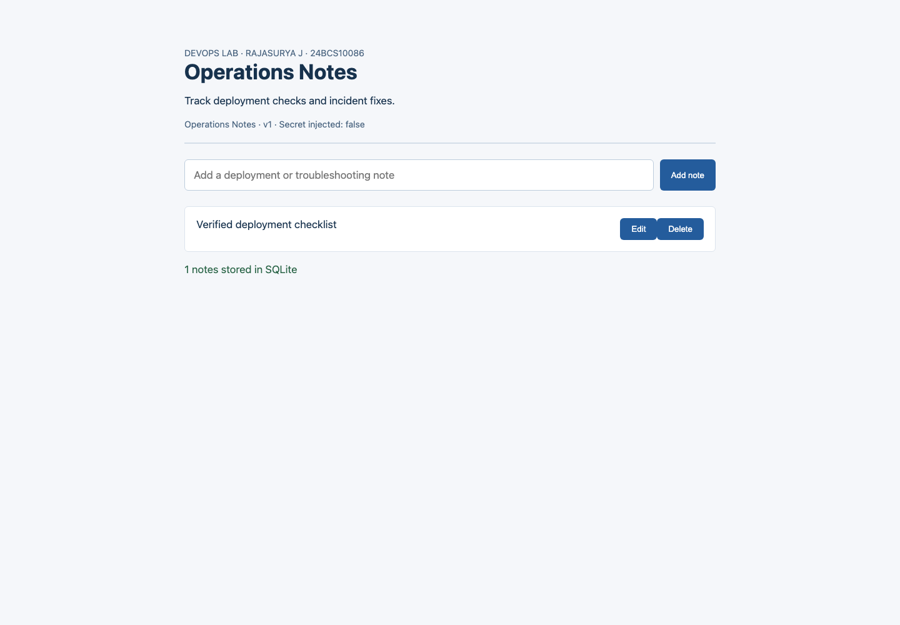
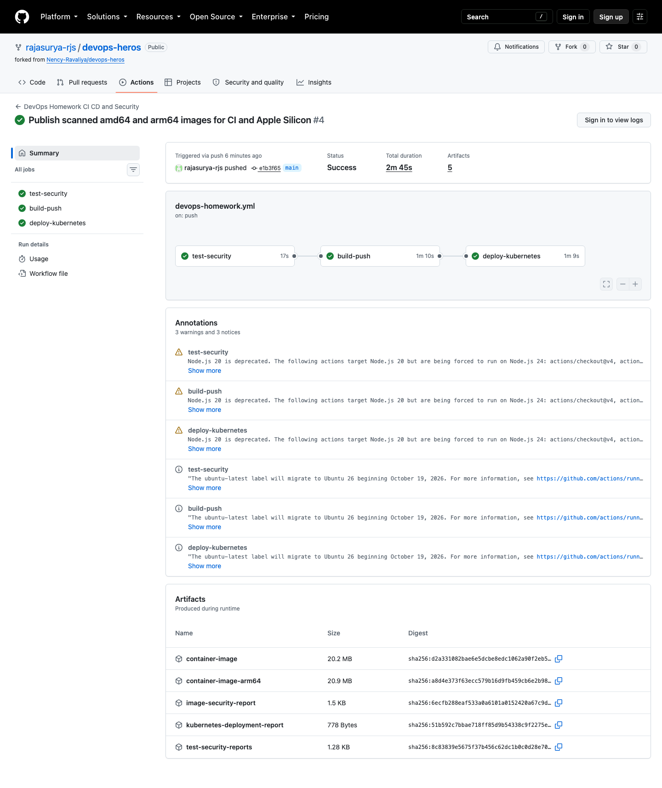
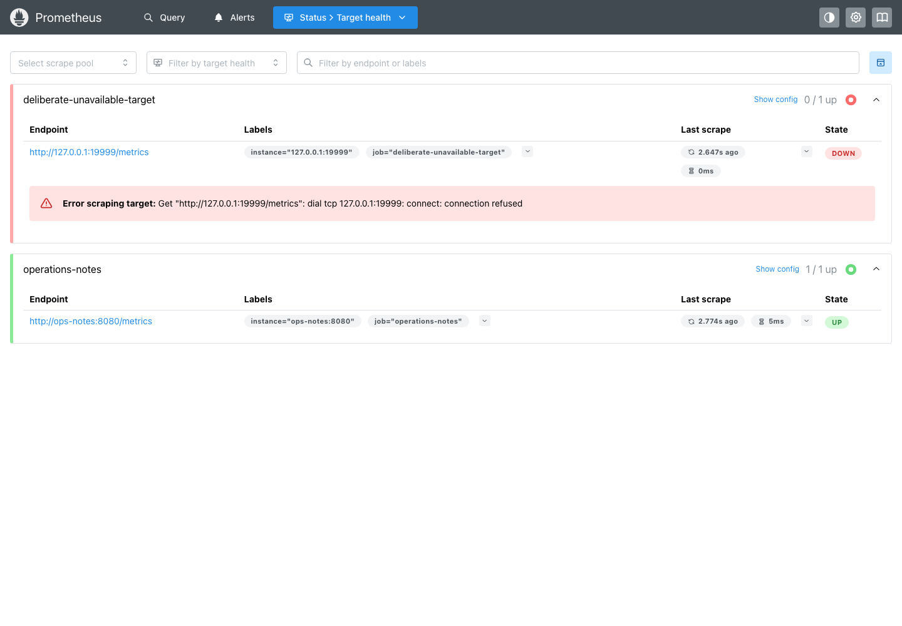
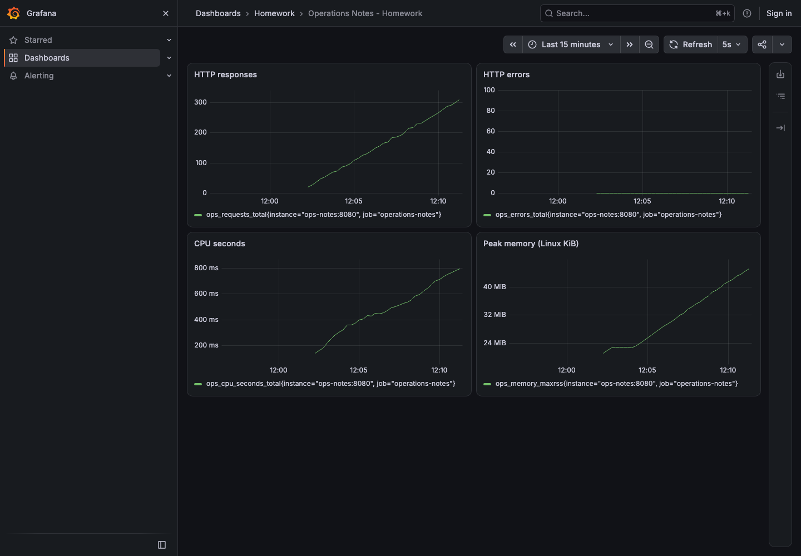
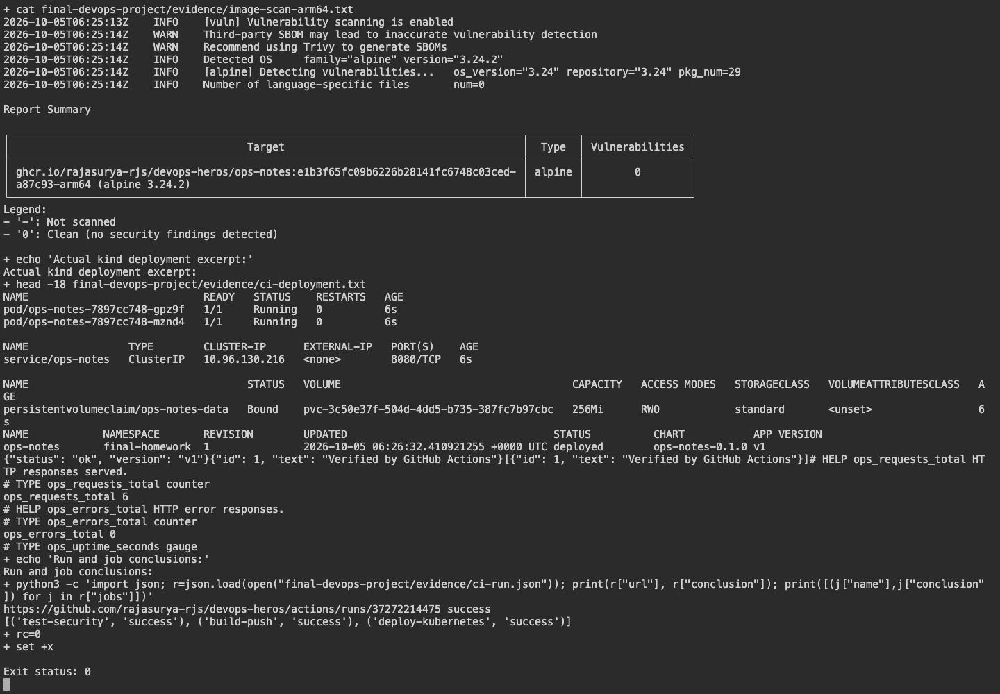
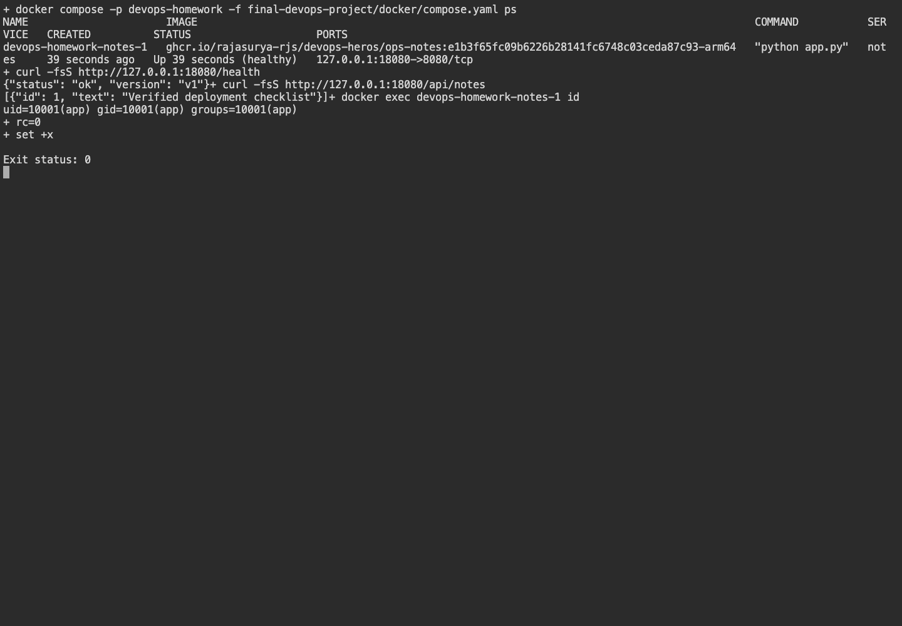
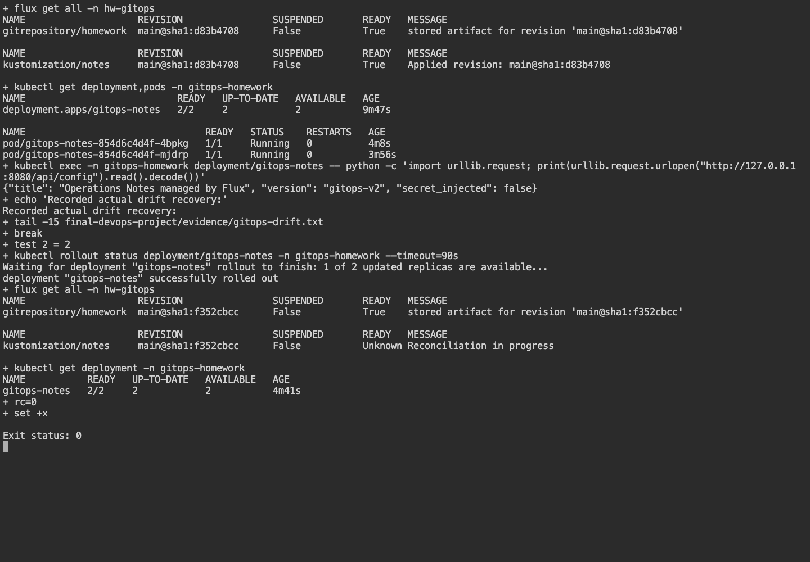
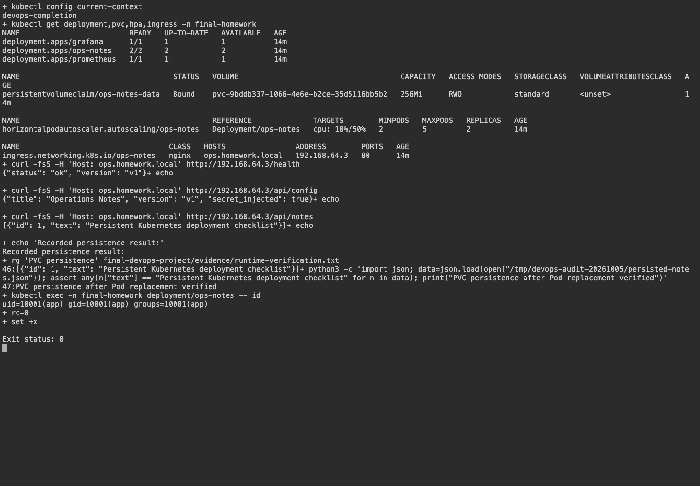
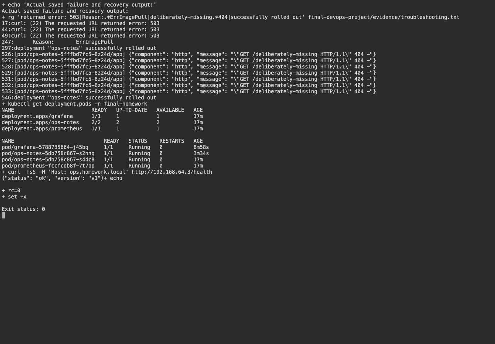
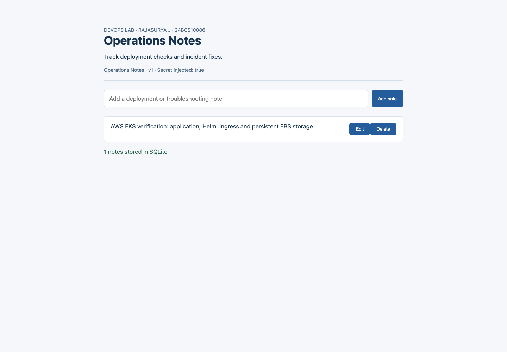
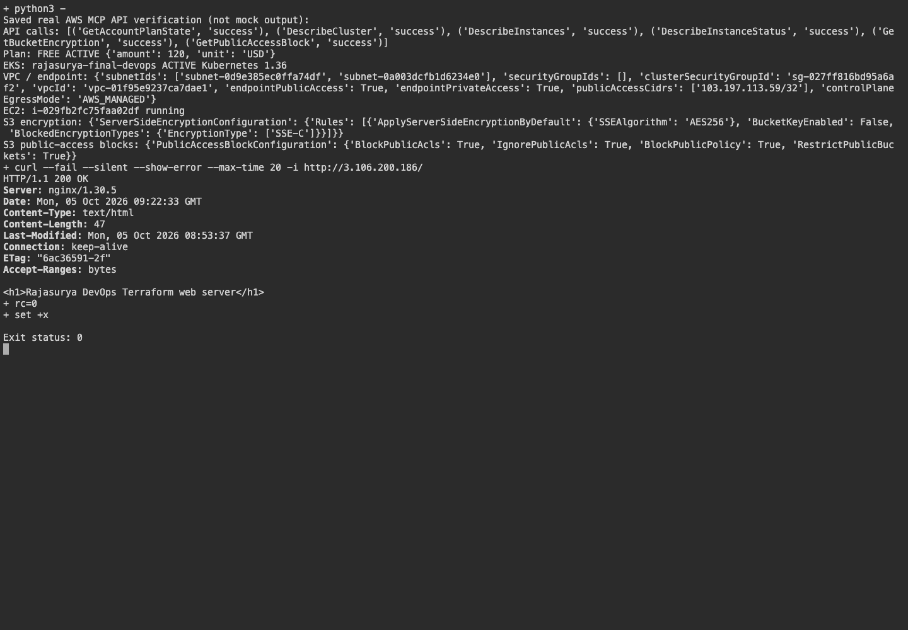
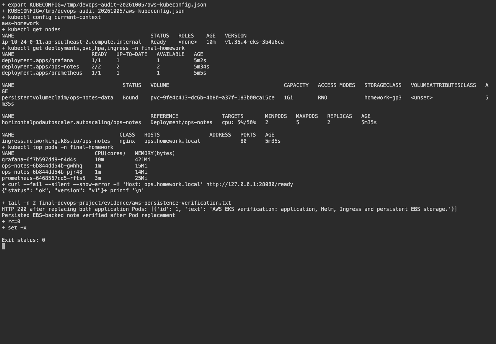
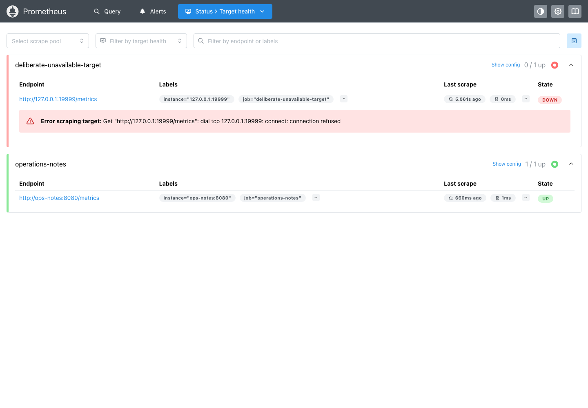
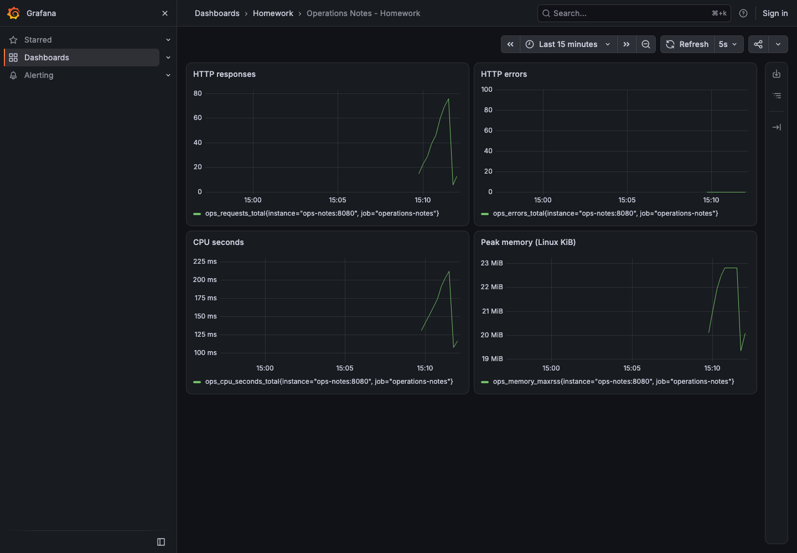
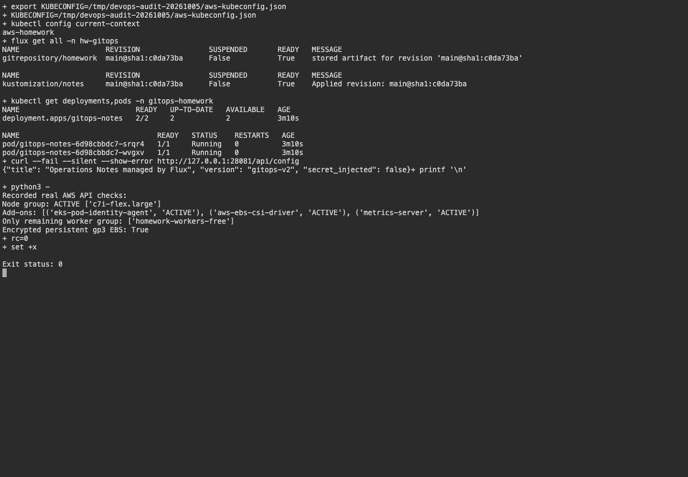

## Lessons from verified execution

A healthy old ReplicaSet can keep an application available while a replacement fails; inspect rollout and
Pod conditions rather than only the homepage. Endpoint and ingress changes converge asynchronously, so
verification needs bounded retries. A Running container can still lack an HTTP listener; resource limits and
readiness checks matter. Preserve security gates and remove unnecessary vulnerable runtime dependencies.
An architecture-matched tested artifact provides reproducible deployment when local registry downloads fail.
Finally, offline Terraform tests prove configuration assertions, not AWS provisioning.

## Unresolved requirement

None of the mandatory assignment requirements remain unresolved. All completed local/CI evidence is
preserved, and the real AWS infrastructure/application checks and screenshots are documented above.
The Google Form has not been submitted. The optional final-resource cleanup plan is not an executed destroy.
