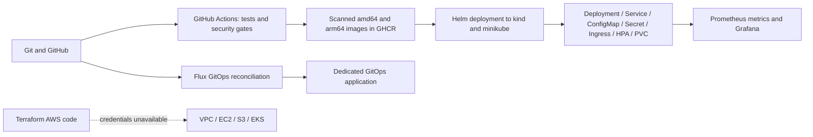

# Final DevOps Project - Operations Notes

**Name:** Rajasurya J

**Enrollment number:** 24BCS10086

## Project overview and status

Operations Notes is an original web application for deployment checks and incident notes.
The HTML frontend calls a Python HTTP API with GET, POST, PUT and DELETE operations.
SQLite persists notes on a Docker volume or Kubernetes PVC. The application exposes health checks and
Prometheus metrics. The local application, remote CI/CD, security gates, Helm, monitoring and GitOps have
been executed and verified. **The assignment is PARTIAL because AWS provisioning is blocked by missing credentials.**
Terraform validation and mock tests do not constitute cloud execution.



## Technologies and execution environment

The host is macOS 26.7.1 arm64 with Docker Desktop 29.2.1, minikube 1.39.0, kubectl 1.37.0,
Helm 3.22.0, Terraform 1.16.4, AWS CLI 2.36.41 and Flux 2.9.6. GitHub Actions uses Ubuntu runners
with Python 3.13 and an isolated kind cluster. Docker containers and minikube's containerd 2.3.4 run Linux;
Linux output here is not attributed to the macOS host.

The existing `minikube` vfkit VM was preserved. Sessions 9/13/14/15 ran there. Its 3 GB allocation became
insufficient for the complete monitoring stack, so it was stopped without deleting it. The final project
runs in a separate `devops-completion` vfkit VM with 4096 MB and 3 CPUs. Its verified address is
`192.168.64.3`; use `minikube -p devops-completion ip` rather than assuming a fixed address on another machine.
The class repository was inspected for requirements and structure; no reference implementation was copied.

## Application setup

Run from `final-devops-project`:

```bash
python3 -m unittest discover -s application/tests -v
DB_PATH=/tmp/ops-notes.db python3 application/app.py
curl http://127.0.0.1:8080/health
```

All nine API tests passed locally and remotely. SQL uses bound parameters; the frontend renders notes with
`textContent`; requests enforce body/text limits. `/health` tests the process and `/ready` tests the database.
`/api/config` reports a boolean for Secret injection, never the Secret value. This classroom Secret is not
an application login mechanism. The UI has no authentication and is intended for this local lab.

## Docker setup

The normal reproducible build is:

```bash
docker compose -p devops-homework -f docker/compose.yaml up -d --build
curl http://127.0.0.1:18080/health
```

Registry metadata and the local Trivy database download stalled during this execution. The final image
was built and scanned successfully in Actions instead. The genuine `ops-notes-arm64` artifact was downloaded
from the successful run, imported with `docker load -i ops-notes-arm64.tar`, then started locally:

```bash
OPS_NOTES_IMAGE=ghcr.io/rajasurya-rjs/devops-heros/ops-notes:e1b3f65fc09b6226b28141fc6748c03ceda87c93-arm64 \
  docker compose -p devops-homework -f docker/compose.yaml up -d --no-build
docker compose -p devops-homework -f docker/compose.yaml ps
```

The running image uses UID/GID 10001 and a named SQLite volume. [Actual Compose output](evidence/compose.txt)
and [local scanner output](evidence/security-local.txt) retain the execution details.
GHCR access may require an authorized package login; the Actions image artifact also enables verified local import.

## Kubernetes and Helm deployment

Host commands used the dedicated homework cluster:

```bash
minikube start -p devops-completion --driver=vfkit --memory=4096 --cpus=3 --kubernetes-version=v1.37.0
kubectl config use-context devops-completion
minikube -p devops-completion addons enable ingress
minikube -p devops-completion addons enable metrics-server
minikube -p devops-completion image load ops-notes-arm64.tar
./kubernetes/deploy.sh \
  --set image.repository=ghcr.io/rajasurya-rjs/devops-heros/ops-notes \
  --set image.tag=e1b3f65fc09b6226b28141fc6748c03ceda87c93-arm64
kubectl get pods,svc,pvc,hpa,ingress -n final-homework
curl -H 'Host: ops.homework.local' http://192.168.64.3/health
```

The chart creates two replicas, ClusterIP Service, ConfigMap, Secret references, nginx Ingress,
CPU HPA (2–5 replicas, 50% target), startup/readiness/liveness probes and a 256 Mi PVC.
`deploy.sh` creates a random temporary demo Secret outside Git without printing it. A ConfigMap checksum
triggers rollouts. Ingress health, CRUD, configuration injection, metrics and persistence across Pod replacement
were verified in [runtime output](evidence/runtime-verification.txt).
[Helm deployment output](evidence/helm-deployment.txt) records the release.

SQLite on a single-node RWO PVC is a homework demonstration; it is not a distributed production database.
Session 13 independently demonstrates actual HPA scale-up under load and scale-down.

## Terraform infrastructure

[Terraform configuration](terraform/) reuses the original Session 19 VPC/EC2/S3 project and adds an EKS
control plane, managed worker group, IAM roles, control-plane logs, Pod Identity and EBS CSI add-ons.
The VPC has two public subnets in separate availability zones, routing and restricted HTTP ingress;
EC2 EBS and private S3 are encrypted. The EKS public API endpoint is restricted to `web_cidr` and the
private endpoint is enabled. The example CIDR is a documentation address and must be replaced with the
operator's actual IPv4/32. This is a small public-subnet lab design.

`terraform init`, `fmt`, `validate` and the [mock configuration test](evidence/terraform-mock-tests.txt) passed.
The test mocks AWS and overrides the separately tested Session 19 module's outputs; it creates no AWS resources.
[Validation](evidence/terraform-validation.txt) and [real failed AWS plan](evidence/terraform-plan-attempt.txt)
are retained. No AWS plan/apply/resource verification/destroy success is claimed.

To complete the cloud portion after authenticating an authorized AWS account:

```bash
cd terraform
aws sts get-caller-identity
terraform plan -var='bucket_name=<globally-unique-name>' -var='web_cidr=<your-ip>/32' -out=homework.tfplan
terraform apply homework.tfplan
terraform output
aws eks update-kubeconfig --name rajasurya-final-devops --region ap-south-1
kubectl apply -f ../kubernetes/aws-storageclass.yaml
```

These are pending commands, not execution evidence. Install a suitable ingress controller, supply registry
pull access if needed, deploy the chart with `storage.className=homework-gp3`, verify endpoints/storage/monitoring,
then retain genuine cloud screenshots and destroy the homework resources when finished.

## CI/CD and DevSecOps

The [executable root workflow](../.github/workflows/devops-homework.yml) runs nine API tests, Bandit SAST,
pip-audit SCA, redacted Gitleaks, Docker builds and Trivy image scans. The application has no third-party
runtime requirements; the empty dependency scan is documented honestly. Trivy rejects fixable HIGH/CRITICAL
vulnerabilities; `--ignore-unfixed` is the explicit gate policy, not a promise of no vulnerabilities of any kind.
The successful build pushes both architectures and their multi-platform SHA manifest to GHCR. CD loads the
tested image into kind, installs Helm and verifies HTTP, CRUD, metrics and Kubernetes resources.

[Successful Actions run](https://github.com/rajasurya-rjs/devops-heros/actions/runs/37272214475) has all three jobs
passing. [Run metadata](evidence/ci-run.json), [complete runner log](evidence/ci-run.log), [security reports](evidence/)
and [CD output](evidence/ci-deployment.txt) are genuine remote execution evidence.
`GITHUB_TOKEN` stays in runner secrets; temporary Kubernetes credentials are never committed.

The first image gate rejected unused installer dependencies. Removing them corrected the actual findings
without weakening the gate; the [failed security output](evidence/pipeline-failures/security-gate.txt) is preserved.
The project-local `.github/workflows/README.md` links the root workflow because GitHub executes root workflows.

## Monitoring and GitOps

[Monitoring manifests](monitoring/) run Prometheus v3.15.0 and Grafana 13.2.3 with a provisioned data source
and four dashboard panels: HTTP responses/errors, cumulative CPU seconds and Linux peak RSS.
`kubectl top` provides current Pod CPU/memory. JSON request logs supply event context.
The actual application target is **UP**; `TargetUnavailable` is **firing** for a separately labelled deliberately
unavailable target. [Targets](evidence/prometheus-targets.json), [alerts](evidence/prometheus-alerts.json)
and [commands/output](evidence/monitoring-gitops.txt) preserve those results.

```bash
./monitoring/deploy.sh
kubectl port-forward -n final-homework svc/prometheus 19090:9090
# In another terminal:
kubectl port-forward -n final-homework svc/grafana 13000:3000
```

Open `http://127.0.0.1:19090/targets` and
`http://127.0.0.1:13000/d/ops-homework/operations-notes-homework`.
Grafana's anonymous Viewer access is scoped to this local lab through ClusterIP and localhost port forwarding.
Metrics and logs are implemented; distributed traces are explained in Session 20 rather than claimed.

Flux watches this repository's `main` branch and reconciles only `gitops/app/` into `gitops-homework`.
An actual Git commit changed the configuration from `gitops-v1` to `gitops-v2`; the Pod template annotation
caused replacement Pods to consume the updated ConfigMap. Both Flux resources became Ready, and the application
returned `gitops-v2`. A deliberate live scale from 2 replicas to 1 was automatically restored to 2 by Flux.
[Git rollout](evidence/gitops-rollout.txt) and [drift recovery](evidence/gitops-drift.txt) record the proof.
This GitOps copy uses temporary data; the Helm-managed main application owns the persistent PVC.

## Final troubleshooting challenge

[Runnable drill](kubernetes/troubleshooting/verify.sh) intentionally changes the real homework application
and restores the correct image, selector and probe with an exit trap. [Full output](evidence/troubleshooting.txt)
records resource inspection, errors, fixes and final health checks.

| Issue | Investigation / root cause | Fix and actual verification |
|---|---|---|
| Wrong Service selector | EndpointSlice loses backend addresses; nginx Ingress eventually returns 503. | Restore selector `app=ops-notes`; endpoint propagation and HTTP 200 verified. |
| Nonexistent image | Pod Events report ErrImagePull / ImagePullBackOff; old replicas remain available during rollout. | Restore the scanned SHA image; Deployment rollout and HTTP 200 verified. |
| Wrong readiness URL | Running replacement Pod gets HTTP 404 from the probe and cannot become Ready. | Restore `/ready`; rollout and HTTP 200 verified. |

The first selector check ran before ingress cache convergence and still returned 200; that attempt is
retained in [first-attempt output](evidence/troubleshooting-first-attempt.txt). Bounded retries then observed
the actual 503 before fixing it. Other genuine troubleshooting included the memory-limited Grafana startup,
minikube resource pressure, installer vulnerabilities and registry download stalls.

## Screenshots

All captures show actual browser pages or live ttyd terminal commands on this host. Native screen capture
was unavailable, so Chromium captured those real application/terminal states. Saved-report excerpts are labelled
by the commands reading the actual files. No reference screenshot, generated terminal image or invented output is used.


## Lessons from verified execution

A healthy old ReplicaSet can keep an application available while a replacement fails; inspect rollout and
Pod conditions rather than only the homepage. Endpoint and ingress changes converge asynchronously, so
verification needs bounded retries. A Running container can still lack an HTTP listener; resource limits and
readiness checks matter. Preserve security gates and remove unnecessary vulnerable runtime dependencies.
An architecture-matched tested artifact provides reproducible deployment when local registry downloads fail.
Finally, offline Terraform tests prove configuration assertions, not AWS provisioning.

## Unresolved requirement

AWS credentials/account access were unavailable. Sessions 18/19 and this final project's real cloud plan,
apply, resource verification, genuine deployed-cloud screenshots and destroy verification remain incomplete.
All available local/CI work is retained; the Google Form has not been submitted.
