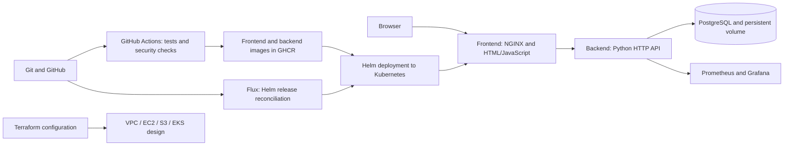
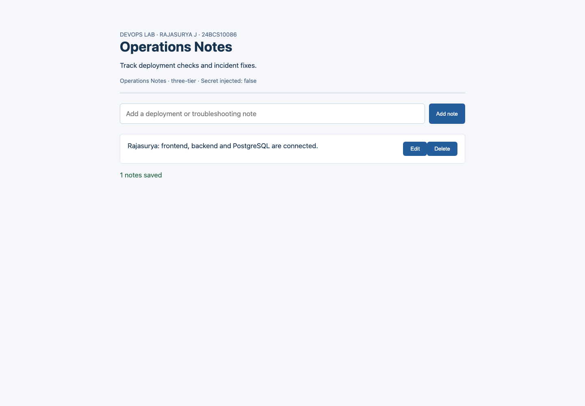
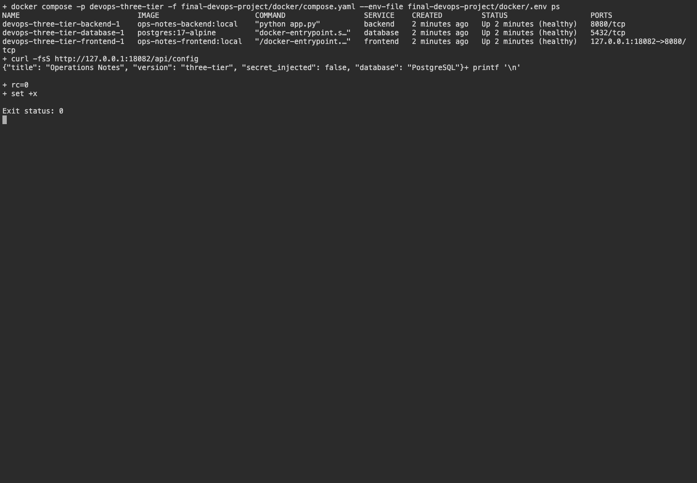
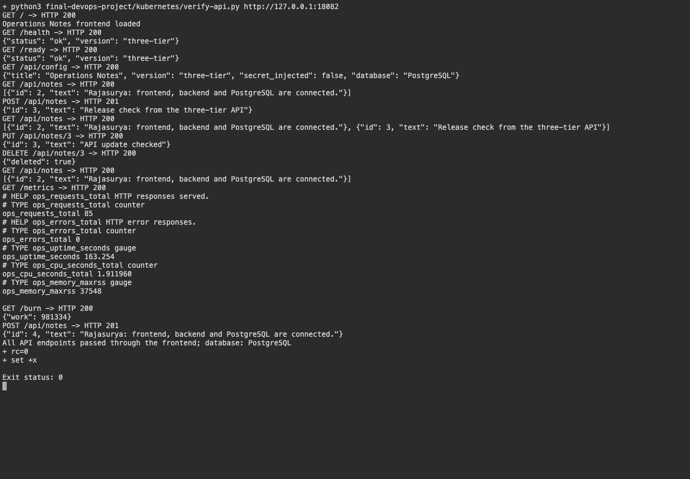
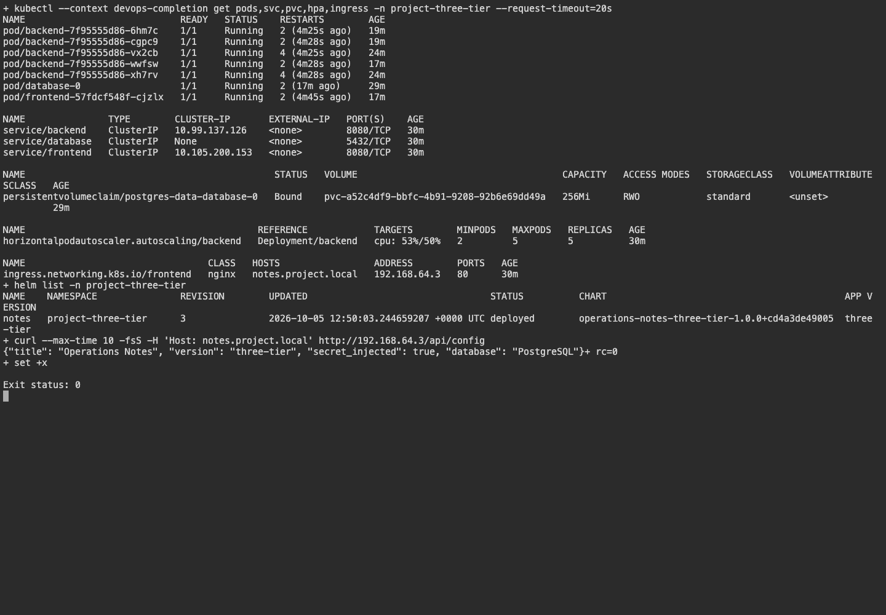
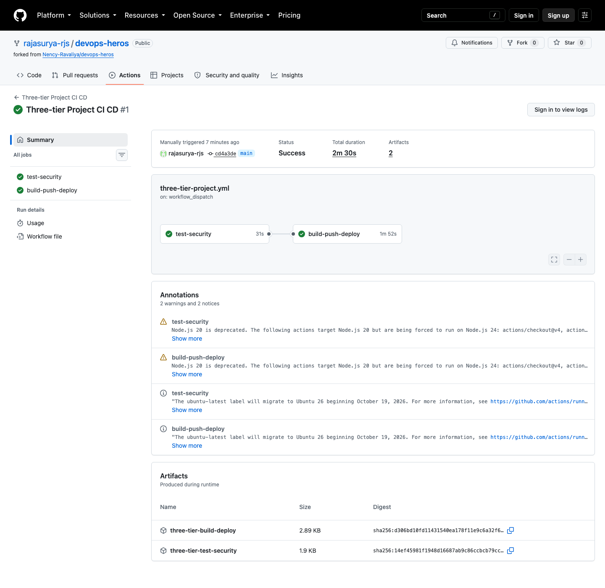
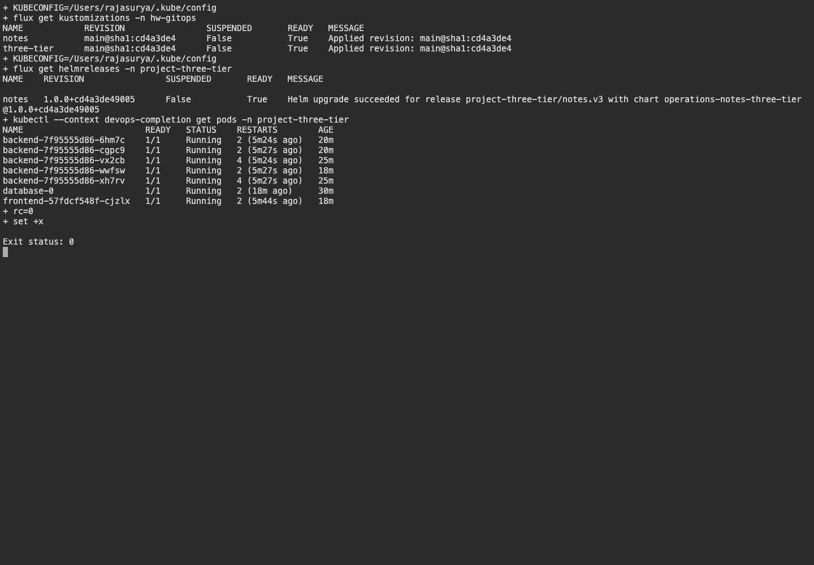
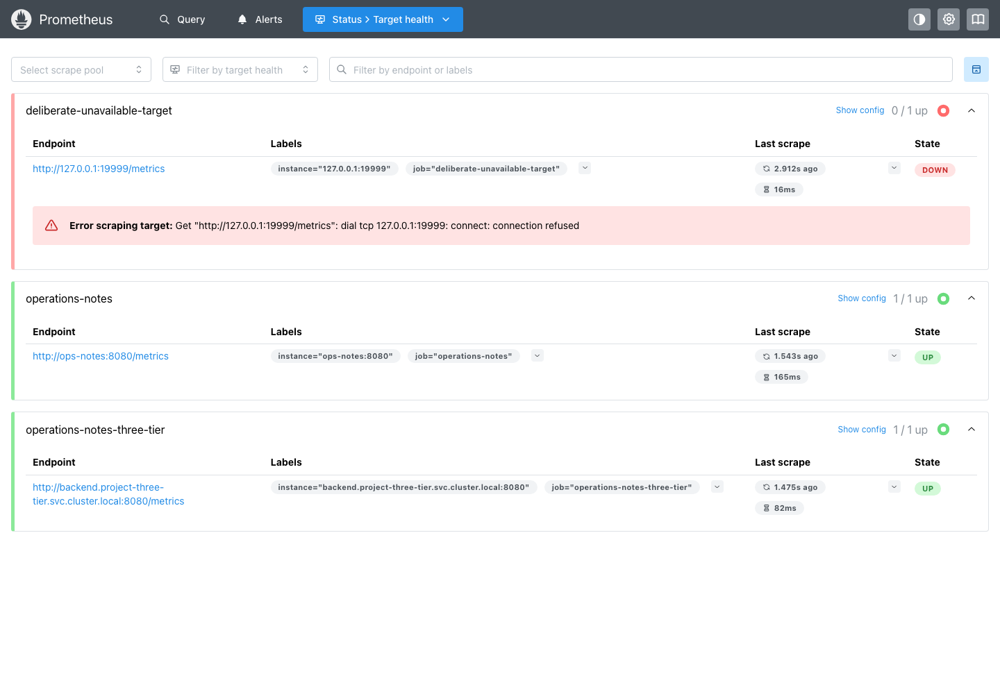
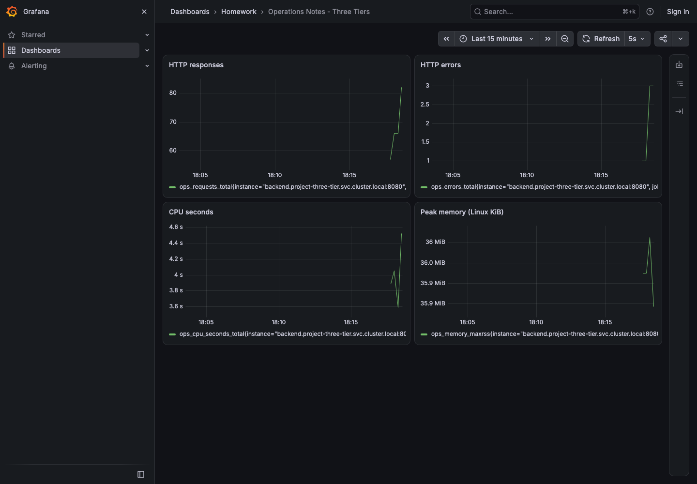

# Final DevOps Project - Operations Notes

**Name:** Rajasurya J

**Enrollment number:** 24BCS10086

## Project overview

Operations Notes stores deployment checks and incident fixes. I built the frontend with
HTML and JavaScript, the backend with Python, and the database with PostgreSQL.
Users can add, list, edit and delete notes. The project includes backend tests, separate
Docker images, Compose, Helm, CI/CD security checks, monitoring and GitOps.

[Presentation](presentation/Operations-Notes.pptx) · [PDF slides](presentation/Operations-Notes.pdf)

## Architecture



## Technologies and environment

- Frontend: HTML, JavaScript and NGINX 1.30.
- Backend: Python 3.13 and Psycopg 3.3.6; database: PostgreSQL 17.
- Docker Desktop 29.2.1 on macOS arm64.
- Kubernetes 1.37 in the local `devops-completion` minikube vfkit VM; Helm 3.22.
- GitHub Actions on Ubuntu with a kind cluster for CI deployment.
- Bandit, pip-audit, Gitleaks and Trivy; Prometheus, Grafana and Flux.
- Terraform 1.16.4 and AWS provider 6.67.0.

The local Kubernetes namespace is `project-three-tier`. I reused the monitoring installation
in `final-homework` and added a scrape target and dashboard for this application.

## Application and backend tests

The [backend](application/app.py) uses bound SQL parameters and validates note text and body size.
The [frontend](application/index.html) renders note content with `textContent`.
[Backend tests](application/tests/test_api.py) cover CRUD, health/readiness, configuration,
metrics, invalid input, SQL injection handling, missing routes and the work endpoint.

```bash
python3 -m venv .venv
.venv/bin/pip install -r application/requirements.txt
.venv/bin/python -m unittest discover -s application/tests -v
```

All 13 tests passed with SQLite and with PostgreSQL. SQLite remains available for the earlier
single-container exercises; the three-tier Compose and Helm deployments use PostgreSQL.
[SQLite test output](evidence/three-tier-sqlite-tests.txt) · [PostgreSQL test output](evidence/three-tier-postgres-tests.txt)

## Docker setup

Run from `final-devops-project`:

```bash
python3 - <<'SETUP'
from pathlib import Path
import secrets
p = Path('docker/.env')
if not p.exists():
    p.write_text('DB_PASSWORD=' + secrets.token_hex(24) + '\n')
    p.chmod(0o600)
SETUP
docker compose -p devops-three-tier -f docker/compose.yaml --env-file docker/.env up -d --build --wait
docker compose -p devops-three-tier -f docker/compose.yaml --env-file docker/.env ps
python3 kubernetes/verify-api.py http://127.0.0.1:18082
```

Open **http://127.0.0.1:18082**.
[Frontend Dockerfile](docker/frontend.Dockerfile), [backend Dockerfile](docker/backend.Dockerfile)
and [Compose file](docker/compose.yaml) define the three services. Only the frontend publishes a
localhost port. The backend reaches PostgreSQL over an internal data network; the frontend
shares the web network with the backend. PostgreSQL data uses a named volume. The application
containers run without root, with read-only filesystems and temporary `/tmp` storage.
The private `.env` file is ignored by Git.

I restarted the database container and checked that the saved notes were unchanged.
[Compose output](evidence/three-tier-compose.txt) · [API results](evidence/three-tier-api.txt) · [Persistence check](evidence/three-tier-persistence.txt)

## Backend API endpoints

All endpoints are accessed through the frontend on port 18082.

| Method | Endpoint | Result |
|---|---|---|
| GET | `/` | Application UI |
| GET | `/health` | Process health, HTTP 200 |
| GET | `/ready` | Database readiness, HTTP 200; 503 when unavailable |
| GET | `/api/config` | Title, version, database type and Secret-injection boolean |
| GET | `/api/notes` | List saved notes |
| POST | `/api/notes` | Create a note, HTTP 201 |
| PUT | `/api/notes/{id}` | Update a note, HTTP 200 |
| DELETE | `/api/notes/{id}` | Delete a note, HTTP 200 |
| GET | `/metrics` | Prometheus metrics |
| GET | `/burn` | Short CPU-work endpoint for the autoscaling lab |

POST and PUT accept `{"text":"Deployment checked"}`. Empty text, more than 500 characters
or an invalid body is rejected with HTTP 400. Missing routes and missing note IDs return 404.
The app is a classroom demo without user login. `/api/config` shows whether the demo Secret
was injected and does not return its value.

## Kubernetes and Helm deployment

The [three-tier chart](helm/three-tier/) creates frontend and backend Deployments, Services,
a ConfigMap, Secret references, Ingress, CPU HPA, probes and a PostgreSQL StatefulSet with PVC.
[Rendered manifests](kubernetes/three-tier.yaml) show the Kubernetes resources.

```bash
kubectl config use-context devops-completion
minikube -p devops-completion addons enable ingress
minikube -p devops-completion addons enable metrics-server
minikube -p devops-completion image load ops-notes-frontend:local
minikube -p devops-completion image load ops-notes-backend:local
minikube -p devops-completion image load postgres:17-alpine
./kubernetes/deploy-three-tier.sh
kubectl get pods,svc,pvc,hpa,ingress -n project-three-tier
helm list -n project-three-tier
```

The helper creates a random database password and demo token in a Kubernetes Secret.
The backend HPA targets 50% CPU between two and five replicas. Startup/readiness checks wait
for PostgreSQL; liveness checks the process. PostgreSQL uses a 256 Mi RWO PVC.
The database is a single-replica classroom deployment.

The Ingress host is `notes.project.local`. Map it to the address returned by
`minikube -p devops-completion ip`, or use localhost port forwarding:

```bash
kubectl port-forward -n project-three-tier svc/frontend 18083:8080
# In another terminal:
python3 kubernetes/verify-api.py http://127.0.0.1:18083
```

[Helm output](evidence/three-tier-helm.txt) · [Kubernetes resources](evidence/three-tier-kubernetes.txt) · [Ingress API check](evidence/three-tier-kubernetes-api.txt)

## Terraform configuration

[Terraform files](terraform/) describe the VPC, EC2, S3 and EKS infrastructure.
For this project, I checked the configuration locally:

```bash
terraform -chdir=terraform init -input=false
terraform -chdir=terraform fmt -check
terraform -chdir=terraform validate
terraform -chdir=terraform test
```

The tests use a mock provider and check configuration assertions. Validation and the test passed.
[Validation output](evidence/three-tier-terraform-validation.txt) · [Configuration test](evidence/three-tier-terraform-tests.txt)

## CI/CD and DevSecOps

[Three-tier workflow](../.github/workflows/three-tier-project.yml) runs:

```text
GitHub → SQLite and PostgreSQL tests → SAST / SCA / secret gates
       → frontend and backend Docker builds → Trivy gates
       → GHCR image push → Helm deployment to kind → API and PostgreSQL checks
```

Bandit scans backend code. pip-audit checks the pinned Psycopg dependencies. Gitleaks scans
project files with redaction. Trivy scans both application images and fails on fixable
HIGH/CRITICAL findings using `--ignore-unfixed`. The first frontend scan found outdated
`libexpat` and `pcre2`; updating those packages resolved the findings. Both local image gates passed.
Registry tags use the full Git commit SHA. `GITHUB_TOKEN` handles publishing without a committed credential.

[Backend image scan](evidence/three-tier-trivy-backend.txt) · [Frontend image scan](evidence/three-tier-trivy-frontend.txt) · [SAST](evidence/three-tier-sast.txt) · [SCA](evidence/three-tier-sca.txt)

[Successful pipeline run](https://github.com/rajasurya-rjs/devops-heros/actions/runs/37312195057)
passed both jobs: `test-security` and `build-push-deploy`. It ran 13 tests with each database,
passed SAST/SCA/secret gates and both image scans, pushed the images to GHCR, deployed the
three services with Helm to kind, and checked the API and PostgreSQL.
[Run metadata](evidence/three-tier-ci-run.json) · [Runner log](evidence/three-tier-ci-run.log)

The executable workflows live in the repository root, where GitHub discovers them.
The project’s [.github/workflows/](.github/workflows/) folder links to both workflows.

## Monitoring

```bash
./monitoring/deploy-three-tier.sh
kubectl port-forward -n final-homework svc/prometheus 39091:9090
# In another terminal:
kubectl port-forward -n final-homework svc/grafana 33001:3000
```

Prometheus scrapes `backend.project-three-tier.svc.cluster.local:8080` under the
`operations-notes-three-tier` job. Its target is UP. The deliberate unavailable target is
an alert exercise. Grafana’s **Operations Notes - Three Tiers** dashboard shows HTTP responses,
errors, cumulative CPU seconds and Linux peak RSS. Backend request logs are JSON:

```bash
kubectl logs -n project-three-tier deployment/backend --tail=10
kubectl top pods -n project-three-tier
```

[Prometheus targets](evidence/three-tier-prometheus-targets.json) · [Monitoring output](evidence/three-tier-monitoring.txt)

## GitOps

Flux source, kustomize and Helm controllers reconcile the three-tier Helm release from this repository.
The [Kustomization](gitops/three-tier-source.yaml) watches [the HelmRelease](gitops/three-tier/release.yaml),
which uses the chart in `helm/three-tier/`. The local images must be loaded into minikube first.

```bash
flux install --namespace hw-gitops --components=source-controller,kustomize-controller,helm-controller
kubectl apply -f gitops/source.yaml
kubectl apply -f gitops/three-tier-source.yaml
flux reconcile kustomization three-tier -n hw-gitops --with-source
flux get helmreleases -n project-three-tier
```

The three-tier Kustomization and HelmRelease both reported Ready at the project commit.
[Flux result](evidence/three-tier-gitops.txt)

The earlier [configuration rollout](evidence/gitops-rollout.txt) and [replica drift check](evidence/gitops-drift.txt)
show the configuration update and Flux restoring two replicas after a live change to one.

## Troubleshooting

| Issue | Investigation | Fix and check |
|---|---|---|
| Database not ready at backend startup | Database DNS/connection was unavailable while PostgreSQL initialized. | Added bounded startup retries; readiness checks the database. |
| PostgreSQL authentication failure | The generated password file included a trailing newline. | Generate the password without the newline; update the Secret and check the backend rollout and API. |
| Frontend image security gate failed | Trivy reported two fixable HIGH findings in `libexpat` and `pcre2`. | Upgrade those libraries in the Dockerfile and rerun the unchanged gate. |
| Local cluster resource pressure | Running two monitoring installations increased memory use on the 8 GB laptop. | Reuse the existing stack with a separate scrape job and dashboard. |

## Final troubleshooting challenge

[Runnable drill](kubernetes/troubleshooting/verify.sh) intentionally changes the homework application
and restores the correct image, selector and probe with an exit trap. [Full output](evidence/troubleshooting.txt)
records resource inspection, errors, fixes and final health checks.

| Issue | Investigation / root cause | Fix and verification |
|---|---|---|
| Wrong Service selector | EndpointSlice loses backend addresses; nginx Ingress eventually returns 503. | Restore selector `app=ops-notes`; endpoint propagation and HTTP 200 verified. |
| Nonexistent image | Pod Events report ErrImagePull / ImagePullBackOff; old replicas remain available during rollout. | Restore the scanned SHA image; Deployment rollout and HTTP 200 verified. |
| Wrong readiness URL | Running replacement Pod gets HTTP 404 from the probe and cannot become Ready. | Restore `/ready`; rollout and HTTP 200 verified. |

The first selector check ran before ingress cache convergence and still returned 200; that attempt is
retained in [first-attempt output](evidence/troubleshooting-first-attempt.txt). Bounded retries then observed
the 503 before fixing it. Other troubleshooting included the memory-limited Grafana startup,
minikube resource pressure, installer vulnerabilities and registry download stalls.

Cloud deployment exposed an EBS CSI dependency error: the association originally depended on a healthy
driver, but the driver needed that association to pass its EC2 health check. The
[driver error log](evidence/aws-ebs-initial-failure.txt) showed `UnauthorizedOperation` under the node role.
The dedicated Pod Identity association was [created](evidence/aws-ebs-identity-creation.json) and
[imported](evidence/aws-ebs-identity-import.txt) into Terraform; the dependency now creates it before the driver.
After restarting only the driver Deployment, its rollout succeeded and
[the AWS API](evidence/aws-ebs-recovery.json) reported `ACTIVE` with no health issues.
Terraform's interrupted-create marker was [cleared](evidence/aws-ebs-preserve-verified-addon.txt) only after
checking that the add-on was healthy.
The final plan reports no changes.
[Provider import documentation](https://registry.terraform.io/providers/hashicorp/aws/latest/docs/resources/eks_pod_identity_association)
specifies the comma-separated cluster/association identifier used.


## Screenshots










## Lessons learned

Separate the UI, request handling and database so each layer has a clear responsibility.
Check the API and saved data as well as the homepage. Keep database readiness separate from
process health. Scan both images before publishing them, and inspect the reported package versions
when a gate fails. Reuse monitoring resources when the laptop has limited memory.

## Earlier local and cloud lab

The single-container SQLite Compose setup is available in [compose.sqlite.yaml](docker/compose.sqlite.yaml)
and the earlier Helm chart is in [helm/ops-notes/](helm/ops-notes/).
The [earlier Actions run](https://github.com/rajasurya-rjs/devops-heros/actions/runs/37272214475)
contains the original pipeline results.

<details>
<summary>Cloud deployment commands and results</summary>

## Terraform infrastructure

[Terraform configuration](terraform/) reuses the Session 19 VPC/EC2/S3 project and adds an EKS
control plane, managed worker group, IAM roles, control-plane logs, Pod Identity and EBS CSI add-ons.
The VPC has two public subnets in separate availability zones, routing and restricted HTTP ingress;
EC2 EBS and private S3 are encrypted. The EKS public API endpoint is restricted to `web_cidr` and the
private endpoint is enabled. The example CIDR is a documentation address and must be replaced with the
operator's IPv4/32. This is a small public-subnet lab design.

`terraform init`, `fmt`, `validate` and the [configuration tests](evidence/terraform-mock-tests.txt)
passed. After the cloud fixes, I reran [validation](evidence/aws-configuration-validation.txt)
and [the mock-provider test](evidence/aws-configuration-mock-tests.txt).
The first plan attempt failed because credentials were missing
([error output](evidence/terraform-plan-attempt.txt)). I authenticated with `devops-homework`
and supplied the selected Region and deployment variables in a local file.

The [initial plan](evidence/aws-plan.txt) selected 26 resources. Terraform provisioned the VPC,
EC2 web server, private S3 bucket, IAM service roles and Kubernetes 1.36 EKS control plane.
[Resource checks](evidence/aws-infrastructure-verification.json) confirm EKS `ACTIVE`,
restricted public API access, enabled private endpoint, EC2 status checks passing, S3 AES256 encryption
and all four public-access blocks. The [EC2 HTTP check](evidence/aws-web-http.txt) returned HTTP 200
and the expected Terraform web page. [Terraform outputs](evidence/aws-outputs.json) record resource IDs.

The first worker type, `t3.medium`, was rejected by the project's Free plan before any worker launched.
The [worker launch error](evidence/aws-node-launch-failure.json) and [first apply log](evidence/aws-first-apply.txt)
show the error. AWS's [eligible instance-type API](evidence/aws-free-tier-instance-types.json) identified
`c7i-flex.large` (2 vCPUs / 4 GiB); I updated the node group to use this eligible type.
The [corrected plan](evidence/aws-corrected-plan.txt) first
attempted deletion; AWS left the empty group in `DELETING`, recorded in the
[interrupted deletion log](evidence/aws-worker-delete-attempt.txt). The
[replacement plan](evidence/aws-replacement-plan.txt) creates `homework-workers-free` before
removing the failed group. The [worker/add-on attempt](evidence/aws-ebs-apply-attempt.txt) records
the successful worker creation and the storage dependency error. The
[final refreshed plan](evidence/aws-final-plan.txt) reports **No changes**, and the
[successful final apply](evidence/aws-apply.txt) confirms zero remaining resource changes.
The [cluster API checks](evidence/aws-cluster-verification.json) confirm the eligible worker and all
three add-ons `ACTIVE`, with the failed group absent. The worker uses encrypted gp3 storage and IMDSv2.
The cluster's pre-existing CloudWatch log group was [imported](evidence/aws-log-group-import.txt)
into Terraform and configured with one-day retention.

Terraform commands from the repository root:

```bash
export AWS_PROFILE=devops-homework AWS_REGION=ap-southeast-2
aws freetier get-account-plan-state --region ap-southeast-2 --profile devops-homework
terraform -chdir=final-devops-project/terraform init -input=false
terraform -chdir=final-devops-project/terraform fmt -check
terraform -chdir=final-devops-project/terraform validate
terraform -chdir=final-devops-project/terraform plan \
  -var-file="$HOME/.aws/devops-homework-final-vars.json" -out=homework.tfplan
terraform -chdir=final-devops-project/terraform apply -input=false homework.tfplan
terraform -chdir=final-devops-project/terraform output
```

The variable file contains `region`, a unique `bucket_name`, my IPv4/32 `web_cidr`,
`cluster_version="1.36"` and `web_ami_id`. For another deployment, use the example variable
file and set these values. The final refreshed plan reports **No changes**; the final apply
reports zero additions, changes or removals.

The shared Session 19 module uses Standard CPU credits for its `t3.micro` web server.
A later [plan](evidence/aws-ami-drift-plan.json) selected a newly published Amazon Linux AMI,
which would replace that server. I added the optional `ami_id` module input and pinned
`web_ami_id="ami-0720cb7af233b0529"` for this deployment. Leaving `ami_id` unset uses the
latest-image lookup.

The project uses public subnets and ClusterIP Services, without a NAT gateway or public
LoadBalancer Service. The plan-state check returned **FREE / ACTIVE / $120 remaining credits**
at the recorded check. AWS usage consumes credits; the
[Free-plan FAQ](https://aws.amazon.com/free/free-tier-faqs/) explains the billing conditions.

## AWS Kubernetes deployment

I use a separate kubeconfig for EKS: `~/.kube/devops-homework-eks.json`.
[kubernetes/deploy-aws.sh](kubernetes/deploy-aws.sh) adds the encrypted gp3 StorageClass and the
open-source NGINX controller (v5.6.3, chart 2.7.3), then runs the application and monitoring
scripts. NGINX is a ClusterIP Service accessed through localhost port forwarding. The tested multi-platform
GHCR image is used, so the amd64 worker does not receive the local arm64-only tag.

The Helm client stalled fetching NGINX's external JSON schema. Downloading the identical official schema
and resolving it locally allowed schema validation and chart linting to pass.
The [deployment log](evidence/aws-kubernetes-deployment.txt) records NGINX and the application
Helm releases, plus successful Prometheus and Grafana rollouts. Commands used from the repository root
with the separate kubeconfig were:

```bash
export KUBECONFIG="$HOME/.kube/devops-homework-eks.json"
./final-devops-project/kubernetes/deploy-aws.sh
kubectl port-forward -n ingress-nginx svc/aws-ingress-nginx-ingress-controller 28080:80
# In separate terminals, with the same KUBECONFIG:
kubectl port-forward -n final-homework svc/prometheus 29090:9090
kubectl port-forward -n final-homework svc/grafana 23000:3000
NOTE_RECORD=/tmp/aws-note.json \
  python3 final-devops-project/kubernetes/verify-aws-runtime.py
```

I set `NGINX_CHART` to the downloaded official chart. The deployment helper also supports
downloading the chart and resolving its schema. Wait for port-forward to print
`Forwarding from 127.0.0.1` before accessing the application.

[API checks](evidence/aws-runtime-verification.txt) verifies health/readiness, GET/POST/PUT/DELETE,
ConfigMap values, Secret injection as a boolean and application metrics.
[Pod replacement verification](evidence/aws-persistence-verification.txt) records both old and new Pod
UIDs and HTTP 200 with the unchanged saved note after replacing both replicas. The 1 GiB RWO PVC is
bound to encrypted gp3 volume `vol-0f0d12f858647d5dd`, confirmed by the AWS volume check.
[Kubernetes checks](evidence/aws-kubernetes-verification.txt) record two Ready replicas, all three probes,
the image SHA, HPA CPU readings, Helm releases and JSON request logs.

Cloud [Prometheus targets](evidence/aws-prometheus-targets.json) report the application **UP**; the
[deliberate unavailable-target alert](evidence/aws-prometheus-alerts.json) is **firing**.
[Grafana health](evidence/aws-grafana-health.json) reports database `ok`; the dashboard is shown below.

Flux was [installed](evidence/aws-flux-install.txt) with source and kustomize controllers:

```bash
flux install --namespace hw-gitops --components=source-controller,kustomize-controller
kubectl apply -f final-devops-project/gitops/eks/source.yaml
flux reconcile source git homework -n hw-gitops
flux reconcile kustomization notes -n hw-gitops --with-source
flux get all -n hw-gitops
```

The [EKS overlay](gitops/eks/) changes only the image tag to the tested multi-platform manifest.
The local cluster uses `gitops/app/`; EKS uses `gitops/eks/`.
[Cloud reconciliation](evidence/aws-gitops-verification.txt) shows both Flux resources Ready at commit
`c0da73ba`, two Ready GitOps replicas and `/api/config` response `gitops-v2`.
The GitOps copy deliberately has no Secret; the persistent Helm application separately verified Secret injection.

## Cleanup

The final project remains deployed. The [cleanup plan](evidence/aws-cleanup-plan.txt)
contains 28 Terraform resources and has not been applied. To remove the project, first delete
the application's PVC while EBS CSI is running and check that its dynamic volume is removed,
then apply the Terraform destroy plan. Sessions 18 and 19 were destroyed after their checks.


</details>

<details>
<summary>Earlier application, pipeline, monitoring and cloud screenshots</summary>


</details>
