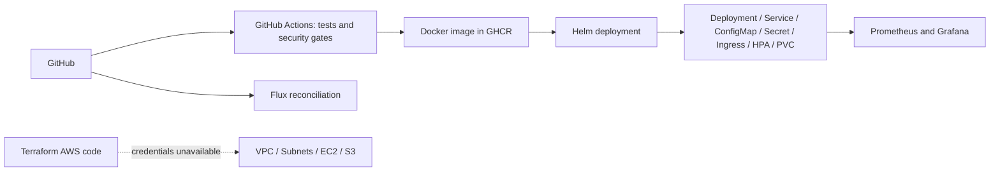

# Final DevOps Project - Operations Notes

**Name:** Rajasurya J
**Enrollment number:** 24BCS10086

## Project overview

Operations Notes is an original web application for deployment checks and incident notes.
The HTML frontend calls a Python HTTP API with GET, POST, PUT and DELETE operations.
SQLite persists notes on a Docker volume or Kubernetes PVC. The application exposes health checks and
Prometheus metrics. This is a single-node homework demonstration, not a distributed database deployment.



## Technologies and environment

macOS 26.7.1 arm64 host, Python 3.13, Docker Desktop 29.2.1, minikube 1.39.0 with vfkit,
Kubernetes 1.37.0/containerd 2.3.4, Helm 3.22.0 and Terraform 1.16.4.
Linux commands inside containers or the minikube VM are distinguished from macOS host commands.
The class repository was inspected for requirements; no reference implementation was copied.

## Application setup

```bash
python3 -m unittest discover -s application/tests -v
DB_PATH=/tmp/ops-notes.db python3 application/app.py
curl http://127.0.0.1:8080/health
```

Run from `final-devops-project`. All nine API tests passed. SQL statements use bound parameters;
the UI inserts note text through `textContent`, and requests enforce body/text size limits.
The lab Secret demonstrates Kubernetes injection; it is not an application login mechanism.

## Docker setup

```bash
docker compose -p devops-homework -f docker/compose.yaml up -d --build
docker compose -p devops-homework -f docker/compose.yaml ps
curl http://127.0.0.1:18080/health
```

The image runs as UID/GID 10001. A named volume retains the SQLite database.
[Actual Compose output](evidence/compose.txt) and [local security output](evidence/security-local.txt) are retained.

## Kubernetes and Helm

```bash
docker build -t ops-notes:local -f docker/Dockerfile .
minikube image load ops-notes:local
./kubernetes/deploy.sh
kubectl get pods,svc,pvc,hpa,ingress -n final-homework
curl -H 'Host: ops.homework.local' http://192.168.64.2/health
```

The Helm chart creates configuration, a PVC, a Deployment, a Service, Ingress and HPA.
Startup, readiness and liveness probes protect routing and startup. `deploy.sh` creates a temporary random
demo Secret out of Git. Its value is not printed. The ConfigMap checksum rolls Pods when configuration changes.
The local deployment is running and its Ingress returns HTTP 200. The SQLite PVC is a single-node RWO lab
volume; a multi-node production application needs an appropriate shared database.

## Terraform infrastructure

[Terraform files](terraform/) reuse the original Session 19 cloud project: VPC, two public subnets,
Internet Gateway, routing, restricted HTTP Security Group, encrypted EC2 storage and private S3.
The configuration has been initialized and validated locally. AWS has no configured credentials;
real AWS plan, apply, resource verification and destroy are blocked. Mock-provider tests only validate
configuration assertions and do not create AWS resources.

## CI/CD and DevSecOps

The [root workflow](../.github/workflows/devops-homework.yml) runs API tests, Bandit, pip-audit, Gitleaks,
Docker build and Trivy, then publishes a SHA-tagged image to GHCR and deploys to an isolated kind cluster.
Trivy blocks fixable HIGH/CRITICAL vulnerabilities. `GITHUB_TOKEN` stays in runner secrets.
Remote execution evidence will be added after the first push that starts this workflow.

## Monitoring and GitOps

[Monitoring manifests](monitoring/) configure Prometheus scraping, an unavailable-target alert and a
Grafana dashboard. [GitOps manifests](gitops/) configure Flux to reconcile this repository's dedicated
application directory. Runtime evidence is being collected before these sections are finalized.

## Troubleshooting

Session 14 records intentional image, process, scheduling, mount, configuration, DNS and Service failures.
Final-project image/selector/readiness drills and their before/after output will be recorded after the
pipeline and monitoring deployment are verified.

## Current limitation

The required AWS execution is blocked by missing AWS credentials. Local and remote execution evidence
will be finalized after verification; this README does not claim full assignment completion yet.
