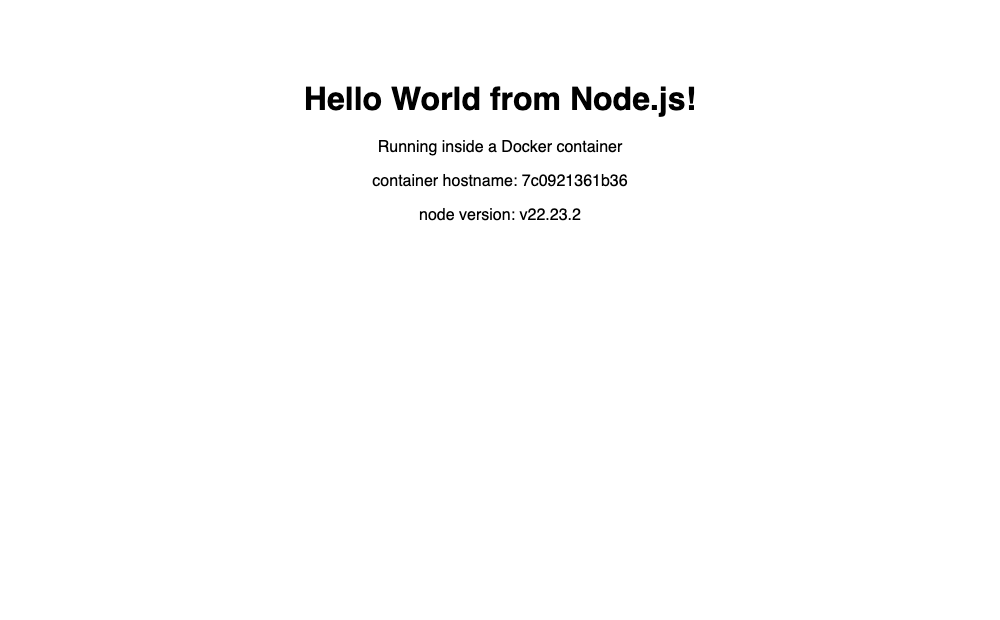
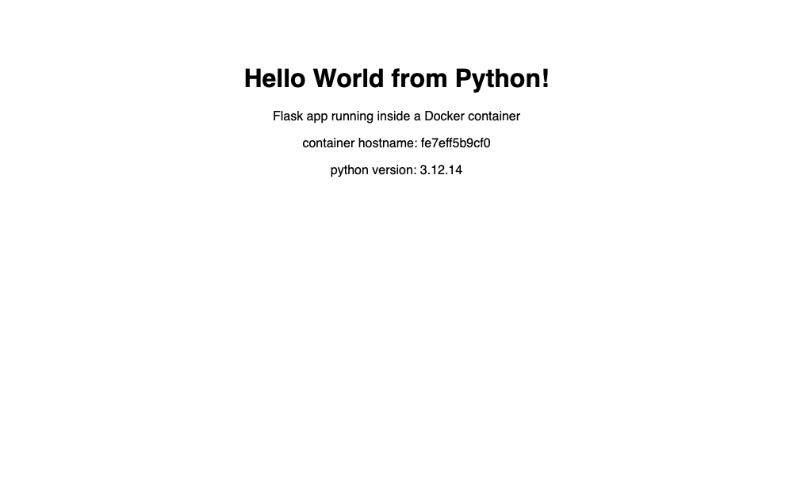
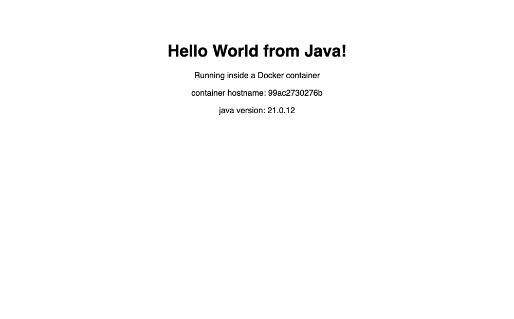
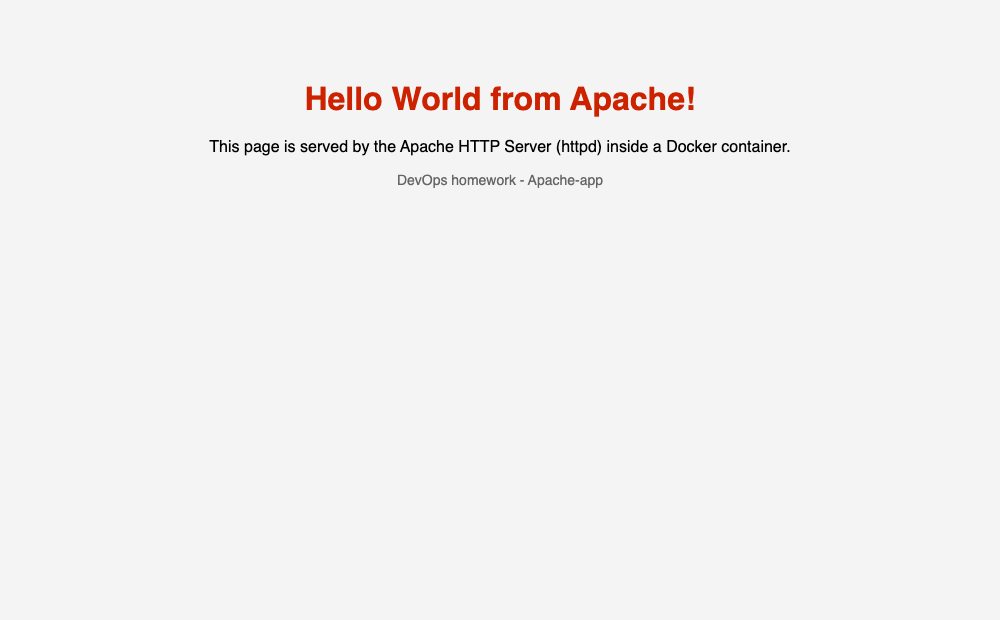
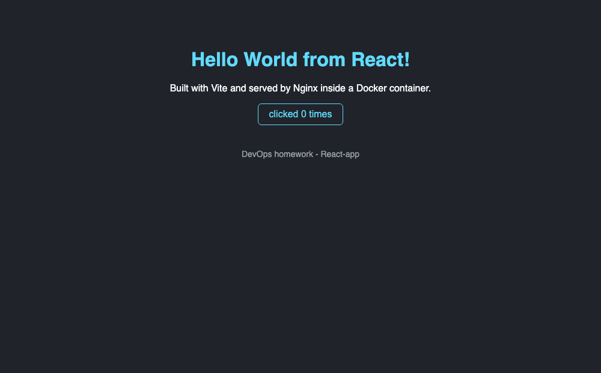
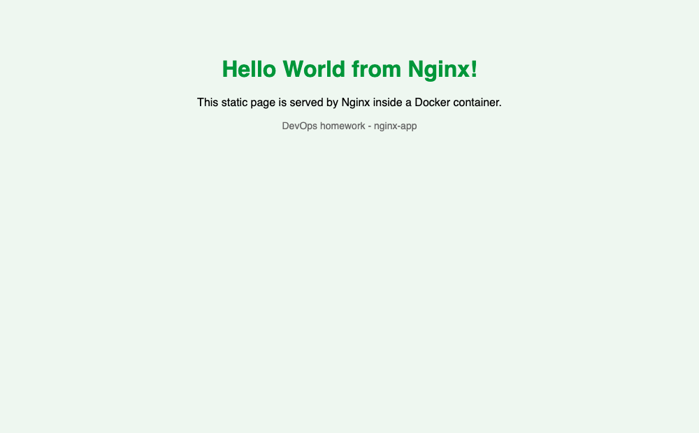

# Docker Fundamentals - Hello World Applications

**Name:** Rajasurya J
**Roll number:** 24BCS10086

Six Hello World web apps, each with its own folder and Dockerfile, each built and
actually run and verified in a browser.

## Folder structure

```
homework/docker-images/
├── nodejs-app/     Express server            -> container port 3000
├── python-app/     Flask server              -> container port 5000
├── java-app/       JDK built-in HTTP server  -> container port 8080
├── Apache-app/     httpd:2.4 + static HTML   -> container port 80
├── React-app/      Vite build + nginx        -> container port 80
└── nginx-app/      nginx:alpine + static HTML-> container port 80
```

## Ports I used

I ran all six at the same time, so each one needed a different host port:

| App | Image | Container | Host port | URL |
|---|---|---|---|---|
| nodejs-app | `hw-nodejs-app` | `hw-nodejs` | 3001 | http://localhost:3001 |
| python-app | `hw-python-app` | `hw-python` | 3002 | http://localhost:3002 |
| java-app | `hw-java-app` | `hw-java` | 3003 | http://localhost:3003 |
| Apache-app | `hw-apache-app` | `hw-apache` | 3004 | http://localhost:3004 |
| React-app | `hw-react-app` | `hw-react` | 3005 | http://localhost:3005 |
| nginx-app | `hw-nginx-app` | `hw-nginx` | 3006 | http://localhost:3006 |

## All six running at once

```
$ docker ps --format "table {{.Names}}\t{{.Image}}\t{{.Status}}\t{{.Ports}}"
NAMES       IMAGE           STATUS              PORTS
hw-nginx    hw-nginx-app    Up About a minute   0.0.0.0:3006->80/tcp, [::]:3006->80/tcp
hw-react    hw-react-app    Up About a minute   0.0.0.0:3005->80/tcp, [::]:3005->80/tcp
hw-apache   hw-apache-app   Up About a minute   0.0.0.0:3004->80/tcp, [::]:3004->80/tcp
hw-java     hw-java-app     Up About a minute   0.0.0.0:3003->8080/tcp, [::]:3003->8080/tcp
hw-python   hw-python-app   Up About a minute   0.0.0.0:3002->5000/tcp, [::]:3002->5000/tcp
hw-nodejs   hw-nodejs-app   Up About a minute   0.0.0.0:3001->3000/tcp, [::]:3001->3000/tcp
```

```
$ docker images --filter "reference=hw-*"
REPOSITORY      TAG       IMAGE ID       SIZE
hw-react-app    latest    13298de9dcb0   102MB
hw-nginx-app    latest    ee54bd433aea   102MB
hw-java-app     latest    a812ffea818b   286MB
hw-apache-app   latest    8cb150f8779d   205MB
hw-python-app   latest    21a8d5362913   234MB
hw-nodejs-app   latest    b3ca5400b872   248MB
```

---

## 1. nodejs-app

**Files:** `server.js`, `package.json`, `Dockerfile`, `.dockerignore`

```dockerfile
FROM node:22-alpine
WORKDIR /app
# copy package.json first so this layer is cached when only the code changes
COPY package.json ./
RUN npm install --omit=dev
COPY server.js ./
EXPOSE 3000
CMD ["node", "server.js"]
```

```bash
docker build -t hw-nodejs-app nodejs-app
docker run -d --name hw-nodejs -p 3001:3000 hw-nodejs-app
```

```
$ curl http://localhost:3001
<!DOCTYPE html>
<html>
  <head><title>Node.js Hello World</title></head>
  <body style="font-family: sans-serif; text-align: center; margin-top: 80px;">
    <h1>Hello World from Node.js!</h1>
    <p>Running inside a Docker container</p>
    <p>container hostname: 7c0921361b36</p>
    <p>node version: v22.23.2</p>
  </body>
</html>
[http_code=200]
```



The page prints `os.hostname()`, which inside a container is the **container ID**
(`7c0921361b36`). That is a nice cheap proof that the response really is coming
from inside the container and not from something on my Mac.

**Why `COPY package.json` before `COPY server.js`:** each Dockerfile instruction
is a layer, and Docker caches them. If I copied everything at once, changing one
line of `server.js` would invalidate the cache and re-run `npm install` every
build. Copying the manifest first means `npm install` is only re-run when the
dependencies actually change.

I also had to bind to `0.0.0.0` and not `localhost` inside the container -
`app.listen(PORT, '0.0.0.0')`. If a server binds to `127.0.0.1` inside a
container, the port mapping cannot reach it.

---

## 2. python-app

**Files:** `app.py`, `requirements.txt`, `Dockerfile`

```dockerfile
FROM python:3.12-slim
WORKDIR /app
COPY requirements.txt ./
RUN pip install --no-cache-dir -r requirements.txt
COPY app.py ./
EXPOSE 5000
CMD ["python", "app.py"]
```

```bash
docker build -t hw-python-app python-app
docker run -d --name hw-python -p 3002:5000 hw-python-app
```

```
$ curl http://localhost:3002
<!DOCTYPE html>
<html>
  <head><title>Python Hello World</title></head>
  <body style="font-family: sans-serif; text-align: center; margin-top: 80px;">
    <h1>Hello World from Python!</h1>
    <p>Flask app running inside a Docker container</p>
    <p>container hostname: fe7eff5b9cf0</p>
    <p>python version: 3.12.14</p>
  </body>
</html>
[http_code=200]
```



`--no-cache-dir` on pip stops it keeping the downloaded wheels in the image -
smaller image for free. `python:3.12-slim` instead of the full `python:3.12`
image for the same reason.

Same `0.0.0.0` rule as Node - `app.run(host="0.0.0.0", port=5000)`. Flask
defaults to `127.0.0.1`, which would have been unreachable.

---

## 3. java-app

**Files:** `src/HelloServer.java`, `Dockerfile`

I used the HTTP server that ships with the JDK (`com.sun.net.httpserver`), so
there is no Maven or Gradle and no dependencies to download. The Dockerfile is
two stages: compile with the **JDK**, ship only the **JRE** plus the compiled
class.

```dockerfile
# Build stage: compile the source with a full JDK
FROM eclipse-temurin:21-jdk-alpine AS build
WORKDIR /build
COPY src/HelloServer.java .
RUN javac HelloServer.java

# Run stage: only the JRE + the compiled class is shipped
FROM eclipse-temurin:21-jre-alpine
WORKDIR /app
COPY --from=build /build/HelloServer.class .
EXPOSE 8080
CMD ["java", "HelloServer"]
```

```bash
docker build -t hw-java-app java-app
docker run -d --name hw-java -p 3003:8080 hw-java-app
```

```
$ curl http://localhost:3003
<!DOCTYPE html>
<html>
  <head><title>Java Hello World</title></head>
  <body style="font-family: sans-serif; text-align: center; margin-top: 80px;">
    <h1>Hello World from Java!</h1>
    <p>Running inside a Docker container</p>
    <p>container hostname: 99ac2730276b</p>
    <p>java version: 21.0.12</p>
  </body>
</html>
[http_code=200]
```



The final image never contains `javac`, the compiler, or the `.java` source -
only `HelloServer.class` and a JRE. This is the same multi-stage idea as the
homework in `../docker-multistage/`.

---

## 4. Apache-app

**Files:** `index.html`, `style.css`, `Dockerfile`

```dockerfile
FROM httpd:2.4
# httpd serves everything in this directory by default
COPY index.html /usr/local/apache2/htdocs/
COPY style.css  /usr/local/apache2/htdocs/
EXPOSE 80
# the base image already starts httpd in the foreground
```

```bash
docker build -t hw-apache-app Apache-app
docker run -d --name hw-apache -p 3004:80 hw-apache-app
```

```
$ curl http://localhost:3004
<!DOCTYPE html>
<html>
  <head>
    <title>Apache Hello World</title>
    <link rel="stylesheet" href="style.css">
  </head>
  <body>
    <h1>Hello World from Apache!</h1>
    <p>This page is served by the Apache HTTP Server (httpd) inside a Docker container.</p>
    <p class="small">DevOps homework - Apache-app</p>
  </body>
</html>
[http_code=200]
```



No `CMD` needed - the `httpd:2.4` base image already has one
(`httpd-foreground`) that runs Apache in the foreground. A container stays alive
only as long as PID 1 is alive, so a web server in a container must **not**
daemonize itself.

Apache's document root is `/usr/local/apache2/htdocs/`, which is different from
nginx's `/usr/share/nginx/html/` - the only real difference between this
Dockerfile and the nginx one.

---

## 5. React-app

**Files:** `src/App.jsx`, `src/main.jsx`, `src/index.css`, `index.html`,
`package.json`, `vite.config.js`, `Dockerfile`, `.dockerignore`

A real Vite + React app, built for production and served as static files by
nginx - a **multi-stage build**, which is the production-oriented way to ship
React.

```dockerfile
# ---- stage 1: build ----
FROM node:22-alpine AS build
WORKDIR /app
COPY package.json ./
RUN npm install
COPY . .
RUN npm run build

# ---- stage 2: serve ----
FROM nginx:alpine
COPY --from=build /app/dist /usr/share/nginx/html
EXPOSE 80
```

```bash
docker build -t hw-react-app React-app
docker run -d --name hw-react -p 3005:80 hw-react-app
```

The build output from inside the container:

```
#12 1.026 vite v5.4.21 building for production...
#12 2.155 ✓ 31 modules transformed.
#12 2.302 dist/index.html                   0.40 kB │ gzip:  0.28 kB
#12 2.303 dist/assets/index-HenLfG-k.css    0.31 kB │ gzip:  0.22 kB
#12 2.303 dist/assets/index-BCyLVO7J.js   142.97 kB │ gzip: 45.96 kB
#12 2.304 ✓ built in 1.19s
```

```
$ curl http://localhost:3005
<!DOCTYPE html>
<html lang="en">
  <head>
    <meta charset="UTF-8" />
    <meta name="viewport" content="width=device-width, initial-scale=1.0" />
    <title>React Hello World</title>
    <script type="module" crossorigin src="/assets/index-BCyLVO7J.js"></script>
    <link rel="stylesheet" crossorigin href="/assets/index-HenLfG-k.css">
  </head>
  <body>
    <div id="root"></div>
  </body>
</html>
[http_code=200]
```



**Important thing I learned here:** `curl` shows an *empty* `<div id="root">`.
That is not a bug - React renders on the client, so the HTML that comes off the
wire is just a shell and the JS bundle fills it in. `curl` alone cannot prove
this app works, which is exactly why the browser screenshot matters for this one.
The screenshot shows the rendered heading and the working counter button.

**Why multi-stage is worth it here.** I built the same app as a single stage
(node + node_modules + source kept in the final image) just to compare:

```
$ docker images
REPOSITORY           TAG      SIZE
react-single-stage   v1       449MB     <- single stage
hw-react-app         latest   102MB     <- multi-stage (nginx + dist only)
```

**449MB -> 102MB, about a 77% reduction.** The final image contains only the
compiled `dist/` folder and nginx - no Node.js runtime, no `node_modules`, no
`.jsx` source.

---

## 6. nginx-app

**Files:** `index.html`, `style.css`, `Dockerfile`

```dockerfile
FROM nginx:alpine
# nginx serves this directory by default
COPY index.html /usr/share/nginx/html/
COPY style.css  /usr/share/nginx/html/
EXPOSE 80
```

```bash
docker build -t hw-nginx-app nginx-app
docker run -d --name hw-nginx -p 3006:80 hw-nginx-app
```

```
$ curl http://localhost:3006
<!DOCTYPE html>
<html>
  <head>
    <title>Nginx Hello World</title>
    <link rel="stylesheet" href="style.css">
  </head>
  <body>
    <h1>Hello World from Nginx!</h1>
    <p>This static page is served by Nginx inside a Docker container.</p>
    <p class="small">DevOps homework - nginx-app</p>
  </body>
</html>
[http_code=200]
```



The smallest and simplest of the six - `nginx:alpine` is ~50MB and my image came
out at 102MB. For a static site this is all you need.

---

## Build and run everything at once

```bash
cd homework/docker-images

docker build -t hw-nodejs-app nodejs-app
docker build -t hw-python-app python-app
docker build -t hw-java-app   java-app
docker build -t hw-apache-app Apache-app
docker build -t hw-react-app  React-app
docker build -t hw-nginx-app  nginx-app

docker run -d --name hw-nodejs -p 3001:3000 hw-nodejs-app
docker run -d --name hw-python -p 3002:5000 hw-python-app
docker run -d --name hw-java   -p 3003:8080 hw-java-app
docker run -d --name hw-apache -p 3004:80   hw-apache-app
docker run -d --name hw-react  -p 3005:80   hw-react-app
docker run -d --name hw-nginx  -p 3006:80   hw-nginx-app

docker ps

# cleanup when done
docker rm -f hw-nodejs hw-python hw-java hw-apache hw-react hw-nginx
```

## What I learned

- **The Dockerfile pattern is the same every time:** pick a base image, set a
  workdir, copy the dependency manifest, install, copy the code, `EXPOSE`, `CMD`.
  Only the base image and the paths change between languages.
- **`-p host:container` order matters.** `-p 3003:8080` means "host 3003 goes to
  container 8080". I mixed this up once and got connection refused.
- **A server must bind to `0.0.0.0` inside a container**, not `127.0.0.1`, or the
  published port cannot reach it.
- **The process must stay in the foreground.** Apache and nginx base images
  already handle this; if PID 1 exits, the container dies.
- **Layer order is a caching decision**, not just style - manifest first, source
  last.
- **Multi-stage builds are the big win for anything with a build step.** The
  React app went from 449MB to 102MB, and the Java app ships a JRE with no
  compiler.
- **`curl` is not always enough to verify.** For a client-rendered SPA like the
  React app you need an actual browser to see whether it works.
