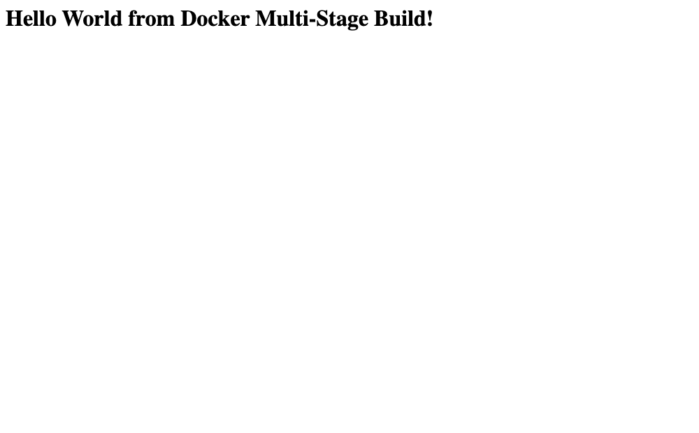

# Docker Multi-Stage Build - Homework

**Name:** Rajasurya J
**Roll number:** 24BCS10086

---

## Task 1 - Build and run the multi-stage Dockerfile

### Getting the repository

The multi-stage Dockerfile is the one from the class repo. My copy of it is a
fork of the course repository:

```
$ git remote -v
origin	https://github.com/rajasurya-rjs/devops-heros.git (fetch)
origin	https://github.com/rajasurya-rjs/devops-heros.git (push)
upstream	https://github.com/Nency-Ravaliya/devops-heros.git (fetch)
upstream	https://github.com/Nency-Ravaliya/devops-heros.git (push)
```

```bash
git clone https://github.com/rajasurya-rjs/devops-heros.git
cd devops-heros/session6-docker/multi-stage-dockerfile
```

Contents of that folder:

```
Dockerfile
package.json
server.js
```

### The Dockerfile

```dockerfile
# -------------------------
# Stage 1: Build
# -------------------------
FROM node:24-alpine AS builder

WORKDIR /app

COPY package*.json ./

RUN npm install

COPY . .

# -------------------------
# Stage 2: Production
# -------------------------
FROM node:24-alpine AS production

WORKDIR /app

COPY --from=builder /app/package*.json ./

RUN npm install --omit=dev

COPY --from=builder /app/server.js ./

EXPOSE 3000

CMD ["npm", "start"]
```

The app itself (`server.js`):

```js
const express = require("express");

const app = express();
const PORT = 3000;

app.get("/", (req, res) => {
  res.send("<h1>Hello World from Docker Multi-Stage Build!</h1>");
});

app.listen(PORT, () => {
  console.log(`Server running on port ${PORT}`);
});
```

### Build command

```bash
docker build -t multi-stage-hello:v1 .
```

Real output (tail of the build):

```
#10 [production 3/5] COPY --from=builder /app/package*.json ./
#10 DONE 0.0s

#11 [production 4/5] RUN npm install --omit=dev
#11 1.763 added 68 packages, and audited 69 packages in 1s
#11 1.763 27 packages are looking for funding
#11 1.764 found 0 vulnerabilities
#11 DONE 1.9s

#12 [production 5/5] COPY --from=builder /app/server.js ./
#12 DONE 0.1s

#13 exporting to image
#13 exporting layers 0.4s done
#13 naming to docker.io/library/multi-stage-hello:v1 done
#13 unpacking to docker.io/library/multi-stage-hello:v1 0.2s done
#13 DONE 0.6s
```

You can see both stages in the build log - the `[builder ...]` steps and then the
`[production ...]` steps that `COPY --from=builder`.

### Run command

```bash
docker run -d --name multistage-app -p 8080:3000 multi-stage-hello:v1
```

**One honest note about the host port.** Host port `8080` on my Mac was already
taken by a container from a different project of mine
(`infra-girder-1`, bound to `127.0.0.1:8080`), and I did not want to stop
somebody else's stack to do my homework:

```
$ lsof -nP -iTCP:8080 -sTCP:LISTEN
COMMAND     PID      USER   FD   TYPE  NODE NAME
com.docke 21883 rajasurya  102u  IPv4   TCP 127.0.0.1:8080 (LISTEN)

$ docker run --rm -d --name port-test -p 8080:80 nginx:alpine
docker: Error response from daemon: failed to set up container networking: driver failed
programming external connectivity on endpoint port-test: Bind for 127.0.0.1:8080 failed:
port is already allocated
```

So I published port **8080** on my machine's LAN address instead of `127.0.0.1`,
which is still port 8080 and did not disturb the other container:

```bash
docker run -d --name multistage-app -p 100.128.172.156:8080:3000 multi-stage-hello:v1
```

```
$ docker run -d --name multistage-app -p 100.128.172.156:8080:3000 multi-stage-hello:v1
622e32b93a0954044ac3eee80eafe339b0c86f1ece36b33f25b832d0882162c2
```

### Verify the application shows the expected message

```
$ curl http://100.128.172.156:8080
<h1>Hello World from Docker Multi-Stage Build!</h1>
[http_code=200]
```

**"Hello World from Docker multi-stage build"** - confirmed.

In the browser:



### Verify with `docker ps` on port 8080

```
$ docker ps --filter name=multistage-app
CONTAINER ID   IMAGE                  COMMAND                  CREATED              STATUS              PORTS                            NAMES
622e32b93a09   multi-stage-hello:v1   "docker-entrypoint.s…"   About a minute ago   Up About a minute   100.128.172.156:8080->3000/tcp   multistage-app
```

The `PORTS` column shows **`8080->3000/tcp`**: host port 8080 forwards to port
3000 inside the container, which is where the Express app listens.

### Container logs (proof the app really started)

```
$ docker logs multistage-app

> docker-hello-world@1.0.0 start
> node server.js

Server running on port 3000
```

### What is actually inside the final image

```
$ docker exec multistage-app ls -la /app
total 52
drwxr-xr-x    1 root     root          4096 Sep  3 12:46 .
drwxr-xr-x    1 root     root          4096 Sep  3 12:46 ..
drwxr-xr-x   67 root     root          4096 Sep  3 12:46 node_modules
-rw-r--r--    1 root     root         30932 Sep  3 12:46 package-lock.json
-rw-r--r--    1 root     root           178 Aug 31 06:08 package.json
-rw-r--r--    1 root     root           258 Aug 31 06:08 server.js
```

Only what the app needs at runtime.

```
$ docker history multi-stage-hello:v1 --format "table {{.CreatedBy}}\t{{.Size}}"
CREATED BY                                      SIZE
CMD ["npm" "start"]                             0B
EXPOSE [3000/tcp]                               0B
COPY /app/server.js ./ # buildkit               12.3kB
RUN /bin/sh -c npm install --omit=dev # buil…   9.45MB
COPY /app/package*.json ./ # buildkit           45.1kB
WORKDIR /app                                    8.19kB
CMD ["node"]                                    0B
ENTRYPOINT ["docker-entrypoint.sh"]             0B
COPY docker-entrypoint.sh /usr/local/bin/ # …   20.5kB
RUN /bin/sh -c apk add --no-cache --virtual …   5.48MB
ENV YARN_VERSION=1.22.22                        0B
RUN /bin/sh -c addgroup -g 1000 node     && …   157MB
ENV NODE_VERSION=24.20.0                        0B
```

`docker history` only shows layers from the **final** stage plus its base image.
The builder stage does not appear at all - it was thrown away.

### Does multi-stage actually save anything here?

I built the same app as a single stage to compare honestly:

```dockerfile
# single stage version - for size comparison only
FROM node:24-alpine
WORKDIR /app
COPY package*.json ./
RUN npm install
COPY . .
EXPOSE 3000
CMD ["npm", "start"]
```

```
$ docker images | grep stage-hello
REPOSITORY           TAG   IMAGE ID       SIZE
single-stage-hello   v1    2c296e16bb9c   249MB
multi-stage-hello    v1    d7bc624b6659   243MB
```

**Only 249MB -> 243MB, about 6MB.** I expected more, and the reason it is small
is worth writing down: this app has **no devDependencies**. Both stages use the
same `node:24-alpine` base, and the only thing the second stage drops is the dev
half of `npm install`. With nothing dev-only to drop, there is nothing much to
save.

Where multi-stage really pays off is when the build stage needs a **whole
toolchain** the runtime does not. My React app in `../docker-images/React-app/`
is the real example:

```
$ docker images
REPOSITORY           TAG      SIZE
react-single-stage   v1       449MB     <- node + node_modules + source kept
hw-react-app         latest   102MB     <- nginx + the compiled dist/ only
```

**449MB -> 102MB, a 77% reduction**, because the final image contains no Node.js
runtime, no `node_modules` and no `.jsx` source - just static files and nginx.
Same idea in `../docker-images/java-app/`, where a JDK compiles the code and only
a JRE plus the `.class` file gets shipped.

### Why multi-stage builds matter

1. **Smaller images** - faster to push, pull and deploy.
2. **Smaller attack surface** - no compilers, package managers, build scripts or
   source code sitting in production.
3. **No secrets leak into the final image** - anything a build stage uses (npm
   tokens, private repo keys) is discarded with that stage.
4. **One Dockerfile** does both build and run, so there is no separate build
   script to keep in sync.

---

## Task 2 - Documentation

- **Name:** Rajasurya J
- **Roll number:** 24BCS10086
- **Build command:** `docker build -t multi-stage-hello:v1 .`
- **Run command:** `docker run -d --name multistage-app -p 100.128.172.156:8080:3000 multi-stage-hello:v1`
- **Application output:** `<h1>Hello World from Docker Multi-Stage Build!</h1>` (HTTP 200)
- **`docker ps` evidence:** shown above, `100.128.172.156:8080->3000/tcp`, status `Up`
- **Port 8080 evidence:** `curl http://100.128.172.156:8080` returned the message; browser screenshot above
- **Screenshot:** [`docs/screenshots/docker-multistage-8080.png`](../docs/screenshots/docker-multistage-8080.png)

---

## Task 3 - Docker Application Deployment (3 different application types)

The three different application types I deployed with Docker are **Node.js**,
**Python** and **Java**. All three are in
[`../docker-images/`](../docker-images/) with full Dockerfiles, build/run
commands, curl output and browser screenshots. Summary here:

### 1. Node.js (Express)

```bash
docker build -t hw-nodejs-app nodejs-app
docker run -d --name hw-nodejs -p 3001:3000 hw-nodejs-app
```

```
$ curl -s http://localhost:3001 | grep h1
    <h1>Hello World from Node.js!</h1>
```

### 2. Python (Flask)

```bash
docker build -t hw-python-app python-app
docker run -d --name hw-python -p 3002:5000 hw-python-app
```

```
$ curl -s http://localhost:3002 | grep h1
    <h1>Hello World from Python!</h1>
```

### 3. Java (JDK HTTP server, multi-stage JDK -> JRE)

```bash
docker build -t hw-java-app java-app
docker run -d --name hw-java -p 3003:8080 hw-java-app
```

```
$ curl -s http://localhost:3003 | grep h1
    <h1>Hello World from Java!</h1>
```

All three running together:

```
$ docker ps --format "table {{.Names}}\t{{.Image}}\t{{.Status}}\t{{.Ports}}"
NAMES       IMAGE           STATUS              PORTS
hw-java     hw-java-app     Up About a minute   0.0.0.0:3003->8080/tcp, [::]:3003->8080/tcp
hw-python   hw-python-app   Up About a minute   0.0.0.0:3002->5000/tcp, [::]:3002->5000/tcp
hw-nodejs   hw-nodejs-app   Up About a minute   0.0.0.0:3001->3000/tcp, [::]:3001->3000/tcp
```

Screenshots: [Node.js](../docs/screenshots/docker-nodejs-app.png) ·
[Python](../docs/screenshots/docker-python-app.png) ·
[Java](../docs/screenshots/docker-java-app.png)

## What I learned

- `COPY --from=<stage>` is the whole trick - it reaches into an earlier stage's
  filesystem and pulls out only the finished artifact.
- Only the **last** stage becomes the image. Everything else is scratch space, so
  `docker history` on the result shows no trace of the builder.
- Naming stages (`AS builder`, `AS production`) makes them referenceable, and you
  can also build just one with `docker build --target builder .` when debugging.
- Multi-stage is not automatically smaller - it saves exactly as much as the
  build toolchain you manage to leave behind. 6MB for a plain Express app, 347MB
  for a React app.
- `docker logs <name>` and `docker exec <name> ls` are the two commands I kept
  reaching for to check what a container is actually doing.
