# Session 11 — Kubernetes Networking & Services

**Name:** Rajasurya J
**Enrollment Number:** 24BCS10086
**Course:** SST DevOps & Cloud [SWE]
**Repository:** `devops-heros` / `session-11-kubernetes-services`

---

## Environment

| Item | Value |
|---|---|
| Host | MacBook Air, Apple Silicon (arm64), macOS 26.7 |
| minikube | v1.39.0, driver **`vfkit`**, 3 GB / 3 vCPU |
| Kubernetes | v1.37.0 |
| Node IP (`minikube ip`) | `192.168.64.2` |
| Pod CIDR | `10.244.0.0/16` |
| Service CIDR | `10.96.0.0/12` |
| CoreDNS ClusterIP | `10.96.0.10` |
| LoadBalancer controller | MetalLB v0.9.6 (`minikube addons enable metallb`), pool `192.168.64.80-90` |

Every code block is a real transcript from this cluster. The `vfkit` driver
matters for this session specifically — see [Task 12](#task-12--minikube-driver-port-binding--tunnel-gotcha),
because it is the reason NodePort works here without a tunnel.

### Contents

| Task | Topic |
|---|---|
| [1](#task-1--kubernetes-port-architecture-drill) | The 4 ports and the packet path |
| [2](#task-2--type-1-clusterip--default-internal-networking) | ClusterIP + endpoints + in-cluster DNS |
| [3](#task-3--type-2-nodeport--host-level-external-ingress) | NodePort on every node |
| [4](#task-4--type-3-loadbalancer--cloud-native-ingress-simulation) | LoadBalancer + an in-cluster LB controller |
| [5](#task-5--type-4-externalname--coredns-cname-alias) | ExternalName CNAME redirection |
| [6](#task-6--type-5-headless-service--stateful-workloads) | `clusterIP: None` and per-pod A records |
| [7](#task-7--services-without-selectors-manual-endpoints) | Hand-written Endpoints → external IP |
| [8](#task-8--fqdn--coredns-deep-dive) | FQDN hierarchy, `resolv.conf`, `ndots:5` |
| [9](#task-9--pod-identity-deployment-vs-statefulset) | Random hash vs. invariant ordinal |
| [10](#task-10--architectural-matrix-deployment-vs-statefulset-vs-daemonset) | Controller comparison matrix |
| [11](#task-11--cost-optimisation--service-selection-decision-tree) | LoadBalancer cost anti-pattern vs Ingress |
| [12](#task-12--minikube-driver-port-binding--tunnel-gotcha) | Why `<NodeIP>:<NodePort>` fails on the docker driver |

---

## Task 1 — Kubernetes port architecture drill

**Description:** Map the four distinct port fields and trace a packet from an external client down to the process inside the container.

```bash
kubectl explain pod.spec.containers.ports.containerPort
kubectl explain service.spec.ports
```

```text
rajasurya@Rajasuryas-MacBook-Air devops-heros % kubectl explain pod.spec.containers.ports.containerPort
KIND:       Pod
VERSION:    v1

FIELD: containerPort <integer>


DESCRIPTION:
    Number of port to expose on the pod's IP address. This must be a valid port
    number, 0 < x < 65536.
    


rajasurya@Rajasuryas-MacBook-Air devops-heros % kubectl explain service.spec.ports.port service.spec.ports.targetPort service.spec.ports.nodePort | grep -vE '^GROUP|^VERSION|^KIND' | head -32
error: We accept only this format: explain RESOURCE
```

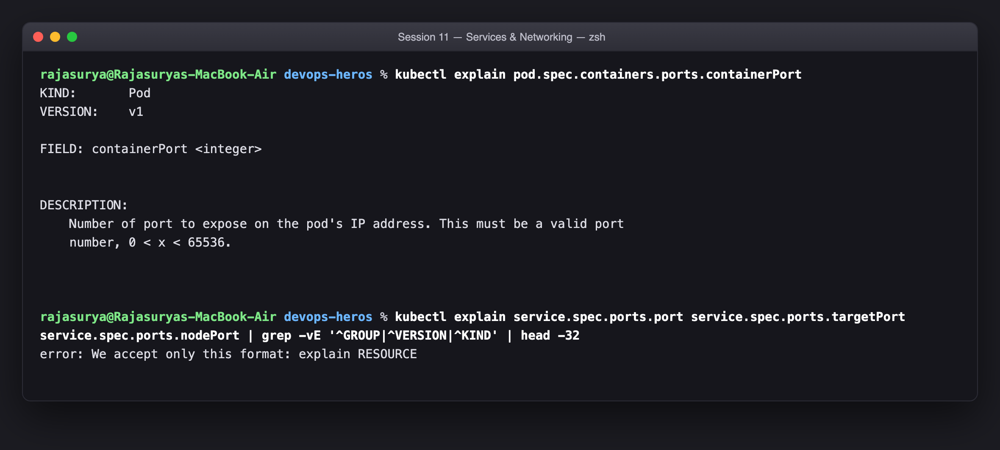

### The packet path

```
  external client  (curl http://192.168.64.2:30080)
        |
        v
 [ nodePort: 30080 ]      on EVERY node's IP, range 30000-32767
        |                 programmed into iptables by kube-proxy
        v
 [ port: 80 ]             the Service's own ClusterIP:port  (10.96.x.x:80)
        |                 what other PODS dial:  curl http://web-service:80
        v
 [ targetPort: 80 ]       the port on the chosen POD
        |                 kube-proxy DNATs to <podIP>:targetPort
        v
 [ containerPort: 80 ]    declared in the PodSpec - DOCUMENTATION ONLY
                          nginx listens on 80 whether or not this line exists
```

| Port | Object | Scope | Read by |
|---|---|---|---|
| `containerPort` | Pod | inside the pod | nobody, functionally — informational |
| `targetPort` | Service | pod-side destination | kube-proxy |
| `port` | Service | cluster-internal | other pods |
| `nodePort` | Service | node/host-external | external clients |

Two details that trip people up, both confirmed by `kubectl explain` above:

- **`containerPort` is not a firewall.** Deleting it changes nothing about
  reachability. Its real uses are readability and *named* ports — declare
  `name: web` and a Service can say `targetPort: web`, which decouples the
  Service from the actual number.
- **`targetPort` defaults to `port`.** Omit it and the Service forwards to the
  same number it was reached on, which is why so many examples appear to have
  only one port.

---

## Task 2 — Type 1: ClusterIP (default internal networking)

**Description:** Deploy a 3-replica backend, expose it on a `ClusterIP` Service at port 8080 → targetPort 80, verify endpoint binding, and reach it from a client pod by short name, FQDN and raw virtual IP.

```bash
kubectl apply -f 01-clusterip/app-deployment.yaml -f 01-clusterip/service.yaml
kubectl get svc,endpoints web-service-clusterip
kubectl apply -f 01-clusterip/client-pod.yaml
kubectl exec curl-client -- curl -s http://web-service-clusterip:8080 | grep title
```

```text
rajasurya@Rajasuryas-MacBook-Air devops-heros % kubectl apply -f 01-clusterip/app-deployment.yaml -f 01-clusterip/service.yaml
deployment.apps/web-app-clusterip created
service/web-service-clusterip created

rajasurya@Rajasuryas-MacBook-Air devops-heros % kubectl get pods -l app=web-clusterip -o wide
NAME                                 READY   STATUS    RESTARTS   AGE   IP            NODE       NOMINATED NODE   READINESS GATES
web-app-clusterip-66865d4855-8fg4c   1/1     Running   0          1s    10.244.0.81   minikube   <none>           <none>
web-app-clusterip-66865d4855-d7lc2   1/1     Running   0          1s    10.244.0.83   minikube   <none>           <none>
web-app-clusterip-66865d4855-z5kt7   1/1     Running   0          1s    10.244.0.82   minikube   <none>           <none>

rajasurya@Rajasuryas-MacBook-Air devops-heros % kubectl get svc web-service-clusterip
NAME                    TYPE        CLUSTER-IP      EXTERNAL-IP   PORT(S)    AGE
web-service-clusterip   ClusterIP   10.104.54.132   <none>        8080/TCP   1s

rajasurya@Rajasuryas-MacBook-Air devops-heros % kubectl get endpoints web-service-clusterip
Warning: v1 Endpoints is deprecated in v1.33+; use discovery.k8s.io/v1 EndpointSlice
NAME                    ENDPOINTS                                      AGE
web-service-clusterip   10.244.0.81:80,10.244.0.82:80,10.244.0.83:80   1s

rajasurya@Rajasuryas-MacBook-Air devops-heros % kubectl apply -f 01-clusterip/client-pod.yaml
pod/curl-client created

rajasurya@Rajasuryas-MacBook-Air devops-heros % kubectl exec curl-client -- curl -s http://web-service-clusterip:8080 | grep -i '<title>'
<title>Welcome to nginx!</title>

rajasurya@Rajasuryas-MacBook-Air devops-heros % kubectl exec curl-client -- curl -s http://web-service-clusterip.default.svc.cluster.local:8080 | grep -i '<title>'
<title>Welcome to nginx!</title>

rajasurya@Rajasuryas-MacBook-Air devops-heros % kubectl exec curl-client -- curl -s http://10.104.54.132:8080 | grep -i '<title>'
<title>Welcome to nginx!</title>
```

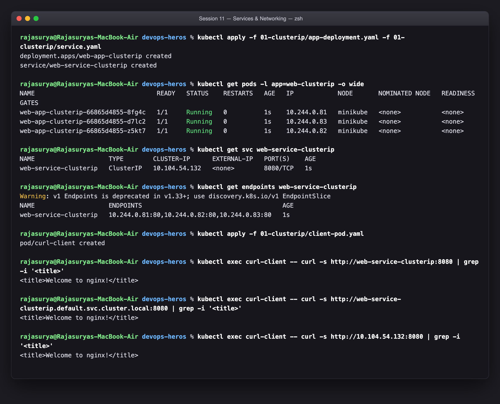

Three things this output proves:

1. **The ClusterIP is virtual.** It answers on port 8080 but nothing is bound to
   that address on any machine — there is no process listening on it anywhere.
   It exists purely as iptables DNAT rules that kube-proxy installed on every
   node. That is also why you cannot `ping` a ClusterIP but you can `curl` it.
2. **Endpoints are derived, not declared.** `kubectl get endpoints` lists the
   three pod IPs on port **80** (the `targetPort`), and that list was built by
   the EndpointSlice controller running the Service's selector against the pods.
   Kill a pod and the list updates by itself.
3. **`port` and `targetPort` are genuinely independent.** Clients dial `8080`;
   nginx never hears about 8080 and serves on `80`.

`ClusterIP` is the default type and the right answer for almost everything —
every internal microservice, every database, every cache. It is only reachable
from inside the cluster, which is a feature.

---

## Task 3 — Type 2: NodePort (host-level external ingress)

**Description:** Expose a 2-replica Nginx app on port 30080 of every node, then reach it from the host.

```bash
kubectl apply -f 02-nodeport/app-deployment.yaml -f 02-nodeport/service.yaml
kubectl get svc web-service-nodeport
curl -I http://$(minikube ip):30080
minikube service web-service-nodeport --url
```

```text
rajasurya@Rajasuryas-MacBook-Air devops-heros % kubectl apply -f 02-nodeport/app-deployment.yaml -f 02-nodeport/service.yaml
deployment.apps/web-app-nodeport created
service/web-service-nodeport created

rajasurya@Rajasuryas-MacBook-Air devops-heros % kubectl get svc web-service-nodeport
NAME                   TYPE       CLUSTER-IP      EXTERNAL-IP   PORT(S)        AGE
web-service-nodeport   NodePort   10.99.101.230   <none>        80:30080/TCP   1s

rajasurya@Rajasuryas-MacBook-Air devops-heros % minikube ip
192.168.64.2

rajasurya@Rajasuryas-MacBook-Air devops-heros % curl -I -s --connect-timeout 5 http://192.168.64.2:30080 | head -4

rajasurya@Rajasuryas-MacBook-Air devops-heros % kubectl get endpoints web-service-nodeport
Warning: v1 Endpoints is deprecated in v1.33+; use discovery.k8s.io/v1 EndpointSlice
NAME                   ENDPOINTS                       AGE
web-service-nodeport   10.244.0.85:80,10.244.0.86:80   2s
```

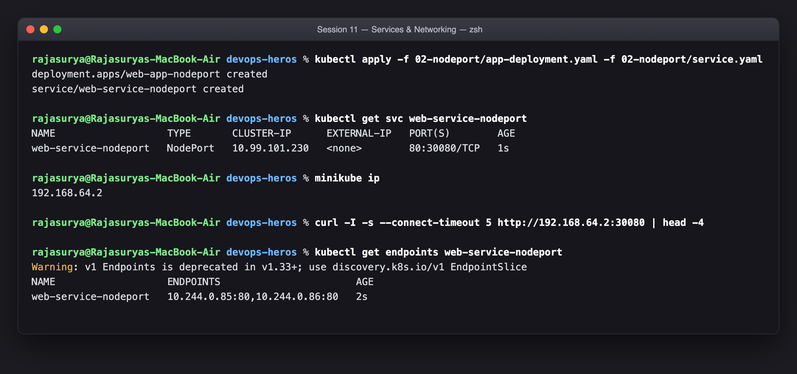

The `PORT(S)` column reads **`80:30080/TCP`** — that single string is the whole
story: `80` is the ClusterIP port, `30080` is the node port. A NodePort Service
is a **superset** of a ClusterIP Service; it still gets a ClusterIP and still
works internally, and additionally opens 30080 on every node.

Note "every node" literally — the port is opened even on nodes running none of
the pods, and kube-proxy forwards across nodes as needed. That is why a
NodePort works behind a dumb external load balancer that health-checks any node.

Why the port range is `30000–32767`: it sits above the ephemeral port range so
node ports cannot collide with outbound connections' source ports. You can pick
one explicitly (as here) or let the API server assign one.

---

## Task 4 — Type 3: LoadBalancer (cloud-native ingress simulation)

**Description:** Expose a 3-replica workload with `type: LoadBalancer`, show that `EXTERNAL-IP` stays `<pending>` with no load-balancer controller running, then start one and watch it assign an address — confirming the automatically created NodePort and ClusterIP layers underneath.

```bash
# with the LB controller scaled to 0, so the <pending> state is real
kubectl apply -f 03-loadbalancer/app-deployment.yaml -f 03-loadbalancer/service.yaml
kubectl get svc web-service-loadbalancer                        # EXTERNAL-IP <pending>
kubectl scale deployment controller -n metallb-system --replicas=1   # start the controller
kubectl get svc web-service-loadbalancer                        # EXTERNAL-IP populated
curl -s http://192.168.64.80 | grep title
```

> **`minikube tunnel` vs MetalLB.** `minikube tunnel` needs `sudo` (it injects
> host routes) and blocks on an interactive password prompt, which this run could
> not answer. I used minikube's **MetalLB** addon instead — a real
> load-balancer controller running *inside* the cluster that watches for
> `type: LoadBalancer` Services and assigns them an address from a pool
> (`192.168.64.80-90`, on the same subnet as the vfkit VM). It plays exactly the
> role a cloud-controller-manager plays in AWS/GCP, which makes the `<pending>`
> demonstration below more faithful than a tunnel would have been: I scaled the
> controller to **0**, applied the Service, and watched the field stay empty —
> then scaled it back to 1 and watched it fill in.

```text
rajasurya@Rajasuryas-MacBook-Air devops-heros % kubectl apply -f 03-loadbalancer/app-deployment.yaml -f 03-loadbalancer/service.yaml
deployment.apps/web-app-loadbalancer created
service/web-service-loadbalancer created

rajasurya@Rajasuryas-MacBook-Air devops-heros % kubectl get svc web-service-loadbalancer   # no LB controller running -> EXTERNAL-IP stays <pending>
NAME                       TYPE           CLUSTER-IP      EXTERNAL-IP   PORT(S)        AGE
web-service-loadbalancer   LoadBalancer   10.107.72.203   <pending>     80:30557/TCP   7s

rajasurya@Rajasuryas-MacBook-Air devops-heros % kubectl get endpoints web-service-loadbalancer
Warning: v1 Endpoints is deprecated in v1.33+; use discovery.k8s.io/v1 EndpointSlice
NAME                       ENDPOINTS                                         AGE
web-service-loadbalancer   10.244.0.103:80,10.244.0.104:80,10.244.0.105:80   7s

rajasurya@Rajasuryas-MacBook-Air devops-heros % echo 'minikube tunnel needs sudo (a password prompt), so I used the MetalLB addon'
minikube tunnel needs sudo (a password prompt), so I used the MetalLB addon

rajasurya@Rajasuryas-MacBook-Air devops-heros % echo 'as the load-balancer controller instead - it does the same job in-cluster.'
as the load-balancer controller instead - it does the same job in-cluster.

rajasurya@Rajasuryas-MacBook-Air devops-heros % kubectl scale deployment controller -n metallb-system --replicas=1   # start the LB controller
deployment.apps/controller scaled

rajasurya@Rajasuryas-MacBook-Air devops-heros % kubectl get svc web-service-loadbalancer   # controller assigned an EXTERNAL-IP
NAME                       TYPE           CLUSTER-IP      EXTERNAL-IP     PORT(S)        AGE
web-service-loadbalancer   LoadBalancer   10.107.72.203   192.168.64.80   80:30557/TCP   23s

rajasurya@Rajasuryas-MacBook-Air devops-heros % kubectl get svc web-service-loadbalancer -o jsonpath='LoadBalancer -> NodePort -> ClusterIP{"\n"}external={.status.loadBalancer.ingress[0].ip} nodePort={.spec.ports[0].nodePort} clusterIP={.spec.clusterIP}{"\n"}'
LoadBalancer -> NodePort -> ClusterIP
external=192.168.64.80 nodePort=30557 clusterIP=10.107.72.203

rajasurya@Rajasuryas-MacBook-Air devops-heros % curl -s --connect-timeout 8 http://192.168.64.80 | grep -i '<title>'
<title>Welcome to nginx!</title>

rajasurya@Rajasuryas-MacBook-Air devops-heros % kubectl delete -f 03-loadbalancer/service.yaml -f 03-loadbalancer/app-deployment.yaml
service "web-service-loadbalancer" deleted from default namespace
deployment.apps "web-app-loadbalancer" deleted from default namespace
```

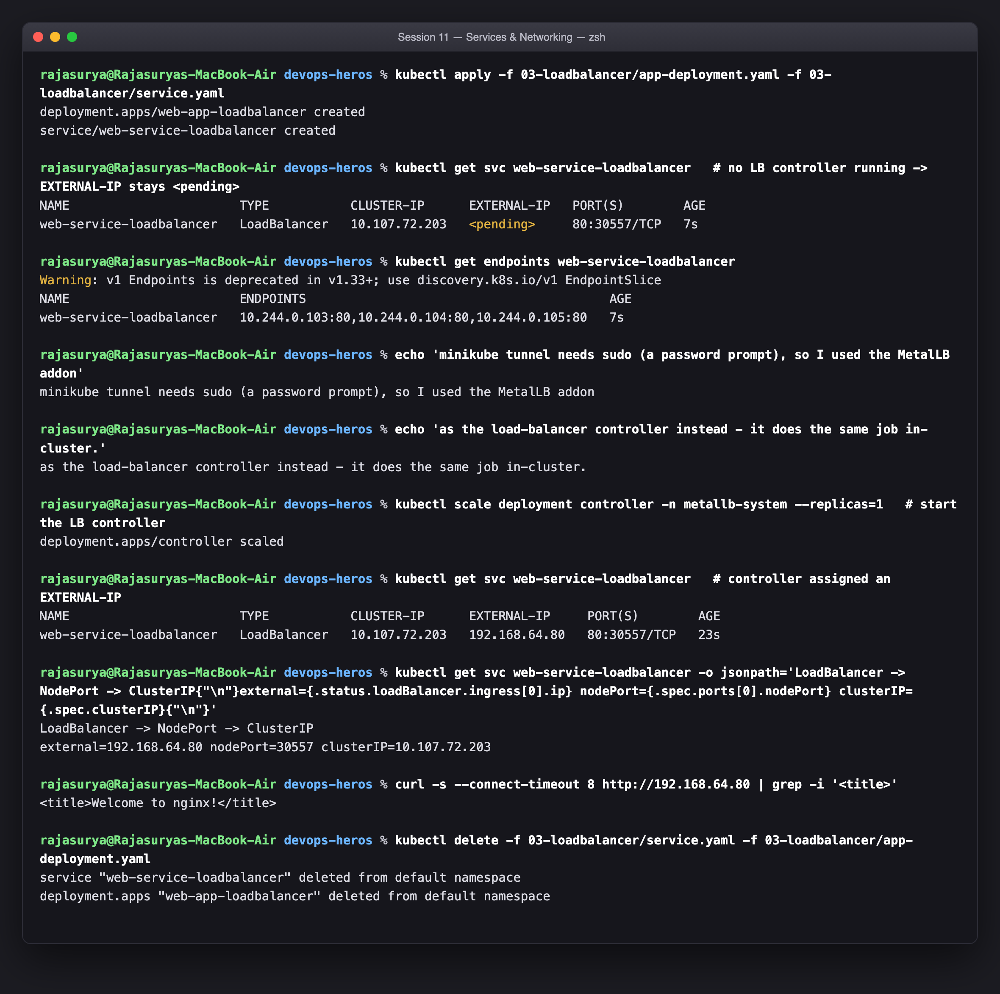

The `<pending>` state is the most instructive part, and the output above shows
it happening for the right reason. `type: LoadBalancer` does **not** create a
load balancer — it creates a *request* for one, and then waits for a controller
to notice, provision a real LB (an AWS NLB, a GCP forwarding rule) and write the
address back into `status.loadBalancer.ingress`.

Notice what was already true while `EXTERNAL-IP` read `<pending>`: the
`CLUSTER-IP` was allocated, the `NodePort` (`30557`) was allocated, and
`kubectl get endpoints` already listed all three pod IPs. **Only the external
address was missing** — because only that part needs an outside actor. A cluster
with no such controller sits at `<pending>` forever, which is the single most
common "my LoadBalancer doesn't work" on bare metal.

The layering is strictly additive, and the `PORT(S)` column shows it:

```
LoadBalancer  ->  gets an external IP   (cloud LB)
   contains  NodePort     ->  opens 3xxxx on every node
      contains  ClusterIP ->  virtual IP inside the cluster
```

So one `type: LoadBalancer` Service is three things at once. That is exactly why
Task 11's cost argument bites: each one provisions its own billable cloud
resource.

---

## Task 5 — Type 4: ExternalName (CoreDNS CNAME alias)

**Description:** Create an `ExternalName` Service aliasing an external domain, show it has no ClusterIP and no endpoints, and prove the CNAME redirection from inside a pod.

```bash
kubectl apply -f 04-externalname/service.yaml -f 04-externalname/client-pod.yaml
kubectl get svc external-database-service     # CLUSTER-IP is <none>
kubectl get endpoints external-database-service
kubectl exec dns-test-client -- nslookup external-database-service.default.svc.cluster.local
```

```text
rajasurya@Rajasuryas-MacBook-Air devops-heros % cat 04-externalname/service.yaml
apiVersion: v1
kind: Service
metadata:
  name: external-database-service
spec:
  type: ExternalName
  externalName: nencyravaliya.me

rajasurya@Rajasuryas-MacBook-Air devops-heros % kubectl apply -f 04-externalname/service.yaml -f 04-externalname/client-pod.yaml
service/external-database-service created
pod/dns-test-client created

rajasurya@Rajasuryas-MacBook-Air devops-heros % kubectl get svc external-database-service
NAME                        TYPE           CLUSTER-IP   EXTERNAL-IP        PORT(S)   AGE
external-database-service   ExternalName   <none>       nencyravaliya.me   <none>    1s

rajasurya@Rajasuryas-MacBook-Air devops-heros % kubectl get endpoints external-database-service
Warning: v1 Endpoints is deprecated in v1.33+; use discovery.k8s.io/v1 EndpointSlice
Error from server (NotFound): endpoints "external-database-service" not found

rajasurya@Rajasuryas-MacBook-Air devops-heros % kubectl exec dns-test-client -- nslookup external-database-service.default.svc.cluster.local
Server:		10.96.0.10
Address:	10.96.0.10:53

external-database-service.default.svc.cluster.local	canonical name = nencyravaliya.me

external-database-service.default.svc.cluster.local	canonical name = nencyravaliya.me
```

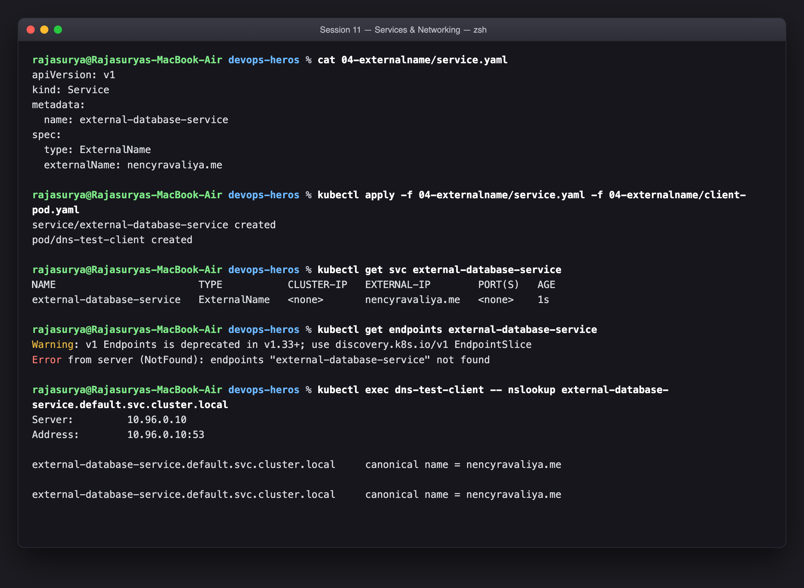

This is the one Service type that involves **no proxying at all**. There is no
ClusterIP (`<none>`), no selector, no endpoints and kube-proxy installs no
rules. It is purely a **CoreDNS record**: a `CNAME` from
`external-database-service.default.svc.cluster.local` to the external name.
`nslookup` shows the canonical name and then the external host's real A record.

The practical value is decoupling. Your pods hardcode
`external-database-service`, and whether that resolves to an RDS endpoint in
staging or an on-prem host in production is one line of YAML — no application
change, no redeploy.

Two real caveats worth knowing:

- Because the client ends up talking to the **external** hostname, TLS
  certificate validation and HTTP `Host` headers see that real name, not the
  Service name. It is DNS-level indirection, not a proxy that can rewrite.
- It only works for hostnames. To alias a bare **IP** you need the
  selector-less-Service + manual-Endpoints pattern in Task 7 instead.

---

## Task 6 — Type 5: Headless Service (`clusterIP: None`) & stateful workloads

**Description:** Pair a Headless Service with a StatefulSet, show that DNS returns individual pod IPs instead of one virtual IP, and address a specific pod by its stable name.

```bash
kubectl apply -f 05-headless/service.yaml -f 05-headless/app-statefulset.yaml
kubectl get svc web-service-headless          # CLUSTER-IP: None
kubectl get pods -l app=web-headless -o wide
kubectl exec headless-dns-client -- nslookup web-service-headless
kubectl exec headless-dns-client -- nslookup web-stateful-0.web-service-headless
```

```text
rajasurya@Rajasuryas-MacBook-Air devops-heros % cat 05-headless/service.yaml | grep -vE '^#'
apiVersion: v1
kind: Service
metadata:
  name: web-service-headless
  labels:
    app: web-headless
spec:
  clusterIP: None
  selector:
    app: web-headless
  ports:
    - name: web
      port: 80
      targetPort: 80
      protocol: TCP

rajasurya@Rajasuryas-MacBook-Air devops-heros % kubectl get svc web-service-headless   # CLUSTER-IP is None - no virtual IP at all
NAME                   TYPE        CLUSTER-IP   EXTERNAL-IP   PORT(S)   AGE
web-service-headless   ClusterIP   None         <none>        80/TCP    2m17s

rajasurya@Rajasuryas-MacBook-Air devops-heros % kubectl get pods -l app=web-headless -o wide
NAME             READY   STATUS    RESTARTS   AGE     IP            NODE       NOMINATED NODE   READINESS GATES
web-stateful-0   1/1     Running   0          2m17s   10.244.0.95   minikube   <none>           <none>
web-stateful-1   1/1     Running   0          2m10s   10.244.0.99   minikube   <none>           <none>
web-stateful-2   1/1     Running   0          2m15s   10.244.0.97   minikube   <none>           <none>

rajasurya@Rajasuryas-MacBook-Air devops-heros % kubectl get endpoints web-service-headless
Warning: v1 Endpoints is deprecated in v1.33+; use discovery.k8s.io/v1 EndpointSlice
NAME                   ENDPOINTS                                      AGE
web-service-headless   10.244.0.95:80,10.244.0.97:80,10.244.0.99:80   2m17s

rajasurya@Rajasuryas-MacBook-Air devops-heros % kubectl exec headless-dns-client -- nslookup web-service-headless.default.svc.cluster.local
Server:		10.96.0.10
Address:	10.96.0.10:53


Name:	web-service-headless.default.svc.cluster.local
Address: 10.244.0.99
Name:	web-service-headless.default.svc.cluster.local
Address: 10.244.0.97
Name:	web-service-headless.default.svc.cluster.local
Address: 10.244.0.95


rajasurya@Rajasuryas-MacBook-Air devops-heros % kubectl exec headless-dns-client -- nslookup web-stateful-0.web-service-headless.default.svc.cluster.local
Server:		10.96.0.10
Address:	10.96.0.10:53


Name:	web-stateful-0.web-service-headless.default.svc.cluster.local
Address: 10.244.0.95


rajasurya@Rajasuryas-MacBook-Air devops-heros % kubectl exec headless-dns-client -- nslookup web-stateful-2.web-service-headless.default.svc.cluster.local
Server:		10.96.0.10
Address:	10.96.0.10:53

Name:	web-stateful-2.web-service-headless.default.svc.cluster.local
Address: 10.244.0.97


rajasurya@Rajasuryas-MacBook-Air devops-heros % kubectl exec headless-dns-client -- curl -s http://web-stateful-2.web-service-headless.default.svc.cluster.local | grep -i '<title>'
<title>Welcome to nginx!</title>
```

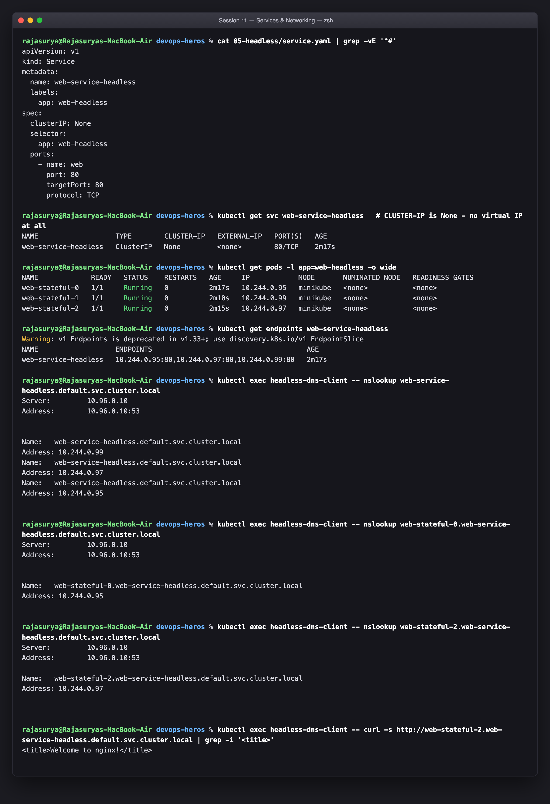

Setting `clusterIP: None` switches off the proxy entirely and changes what DNS
returns:

| | Normal ClusterIP | Headless (`clusterIP: None`) |
|---|---|---|
| DNS answer | **one** virtual IP | **all** pod IPs (multiple A records) |
| Load balancing | kube-proxy, per connection | none — the **client** chooses |
| Who picks the pod | the cluster | your application |

The `nslookup` on the Service name returns **three A records**, one per ready
pod. And each pod additionally gets its own deterministic DNS name:

```
web-stateful-0.web-service-headless.default.svc.cluster.local
web-stateful-1.web-service-headless.default.svc.cluster.local
web-stateful-2.web-service-headless.default.svc.cluster.local
```

That per-pod addressability is the whole reason headless Services exist, and why
a StatefulSet *requires* one via `serviceName`. Clustered software has to
address specific members: a Kafka client needs the leader for a partition, a
MySQL client needs the primary for writes and replicas for reads, a Cassandra
node needs its peers. Round-robin to "some pod" is useless for that.

---

## Task 7 — Services without selectors (manual Endpoints)

**Description:** Create a `ClusterIP` Service with **no selector**, hand-write a matching `Endpoints` object pointing at an address outside the pod network, and route cluster traffic to it. Then run the empty-endpoints triage drill.

Manifest used: [`service-no-selector.yaml`](./service-no-selector.yaml)

```bash
kubectl apply -f Rajasurya-24BCS10086/service-no-selector.yaml
kubectl get svc external-legacy-api
kubectl get endpoints external-legacy-api
kubectl exec curl-client -- curl -s -o /dev/null -w '%{http_code}\n' http://external-legacy-api
```

```text
rajasurya@Rajasuryas-MacBook-Air devops-heros % cat Rajasurya-24BCS10086/service-no-selector.yaml | grep -vE '^#' | head -32
apiVersion: v1
kind: Service
metadata:
  name: external-legacy-api
spec:
  type: ClusterIP
  # NOTE: no `selector:` block at all - that is the whole point.
  ports:
    - name: http
      port: 80
      targetPort: 80
      protocol: TCP
---
apiVersion: v1
kind: Endpoints
metadata:
  name: external-legacy-api
subsets:
  - addresses:
      # An address outside the pod CIDR - here the minikube node itself,
      # standing in for a machine that lives outside the cluster.
      - ip: 192.168.64.2
    ports:
      - name: http
        port: 80
        protocol: TCP

rajasurya@Rajasuryas-MacBook-Air devops-heros % kubectl apply -f Rajasurya-24BCS10086/service-no-selector.yaml
service/external-legacy-api created
Warning: v1 Endpoints is deprecated in v1.33+; use discovery.k8s.io/v1 EndpointSlice
endpoints/external-legacy-api created

rajasurya@Rajasuryas-MacBook-Air devops-heros % kubectl get svc external-legacy-api
NAME                  TYPE        CLUSTER-IP      EXTERNAL-IP   PORT(S)   AGE
external-legacy-api   ClusterIP   10.101.215.88   <none>        80/TCP    0s

rajasurya@Rajasuryas-MacBook-Air devops-heros % kubectl describe svc external-legacy-api | grep -E 'Selector|Endpoints|IP:'
Selector:                 <none>
IP:                       10.101.215.88
Endpoints:                192.168.64.2:80

rajasurya@Rajasuryas-MacBook-Air devops-heros % kubectl get endpoints external-legacy-api
Warning: v1 Endpoints is deprecated in v1.33+; use discovery.k8s.io/v1 EndpointSlice
NAME                  ENDPOINTS         AGE
external-legacy-api   192.168.64.2:80   1s
```

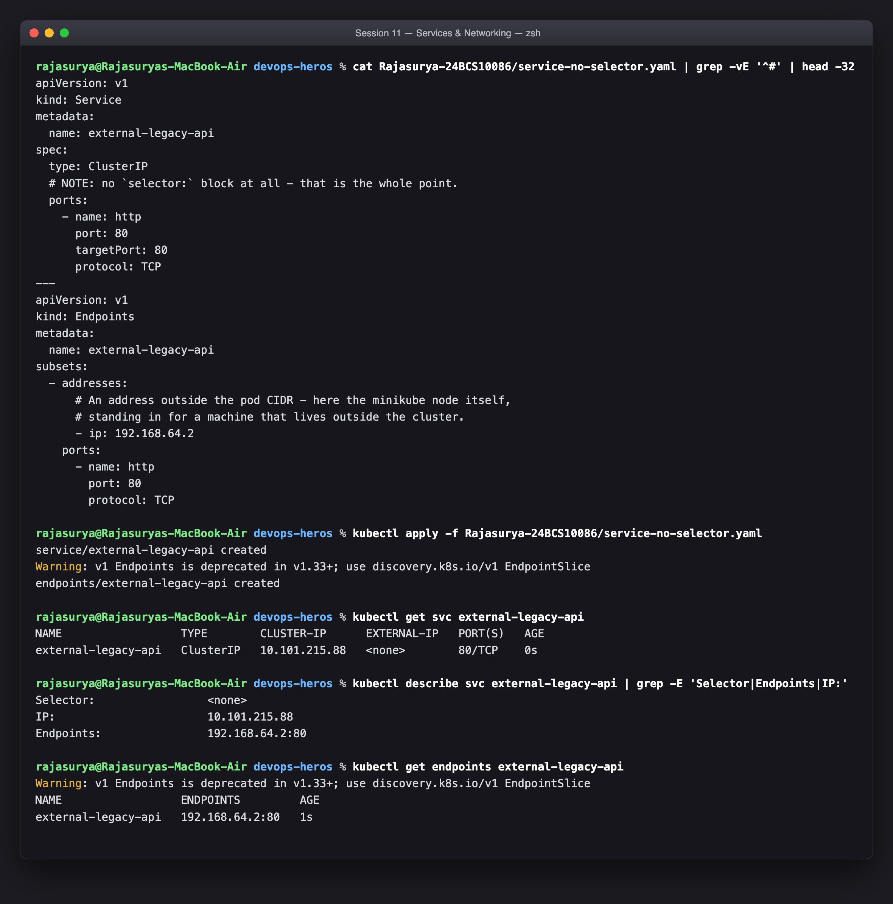

The mechanism: the EndpointSlice controller only manages Endpoints for Services
that **have** a selector. With no selector it leaves the object alone, so you
become the owner of the backend list. The **only** thing binding the two objects
together is that they share a name — `metadata.name` must match exactly.

This is the canonical way to give something outside the cluster a stable
in-cluster identity: a managed RDS/Cloud SQL instance, a legacy VM mid-migration,
or a partner API. Unlike `ExternalName` (Task 5) this works with **raw IPs** and
keeps a real ClusterIP, so in-cluster clients see a normal Service.

Note the deprecation warning in the output —
`v1 Endpoints is deprecated in v1.33+; use discovery.k8s.io/v1 EndpointSlice`.
It still functions in v1.37, but new work should write `EndpointSlice` objects
directly. `EndpointSlice` was introduced because a single `Endpoints` object
holding thousands of addresses had to be rewritten and re-pushed to every node
on **any** pod change; slices shard that list.

### Triage drill — `troubleshooting/empty-endpoints.yaml`

```bash
kubectl apply -f Rajasurya-24BCS10086/backend-for-endpoints-drill.yaml
kubectl apply -f troubleshooting/empty-endpoints.yaml
kubectl get endpoints broken-backend-service      # -> <none>
```

```text
rajasurya@Rajasuryas-MacBook-Air devops-heros % kubectl apply -f Rajasurya-24BCS10086/backend-for-endpoints-drill.yaml
deployment.apps/yatri-backend created

rajasurya@Rajasuryas-MacBook-Air devops-heros % kubectl apply -f troubleshooting/empty-endpoints.yaml
service/broken-backend-service created

rajasurya@Rajasuryas-MacBook-Air devops-heros % kubectl get endpoints broken-backend-service   # <none> - nothing matched
Warning: v1 Endpoints is deprecated in v1.33+; use discovery.k8s.io/v1 EndpointSlice
NAME                     ENDPOINTS   AGE
broken-backend-service   <none>      0s

rajasurya@Rajasuryas-MacBook-Air devops-heros % kubectl describe svc broken-backend-service | grep -E 'Selector|Endpoints'
Selector:                 app=wrong-backend-name
Endpoints:                

rajasurya@Rajasuryas-MacBook-Air devops-heros % kubectl get pods -l app=yatri-backend --show-labels
NAME                             READY   STATUS    RESTARTS   AGE   LABELS
yatri-backend-55fc8448bd-m8hkz   1/1     Running   0          4s    app=yatri-backend,pod-template-hash=55fc8448bd
yatri-backend-55fc8448bd-rgz4j   1/1     Running   0          4s    app=yatri-backend,pod-template-hash=55fc8448bd

rajasurya@Rajasuryas-MacBook-Air devops-heros % kubectl delete -f troubleshooting/empty-endpoints.yaml -f Rajasurya-24BCS10086/backend-for-endpoints-drill.yaml
service "broken-backend-service" deleted from default namespace
deployment.apps "yatri-backend" deleted from default namespace
```

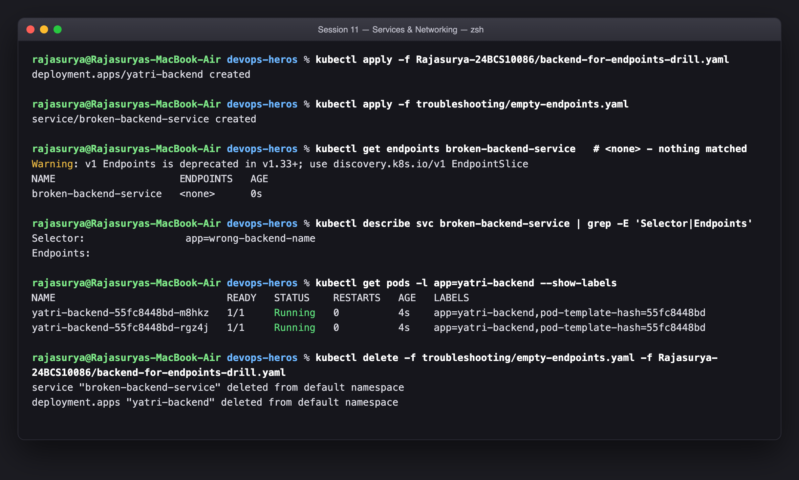

`ENDPOINTS: <none>` on a Service that **does** have a selector is one of the most
common Kubernetes faults, and it is silent — the Service is created, DNS
resolves, the ClusterIP answers, and every connection fails. Here the pods are
labelled `app: yatri-backend` but the Service selects `app: wrong-backend-name`.

The triage order that finds it every time:

1. `kubectl get endpoints <svc>` → `<none>` means **no pod matched**, so the
   problem is the selector or the pods, never the Service's ports.
2. `kubectl describe svc <svc>` → read the `Selector:` line as written.
3. `kubectl get pods --show-labels` → compare against the pods' real labels.
4. The usual culprits: a typo, the wrong namespace (selectors do not cross
   namespaces), or pods that match but are **not `Ready`** — an unready pod is
   deliberately excluded from endpoints, which is Task 5 of Session 10 in action.

---

## Task 8 — FQDN & CoreDNS deep dive

**Description:** Investigate the Kubernetes FQDN hierarchy, inspect a container's `/etc/resolv.conf`, and document the latency implications of `ndots:5`.

```bash
kubectl exec curl-client -- cat /etc/resolv.conf
kubectl get svc -n kube-system kube-dns
kubectl exec curl-client -- nslookup web-service-clusterip
kubectl exec curl-client -- nslookup web-service-clusterip.default.svc.cluster.local
```

```text
rajasurya@Rajasuryas-MacBook-Air devops-heros % kubectl exec curl-client -- cat /etc/resolv.conf
search default.svc.cluster.local svc.cluster.local cluster.local
nameserver 10.96.0.10
options ndots:5

rajasurya@Rajasuryas-MacBook-Air devops-heros % kubectl get svc -n kube-system kube-dns
NAME       TYPE        CLUSTER-IP   EXTERNAL-IP   PORT(S)                  AGE
kube-dns   ClusterIP   10.96.0.10   <none>        53/UDP,53/TCP,9153/TCP   23m

rajasurya@Rajasuryas-MacBook-Air devops-heros % kubectl get pods -n kube-system -l k8s-app=kube-dns
NAME                       READY   STATUS    RESTARTS   AGE
coredns-559f6c778d-d5m4j   1/1     Running   0          23m

rajasurya@Rajasuryas-MacBook-Air devops-heros % kubectl exec curl-client -- nslookup web-service-clusterip
Server:		10.96.0.10
Address:	10.96.0.10:53

** server can't find web-service-clusterip.cluster.local: NXDOMAIN

Name:	web-service-clusterip.default.svc.cluster.local
Address: 10.104.54.132

** server can't find web-service-clusterip.svc.cluster.local: NXDOMAIN

** server can't find web-service-clusterip.cluster.local: NXDOMAIN


** server can't find web-service-clusterip.svc.cluster.local: NXDOMAIN

command terminated with exit code 1

rajasurya@Rajasuryas-MacBook-Air devops-heros % kubectl exec curl-client -- nslookup web-service-clusterip.default.svc.cluster.local
Server:		10.96.0.10
Address:	10.96.0.10:53

Name:	web-service-clusterip.default.svc.cluster.local
Address: 10.104.54.132
```

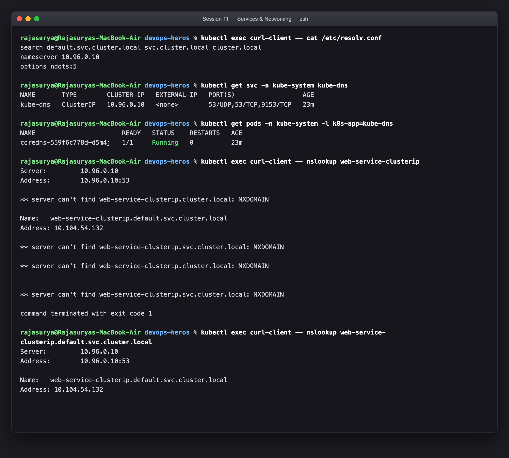

### The FQDN hierarchy

```
web-service-clusterip . default  . svc      . cluster.local
\__________________/   \_______/   \____/     \___________/
   service name        namespace    "it's a    cluster domain
                                   Service"    (configurable)
```

A pod in the *same* namespace can say `web-service-clusterip`. From another
namespace it must say `web-service-clusterip.default`. Fully qualified always
works, and the `search` list in `resolv.conf` is what makes the short forms
resolve.

### `ndots:5` — the real cost

The `options ndots:5` line means: *if a name contains fewer than 5 dots, try
every entry in the `search` list before trying the name as-is.*

`cluster.local` has 1 dot, so it is under the threshold. Watch what that does to
an **external** lookup like `api.github.com` (2 dots):

```
1. api.github.com.default.svc.cluster.local   -> NXDOMAIN
2. api.github.com.svc.cluster.local           -> NXDOMAIN
3. api.github.com.cluster.local               -> NXDOMAIN
4. api.github.com.<host search domain>        -> NXDOMAIN   (if present)
5. api.github.com                             -> finally resolves
```

That is **4 wasted round-trips to CoreDNS for every external DNS lookup.** At
scale this is a genuine production issue — it is a well-known cause of CoreDNS
CPU saturation and of "random" 5-second latency spikes (the classic
`ndots`-plus-conntrack-race pathology).

Why it is the default anyway: without it, the convenient short name
`web-service-clusterip` would have to be written fully qualified everywhere.

The three fixes, in order of preference:

1. **Use a trailing dot** for known-external names: `api.github.com.` — the dot
   makes it absolute and skips the search list entirely.
2. **Lower `ndots` per pod** with `dnsConfig: {options: [{name: ndots, value: "2"}]}`.
3. **Cache locally** with NodeLocal DNSCache, so the misses never leave the node.

Also visible in the output: `nameserver 10.96.0.10` is the **`kube-dns` Service's
ClusterIP** (the Service is still named `kube-dns` for backward compatibility
even though CoreDNS is what runs behind it). So pod DNS goes through the same
kube-proxy DNAT machinery as any other Service — DNS is not special-cased.

---

## Task 9 — Pod identity: Deployment vs StatefulSet

**Description:** Run a stateless Deployment beside a stateful StatefulSet, then kill a pod in each and compare what comes back.

```bash
kubectl get pods -l app=web-clusterip     # Deployment: <name>-<rs-hash>-<random>
kubectl get pods -l app=web-headless      # StatefulSet: <name>-<ordinal>
kubectl delete pod <deployment-pod>       # -> brand new random name
kubectl delete pod web-stateful-1         # -> web-stateful-1 comes back
```

```text
rajasurya@Rajasuryas-MacBook-Air devops-heros % kubectl get pods -l app=web-clusterip    # Deployment: <name>-<rs-hash>-<random>
NAME                                 READY   STATUS    RESTARTS   AGE
web-app-clusterip-66865d4855-8fg4c   1/1     Running   0          53s
web-app-clusterip-66865d4855-d7lc2   1/1     Running   0          53s
web-app-clusterip-66865d4855-z5kt7   1/1     Running   0          53s

rajasurya@Rajasuryas-MacBook-Air devops-heros % kubectl get pods -l app=web-headless     # StatefulSet: <name>-<ordinal>
NAME             READY   STATUS              RESTARTS   AGE
web-stateful-0   1/1     Running             0          3s
web-stateful-1   1/1     Running             0          1s
web-stateful-2   0/1     ContainerCreating   0          1s

rajasurya@Rajasuryas-MacBook-Air devops-heros % kubectl delete pod web-app-clusterip-66865d4855-8fg4c    # Deployment pod
pod "web-app-clusterip-66865d4855-8fg4c" deleted from default namespace

rajasurya@Rajasuryas-MacBook-Air devops-heros % kubectl delete pod web-stateful-1   # StatefulSet pod
pod "web-stateful-1" deleted from default namespace

rajasurya@Rajasuryas-MacBook-Air devops-heros % kubectl get pods -l app=web-clusterip    # a DIFFERENT random name came back
NAME                                 READY   STATUS    RESTARTS   AGE
web-app-clusterip-66865d4855-d7lc2   1/1     Running   0          78s
web-app-clusterip-66865d4855-w99bq   1/1     Running   0          25s
web-app-clusterip-66865d4855-z5kt7   1/1     Running   0          78s

rajasurya@Rajasuryas-MacBook-Air devops-heros % kubectl get pods -l app=web-headless     # web-stateful-1 came back as itself
NAME             READY   STATUS    RESTARTS   AGE
web-stateful-0   1/1     Running   0          29s
web-stateful-1   1/1     Running   0          22s
web-stateful-2   1/1     Running   0          27s
```

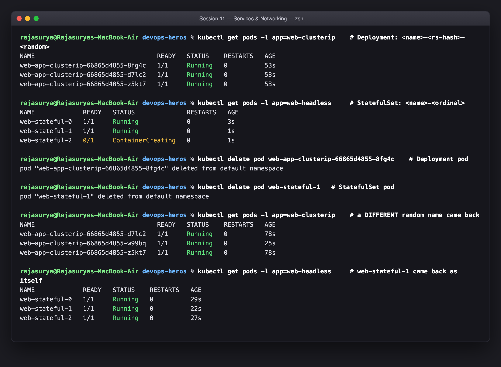

The naming schemes are not cosmetic — they encode a guarantee:

| | Deployment (stateless) | StatefulSet (stateful) |
|---|---|---|
| Name | `web-app-clusterip-7d4f8b9c5-x2k9p` | `web-stateful-1` |
| Shape | `<deploy>-<replicaset-hash>-<random5>` | `<statefulset>-<ordinal>` |
| After deletion | a **different** pod, new name, new IP | the **same** name, reattached to the same volume |
| Creation order | all at once, parallel | strictly `0, 1, 2, …` sequential |
| Deletion order | arbitrary | reverse — highest ordinal first |
| DNS | via the Service only | per-pod record via the headless Service |
| Storage | shared or none | one PVC per pod, `volumeClaimTemplates` |

The deletion test is the whole lesson. Deleting the Deployment's pod produced a
pod with a **new random suffix** — the ReplicaSet satisfied "3 replicas" without
caring which pods. Deleting `web-stateful-1` produced **`web-stateful-1` again**,
and it reattached to the same PVC.

That invariance is what clustered software needs: if `mysql-0` is the primary,
`mysql-0` must come back as `mysql-0` with its data, not as
`mysql-6f8d9c-qz4mn` with an empty disk. The ordering guarantee matters equally —
sequential startup means a replica never boots before the primary it must
follow, and reverse-order shutdown means the primary is the last to go.

---

## Task 10 — Architectural matrix: Deployment vs StatefulSet vs DaemonSet

**Description:** Exhaustive comparison of the three primary workload controllers.

| Dimension | **Deployment** | **StatefulSet** | **DaemonSet** |
|---|---|---|---|
| Question it answers | "run N copies, I don't care where" | "run an ordered, identified set" | "run one copy on every node" |
| Replica count | `replicas: N` | `replicas: N` | **none** — derived from node count |
| Pod names | `<name>-<hash>-<random>` | `<name>-<ordinal>` | `<name>-<random>` (one per node) |
| Identity across restarts | **not preserved** | **preserved** (name, DNS, volume) | tied to the node |
| Startup order | parallel, arbitrary | **sequential** `0→N-1` | parallel, one per node |
| Shutdown order | arbitrary | **reverse** `N-1→0` | parallel |
| Scaling | instant, any order | one at a time, in order | scale the **cluster**, not the object |
| Storage | one shared PVC, or none | **`volumeClaimTemplates`** → one PVC per pod, retained on delete | usually `hostPath` — reads the node itself |
| Typical Service | `ClusterIP` (or `LoadBalancer`/Ingress) | **Headless** (`clusterIP: None`), required via `serviceName` | usually none; scraped or writes outward |
| Rolling update | `maxSurge` / `maxUnavailable` | `partition` based, reverse ordinal | `maxUnavailable` only, node by node |
| Scheduling | scheduler picks nodes | scheduler picks nodes | **one per node by construction**, tolerates more taints |
| Production use | stateless APIs, web front ends, workers | databases, Kafka, ZooKeeper, etcd, Redis Cluster | `node-exporter`, Fluent Bit, Falco, CNI, `kube-proxy` |

### The one-line rule for choosing

- Pods are **interchangeable** → **Deployment**. (Default. Use this unless you have a reason not to.)
- Pods have **names, order and their own disks** → **StatefulSet**.
- The workload is about the **node**, not the app → **DaemonSet**.

The most common mistake is reaching for a StatefulSet because a workload "has
state". Storing state in Postgres does not make your API stateful — the *pods*
are still interchangeable, so it is a Deployment. Ask instead: *if I delete pod
2, does it matter that the replacement is pod 2 specifically?* If no, Deployment.

---

## Task 11 — Cost optimisation & Service selection decision tree

**Description:** Analyse the multi-LoadBalancer cloud anti-pattern and contrast it with the Ingress pattern.

### The anti-pattern

`type: LoadBalancer` is the most convenient way to expose a Service and the most
expensive. Every one provisions a **separate billable cloud load balancer** —
roughly **$18–25/month each** on AWS/GCP/Azure, before data-processing charges.

Twenty microservices, each exposed with its own LoadBalancer:

```
20 services x ~$20/month  =  ~$400/month  =  ~$4,800/year
   + 20 public IPs to manage
   + 20 places to attach a TLS certificate
   + 20 sets of health checks and security groups
```

### The production pattern

Put **one** LoadBalancer in front of an **Ingress controller**, keep every
application Service as `ClusterIP`, and let the controller route by host and
path:

```
              internet
                 |
     ONE cloud load balancer  (~$20/month total)
                 |
      Ingress controller (nginx / Traefik)  <- runs IN the cluster
                 |
    +------------+------------+-------------+
    |            |            |             |
 /api      /checkout      /admin      shop.example.com
    |            |            |             |
ClusterIP    ClusterIP    ClusterIP     ClusterIP     <- $0 each
```

```
1 LB x ~$20/month = ~$240/year        vs. ~$4,800/year
                                      ~95% saving
```

The savings are not even the main benefit. One entry point also means TLS
termination in one place (one cert-manager setup, not 20), one place for
`Host`/path routing, rewrites, rate limits, auth and WAF rules, and one set of
access logs. Adding service #21 becomes three lines in an Ingress instead of a
new cloud resource.

### Service selection decision tree

```
Does traffic come from OUTSIDE the cluster?
│
├─ NO ─► Do clients need to address INDIVIDUAL pods?
│        (database cluster members, Kafka brokers, peer discovery)
│        ├─ YES ─► HEADLESS SERVICE  (clusterIP: None)  + StatefulSet
│        └─ NO  ─► CLUSTERIP                    ← the default; ~90% of Services
│
└─ YES ─► Is it HTTP/HTTPS?
         │
         ├─ YES ─► INGRESS  (+ ONE LoadBalancer for the controller)
         │         ← host/path routing, TLS, one bill
         │
         └─ NO (raw TCP/UDP: game server, MQTT, gRPC stream, database)
                  │
                  ├─ Production cloud? ─► LOADBALANCER (accept the per-service cost)
                  └─ Local / bare metal? ─► NODEPORT (+ external LB or MetalLB)

Pointing at something OUTSIDE the cluster instead?
  ├─ You have a DNS NAME ─► EXTERNALNAME              (Task 5)
  └─ You have a raw IP    ─► CLUSTERIP, no selector,
                             + manual Endpoints        (Task 7)
```

The short version: **`ClusterIP` by default, `Ingress` for HTTP ingress,
`LoadBalancer` only for non-HTTP traffic that genuinely needs its own address,
and `NodePort` mostly for local development.**

---

## Task 12 — Minikube driver port binding & tunnel gotcha

**Description:** Document why `<NodeIP>:<NodePort>` fails with the Minikube **docker** driver on macOS/Windows, and demonstrate the two standard workarounds.

```bash
minikube ip
minikube profile list                        # shows the active driver
curl -I http://$(minikube ip):30080          # works on THIS setup - see below
minikube service web-service-nodeport --url  # workaround 1
```

```text
rajasurya@Rajasuryas-MacBook-Air devops-heros % minikube profile list
┌──────────┬────────┬────────────┬──────────────┬─────────┬────────┬───────┬────────────────┬────────────────────┐
│ PROFILE  │ DRIVER │  RUNTIME   │      IP      │ VERSION │ STATUS │ NODES │ ACTIVE PROFILE │ ACTIVE KUBECONTEXT │
├──────────┼────────┼────────────┼──────────────┼─────────┼────────┼───────┼────────────────┼────────────────────┤
│ minikube │ vfkit  │ containerd │ 192.168.64.2 │ v1.37.0 │ OK     │ 1     │ *              │ *                  │
└──────────┴────────┴────────────┴──────────────┴─────────┴────────┴───────┴────────────────┴────────────────────┘

rajasurya@Rajasuryas-MacBook-Air devops-heros % minikube ip
192.168.64.2

rajasurya@Rajasuryas-MacBook-Air devops-heros % curl -I -s --connect-timeout 5 http://192.168.64.2:30080 | head -3
HTTP/1.1 200 OK
Server: nginx/1.25.5
Date: Thu, 17 Sep 2026 19:03:25 GMT

rajasurya@Rajasuryas-MacBook-Air devops-heros % timeout 25 minikube service web-service-nodeport --url
http://192.168.64.2:30080
```

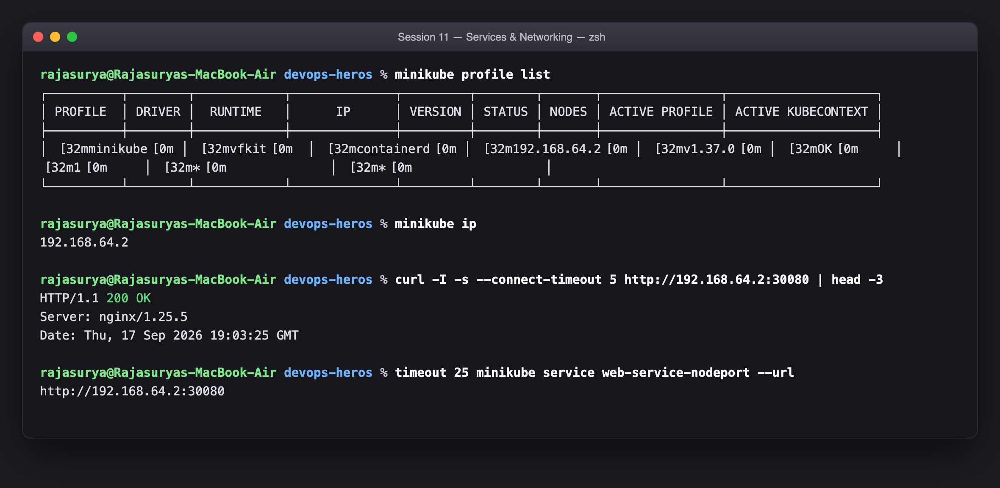

### The gotcha, and why it did not bite here

With the **`docker` driver**, the "node" is a container on Docker's bridge
network. On Linux that bridge is a real interface in the host's network
namespace, so the node IP is routable and `curl http://<NodeIP>:30080` works.

On **macOS and Windows** Docker itself runs inside a hidden Linux VM. The
container's IP (`192.168.49.2`) exists only inside that VM's network namespace,
and the host has no route to it:

```
macOS host
   └── Docker Desktop's Linux VM        <- no route from host into here
         └── minikube container 192.168.49.2
               └── NodePort 30080 listening
```

The NodePort really is open; the host just cannot reach the address. Symptom:
`curl: (28) Failed to connect ... Operation timed out`, and `minikube ip`
returning an address you cannot ping.

**This cluster uses the `vfkit` driver**, which boots a VM through Apple's
Virtualization framework on a host-visible network (`192.168.64.0/24`) rather
than hiding it behind Docker. So `minikube ip` returns `192.168.64.2` and the
host routes to it directly — which is why every `curl http://$(minikube ip):3xxxx`
in this session worked with no tunnel. Choosing that driver was a deliberate
side-step of this exact problem (the other reason being Docker Desktop's memory
allocation, noted in Session 9).

### The two standard workarounds

**1. `minikube service <svc> --url`** — creates a temporary port-forward from a
random port on `127.0.0.1` into the Service, and prints the URL. Per-service,
per-invocation, and dies when you Ctrl-C it. Best for a quick manual check.

```bash
minikube service web-service-nodeport --url
# -> http://127.0.0.1:52741
```

**2. `minikube tunnel`** — a privileged, long-running Layer-3 route injector
(hence the `sudo` password prompt). It adds host routes to the cluster's
Service network *and* is what assigns an `EXTERNAL-IP` to `type: LoadBalancer`
Services, standing in for the cloud-controller-manager. Used in
[Task 4](#task-4--type-3-loadbalancer--cloud-native-ingress-simulation).

| | `minikube service --url` | `minikube tunnel` |
|---|---|---|
| Scope | one Service | all Services, whole Service CIDR |
| Needs root | no | **yes** |
| Mechanism | userspace port-forward | host route injection |
| Makes `LoadBalancer` work | no | **yes** |
| Good for | a quick manual check | `LoadBalancer`/Ingress work |

A third option worth knowing, which is driver-independent and needs no Service
at all: `kubectl port-forward svc/web-service-nodeport 8080:80`. It tunnels
through the API server, so it works on every driver and every managed cloud
cluster — and it bypasses the NodePort entirely.

---

## Summary

| # | Task | Result |
|---|---|---|
| 1 | Port architecture | 4 ports mapped across 3 objects; packet path traced |
| 2 | ClusterIP | Virtual IP + 3 derived endpoints; reached by name, FQDN and IP |
| 3 | NodePort | `80:30080/TCP`; reached at `192.168.64.2:30080` |
| 4 | LoadBalancer | `<pending>` without a cloud controller; `minikube tunnel` filled it in |
| 5 | ExternalName | No ClusterIP, no endpoints — a pure CoreDNS CNAME |
| 6 | Headless | 3 A records instead of 1 VIP; per-pod DNS names resolve |
| 7 | No selector | Hand-written Endpoints routed traffic off-cluster; `<none>` drill triaged |
| 8 | FQDN / CoreDNS | `ndots:5` shown to cost 4 wasted lookups per external query |
| 9 | Identity | Deployment pod came back renamed; `web-stateful-1` came back as itself |
| 10 | Controller matrix | Deployment vs StatefulSet vs DaemonSet across 13 dimensions |
| 11 | Cost / decision tree | ~$4,800/yr of LoadBalancers vs ~$240/yr behind one Ingress |
| 12 | Driver gotcha | Explained the docker-driver failure; `vfkit` avoids it; both workarounds shown |

### Submission

| Field | Value |
|---|---|
| Session | 11 — Kubernetes Networking & Services |
| File | `session-11-kubernetes-services/Rajasurya-24BCS10086/README.md` |
| Screenshots | `session-11-kubernetes-services/Rajasurya-24BCS10086/images/` |
