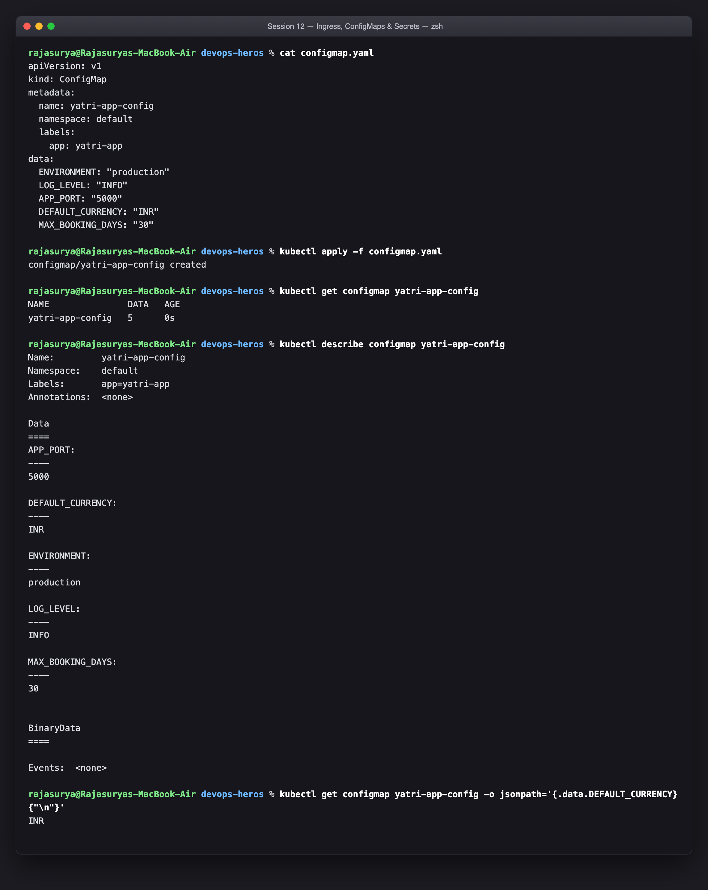
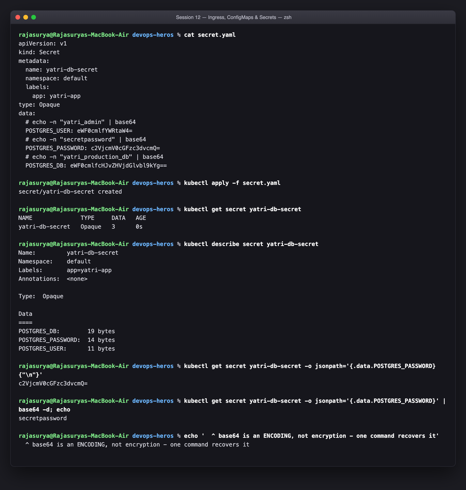
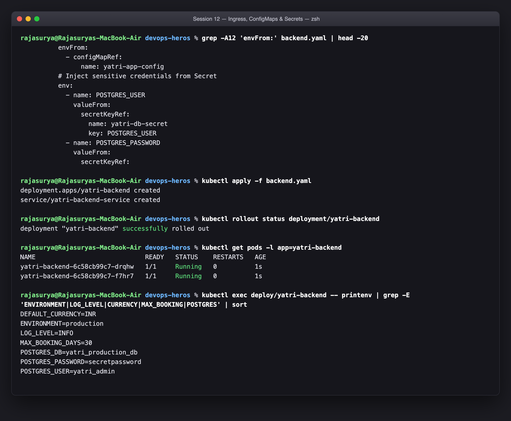
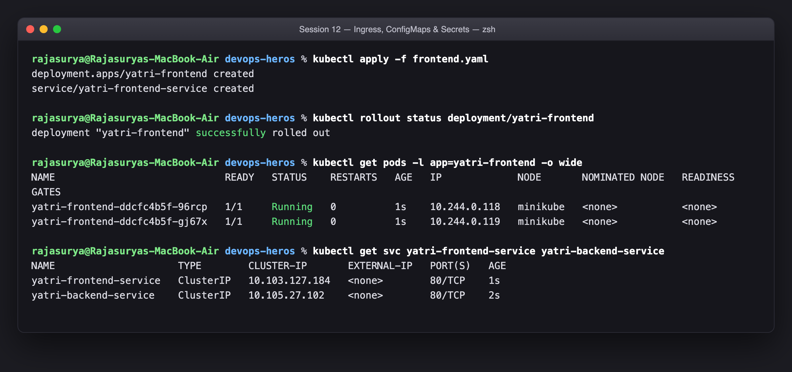
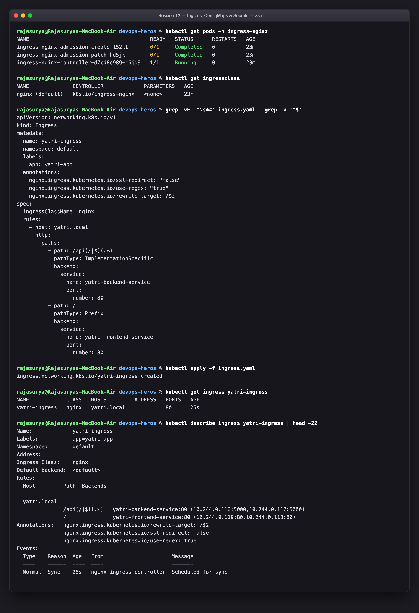
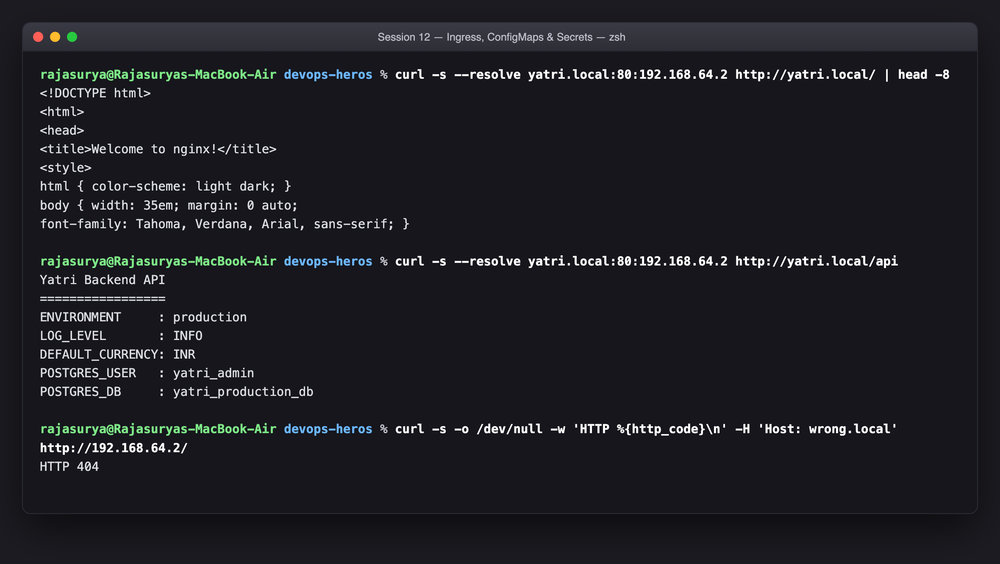
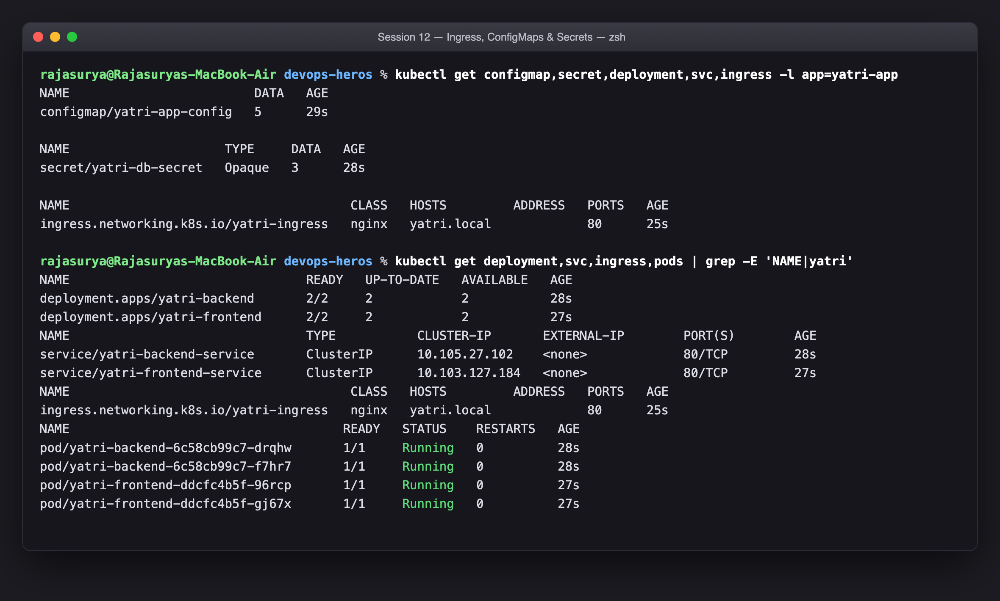
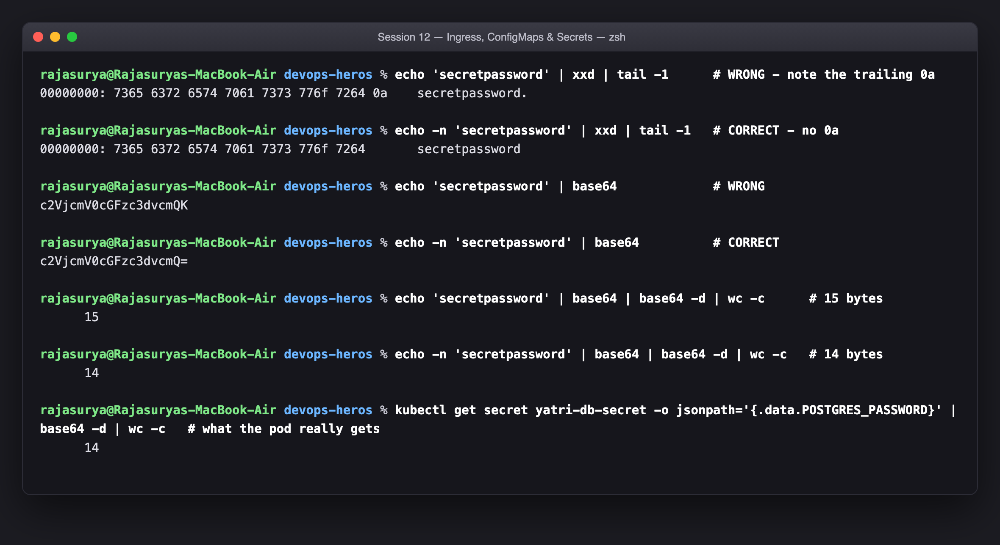
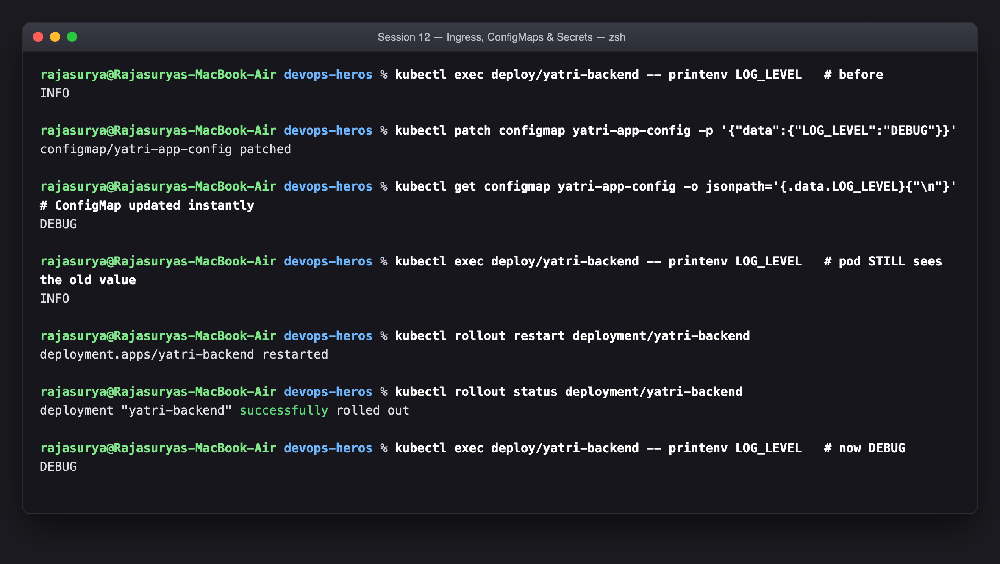
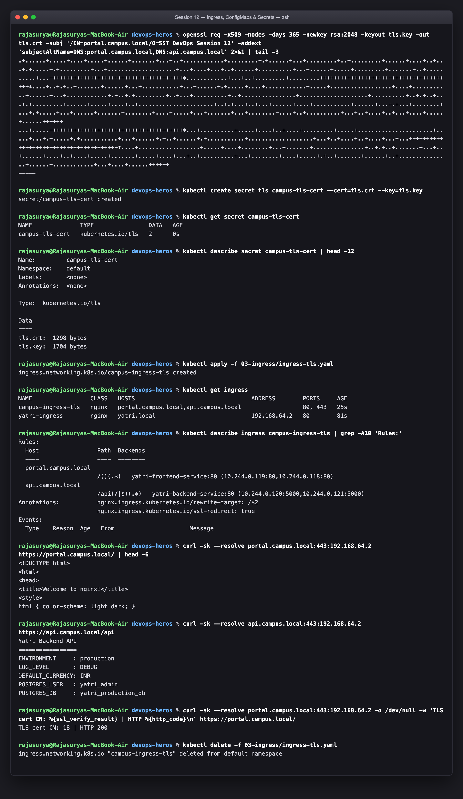

# Session 12 — Kubernetes Ingress, ConfigMaps & Secrets

**Name:** Rajasurya J
**Enrollment Number:** 24BCS10086
**Course:** SST DevOps & Cloud [SWE]
**Repository:** `devops-heros` / `session-12-ingress-configmaps-secrets`

---

## Environment

| Item | Value |
|---|---|
| Host | MacBook Air, Apple Silicon (arm64), macOS 26.7 |
| minikube | v1.39.0, driver **`vfkit`**, 3 GB / 3 vCPU |
| Kubernetes | v1.37.0 |
| Node IP (`minikube ip`) | `192.168.64.2` |
| Ingress controller | `ingress-nginx` via `minikube addons enable ingress` |

Every code block below is a real transcript from this cluster.

### Contents

| Part | Topic |
|---|---|
| [1](#part-1--configmap-plain-text-configuration) | ConfigMap — plain-text configuration |
| [2](#part-2--secret-sensitive-credentials-and-why-base64-is-not-encryption) | Secret — and why base64 is not encryption |
| [3](#part-3--backend-injecting-configmap--secret-as-environment-variables) | Injecting both into a pod's environment |
| [4](#part-4--frontend-deployment) | Frontend deployment |
| [5](#part-5--ingress-one-entry-point-for-both-services) | Ingress — one entry point, host + path routing |
| [6](#part-6--testing-the-routing) | Testing `/` and `/api` routing |
| [7](#part-7--the-full-picture) | All resources at once |
| [8](#part-8--the-trailing-newline-secret-bug-live-drill) | The trailing-newline Secret bug |
| [9](#part-9--what-happens-when-you-update-a-configmap) | ConfigMap update propagation |
| [10](#part-10--tls-ingress-host-based-routing) | TLS Ingress + host-based routing |

---

## Part 1 — ConfigMap: plain-text configuration

**Description:** Store five non-sensitive key/value configuration pairs in a ConfigMap and verify them in the cluster.

```bash
kubectl apply -f configmap.yaml
kubectl get configmap yatri-app-config
kubectl describe configmap yatri-app-config
kubectl get configmap yatri-app-config -o jsonpath='{.data.DEFAULT_CURRENCY}'
```

```text
rajasurya@Rajasuryas-MacBook-Air devops-heros % cat configmap.yaml
apiVersion: v1
kind: ConfigMap
metadata:
  name: yatri-app-config
  namespace: default
  labels:
    app: yatri-app
data:
  ENVIRONMENT: "production"
  LOG_LEVEL: "INFO"
  APP_PORT: "5000"
  DEFAULT_CURRENCY: "INR"
  MAX_BOOKING_DAYS: "30"

rajasurya@Rajasuryas-MacBook-Air devops-heros % kubectl apply -f configmap.yaml
configmap/yatri-app-config created

rajasurya@Rajasuryas-MacBook-Air devops-heros % kubectl get configmap yatri-app-config
NAME               DATA   AGE
yatri-app-config   5      0s

rajasurya@Rajasuryas-MacBook-Air devops-heros % kubectl describe configmap yatri-app-config
Name:         yatri-app-config
Namespace:    default
Labels:       app=yatri-app
Annotations:  <none>

Data
====
APP_PORT:
----
5000

DEFAULT_CURRENCY:
----
INR

ENVIRONMENT:
----
production

LOG_LEVEL:
----
INFO

MAX_BOOKING_DAYS:
----
30


BinaryData
====

Events:  <none>

rajasurya@Rajasuryas-MacBook-Air devops-heros % kubectl get configmap yatri-app-config -o jsonpath='{.data.DEFAULT_CURRENCY}{"\n"}'
INR
```



`DATA 5` in the output is the count of keys, not bytes. The point of a ConfigMap
is to get configuration **out of the container image**: the same image then runs
in dev, staging and production, and only the ConfigMap differs. Without it you
would rebuild the image to change a log level.

Limits worth knowing: a ConfigMap is capped at **1 MiB** (it is stored in `etcd`,
which is not a file server), and it is **namespaced** — a pod can only mount a
ConfigMap from its own namespace.

---

## Part 2 — Secret: sensitive credentials, and why base64 is not encryption

**Description:** Store database credentials in a Secret, show that `describe` hides the values, then decode one to prove base64 is only an encoding.

```bash
kubectl apply -f secret.yaml
kubectl get secret yatri-db-secret
kubectl describe secret yatri-db-secret
kubectl get secret yatri-db-secret -o jsonpath='{.data.POSTGRES_PASSWORD}' | base64 -d
```

```text
rajasurya@Rajasuryas-MacBook-Air devops-heros % cat secret.yaml
apiVersion: v1
kind: Secret
metadata:
  name: yatri-db-secret
  namespace: default
  labels:
    app: yatri-app
type: Opaque
data:
  # echo -n "yatri_admin" | base64
  POSTGRES_USER: eWF0cmlfYWRtaW4=
  # echo -n "secretpassword" | base64
  POSTGRES_PASSWORD: c2VjcmV0cGFzc3dvcmQ=
  # echo -n "yatri_production_db" | base64
  POSTGRES_DB: eWF0cmlfcHJvZHVjdGlvbl9kYg==

rajasurya@Rajasuryas-MacBook-Air devops-heros % kubectl apply -f secret.yaml
secret/yatri-db-secret created

rajasurya@Rajasuryas-MacBook-Air devops-heros % kubectl get secret yatri-db-secret
NAME              TYPE     DATA   AGE
yatri-db-secret   Opaque   3      0s

rajasurya@Rajasuryas-MacBook-Air devops-heros % kubectl describe secret yatri-db-secret
Name:         yatri-db-secret
Namespace:    default
Labels:       app=yatri-app
Annotations:  <none>

Type:  Opaque

Data
====
POSTGRES_DB:        19 bytes
POSTGRES_PASSWORD:  14 bytes
POSTGRES_USER:      11 bytes

rajasurya@Rajasuryas-MacBook-Air devops-heros % kubectl get secret yatri-db-secret -o jsonpath='{.data.POSTGRES_PASSWORD}{"\n"}'
c2VjcmV0cGFzc3dvcmQ=

rajasurya@Rajasuryas-MacBook-Air devops-heros % kubectl get secret yatri-db-secret -o jsonpath='{.data.POSTGRES_PASSWORD}' | base64 -d; echo
secretpassword

rajasurya@Rajasuryas-MacBook-Air devops-heros % echo '  ^ base64 is an ENCODING, not encryption - one command recovers it'
  ^ base64 is an ENCODING, not encryption - one command recovers it
```



Two different things are happening in that output, and conflating them is the
classic mistake:

- `kubectl describe secret` prints `POSTGRES_PASSWORD: 14 bytes` instead of the
  value. That is **only** so the value does not end up in your scrollback, a
  screen share, or a CI log.
- One `base64 -d` recovers `secretpassword` in full. **Base64 is an encoding,
  not encryption.** Anyone who can read the Secret object can read the value.

So what does a Secret actually buy you over a ConfigMap?

| | ConfigMap | Secret |
|---|---|---|
| Stored as | plain text | base64 (still plain text, really) |
| Hidden in `describe` | no | yes |
| RBAC-able separately | yes | **yes — and this is the real value** |
| Encrypted at rest in `etcd` | no | **only if you enable it** (`EncryptionConfiguration`) |
| Mounted as a volume | on disk | in a **`tmpfs`** — never written to the node's disk |
| Sent to a node | — | only to nodes that actually run a pod needing it |

The genuine security boundary is **RBAC**: you grant `get secrets` to far fewer
subjects than `get configmaps`. For real protection at rest you must either turn
on `EncryptionConfiguration` on the API server, or keep secrets out of `etcd`
entirely using an external store (Vault, AWS/GCP Secrets Manager, Sealed
Secrets, External Secrets Operator).

And the rule that follows from all of this: **never commit a real Secret
manifest to Git.** The `data:` block is readable by anyone with repo access.

---

## Part 3 — Backend: injecting ConfigMap + Secret as environment variables

**Description:** Deploy the Python backend that reads config from both sources, and verify the variables really arrived inside the container.

The manifest uses **both** injection styles on purpose:

```yaml
envFrom:                          # bulk: every key in the ConfigMap becomes a var
  - configMapRef:
      name: yatri-app-config
env:                              # selective: one named key at a time
  - name: POSTGRES_USER
    valueFrom:
      secretKeyRef:
        name: yatri-db-secret
        key: POSTGRES_USER
```

```bash
kubectl apply -f backend.yaml
kubectl rollout status deployment/yatri-backend
kubectl exec deploy/yatri-backend -- printenv | grep -E 'ENVIRONMENT|LOG_LEVEL|CURRENCY|POSTGRES'
```

```text
rajasurya@Rajasuryas-MacBook-Air devops-heros % grep -A12 'envFrom:' backend.yaml | head -20
          envFrom:
            - configMapRef:
                name: yatri-app-config
          # Inject sensitive credentials from Secret
          env:
            - name: POSTGRES_USER
              valueFrom:
                secretKeyRef:
                  name: yatri-db-secret
                  key: POSTGRES_USER
            - name: POSTGRES_PASSWORD
              valueFrom:
                secretKeyRef:

rajasurya@Rajasuryas-MacBook-Air devops-heros % kubectl apply -f backend.yaml
deployment.apps/yatri-backend created
service/yatri-backend-service created

rajasurya@Rajasuryas-MacBook-Air devops-heros % kubectl rollout status deployment/yatri-backend
deployment "yatri-backend" successfully rolled out

rajasurya@Rajasuryas-MacBook-Air devops-heros % kubectl get pods -l app=yatri-backend
NAME                             READY   STATUS    RESTARTS   AGE
yatri-backend-6c58cb99c7-drqhw   1/1     Running   0          1s
yatri-backend-6c58cb99c7-f7hr7   1/1     Running   0          1s

rajasurya@Rajasuryas-MacBook-Air devops-heros % kubectl exec deploy/yatri-backend -- printenv | grep -E 'ENVIRONMENT|LOG_LEVEL|CURRENCY|MAX_BOOKING|POSTGRES' | sort
DEFAULT_CURRENCY=INR
ENVIRONMENT=production
LOG_LEVEL=INFO
MAX_BOOKING_DAYS=30
POSTGRES_DB=yatri_production_db
POSTGRES_PASSWORD=secretpassword
POSTGRES_USER=yatri_admin
```



`envFrom` is the bulk form — all five ConfigMap keys land as environment
variables with no per-key wiring, which is convenient but means adding a key to
the ConfigMap silently adds a variable. `secretKeyRef` is the selective form,
and it is the right default for secrets: the pod receives exactly the three keys
it needs and nothing else.

Note the `printenv` output shows `POSTGRES_PASSWORD` in the clear **inside the
container**. That is unavoidable — the application has to be able to read it.
This is why environment variables are the weaker of the two injection methods:
they are visible in `/proc/<pid>/environ`, are inherited by every child process,
and frequently end up in crash dumps and log aggregators. For higher-value
secrets, mount them as a volume instead:

```yaml
volumes:
  - name: creds
    secret:
      secretName: yatri-db-secret
```

That lands each key as a file in a `tmpfs` mount, readable only by the process
that opens it — and it **updates in place** when the Secret changes, which
environment variables never do (see Part 9).

---

## Part 4 — Frontend deployment

**Description:** Deploy the Nginx frontend and its ClusterIP Service.

```bash
kubectl apply -f frontend.yaml
kubectl rollout status deployment/yatri-frontend
kubectl get pods -l app=yatri-frontend -o wide
kubectl get svc yatri-frontend-service yatri-backend-service
```

```text
rajasurya@Rajasuryas-MacBook-Air devops-heros % kubectl apply -f frontend.yaml
deployment.apps/yatri-frontend created
service/yatri-frontend-service created

rajasurya@Rajasuryas-MacBook-Air devops-heros % kubectl rollout status deployment/yatri-frontend
deployment "yatri-frontend" successfully rolled out

rajasurya@Rajasuryas-MacBook-Air devops-heros % kubectl get pods -l app=yatri-frontend -o wide
NAME                             READY   STATUS    RESTARTS   AGE   IP             NODE       NOMINATED NODE   READINESS GATES
yatri-frontend-ddcfc4b5f-96rcp   1/1     Running   0          1s    10.244.0.118   minikube   <none>           <none>
yatri-frontend-ddcfc4b5f-gj67x   1/1     Running   0          1s    10.244.0.119   minikube   <none>           <none>

rajasurya@Rajasuryas-MacBook-Air devops-heros % kubectl get svc yatri-frontend-service yatri-backend-service
NAME                     TYPE        CLUSTER-IP       EXTERNAL-IP   PORT(S)   AGE
yatri-frontend-service   ClusterIP   10.103.127.184   <none>        80/TCP    1s
yatri-backend-service    ClusterIP   10.105.27.102    <none>        80/TCP    2s
```



Both Services are **`ClusterIP`** — neither is reachable from outside the
cluster, and deliberately so. That is the whole premise of Part 5: the Ingress
becomes the single public entry point, and the applications stay private. This
is the pattern Session 11's Task 11 argued for on cost grounds, applied here.

---

## Part 5 — Ingress: one entry point for both services

**Description:** Enable the NGINX Ingress Controller, apply host + path routing rules, and confirm the Ingress received an address.

```bash
minikube addons enable ingress
kubectl get pods -n ingress-nginx
kubectl apply -f ingress.yaml
kubectl get ingress yatri-ingress
kubectl describe ingress yatri-ingress
```

```text
rajasurya@Rajasuryas-MacBook-Air devops-heros % kubectl get pods -n ingress-nginx
NAME                                       READY   STATUS      RESTARTS   AGE
ingress-nginx-admission-create-l52kt       0/1     Completed   0          23m
ingress-nginx-admission-patch-hd5jk        0/1     Completed   0          23m
ingress-nginx-controller-d7cd8c989-c6jg9   1/1     Running     0          23m

rajasurya@Rajasuryas-MacBook-Air devops-heros % kubectl get ingressclass
NAME              CONTROLLER             PARAMETERS   AGE
nginx (default)   k8s.io/ingress-nginx   <none>       23m

rajasurya@Rajasuryas-MacBook-Air devops-heros % grep -vE '^\s*#' ingress.yaml | grep -v '^$'
apiVersion: networking.k8s.io/v1
kind: Ingress
metadata:
  name: yatri-ingress
  namespace: default
  labels:
    app: yatri-app
  annotations:
    nginx.ingress.kubernetes.io/ssl-redirect: "false"
    nginx.ingress.kubernetes.io/use-regex: "true"
    nginx.ingress.kubernetes.io/rewrite-target: /$2
spec:
  ingressClassName: nginx
  rules:
    - host: yatri.local
      http:
        paths:
          - path: /api(/|$)(.*)
            pathType: ImplementationSpecific
            backend:
              service:
                name: yatri-backend-service
                port:
                  number: 80
          - path: /
            pathType: Prefix
            backend:
              service:
                name: yatri-frontend-service
                port:
                  number: 80

rajasurya@Rajasuryas-MacBook-Air devops-heros % kubectl apply -f ingress.yaml
ingress.networking.k8s.io/yatri-ingress created

rajasurya@Rajasuryas-MacBook-Air devops-heros % kubectl get ingress yatri-ingress
NAME            CLASS   HOSTS         ADDRESS   PORTS   AGE
yatri-ingress   nginx   yatri.local             80      25s

rajasurya@Rajasuryas-MacBook-Air devops-heros % kubectl describe ingress yatri-ingress | head -22
Name:             yatri-ingress
Labels:           app=yatri-app
Namespace:        default
Address:          
Ingress Class:    nginx
Default backend:  <default>
Rules:
  Host         Path  Backends
  ----         ----  --------
  yatri.local  
               /api(/|$)(.*)   yatri-backend-service:80 (10.244.0.116:5000,10.244.0.117:5000)
               /               yatri-frontend-service:80 (10.244.0.119:80,10.244.0.118:80)
Annotations:   nginx.ingress.kubernetes.io/rewrite-target: /$2
               nginx.ingress.kubernetes.io/ssl-redirect: false
               nginx.ingress.kubernetes.io/use-regex: true
Events:
  Type    Reason  Age   From                      Message
  ----    ------  ----  ----                      -------
  Normal  Sync    25s   nginx-ingress-controller  Scheduled for sync
```



### The two-part thing people miss

An **Ingress** object is just routing *rules* — inert YAML. It does nothing
until an **Ingress controller** (here `ingress-nginx`, a Deployment running in
the `ingress-nginx` namespace) is watching for those objects and reconfiguring
itself. Apply an Ingress with no controller installed and you get a permanently
empty `ADDRESS` field and no errors — a genuinely confusing failure mode.
`ingressClassName: nginx` is what binds this object to that controller.

The rules being applied:

| Host | Path | Backend Service |
|---|---|---|
| `yatri.local` | `/api(/\|$)(.*)` | `yatri-backend-service:80` → pods on `:5000` |
| `yatri.local` | `/` (Prefix) | `yatri-frontend-service:80` |

And the three annotations, each doing real work:

- `nginx.ingress.kubernetes.io/ssl-redirect: "false"` — without this the
  controller 308-redirects HTTP to HTTPS, and there is no certificate in this
  demo, so every test would fail.
- `use-regex: "true"` — permits the capture groups in the path.
- `rewrite-target: /$2` — strips the `/api` prefix before forwarding. The
  backend serves at `/`, so a request for `/api/config` must arrive as
  `/config`. `$2` is the second capture group of `/api(/|$)(.*)`.

Path matching is **longest-prefix-first**, not file order, which is why `/api`
wins over `/` for `/api/anything`.

---

## Part 6 — Testing the routing

**Description:** Send requests to `/` and `/api` through the Ingress and confirm they reach different backends.

Because the rules are **host-based**, the request must carry
`Host: yatri.local`. Either add it to `/etc/hosts` or pass it explicitly with
`curl --resolve`, which is what I did to avoid editing a system file.

```bash
curl -s --resolve yatri.local:80:$(minikube ip) http://yatri.local/
curl -s --resolve yatri.local:80:$(minikube ip) http://yatri.local/api
curl -s -H 'Host: wrong.local' http://$(minikube ip)/      # no rule matches
```

```text
rajasurya@Rajasuryas-MacBook-Air devops-heros % curl -s --resolve yatri.local:80:192.168.64.2 http://yatri.local/ | head -8
<!DOCTYPE html>
<html>
<head>
<title>Welcome to nginx!</title>
<style>
html { color-scheme: light dark; }
body { width: 35em; margin: 0 auto;
font-family: Tahoma, Verdana, Arial, sans-serif; }

rajasurya@Rajasuryas-MacBook-Air devops-heros % curl -s --resolve yatri.local:80:192.168.64.2 http://yatri.local/api
Yatri Backend API
=================
ENVIRONMENT     : production
LOG_LEVEL       : INFO
DEFAULT_CURRENCY: INR
POSTGRES_USER   : yatri_admin
POSTGRES_DB     : yatri_production_db

rajasurya@Rajasuryas-MacBook-Air devops-heros % curl -s -o /dev/null -w 'HTTP %{http_code}\n' -H 'Host: wrong.local' http://192.168.64.2/
HTTP 404
```



- `/` returned the **Nginx welcome page** — the frontend Service.
- `/api` returned the **Python backend's plain-text body**, listing
  `ENVIRONMENT: production`, `LOG_LEVEL: INFO`, `DEFAULT_CURRENCY: INR`,
  `POSTGRES_USER: yatri_admin` and `POSTGRES_DB: yatri_production_db`.

That single response closes the loop for the whole session: those five values
came from **two different objects** (a ConfigMap and a Secret), were injected as
environment variables into a pod that is **not externally reachable**, and were
retrieved through an **Ingress** that routed by path and rewrote the URL. One IP,
one port, two backends.

The wrong-`Host` request returns the controller's **default backend 404** —
proof that routing really is keyed on the `Host` header, not just the path.

---

## Part 7 — The full picture

**Description:** List every resource this lab created in one view.

```bash
kubectl get configmap,secret,deployment,svc,ingress,pods
```

```text
rajasurya@Rajasuryas-MacBook-Air devops-heros % kubectl get configmap,secret,deployment,svc,ingress -l app=yatri-app
NAME                         DATA   AGE
configmap/yatri-app-config   5      29s

NAME                     TYPE     DATA   AGE
secret/yatri-db-secret   Opaque   3      28s

NAME                                      CLASS   HOSTS         ADDRESS   PORTS   AGE
ingress.networking.k8s.io/yatri-ingress   nginx   yatri.local             80      25s

rajasurya@Rajasuryas-MacBook-Air devops-heros % kubectl get deployment,svc,ingress,pods | grep -E 'NAME|yatri'
NAME                                READY   UP-TO-DATE   AVAILABLE   AGE
deployment.apps/yatri-backend       2/2     2            2           28s
deployment.apps/yatri-frontend      2/2     2            2           27s
NAME                                TYPE           CLUSTER-IP       EXTERNAL-IP        PORT(S)        AGE
service/yatri-backend-service       ClusterIP      10.105.27.102    <none>             80/TCP         28s
service/yatri-frontend-service      ClusterIP      10.103.127.184   <none>             80/TCP         27s
NAME                                      CLASS   HOSTS         ADDRESS   PORTS   AGE
ingress.networking.k8s.io/yatri-ingress   nginx   yatri.local             80      25s
NAME                                     READY   STATUS    RESTARTS   AGE
pod/yatri-backend-6c58cb99c7-drqhw       1/1     Running   0          28s
pod/yatri-backend-6c58cb99c7-f7hr7       1/1     Running   0          28s
pod/yatri-frontend-ddcfc4b5f-96rcp       1/1     Running   0          27s
pod/yatri-frontend-ddcfc4b5f-gj67x       1/1     Running   0          27s
```



```
                    curl http://yatri.local/  and  /api
                                  |
                      minikube ip : 192.168.64.2 : 80
                                  |
                    +-------------------------------+
                    |  ingress-nginx controller     |   (ingress-nginx ns)
                    |  reads Ingress yatri-ingress  |
                    +---------------+---------------+
                        /           |            \
                   path /           |         path /api(/|$)(.*)
                        |           |              |  rewrite -> /$2
            yatri-frontend-service  |     yatri-backend-service
                 ClusterIP :80      |          ClusterIP :80
                        |           |              |  targetPort 5000
              2x nginx pods         |        2x python pods
                                    |              |
                                    |      envFrom: ConfigMap yatri-app-config
                                    |      env:     Secret    yatri-db-secret
```

---

## Part 8 — The trailing-newline Secret bug (live drill)

**Description:** Reproduce the classic `echo` vs `echo -n` base64 bug and prove the difference byte by byte.

```bash
echo    "secretpassword" | xxd | tail -1      # note the trailing 0a
echo -n "secretpassword" | xxd | tail -1      # no 0a
echo    "secretpassword" | base64             # ...Cg==  <- WRONG
echo -n "secretpassword" | base64             # ...ZA==  <- correct
```

```text
rajasurya@Rajasuryas-MacBook-Air devops-heros % echo 'secretpassword' | xxd | tail -1      # WRONG - note the trailing 0a
00000000: 7365 6372 6574 7061 7373 776f 7264 0a    secretpassword.

rajasurya@Rajasuryas-MacBook-Air devops-heros % echo -n 'secretpassword' | xxd | tail -1   # CORRECT - no 0a
00000000: 7365 6372 6574 7061 7373 776f 7264       secretpassword

rajasurya@Rajasuryas-MacBook-Air devops-heros % echo 'secretpassword' | base64             # WRONG
c2VjcmV0cGFzc3dvcmQK

rajasurya@Rajasuryas-MacBook-Air devops-heros % echo -n 'secretpassword' | base64          # CORRECT
c2VjcmV0cGFzc3dvcmQ=

rajasurya@Rajasuryas-MacBook-Air devops-heros % echo 'secretpassword' | base64 | base64 -d | wc -c      # 15 bytes
      15

rajasurya@Rajasuryas-MacBook-Air devops-heros % echo -n 'secretpassword' | base64 | base64 -d | wc -c   # 14 bytes
      14

rajasurya@Rajasuryas-MacBook-Air devops-heros % kubectl get secret yatri-db-secret -o jsonpath='{.data.POSTGRES_PASSWORD}' | base64 -d | wc -c   # what the pod really gets
      14
```



`echo` appends a newline. So `echo "secretpassword" | base64` encodes **15**
bytes — `secretpassword\n` — not 14. The application then authenticates with a
password that has an invisible `\n` on the end, and the database correctly
rejects it. The error says `password authentication failed`, which sends people
hunting for the wrong bug entirely.

The tell is in the base64 itself, and it is worth memorising:

| Command | Base64 | Bytes |
|---|---|---|
| `echo "secretpassword" \| base64` | `c2VjcmV0cGFzc3dvcmQK` | 15 ❌ |
| `echo -n "secretpassword" \| base64` | `c2VjcmV0cGFzc3dvcmQ=` | 14 ✅ |

Base64 encodes 3 bytes into 4 characters, so the padding exposes the length:
a trailing `Cg==` or `...K` where you expected `=`/`==` means a stray `0a`.

Three ways to never hit it:

1. `echo -n` (or `printf '%s'`, which never adds a newline at all).
2. Skip manual encoding entirely — use `stringData:` in the manifest and let
   Kubernetes encode it:
   ```yaml
   stringData:
     POSTGRES_PASSWORD: secretpassword   # no base64, no newline risk
   ```
3. Or create it imperatively: `kubectl create secret generic db --from-literal=POSTGRES_PASSWORD=secretpassword`

And to verify whatever you inherited, count the bytes the pod actually sees:

```bash
kubectl get secret yatri-db-secret -o jsonpath='{.data.POSTGRES_PASSWORD}' | base64 -d | wc -c
```

14, not 15.

---

## Part 9 — What happens when you update a ConfigMap?

**Description:** Change a ConfigMap value on a running Deployment and observe whether the pods pick it up.

```bash
kubectl patch configmap yatri-app-config -p '{"data":{"LOG_LEVEL":"DEBUG"}}'
kubectl get configmap yatri-app-config -o jsonpath='{.data.LOG_LEVEL}'   # DEBUG
kubectl exec deploy/yatri-backend -- printenv LOG_LEVEL                  # still INFO
kubectl rollout restart deployment/yatri-backend
kubectl exec deploy/yatri-backend -- printenv LOG_LEVEL                  # now DEBUG
```

```text
rajasurya@Rajasuryas-MacBook-Air devops-heros % kubectl exec deploy/yatri-backend -- printenv LOG_LEVEL   # before
INFO

rajasurya@Rajasuryas-MacBook-Air devops-heros % kubectl patch configmap yatri-app-config -p '{"data":{"LOG_LEVEL":"DEBUG"}}'
configmap/yatri-app-config patched

rajasurya@Rajasuryas-MacBook-Air devops-heros % kubectl get configmap yatri-app-config -o jsonpath='{.data.LOG_LEVEL}{"\n"}'   # ConfigMap updated instantly
DEBUG

rajasurya@Rajasuryas-MacBook-Air devops-heros % kubectl exec deploy/yatri-backend -- printenv LOG_LEVEL   # pod STILL sees the old value
INFO

rajasurya@Rajasuryas-MacBook-Air devops-heros % kubectl rollout restart deployment/yatri-backend
deployment.apps/yatri-backend restarted

rajasurya@Rajasuryas-MacBook-Air devops-heros % kubectl rollout status deployment/yatri-backend
deployment "yatri-backend" successfully rolled out

rajasurya@Rajasuryas-MacBook-Air devops-heros % kubectl exec deploy/yatri-backend -- printenv LOG_LEVEL   # now DEBUG
DEBUG
```



This is the most commonly misunderstood behaviour in the session. The ConfigMap
updated **instantly**, and the running pods **kept serving the old value**.

The reason is simple: environment variables are set **once**, at container start,
by the kubelet. There is no mechanism to change a running process's environment
from outside — that is a Linux fact, not a Kubernetes limitation. So a
ConfigMap consumed via `env`/`envFrom` is a **snapshot taken at pod start**.

| Consumption method | Picks up a ConfigMap change? |
|---|---|
| `env` / `envFrom` | **No** — never, until the pod restarts |
| Volume mount | **Yes**, automatically (~60s sync), file contents change in place |
| `subPath` volume mount | **No** — a documented exception |

`kubectl rollout restart` is the correct fix: it rolls the pods with the
Deployment's normal rolling-update strategy, so new pods read the new value with
no downtime. The more robust production pattern is to put a **hash of the
ConfigMap into the pod template's annotations** — then changing the ConfigMap
changes the pod spec, and the rollout happens automatically rather than relying
on someone remembering to run a command.

---

## Part 10 — TLS Ingress: host-based routing

**Description:** Apply `03-ingress/ingress-tls.yaml`, which routes two different hostnames to two backends over HTTPS with a TLS secret.

```bash
openssl req -x509 -nodes -days 365 -newkey rsa:2048 \
  -keyout tls.key -out tls.crt -subj "/CN=portal.campus.local" \
  -addext "subjectAltName=DNS:portal.campus.local,DNS:api.campus.local"
kubectl create secret tls campus-tls-cert --cert=tls.crt --key=tls.key
kubectl apply -f ../03-ingress/ingress-tls.yaml
curl -sk --resolve portal.campus.local:443:$(minikube ip) https://portal.campus.local/
curl -sk --resolve api.campus.local:443:$(minikube ip) https://api.campus.local/api
```

```text
rajasurya@Rajasuryas-MacBook-Air devops-heros % openssl req -x509 -nodes -days 365 -newkey rsa:2048 -keyout tls.key -out tls.crt -subj '/CN=portal.campus.local/O=SST DevOps Session 12' -addext 'subjectAltName=DNS:portal.campus.local,DNS:api.campus.local' 2>&1 | tail -3
.+......+.....+....+.....+......+.......+...+..+............+.........+.+......+...+.........+..+.........+......+....+..+...+.+.....+.+.........+...+....................+...+....+...+..+......+..........+...+......+.....+.........+.......+..+..........+...+++++++++++++++++++++++++++++++++++++++*............+...+..+.........+.........+++++++++++++++++++++++++++++++++++++++*....+..+.+..+.......+......+...+...........+...+......+.+.....+....+............+.....+..................+....+...........+......+...+............+.+..+.+.........+..+...+..........+..+................+....................+..........+..+.+..+...+.+.........+......+.....+....+..+......................+..+.+...+..+...+......+....+...........+......+...+.+...+........+...+.+.....+...+......+.......+........+....+.....+...+.......+...+........+....+..+..........+...+..+....+..+...+....+.....+......++++++
...+.....+++++++++++++++++++++++++++++++++++++++*...+..........+.....+....+..+....+.........+.....+......................+.....+...+.+.....+.+...........+...+......+.+..+......+.+...........+...................+...+..+....+..+....+...+...+++++++++++++++++++++++++++++++++++++++*....+..................+.....+....+........+...+.......+...............+..+.+..+.......+...+..+......+....+..+....+.....+.......+.....+....+...+..+..........+...+........+....+.....+.+..+.......+......+..+...............+......+............+...+....+......++++++
-----

rajasurya@Rajasuryas-MacBook-Air devops-heros % kubectl create secret tls campus-tls-cert --cert=tls.crt --key=tls.key
secret/campus-tls-cert created

rajasurya@Rajasuryas-MacBook-Air devops-heros % kubectl get secret campus-tls-cert
NAME              TYPE                DATA   AGE
campus-tls-cert   kubernetes.io/tls   2      0s

rajasurya@Rajasuryas-MacBook-Air devops-heros % kubectl describe secret campus-tls-cert | head -12
Name:         campus-tls-cert
Namespace:    default
Labels:       <none>
Annotations:  <none>

Type:  kubernetes.io/tls

Data
====
tls.crt:  1298 bytes
tls.key:  1704 bytes

rajasurya@Rajasuryas-MacBook-Air devops-heros % kubectl apply -f 03-ingress/ingress-tls.yaml
ingress.networking.k8s.io/campus-ingress-tls created

rajasurya@Rajasuryas-MacBook-Air devops-heros % kubectl get ingress
NAME                 CLASS   HOSTS                                  ADDRESS        PORTS     AGE
campus-ingress-tls   nginx   portal.campus.local,api.campus.local                  80, 443   25s
yatri-ingress        nginx   yatri.local                            192.168.64.2   80        81s

rajasurya@Rajasuryas-MacBook-Air devops-heros % kubectl describe ingress campus-ingress-tls | grep -A10 'Rules:'
Rules:
  Host                 Path  Backends
  ----                 ----  --------
  portal.campus.local  
                       /()(.*)   yatri-frontend-service:80 (10.244.0.119:80,10.244.0.118:80)
  api.campus.local     
                       /api(/|$)(.*)   yatri-backend-service:80 (10.244.0.120:5000,10.244.0.121:5000)
Annotations:           nginx.ingress.kubernetes.io/rewrite-target: /$2
                       nginx.ingress.kubernetes.io/ssl-redirect: true
Events:
  Type    Reason  Age   From                      Message

rajasurya@Rajasuryas-MacBook-Air devops-heros % curl -sk --resolve portal.campus.local:443:192.168.64.2 https://portal.campus.local/ | head -6
<!DOCTYPE html>
<html>
<head>
<title>Welcome to nginx!</title>
<style>
html { color-scheme: light dark; }

rajasurya@Rajasuryas-MacBook-Air devops-heros % curl -sk --resolve api.campus.local:443:192.168.64.2 https://api.campus.local/api
Yatri Backend API
=================
ENVIRONMENT     : production
LOG_LEVEL       : DEBUG
DEFAULT_CURRENCY: INR
POSTGRES_USER   : yatri_admin
POSTGRES_DB     : yatri_production_db

rajasurya@Rajasuryas-MacBook-Air devops-heros % curl -sk --resolve portal.campus.local:443:192.168.64.2 -o /dev/null -w 'TLS cert CN: %{ssl_verify_result} | HTTP %{http_code}\n' https://portal.campus.local/
TLS cert CN: 18 | HTTP 200

rajasurya@Rajasuryas-MacBook-Air devops-heros % kubectl delete -f 03-ingress/ingress-tls.yaml
ingress.networking.k8s.io "campus-ingress-tls" deleted from default namespace
```



Two things this demonstrates beyond Part 5:

- **`kubectl create secret tls`** produces a Secret of type
  **`kubernetes.io/tls`** — a *typed* Secret, unlike the `Opaque` one in Part 2.
  The type is not decoration: it requires the keys to be named exactly
  `tls.crt` and `tls.key`, and the Ingress controller relies on that contract to
  find the certificate. `spec.tls[].secretName` is the only link between the
  Ingress and the cert.
- **Host-based routing.** `portal.campus.local` and `api.campus.local` resolve
  to the same IP and the same port, and the controller separates them purely on
  the `Host` header (and on SNI during the TLS handshake — which is why one IP
  can serve many certificates).

`curl -k` is needed because the certificate is self-signed; the handshake and the
routing are otherwise real. In production `cert-manager` would issue and rotate
this automatically from Let's Encrypt, writing exactly this kind of Secret.

Note also `ssl-redirect: "true"` on this Ingress, the opposite of Part 5 — with
a certificate present, forcing HTTP → HTTPS is now the correct behaviour.

---

## Summary

| Part | Result |
|---|---|
| 1 | ConfigMap with 5 keys created and read back by `jsonpath` |
| 2 | Secret values hidden by `describe`, then decoded with one `base64 -d` |
| 3 | `envFrom` (bulk ConfigMap) + `secretKeyRef` (selective Secret) verified with `printenv` |
| 4 | Frontend + backend both exposed only as `ClusterIP` |
| 5 | `ingress-nginx` controller running; Ingress got an ADDRESS; 3 annotations explained |
| 6 | `/` → nginx frontend, `/api` → python backend with live config values; wrong Host → 404 |
| 7 | All ConfigMap/Secret/Deployment/Service/Ingress/Pod resources in one view |
| 8 | `echo` vs `echo -n` shown byte-by-byte with `xxd`; 15 bytes vs 14 |
| 9 | ConfigMap changed instantly; env vars did **not** until `rollout restart` |
| 10 | Self-signed TLS Secret + two hostnames routed over HTTPS on one IP |

### Key takeaways

1. **ConfigMaps and Secrets exist to keep configuration out of images.** Same
   image everywhere; only the config object differs.
2. **A Secret is not encrypted.** Base64 is an encoding. The real boundary is
   RBAC, plus `EncryptionConfiguration` or an external secret store.
3. **An Ingress is inert without a controller**, and it is what lets you serve
   many `ClusterIP` services from one address and one certificate.
4. **Env vars are a snapshot.** Volume mounts refresh, environment variables
   never do — restart the pods, or hash the ConfigMap into the pod template.

### Submission

| Field | Value |
|---|---|
| Session | 12 — Ingress, ConfigMaps & Secrets |
| File | `session-12-ingress-configmaps-secrets/Rajasurya-24BCS10086/README.md` |
| Screenshots | `session-12-ingress-configmaps-secrets/Rajasurya-24BCS10086/images/` |
