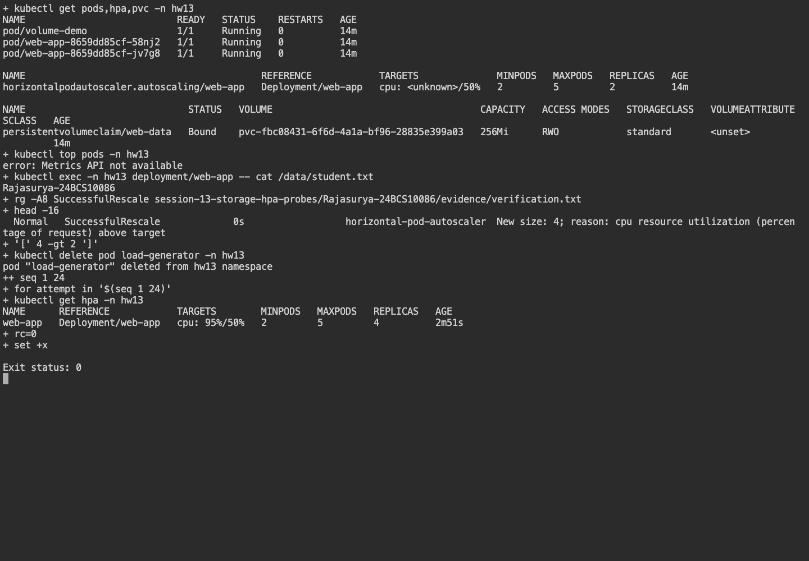
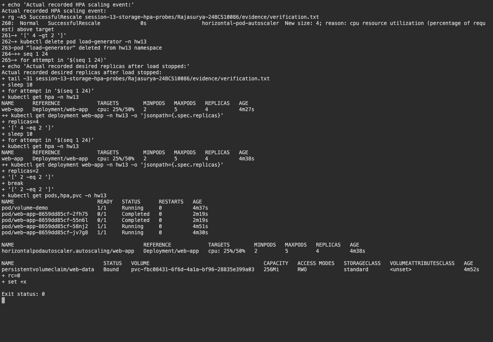

# Session 13 - Kubernetes Storage, HPA and Probes

**Name:** Rajasurya J

**Enrollment number:** 24BCS10086

## Environment

Commands run on the macOS 26.7.1 Apple Silicon host using kubectl 1.37.0.
Kubernetes runs in the existing minikube 1.39.0 vfkit Linux VM with containerd 2.3.4.
I used the `hw13` namespace for this session.

## Task 1: Kubernetes volumes

[01-kubernetes-volumes/README.md](01-kubernetes-volumes/README.md) covers emptyDir, hostPath,
PV, PVC, StorageClass and dynamic provisioning. I used a volume Pod and a mini project
to check how storage behaves when a Pod is replaced.

## Task 2: HPA hands-on

```bash
./verify.sh
kubectl get hpa -n hw13
kubectl get pods -n hw13
kubectl top pods -n hw13
kubectl describe hpa web-app -n hw13
```

[hpa.yml](hpa.yml) targets the nginx Deployment's CPU at 50%, between two and five replicas.
CPU requests are 10m per container, so utilization is measured against that request, not the node's CPUs.
The existing metrics-server addon supplies resource metrics. [load-generator.yaml](load-generator.yaml)
runs eight HTTP request loops against the Service. The output shows scaling above two Pods,
followed by the desired replicas returning to two after deleting the load generator.
The initial `<unknown>` metrics were transient while metrics-server collected the new Pods' samples.
The scale-down stabilization window is 30 seconds for this short lab.

## Task 3: Mini project

[mini-project/app.yaml](mini-project/app.yaml) creates the namespace, a 256Mi dynamically provisioned PVC,
two nginx Pods and a ClusterIP Service. Each Pod has startup, readiness and liveness HTTP probes,
CPU/memory requests and limits, and the PVC mounted at `/data`.
The running Pod wrote `Rajasurya-24BCS10086` to `/data/student.txt`; after deleting the Pod,
the replacement could read that exact file. This proves data survived the Pod's lifetime.

RWO permits mounting on one node; it does not mean only one Pod may mount the volume on that node.
This single-node lab is not a multi-node shared-storage demonstration.

## Output and screenshots

[Full commands and observed output](evidence/verification.txt) include storage binding, persistence,
HPA metrics, the successful scale event, and the return to two desired replicas.



During a later status check, VM resource pressure interrupted the metrics API. The log shows
the earlier scale-up, CPU samples and scale-down, while the second screenshot shows that scaling output.

## Probe observations

Startup probes allow initialization before liveness/readiness begin. Readiness removes an unhealthy Pod
from Service routing; liveness restarts an unhealthy container. The mini project probes `/` on port 80.
The [Session 10 probe lab](../../session10-k8s-core-objects/Rajasurya-24BCS10086/README.md)
shows what happens when readiness and liveness probes fail.

## Result

The PVC bound successfully, the saved file remained after Pod replacement, and the HPA scaled
the application under load. The log includes CPU readings, Pod names and replica counts.
