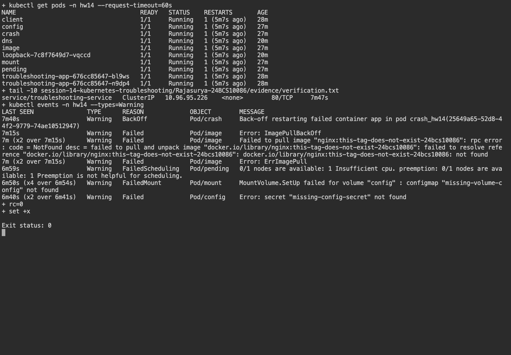
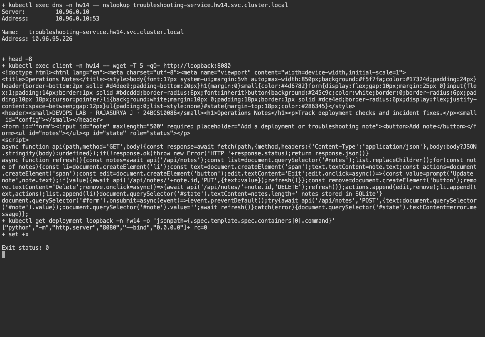

# Session 14 - Kubernetes Troubleshooting

**Name:** Rajasurya J

**Enrollment number:** 24BCS10086

## Environment

Commands run on the macOS 26.7.1 Apple Silicon host using kubectl 1.37.0.
Kubernetes runs in the existing minikube 1.39.0 vfkit Linux VM with containerd 2.3.4.
I used the `hw14` namespace for this session.

## Task 1: Commands

I used [verify.sh](verify.sh) to run `get`, `describe`, `logs`, `exec`, `events`, `explain`, `top`,
and `get -o wide`. The [command log](evidence/verification.txt) includes each error, the investigation
and the check after applying the fix.

`get` provides a summary; `describe` adds configuration, conditions and Events. `logs` reads application
output, while `logs --previous` retrieves the previous terminated container's output. `exec` runs a command
in a running container. `events` identifies scheduling, pulling and mount failures. `explain` reads API field
help; `top` reports sampled CPU/memory; `-o wide` adds IP and node placement.

## Task 2: Deliberate failures and fixes

| Problem | Symptom | Investigation and root cause | Fix and verification |
|---|---|---|---|
| CrashLoopBackOff | Container prints `intentional-exit-42` and exits 42. | `logs --previous`, `describe`; command exits immediately. | Replace the isolated Pod with a sleeping process; Ready verified. |
| ErrImagePull / ImagePullBackOff | Nonexistent nginx tag cannot be found. | Pod Events show `not found`, ErrImagePull and subsequent pull backoff. | `kubectl set image pod/image app=nginx:alpine`; Ready verified. |
| Pending | Pod stays unscheduled. | `describe`: `Insufficient cpu` for a request of 1000 CPUs. | Replace with a feasible request; Ready verified. |
| ContainerCreating | ConfigMap volume cannot mount. | `describe`: `FailedMount`, missing `missing-volume-config`. | Create the ConfigMap; Pod Ready and mounted value read back. |
| Configuration | `CreateContainerConfigError`. | Events identify missing `missing-config-secret`. | Create a classroom Secret; verify injection without printing the value. |
| Service selector | Service has no ready backend addresses; HTTP times out. | Compare Service selector `wrong-app` with Pod labels. | Restore `troubleshooting-app`, verify HTTP response. |
| Service target port | Traffic is sent to port 81, which nginx does not listen on. | Inspect Service targetPort and connection failure. | Restore targetPort 80; HTTP response verified. |
| DNS | Custom DNS server `192.0.2.1` does not respond. | Read `/etc/resolv.conf`; bounded `nslookup` fails. | Replace Pod with ClusterFirst DNS; FQDN resolves. |
| Pod networking | Server listens only on container loopback. | Localhost HTTP returns 200, Service connection fails. | Change bind address to `0.0.0.0`; remote Service request succeeds. |

A Pod can be Running but not Ready, or Pending because it has not been scheduled; inspect the container
waiting reason and Events instead of treating the phase alone as a root cause.
DNS resolution and transport connectivity are separate tests.

## Task 3: Mini project

[mini-project/app.yaml](mini-project/app.yaml) deploys two nginx replicas, a Service and a diagnostic client.
The missing image and deliberately wrong selector reproduce the class mini-project challenges.
[network-broken.yaml](mini-project/network-broken.yaml) adds the loopback-binding exercise.
Broken/fixed Pod manifests are retained in [scenarios/](scenarios/).

An immediate request after fixing a selector initially failed while Kubernetes propagated endpoints and
proxy rules. The unchanged fix succeeded after reconciliation. The script now uses bounded retries for
that convergence; the original failed attempt remains in the evidence.

## Screenshots

The warning Events show the broken configurations. The final Pod list shows the state after the fixes.

## Result

All nine issue categories were investigated, fixed and verified. The mini-project Service serves nginx,
the DNS FQDN resolves, and the formerly loopback-only application responds through its Service.
