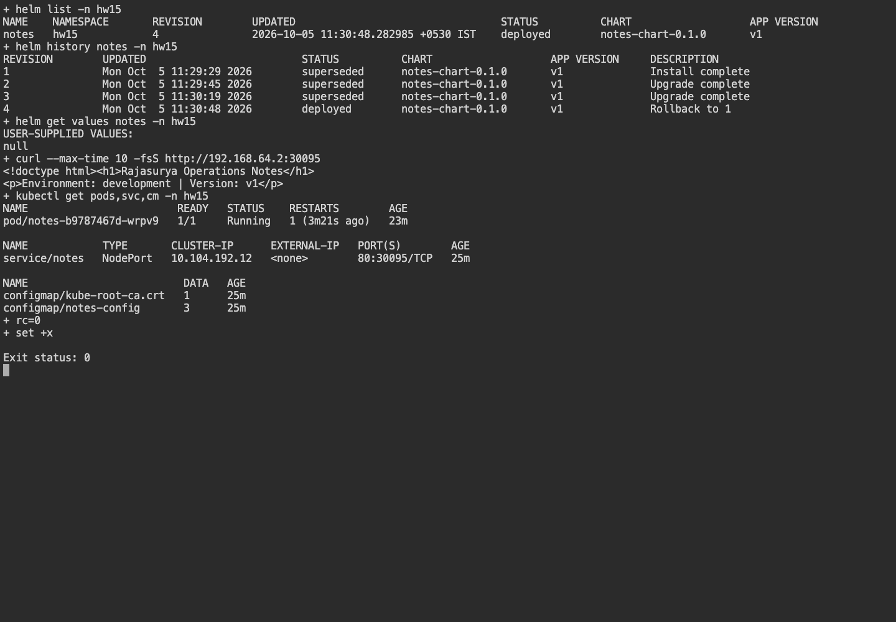

# Session 15 - Helm

**Name:** Rajasurya J

**Enrollment number:** 24BCS10086

## Environment

Commands run on the macOS 26.7.1 Apple Silicon host using kubectl 1.37.0.
Kubernetes runs in the existing minikube 1.39.0 vfkit Linux VM with containerd 2.3.4.
I used the `hw15` namespace for the Helm releases.

## Task 1: Helm commands

I used `helm create` to generate [mini-project/notes-chart](mini-project/notes-chart/) and adjusted
the templates for the Notes project. [Creation output](evidence/create.txt) records that command.
The chart includes Chart.yaml, development/production values, Deployment, Service and ConfigMap templates.

```bash
./verify.sh
helm list -n hw15
helm status notes -n hw15
helm get values notes -n hw15
helm history notes -n hw15
```

| Command | What was executed |
|---|---|
| create | Generate the new Notes chart. |
| repo / search | Add/update/list Bitnami, search the repository for nginx. |
| lint / template | Validate chart structure and save the rendered manifests. |
| install | Install `notes` into `hw15`. |
| list / status / get | Inspect release state, values and installed manifest. |
| upgrade | Apply production values, then another version update. |
| history / rollback | Inspect revisions, restore revision 1. |
| uninstall | Install and remove a separate `disposable` release, preserving `notes`. |

## Task 2: Complete rollback workflow

| Revision | Change | HTTP verification |
|---|---|---|
| 1 | Install: one replica, development, v1. | Page shows development and v1. |
| 2 | Upgrade: three replicas, production, v2. | Page shows production and v2. |
| 3 | Upgrade again: production, v3. | Page shows production and v3. |
| 4 | Rollback to revision 1. | Page returns to development and v1. |

The ConfigMap checksum annotation changes the Pod template when the page configuration changes,
so the rollout replaces Pods rather than leaving environment snapshots stale.
An immediate NodePort connection after rollback initially failed; the later request succeeded once
routing reconciled. I added bounded curl retries to allow time for the endpoints to update.

## Task 3: Notes mini project

The chart serves a Notes page through NodePort 30095 and injects app name/environment through a ConfigMap.
`values-prod.yaml` changes replica count and configuration. Each rendered resource uses the release name,
so the disposable release does not collide with the persistent Notes release.

## Output and screenshot

[Full commands/output](evidence/verification.txt) include every required command and all four revisions.
[Rendered YAML](evidence/rendered.yaml) shows the output of `helm template`.



## Result

The Notes release remains deployed at revision 4, with the original development/v1 behavior restored.
The disposable release was uninstalled successfully.
