# Session 10 — Kubernetes Core Objects: Pods, ReplicaSets & Deployments

**Name:** Rajasurya J
**Enrollment Number:** 24BCS10086
**Course:** SST DevOps & Cloud [SWE]
**Repository:** `devops-heros` / `session10-k8s-core-objects`

---

## Environment

| Item | Value |
|---|---|
| Host | MacBook Air, Apple Silicon (arm64), macOS 26.7 |
| minikube | v1.39.0, driver **`vfkit`**, 3 GB / 3 vCPU |
| Kubernetes | v1.37.0 |
| Runtime | containerd 2.3.4 |
| Nodes | 1 (`minikube`, role `control-plane`, untainted so it also runs workloads) |

Every code block below is a real transcript from this cluster, and every
screenshot is a render of that same transcript. Where a manifest could not run
on arm64 I have said so explicitly rather than papering over it.

### Contents

| Task | What it proves |
|---|---|
| [1](#task-1--cluster-health-verification) | Control plane, CoreDNS and node readiness |
| [2](#task-2--standard-pod-deployment-inspection--teardown) | A bare Pod, its IP, node placement and logs |
| [3](#task-3--error-state-simulation--errimagepull--imagepullbackoff) | API object succeeds while the container fails |
| [4](#task-4--capturing-transient-pod-lifecycle-stages) | `ContainerCreating` → `Running` → `Completed` |
| [5](#task-5--exhaustive-pod-lifecycle-states--probes-lab) | All 12 lifecycle manifests, probes, init & sidecars |
| [6](#task-6--core-controller-objects-replicaset--statefulset) | Self-healing vs. stable ordinal identity |
| [7](#task-7--daemonset-architecture--host-agent-deployment) | Exactly one agent pod per node |
| [8](#task-8--deployment-upgrades-rolling-updates--instant-rollbacks) | Zero-downtime rollout and `rollout undo` |
| [9](#task-9--real-world-troubleshooting-scenarios) | A halted rollout and an immutable-selector rejection |
| [10](#task-10--theoretical--architectural-writeup) | Ports, labels, strategies, surge math, requests vs limits |
| [11](#task-11--blue-green-deployment--instant-selector-cutover) | Instant cutover by flipping a Service selector |
| [12](#task-12--canary-deployment--pod-ratio-traffic-splitting) | 90/10 split by pod count, then 70/30, then rollback |
| [13](#task-13--recreate-deployment--downtime-outage-demonstration) | A deliberate, measured outage window |

---

## Task 1 — Cluster health verification

**Description:** Verify the control plane, CoreDNS endpoint and node readiness before deploying any workload.

**Commands:**

```bash
kubectl cluster-info
kubectl get nodes -o wide
kubectl version --client
```

**Output:**

```text
rajasurya@Rajasuryas-MacBook-Air devops-heros % kubectl cluster-info
Kubernetes control plane is running at https://192.168.64.2:8443
CoreDNS is running at https://192.168.64.2:8443/api/v1/namespaces/kube-system/services/kube-dns:dns/proxy

To further debug and diagnose cluster problems, use 'kubectl cluster-info dump'.

rajasurya@Rajasuryas-MacBook-Air devops-heros % kubectl get nodes -o wide
NAME       STATUS   ROLES           AGE     VERSION   INTERNAL-IP    EXTERNAL-IP   OS-IMAGE               KERNEL-VERSION    CONTAINER-RUNTIME
minikube   Ready    control-plane   2m41s   v1.37.0   192.168.64.2   <none>        Buildroot 2025.02.16   6.6.152 (arm64)   containerd://2.3.4

rajasurya@Rajasuryas-MacBook-Air devops-heros % kubectl version --client
Client Version: v1.37.0
Kustomize Version: v5.8.1
```

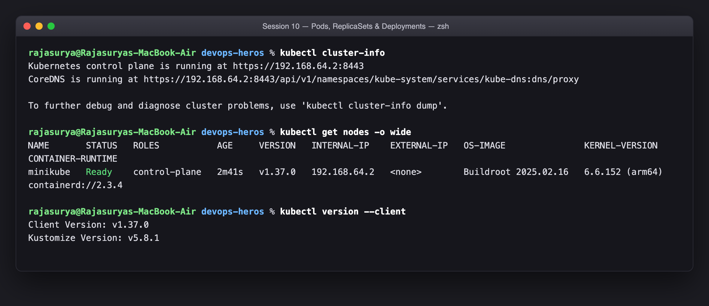

---

## Task 2 — Standard Pod deployment, inspection & teardown

**Description:** Deploy a standalone Nginx Pod declaring the four mandatory top-level fields, inspect its assigned IP and node, read its container logs, then delete it.

The four mandatory fields every Kubernetes manifest must have:

| Field | Value here | Meaning |
|---|---|---|
| `apiVersion` | `v1` | Which API group/version validates this object (`Pod` is in core, so no group prefix). |
| `kind` | `Pod` | Which object type. |
| `metadata` | `name: nginx-pod`, `labels` | Identity — the name is unique per namespace; labels are how selectors find it later. |
| `spec` | `containers[]` | The **desired state**. Kubernetes' job is to make reality match it. |

**Commands:**

```bash
kubectl apply -f pod.yml
kubectl get pods
kubectl get pods -o wide
kubectl describe pod nginx-pod | head -12
kubectl logs nginx-pod --tail=4
kubectl delete -f pod.yml
```

**Output:**

```text
rajasurya@Rajasuryas-MacBook-Air devops-heros % cat pod.yml
apiVersion: v1
kind: Pod

metadata:
  name: nginx-pod
  labels:
    app: nginx

spec:
  containers:
    - name: nginx
      image: nginx:latest
      ports:
        - containerPort: 80
rajasurya@Rajasuryas-MacBook-Air devops-heros % kubectl apply -f pod.yml
pod/nginx-pod created

rajasurya@Rajasuryas-MacBook-Air devops-heros % kubectl get pods
NAME        READY   STATUS    RESTARTS   AGE
nginx-pod   1/1     Running   0          9s

rajasurya@Rajasuryas-MacBook-Air devops-heros % kubectl get pods -o wide
NAME        READY   STATUS    RESTARTS   AGE   IP           NODE       NOMINATED NODE   READINESS GATES
nginx-pod   1/1     Running   0          9s    10.244.0.7   minikube   <none>           <none>

rajasurya@Rajasuryas-MacBook-Air devops-heros % kubectl describe pod nginx-pod | head -12
Name:             nginx-pod
Namespace:        default
Priority:         0
Service Account:  default
Node:             minikube/192.168.64.2
Start Time:       Fri, 18 Sep 2026 00:13:14 +0530
Labels:           app=nginx
Annotations:      <none>
Status:           Running
IP:               10.244.0.7
IPs:
  IP:  10.244.0.7

rajasurya@Rajasuryas-MacBook-Air devops-heros % kubectl logs nginx-pod --tail=4
2026/09/17 18:43:23 [notice] 1#1: start worker processes
2026/09/17 18:43:23 [notice] 1#1: start worker process 29
2026/09/17 18:43:23 [notice] 1#1: start worker process 30
2026/09/17 18:43:23 [notice] 1#1: start worker process 31

rajasurya@Rajasuryas-MacBook-Air devops-heros % kubectl delete -f pod.yml
pod "nginx-pod" deleted from default namespace

rajasurya@Rajasuryas-MacBook-Air devops-heros % kubectl get pods
No resources found in default namespace.
```

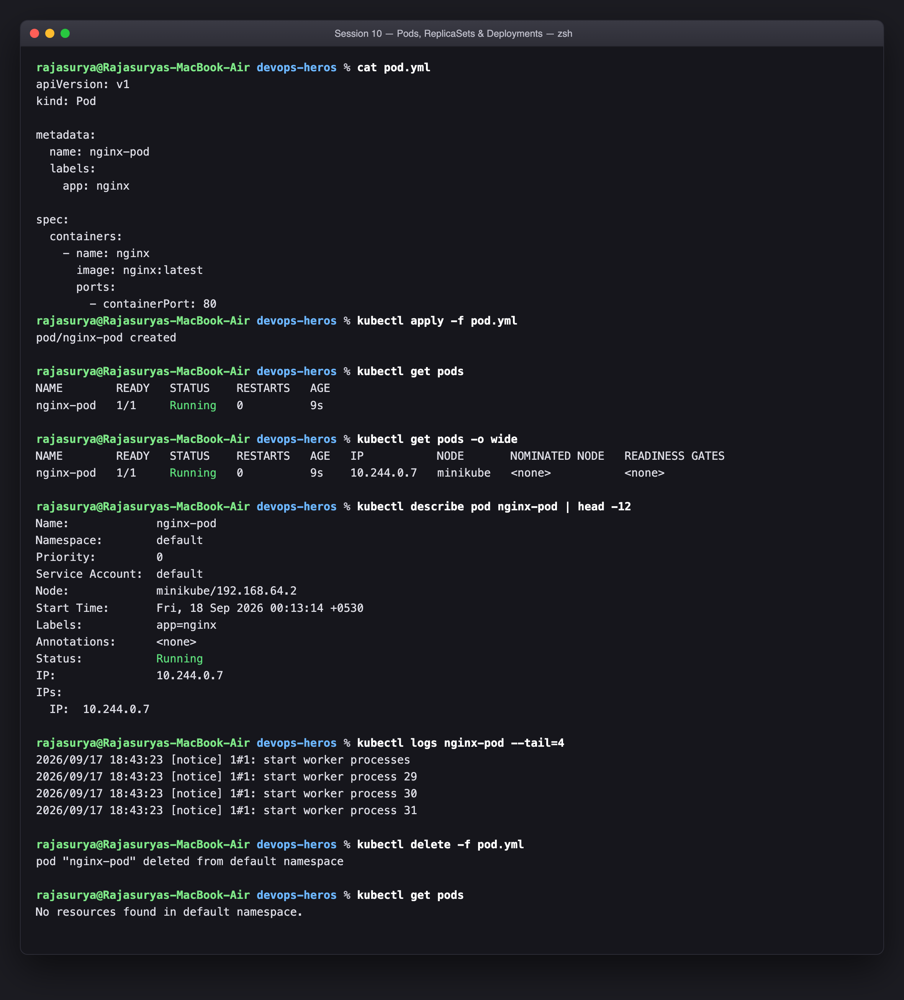

Worth noting: the Pod got `10.244.0.7` — an address from the **CNI pod network**,
not from the node's subnet. That IP lives only inside the cluster and is
released when the pod dies. That impermanence is exactly why Services exist.

---

## Task 3 — Error state simulation: `ErrImagePull` & `ImagePullBackOff`

**Description:** Point a Pod at an image that does not exist and watch the kubelet's retry-with-backoff behaviour.

**Commands:**

```bash
kubectl apply -f pod-lifecycle/06-imagepullbackoff.yaml
kubectl get pod lifecycle-image-error
kubectl describe pod lifecycle-image-error | tail -9
```

**Output:**

```text
rajasurya@Rajasuryas-MacBook-Air devops-heros % cat pod-lifecycle/06-imagepullbackoff.yaml
apiVersion: v1
kind: Pod
metadata:
  name: lifecycle-image-error
spec:
  containers:
    - name: broken-image
      image: jakwehrgkaejw:kahsdfgkhj

rajasurya@Rajasuryas-MacBook-Air devops-heros % kubectl apply -f pod-lifecycle/06-imagepullbackoff.yaml
pod/lifecycle-image-error created

rajasurya@Rajasuryas-MacBook-Air devops-heros % kubectl get pod lifecycle-image-error
NAME                    READY   STATUS         RESTARTS   AGE
lifecycle-image-error   0/1     ErrImagePull   0          6s

rajasurya@Rajasuryas-MacBook-Air devops-heros % kubectl get pod lifecycle-image-error
NAME                    READY   STATUS         RESTARTS   AGE
lifecycle-image-error   0/1     ErrImagePull   0          41s

rajasurya@Rajasuryas-MacBook-Air devops-heros % kubectl describe pod lifecycle-image-error | tail -9
Events:
  Type     Reason     Age                From               Message
  ----     ------     ----               ----               -------
  Normal   Scheduled  41s                default-scheduler  Successfully assigned default/lifecycle-image-error to minikube
  Warning  Failed     23s (x2 over 39s)  kubelet            spec.containers{broken-image}: Failed to pull image "jakwehrgkaejw:kahsdfgkhj": failed to pull and unpack image "docker.io/library/jakwehrgkaejw:kahsdfgkhj": failed to resolve reference "docker.io/library/jakwehrgkaejw:kahsdfgkhj": pull access denied, repository does not exist or may require authorization: server message: insufficient_scope: authorization failed
  Warning  Failed     23s (x2 over 39s)  kubelet            spec.containers{broken-image}: Error: ErrImagePull
  Normal   BackOff    11s (x2 over 38s)  kubelet            spec.containers{broken-image}: Back-off pulling image "jakwehrgkaejw:kahsdfgkhj"
  Warning  Failed     11s (x2 over 38s)  kubelet            spec.containers{broken-image}: Error: ImagePullBackOff
  Normal   Pulling    0s (x3 over 41s)   kubelet            spec.containers{broken-image}: Pulling image "jakwehrgkaejw:kahsdfgkhj"

rajasurya@Rajasuryas-MacBook-Air devops-heros % kubectl delete -f pod-lifecycle/06-imagepullbackoff.yaml
pod "lifecycle-image-error" deleted from default namespace
```

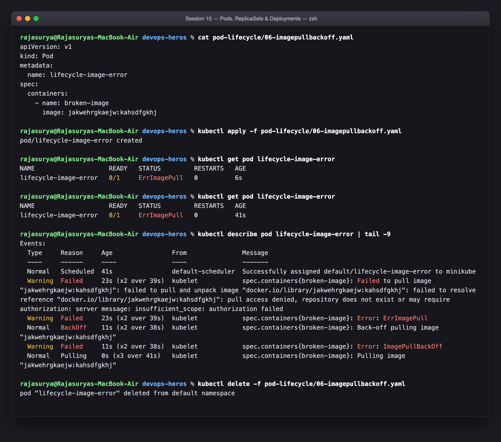

### Why the API object succeeds while the container fails

This is the part the task actually asks to explain, and the events above show it
step by step:

1. `kubectl apply` returned **`pod/lifecycle-image-error created`**. The API
   server authenticated the request, validated the schema — `jakwehrgkaejw:kahsdfgkhj`
   is a *syntactically legal* image reference — and wrote the object to `etcd`.
   As far as the control plane is concerned, the desired state is now recorded
   and the write succeeded.
2. `Successfully assigned default/lifecycle-image-error to minikube` — the
   scheduler had no problem either. Scheduling only considers resources, taints
   and affinity. **Nobody checks whether the image exists**; that would require
   a registry round-trip in the admission path.
3. Only when the kubelet on that node tried to pull did it fail:
   `pull access denied, repository does not exist`. The kubelet set the
   container state to `ErrImagePull`.
4. The kubelet then retried, and on failing again switched the waiting reason to
   **`ImagePullBackOff`** — note `Back-off pulling image` in the events. This is
   an *exponential* backoff (roughly 10s, 20s, 40s … capped at 5 minutes), which
   exists so one bad manifest cannot turn a cluster into a denial-of-service
   client against a registry.

So the two statuses are two stages of one problem: `ErrImagePull` is "the last
pull attempt failed", `ImagePullBackOff` is "I have failed enough times that I
am now deliberately waiting before trying again". The Pod object stays perfectly
healthy in `etcd` the whole time — only `status` reflects the trouble. Desired
state and actual state are separate, and this is what that separation looks like.

---

## Task 4 — Capturing transient Pod lifecycle stages

**Description:** Run a short-lived `busybox` batch container with `restartPolicy: Never` and capture every phase transition as it happens.

The trick is to have `kubectl get pods -w` already watching in one terminal
*before* applying in another — the whole thing is over in about 5 seconds.

**Commands:**

```bash
# Terminal 1
kubectl get pods -w
# Terminal 2
kubectl apply -f hello.yml
kubectl logs hello-pod
```

**Output:**

```text
rajasurya@Rajasuryas-MacBook-Air devops-heros % cat hello.yml
apiVersion: v1
kind: Pod

metadata:
  name: hello-pod

spec:
  restartPolicy: Never

  containers:
    - name: hello
      image: busybox
      command: ["sh", "-c", "echo Hello Kubernetes"]
rajasurya@Rajasuryas-MacBook-Air devops-heros % kubectl apply -f hello.yml
pod/hello-pod created

rajasurya@Rajasuryas-MacBook-Air devops-heros % kubectl get pods -w      # Terminal 1: every state change as it happens
NAME                    READY   STATUS         RESTARTS   AGE
hello-pod               0/1     Pending            0          0s
hello-pod               0/1     Pending            0          0s
hello-pod               0/1     ContainerCreating   0          0s
hello-pod               0/1     ContainerCreating   0          0s
hello-pod               1/1     Running                  0          4s
hello-pod               0/1     Completed                0          4s
hello-pod               0/1     Completed                0          5s

rajasurya@Rajasuryas-MacBook-Air devops-heros % kubectl get pod hello-pod
NAME        READY   STATUS      RESTARTS   AGE
hello-pod   0/1     Completed   0          8s

rajasurya@Rajasuryas-MacBook-Air devops-heros % kubectl logs hello-pod
Hello Kubernetes

rajasurya@Rajasuryas-MacBook-Air devops-heros % kubectl get pod hello-pod -o jsonpath='Phase={.status.phase} ExitCode={.status.containerStatuses[0].state.terminated.exitCode} Reason={.status.containerStatuses[0].state.terminated.reason}{"\n"}'
Phase=Succeeded ExitCode=0 Reason=Completed

rajasurya@Rajasuryas-MacBook-Air devops-heros % kubectl delete -f hello.yml
pod "hello-pod" deleted from default namespace
```

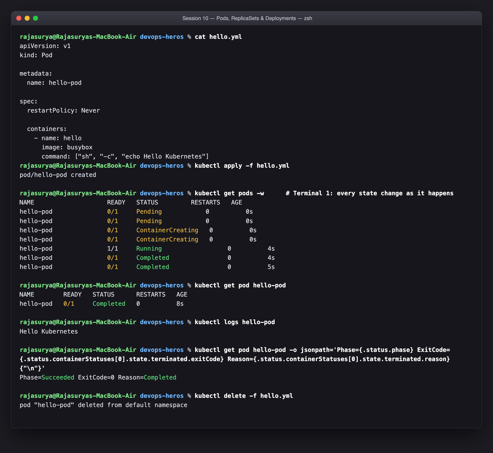

Every stage, captured:

| Phase shown | What was happening |
|---|---|
| `Pending` | Object exists in `etcd`; scheduler has not bound it to a node yet. |
| `ContainerCreating` | Bound to `minikube`; kubelet is creating the sandbox and pulling/starting the image. |
| `Running` (`1/1`) | The `echo` process was alive. This is the stage that is easy to miss. |
| `Completed` (`0/1`) | Process exited 0. `READY` drops to `0/1` because nothing is running any more. |

`kubectl get pod -o jsonpath` then confirms the underlying truth:
**`Phase=Succeeded ExitCode=0 Reason=Completed`**. Note the distinction — the
`STATUS` column shows `Completed` (the *container's* terminated reason) while
the Pod's actual `phase` is `Succeeded`. With `restartPolicy: Never`, exit 0 is
terminal: the kubelet will not restart it, which is what makes this a batch job
rather than a service.

---

## Task 5 — Exhaustive Pod lifecycle states & probes lab

**Description:** Execute and document all 12 manifests in `session10-k8s-core-objects/pod-lifecycle/`.

### 5.1 `01-running.yaml` + `02-pending.yaml` — Running and Pending

```bash
kubectl apply -f 01-running.yaml
kubectl get pod lifecycle-running -o wide
kubectl apply -f 02-pending.yaml
kubectl describe pod lifecycle-pending | tail -5
```

```text
rajasurya@Rajasuryas-MacBook-Air devops-heros % kubectl apply -f 01-running.yaml
pod/lifecycle-running created

rajasurya@Rajasuryas-MacBook-Air devops-heros % kubectl get pod lifecycle-running -o wide
NAME                READY   STATUS    RESTARTS   AGE   IP            NODE       NOMINATED NODE   READINESS GATES
lifecycle-running   1/1     Running   0          0s    10.244.0.11   minikube   <none>           <none>

rajasurya@Rajasuryas-MacBook-Air devops-heros % kubectl delete -f 01-running.yaml
pod "lifecycle-running" deleted from default namespace

rajasurya@Rajasuryas-MacBook-Air devops-heros % kubectl apply -f 02-pending.yaml
pod/lifecycle-pending created

rajasurya@Rajasuryas-MacBook-Air devops-heros % kubectl get pod lifecycle-pending
NAME                READY   STATUS    RESTARTS   AGE
lifecycle-pending   0/1     Pending   0          13s

rajasurya@Rajasuryas-MacBook-Air devops-heros % kubectl describe pod lifecycle-pending | tail -5
                             node.kubernetes.io/unreachable:NoExecute op=Exists for 300s
Events:
  Type     Reason            Age   From               Message
  ----     ------            ----  ----               -------
  Warning  FailedScheduling  12s   default-scheduler  0/1 nodes are available: 1 Insufficient memory. preemption: 0/1 nodes are available: 1 Preemption is not helpful for scheduling.

rajasurya@Rajasuryas-MacBook-Air devops-heros % kubectl delete -f 02-pending.yaml
pod "lifecycle-pending" deleted from default namespace
```

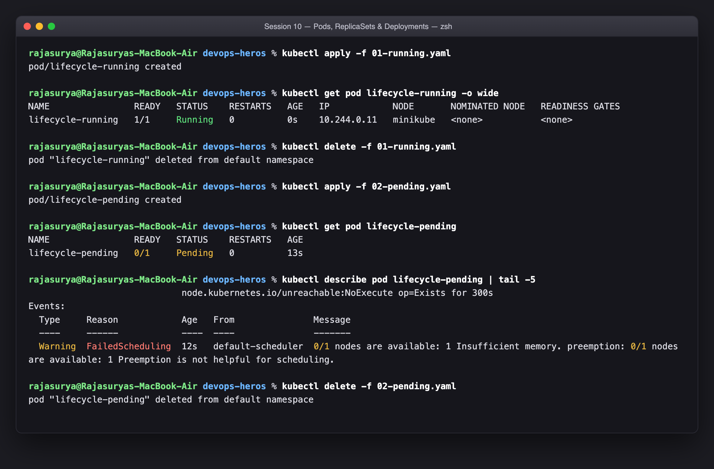

`02-pending.yaml` requests `memory: 9Gi`. This VM has 3 GB, so the scheduler's
filtering phase rejects the only node and the Pod parks in `Pending` forever
with `FailedScheduling: 0/1 nodes are available: 1 Insufficient memory`.

The key insight: **`Pending` is a scheduling problem, not a container problem.**
No image was ever pulled. The event also says
`preemption: 0/1 nodes are available: Preemption is not helpful` — Kubernetes
checked whether evicting lower-priority pods would help, and correctly concluded
that no amount of eviction produces 9 GiB on a 3 GB node.

### 5.2 `03-succeeded.yaml` + `04-failed.yaml` — Succeeded vs Failed

```bash
kubectl apply -f 03-succeeded.yaml -f 04-failed.yaml
kubectl get pods lifecycle-succeeded lifecycle-failed
```

```text
rajasurya@Rajasuryas-MacBook-Air devops-heros % kubectl apply -f 03-succeeded.yaml -f 04-failed.yaml
pod/lifecycle-succeeded created
pod/lifecycle-failed created

rajasurya@Rajasuryas-MacBook-Air devops-heros % kubectl get pods lifecycle-succeeded lifecycle-failed
NAME                  READY   STATUS      RESTARTS   AGE
lifecycle-succeeded   0/1     Completed   0          25s
lifecycle-failed      0/1     Error       0          25s

rajasurya@Rajasuryas-MacBook-Air devops-heros % kubectl get pods lifecycle-succeeded lifecycle-failed -o custom-columns='NAME:.metadata.name,PHASE:.status.phase,EXIT:.status.containerStatuses[0].state.terminated.exitCode,REASON:.status.containerStatuses[0].state.terminated.reason'
NAME                  PHASE       EXIT   REASON
lifecycle-succeeded   Succeeded   0      Completed
lifecycle-failed      Failed      1      Error

rajasurya@Rajasuryas-MacBook-Air devops-heros % kubectl logs lifecycle-failed
Task started
Task failed

rajasurya@Rajasuryas-MacBook-Air devops-heros % kubectl delete -f 03-succeeded.yaml -f 04-failed.yaml
pod "lifecycle-succeeded" deleted from default namespace
pod "lifecycle-failed" deleted from default namespace
```

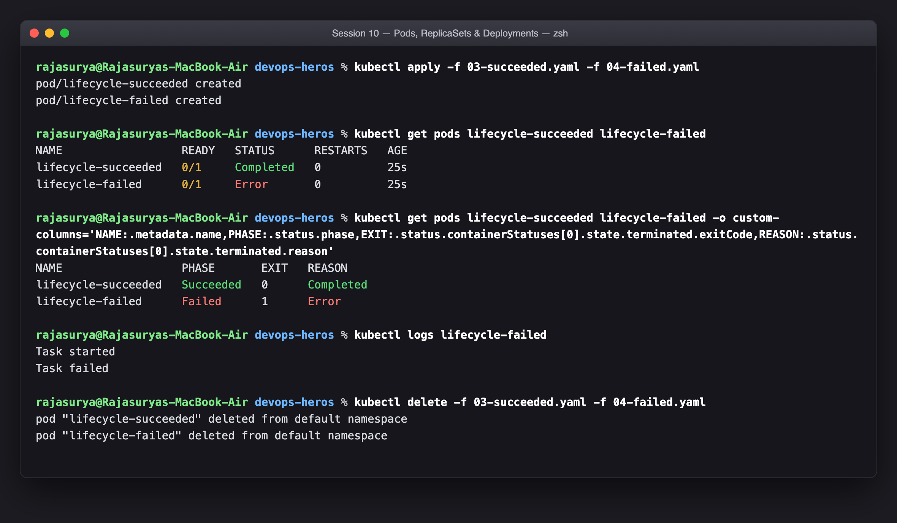

Both have `restartPolicy: Never` and both ran to completion; the *only*
difference is the exit code, and that single byte decides the terminal phase:

| Pod | Exit code | Container reason | Pod phase |
|---|---|---|---|
| `lifecycle-succeeded` | `0` | `Completed` | **`Succeeded`** |
| `lifecycle-failed` | `1` | `Error` | **`Failed`** |

### 5.3 `05-crashloopbackoff.yaml` — CrashLoopBackOff

```bash
kubectl apply -f 05-crashloopbackoff.yaml
kubectl get pod lifecycle-crashloop -w
kubectl logs lifecycle-crashloop
```

```text
rajasurya@Rajasuryas-MacBook-Air devops-heros % cat 05-crashloopbackoff.yaml
apiVersion: v1
kind: Pod
metadata:
  name: lifecycle-crashloop
spec:
  containers:
    - name: crashing-app
      image: busybox:1.36
      command: ["sh", "-c", "echo 'Application started'; sleep 3; echo 'Application crashed'; exit 1"]

rajasurya@Rajasuryas-MacBook-Air devops-heros % kubectl apply -f 05-crashloopbackoff.yaml
pod/lifecycle-crashloop created

rajasurya@Rajasuryas-MacBook-Air devops-heros % kubectl get pod lifecycle-crashloop -w    # Terminal 1: the crash/backoff cycle
NAME                  READY   STATUS    RESTARTS   AGE
lifecycle-crashloop   0/1     Pending   0          0s
lifecycle-crashloop   0/1     Pending   0          0s
lifecycle-crashloop   0/1     ContainerCreating   0          0s
lifecycle-crashloop   0/1     ContainerCreating   0          1s
lifecycle-crashloop   1/1     Running             0          1s
lifecycle-crashloop   0/1     Error               0          4s
lifecycle-crashloop   1/1     Running             1 (0s ago)   4s
lifecycle-crashloop   0/1     Error               1 (4s ago)   8s
lifecycle-crashloop   0/1     CrashLoopBackOff    1 (13s ago)   20s
lifecycle-crashloop   1/1     Running             2 (13s ago)   20s
lifecycle-crashloop   0/1     Error               2 (16s ago)   23s
lifecycle-crashloop   0/1     CrashLoopBackOff    2 (22s ago)   45s
lifecycle-crashloop   1/1     Running             3 (22s ago)   45s
lifecycle-crashloop   0/1     Error               3 (26s ago)   49s
lifecycle-crashloop   0/1     CrashLoopBackOff    3 (43s ago)   91s
lifecycle-crashloop   1/1     Running             4 (43s ago)   91s

rajasurya@Rajasuryas-MacBook-Air devops-heros % kubectl get pod lifecycle-crashloop
NAME                  READY   STATUS    RESTARTS      AGE
lifecycle-crashloop   1/1     Running   4 (45s ago)   93s

rajasurya@Rajasuryas-MacBook-Air devops-heros % kubectl logs lifecycle-crashloop
Application started

rajasurya@Rajasuryas-MacBook-Air devops-heros % kubectl describe pod lifecycle-crashloop | grep -E 'State|Reason|Exit Code|Restart Count|Back-off' | head -8
    State:          Running
    Last State:     Terminated
      Reason:       Error
      Exit Code:    1
    Restart Count:  4
  Type     Reason     Age                From               Message
  Warning  BackOff    44s (x3 over 85s)  kubelet            spec.containers{crashing-app}: Back-off restarting failed container crashing-app in pod lifecycle-crashloop_default(4601dee5-6a4a-4b48-95b1-c1f93097b74c)

rajasurya@Rajasuryas-MacBook-Air devops-heros % kubectl delete -f 05-crashloopbackoff.yaml
pod "lifecycle-crashloop" deleted from default namespace
```

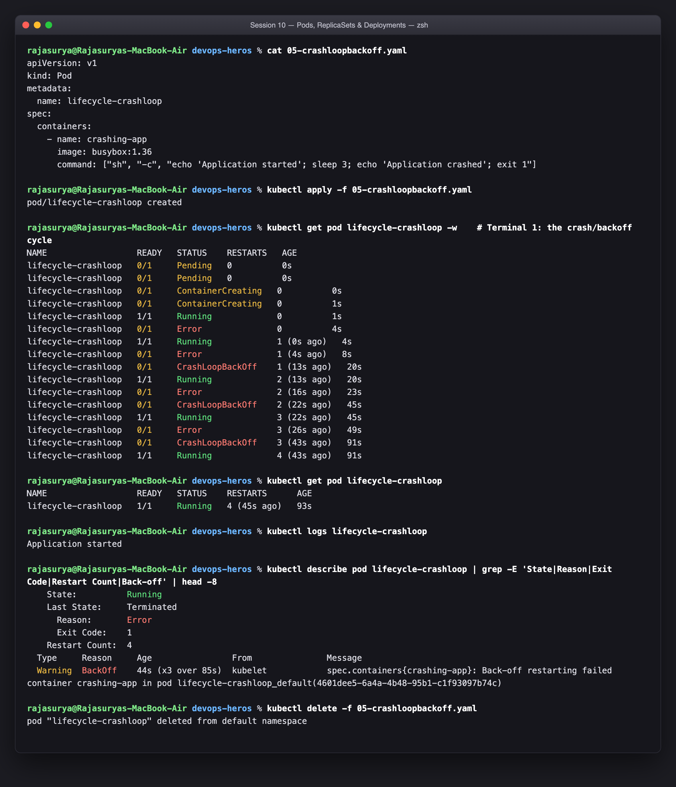

Same failing container as `04-failed.yaml`, but **no `restartPolicy: Never`** —
so it defaults to `Always`. The kubelet therefore keeps restarting it, and
because it keeps dying, the kubelet inserts a growing delay between attempts.
That oscillation is what the watch captures:

```
Running  ->  Error  ->  CrashLoopBackOff  ->  Running  ->  Error  ->  ...
```

`RESTARTS` climbs on every cycle. `CrashLoopBackOff` is therefore **not an
error type** — it is the kubelet saying "this container keeps failing and I am
now waiting longer before each retry" (10s → 20s → 40s … capped at 5 min).
The real diagnosis is always one level down, in `kubectl logs`.

### 5.4 `07/08/09` — readiness, liveness and startup probes

```bash
kubectl apply -f 07-readiness.yaml   # Running != Ready
kubectl apply -f 08-liveness.yaml    # self-healing restart
kubectl apply -f 09-startup.yaml     # protects a slow boot
```

```text
rajasurya@Rajasuryas-MacBook-Air devops-heros % kubectl apply -f 07-readiness.yaml
pod/lifecycle-readiness created

rajasurya@Rajasuryas-MacBook-Air devops-heros % kubectl get pod lifecycle-readiness   # Running, but not yet Ready - probe has not passed
NAME                  READY   STATUS    RESTARTS   AGE
lifecycle-readiness   0/1     Running   0          3s

rajasurya@Rajasuryas-MacBook-Air devops-heros % kubectl get pod lifecycle-readiness   # readinessProbe passed -> 1/1 READY
NAME                  READY   STATUS    RESTARTS   AGE
lifecycle-readiness   1/1     Running   0          6s

rajasurya@Rajasuryas-MacBook-Air devops-heros % kubectl delete -f 07-readiness.yaml
pod "lifecycle-readiness" deleted from default namespace

rajasurya@Rajasuryas-MacBook-Air devops-heros % kubectl apply -f 08-liveness.yaml
pod/lifecycle-liveness created

rajasurya@Rajasuryas-MacBook-Air devops-heros % kubectl get pod lifecycle-liveness    # healthy: /tmp/healthy exists
NAME                 READY   STATUS    RESTARTS   AGE
lifecycle-liveness   1/1     Running   0          0s

rajasurya@Rajasuryas-MacBook-Air devops-heros % kubectl get pod lifecycle-liveness    # liveness probe failed -> kubelet restarted it
NAME                 READY   STATUS    RESTARTS     AGE
lifecycle-liveness   1/1     Running   1 (2s ago)   62s

rajasurya@Rajasuryas-MacBook-Air devops-heros % kubectl describe pod lifecycle-liveness | grep -A3 'Events:' | tail -3
  Type     Reason     Age                From               Message
  ----     ------     ----               ----               -------
  Normal   Scheduled  62s                default-scheduler  Successfully assigned default/lifecycle-liveness to minikube

rajasurya@Rajasuryas-MacBook-Air devops-heros % kubectl delete -f 08-liveness.yaml
pod "lifecycle-liveness" deleted from default namespace

rajasurya@Rajasuryas-MacBook-Air devops-heros % kubectl apply -f 09-startup.yaml
pod/lifecycle-startup created

rajasurya@Rajasuryas-MacBook-Air devops-heros % kubectl get pod lifecycle-startup     # still 0/1 - startupProbe is holding the gate
NAME                READY   STATUS    RESTARTS   AGE
lifecycle-startup   0/1     Running   0          13s

rajasurya@Rajasuryas-MacBook-Air devops-heros % kubectl get pod lifecycle-startup     # startupProbe satisfied after the slow boot
NAME                READY   STATUS    RESTARTS   AGE
lifecycle-startup   1/1     Running   0          36s

rajasurya@Rajasuryas-MacBook-Air devops-heros % kubectl delete -f 09-startup.yaml
pod "lifecycle-startup" deleted from default namespace
```

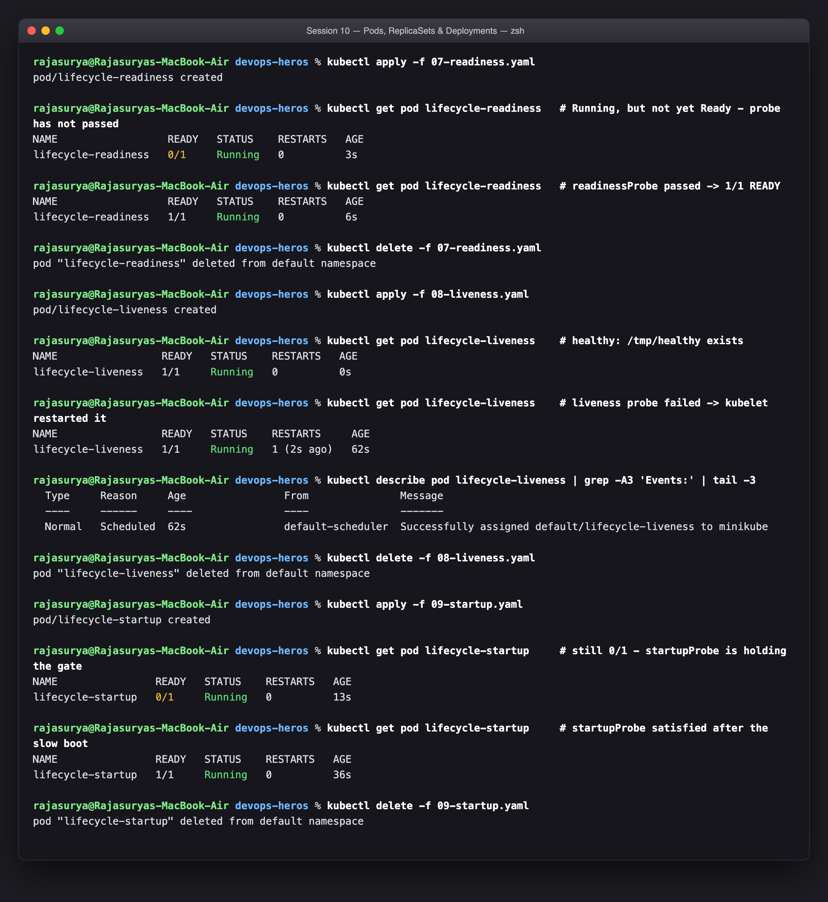

The three probes answer three different questions, and mixing them up is one of
the most common production mistakes:

| Probe | Question it answers | What happens on failure |
|---|---|---|
| **readiness** | "Can this pod take traffic *right now*?" | Pod is removed from Service endpoints. **Container is not restarted.** |
| **liveness** | "Is this container wedged and beyond recovery?" | Kubelet **kills and restarts** the container. |
| **startup** | "Has this slow application finished booting?" | Nothing is restarted while it runs; it just **suspends the liveness probe** until it first passes. |

- **`07-readiness.yaml`** shows the distinction the task is really after:
  immediately after creation the pod is `Running` but `0/1 READY`, because
  `initialDelaySeconds: 5` hasn't elapsed. `Running` is about the process;
  `Ready` is about traffic. A Service only routes to `Ready` pods.
- **`08-liveness.yaml`** creates `/tmp/healthy`, sleeps 20s, deletes it. The
  `exec` probe (`test -f /tmp/healthy`) then fails, and with
  `failureThreshold: 2` at `periodSeconds: 5` the kubelet kills the container
  after ~2 consecutive failures — visible as **`RESTARTS` going to 1** and an
  `Unhealthy` event. This is Kubernetes self-healing without a human involved.
- **`09-startup.yaml`** sleeps 30s before signalling readiness. Its
  `startupProbe` allows `failureThreshold: 10 × periodSeconds: 5` = **50s** of
  grace. The pod sits at `0/1` and then flips to `1/1`. Without a startup probe
  you would have to inflate `initialDelaySeconds` on the liveness probe
  instead — which would leave the app unmonitored for that whole window. This
  is the correct tool for slow-starting legacy apps.

### 5.5 `10/11/12` — init containers, sidecars and graceful termination

```bash
kubectl apply -f 10-init-container.yaml
kubectl apply -f 11-multi-container.yaml
kubectl apply -f 12-termination.yaml
```

```text
rajasurya@Rajasuryas-MacBook-Air devops-heros % kubectl apply -f 10-init-container.yaml
pod/lifecycle-init created

rajasurya@Rajasuryas-MacBook-Air devops-heros % kubectl get pod lifecycle-init     # Init:0/1 - app container has not started yet
NAME             READY   STATUS     RESTARTS   AGE
lifecycle-init   0/1     Init:0/1   0          4s

rajasurya@Rajasuryas-MacBook-Air devops-heros % kubectl describe pod lifecycle-init | grep -A6 'Init Containers:' | head -8
Init Containers:
  setup:
    Container ID:  containerd://914de2a27a427733cd4edf3950f65db8cdd8efaea8dabcf802d3e4e0e059a837
    Image:         busybox:1.36
    Image ID:      docker.io/library/busybox@sha256:73aaf090f3d85aa34ee199857f03fa3a95c8ede2ffd4cc2cdb5b94e566b11662
    Port:          <none>
    Host Port:     <none>

rajasurya@Rajasuryas-MacBook-Air devops-heros % kubectl get pod lifecycle-init     # init finished -> app container running
NAME             READY   STATUS    RESTARTS   AGE
lifecycle-init   1/1     Running   0          12s

rajasurya@Rajasuryas-MacBook-Air devops-heros % kubectl delete -f 10-init-container.yaml
pod "lifecycle-init" deleted from default namespace

rajasurya@Rajasuryas-MacBook-Air devops-heros % kubectl apply -f 11-multi-container.yaml
pod/lifecycle-multi-container created

rajasurya@Rajasuryas-MacBook-Air devops-heros % kubectl get pod lifecycle-multi-container    # READY 2/2 - two containers in one pod
NAME                        READY   STATUS    RESTARTS   AGE
lifecycle-multi-container   2/2     Running   0          0s

rajasurya@Rajasuryas-MacBook-Air devops-heros % kubectl logs lifecycle-multi-container -c sidecar --tail=3
Sidecar is running

rajasurya@Rajasuryas-MacBook-Air devops-heros % kubectl get pod lifecycle-multi-container -o jsonpath='{range .status.containerStatuses[*]}{.name}{" ready="}{.ready}{"\n"}{end}'
app ready=true
sidecar ready=true

rajasurya@Rajasuryas-MacBook-Air devops-heros % kubectl delete -f 11-multi-container.yaml
pod "lifecycle-multi-container" deleted from default namespace

rajasurya@Rajasuryas-MacBook-Air devops-heros % kubectl apply -f 12-termination.yaml
pod/lifecycle-termination created

rajasurya@Rajasuryas-MacBook-Air devops-heros % kubectl get pod lifecycle-termination
NAME                    READY   STATUS    RESTARTS   AGE
lifecycle-termination   1/1     Running   0          0s

rajasurya@Rajasuryas-MacBook-Air devops-heros % time kubectl delete -f 12-termination.yaml    # SIGTERM trap sleeps 10s before exiting
pod "lifecycle-termination" deleted from default namespace
kubectl delete -f 12-termination.yaml  0.03s user 0.02s system 0% cpu 11.414 total

rajasurya@Rajasuryas-MacBook-Air devops-heros % kubectl logs lifecycle-termination 2>/dev/null || echo '(pod is gone - logs no longer retrievable)'
(pod is gone - logs no longer retrievable)
```

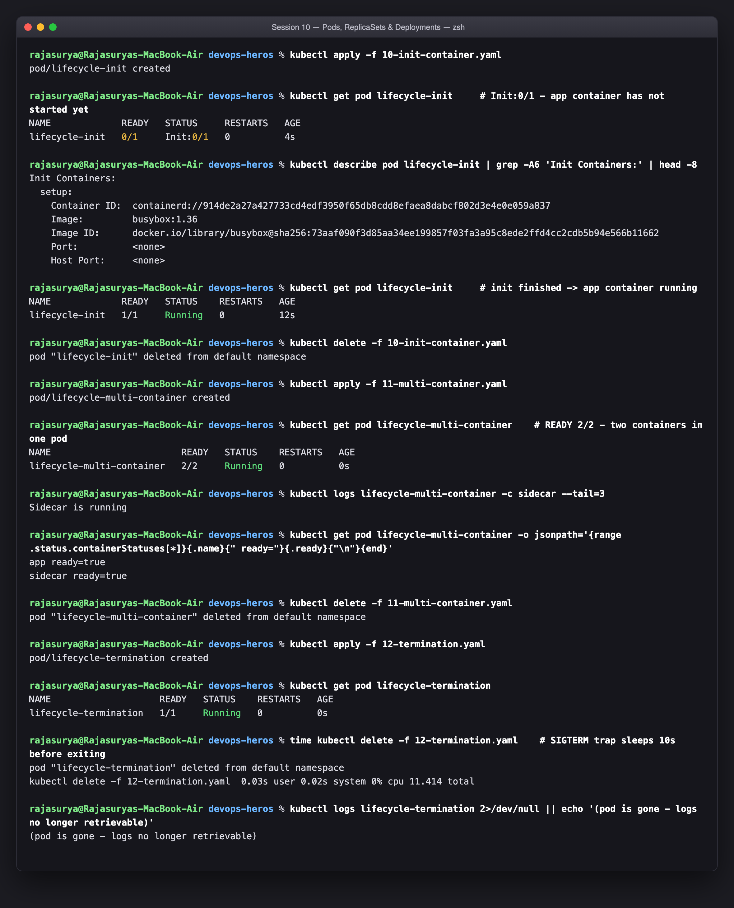

- **`10-init-container.yaml`** — the `setup` init container runs *to completion*
  before the `app` container is started at all. The pod reports
  `Init:0/1` while it works. Init containers run **sequentially**, and if one
  fails the pod restarts it rather than proceeding. This is how you express
  "wait for the database / fetch config / run migrations, *then* boot".
- **`11-multi-container.yaml`** — `app` (nginx) and `sidecar` (a logger) share
  one Pod, so `READY` reads **`2/2`** and logs must be addressed with
  `-c <container>`. They share a network namespace (same IP, reachable on
  `localhost`) and can share volumes. This is the sidecar pattern: log
  shippers, service-mesh proxies, metric exporters.
- **`12-termination.yaml`** — traps `SIGTERM`, cleans up for 10s, then exits,
  with `terminationGracePeriodSeconds: 20`. The `kubectl delete` visibly takes
  about 10 seconds instead of returning instantly. The shutdown sequence is:

  ```
  delete -> pod marked Terminating -> removed from Service endpoints
         -> SIGTERM sent to PID 1  -> app cleans up  -> exits
         -> (if still alive after 20s: SIGKILL)
  ```

  If the app had *not* trapped `SIGTERM` it would have been killed immediately
  and dropped in-flight requests. The endpoint removal happening *before*
  `SIGTERM` is what makes zero-downtime rollouts possible at all.

---

## Task 6 — Core controller objects: ReplicaSet & StatefulSet

### Part A — ReplicaSet self-healing

**Description:** Verify a ReplicaSet enforces its replica count, then delete a pod by hand and watch it be replaced.

```bash
kubectl apply -f replicaset.yml
kubectl get rs nginx-rs
kubectl delete pod $POD_NAME
kubectl get pods -l app=nginx
```

```text
rajasurya@Rajasuryas-MacBook-Air devops-heros % kubectl apply -f replicaset.yml
replicaset.apps/nginx-rs created

rajasurya@Rajasuryas-MacBook-Air devops-heros % kubectl get rs nginx-rs
NAME       DESIRED   CURRENT   READY   AGE
nginx-rs   3         3         3       6s

rajasurya@Rajasuryas-MacBook-Air devops-heros % kubectl get pods -l app=nginx -o wide
NAME             READY   STATUS    RESTARTS   AGE   IP            NODE       NOMINATED NODE   READINESS GATES
nginx-rs-5vk86   1/1     Running   0          6s    10.244.0.23   minikube   <none>           <none>
nginx-rs-mlfxs   1/1     Running   0          6s    10.244.0.22   minikube   <none>           <none>
nginx-rs-mnxzd   1/1     Running   0          6s    10.244.0.24   minikube   <none>           <none>

rajasurya@Rajasuryas-MacBook-Air devops-heros % POD_NAME=$(kubectl get pods -l app=nginx -o jsonpath='{.items[0].metadata.name}')
rajasurya@Rajasuryas-MacBook-Air devops-heros % echo $POD_NAME
nginx-rs-5vk86

rajasurya@Rajasuryas-MacBook-Air devops-heros % kubectl delete pod nginx-rs-5vk86
pod "nginx-rs-5vk86" deleted from default namespace

rajasurya@Rajasuryas-MacBook-Air devops-heros % kubectl get pods -l app=nginx    # ReplicaSet already replaced it - desired count is still 3
NAME             READY   STATUS              RESTARTS   AGE
nginx-rs-mlfxs   1/1     Running             0          7s
nginx-rs-mnxzd   1/1     Running             0          7s
nginx-rs-slchd   0/1     ContainerCreating   0          1s

rajasurya@Rajasuryas-MacBook-Air devops-heros % kubectl get rs nginx-rs
NAME       DESIRED   CURRENT   READY   AGE
nginx-rs   3         3         2       7s

rajasurya@Rajasuryas-MacBook-Air devops-heros % kubectl delete -f replicaset.yml
replicaset.apps "nginx-rs" deleted from default namespace
```

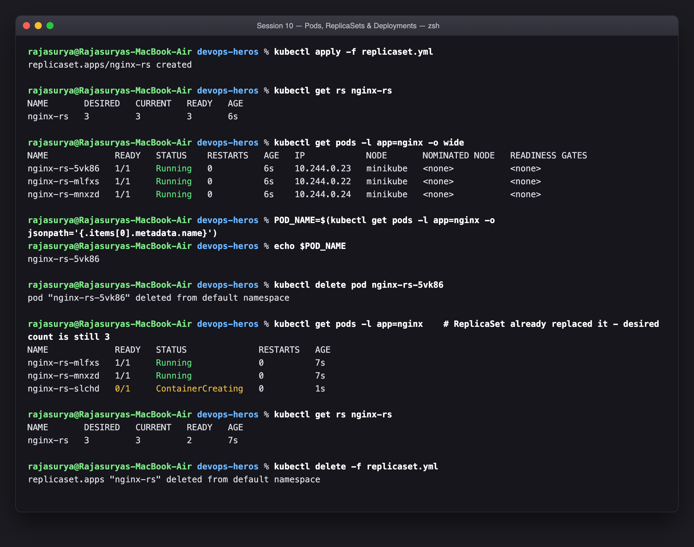

Deleting a pod does not reduce the count — the ReplicaSet controller's
reconciliation loop observes `current=2, desired=3` and immediately creates a
replacement, **with a new random name and a new IP**. The pod was never
"repaired"; it was replaced. Cattle, not pets.

### Part B — StatefulSet ordinal identity

**Description:** Deploy a stateful workload, verify deterministic ordinal naming and inspect the PersistentVolumeClaim bindings.

```bash
kubectl apply -f k8s-core-objects/statefulset.yml
kubectl get statefulset mysql
kubectl get pods -l app=mysql
kubectl get pvc
```

```text
rajasurya@Rajasuryas-MacBook-Air devops-heros % kubectl apply -f k8s-core-objects/statefulset.yml
statefulset.apps/mysql created

rajasurya@Rajasuryas-MacBook-Air devops-heros % kubectl get statefulset mysql
NAME    READY   AGE
mysql   0/3     46s

rajasurya@Rajasuryas-MacBook-Air devops-heros % kubectl get pods -l app=mysql
NAME      READY   STATUS         RESTARTS   AGE
mysql-0   0/1     ErrImagePull   0          46s

rajasurya@Rajasuryas-MacBook-Air devops-heros % kubectl get pvc
NAME                               STATUS   VOLUME                                     CAPACITY   ACCESS MODES   STORAGECLASS   VOLUMEATTRIBUTESCLASS   AGE
mysql-persistent-storage-mysql-0   Bound    pvc-cfc251fe-a1ec-4a4b-a083-8b8a0afedf3d   5Gi        RWO            standard       <unset>                 46s

rajasurya@Rajasuryas-MacBook-Air devops-heros % kubectl describe pod mysql-0 | grep -E 'Image:|Warning' | head -4
    Image:          mysql:5.7
  Warning  FailedScheduling  46s (x4 over 46s)  default-scheduler  0/1 nodes are available: pod has unbound immediate PersistentVolumeClaims. not found
  Warning  Failed            22s (x2 over 40s)  kubelet            spec.containers{mysql}: Failed to pull image "mysql:5.7": rpc error: code = NotFound desc = failed to pull and unpack image "docker.io/library/mysql:5.7": no match for platform in manifest: not found
  Warning  Failed            22s (x2 over 40s)  kubelet            spec.containers{mysql}: Error: ErrImagePull

rajasurya@Rajasuryas-MacBook-Air devops-heros % docker manifest inspect mysql:5.7 | grep -o '"architecture": "[^"]*"' | sort -u
"architecture": "amd64"
"architecture": "unknown"

rajasurya@Rajasuryas-MacBook-Air devops-heros % kubectl delete -f k8s-core-objects/statefulset.yml
statefulset.apps "mysql" deleted from default namespace

rajasurya@Rajasuryas-MacBook-Air devops-heros % kubectl delete pvc -l app=mysql
persistentvolumeclaim "mysql-persistent-storage-mysql-0" deleted from default namespace
```

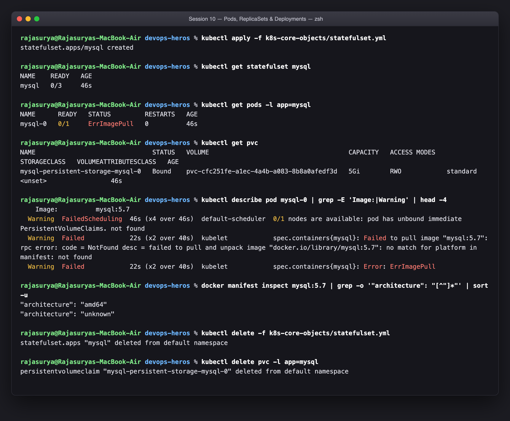

#### An honest note on `mysql:5.7` and Apple Silicon

The upstream manifest pins `image: mysql:5.7`. That tag is **published for
`linux/amd64` only** — there is no arm64 build:

```bash
docker manifest inspect mysql:5.7 | grep architecture   # -> amd64 only
docker manifest inspect mysql:8.0 | grep architecture   # -> amd64 AND arm64
```

So on this M-series Mac the `mysql-0` container cannot start. That does **not**
stop the StatefulSet lesson, because everything the task asks about happens
before the container runs:

- pods are created **one at a time, in order**, `mysql-0` first;
- names are **deterministic ordinals** — `mysql-0`, `mysql-1`, `mysql-2` — not
  random hashes like a ReplicaSet's;
- `volumeClaimTemplates` produced **one PVC per pod**
  (`mysql-persistent-storage-mysql-0`, `-mysql-1`, …), each bound to its own
  PersistentVolume.

It also demonstrates a real StatefulSet property by accident: because the
controller starts pods **sequentially**, `mysql-0` failing means `mysql-1` is
never even attempted. A ReplicaSet would have launched all three in parallel.

To show the same object working end to end on this hardware I wrote an
arm64-safe equivalent, [`statefulset-arm64.yml`](./statefulset-arm64.yml)
(nginx image, 128Mi volumes, same headless-service + `volumeClaimTemplates`
shape):

```bash
kubectl apply -f Rajasurya-24BCS10086/statefulset-arm64.yml
kubectl get pods -l app=web-ordinal
kubectl get pvc
```

```text
rajasurya@Rajasuryas-MacBook-Air devops-heros % kubectl apply -f Rajasurya-24BCS10086/statefulset-arm64.yml
service/web-ordinal created
statefulset.apps/web-ordinal created

rajasurya@Rajasuryas-MacBook-Air devops-heros % kubectl get statefulset web-ordinal
NAME          READY   AGE
web-ordinal   1/3     1s

rajasurya@Rajasuryas-MacBook-Air devops-heros % kubectl get pods -l app=web-ordinal -o wide
NAME            READY   STATUS              RESTARTS   AGE   IP            NODE       NOMINATED NODE   READINESS GATES
web-ordinal-0   1/1     Running             0          1s    10.244.0.27   minikube   <none>           <none>
web-ordinal-1   0/1     ContainerCreating   0          0s    <none>        minikube   <none>           <none>

rajasurya@Rajasuryas-MacBook-Air devops-heros % kubectl get pvc
NAME                 STATUS   VOLUME                                     CAPACITY   ACCESS MODES   STORAGECLASS   VOLUMEATTRIBUTESCLASS   AGE
data-web-ordinal-0   Bound    pvc-bccd6728-a989-43ee-b9fa-460456155e8b   128Mi      RWO            standard       <unset>                 1s
data-web-ordinal-1   Bound    pvc-700609c7-5eaa-4118-93b5-47e794208e65   128Mi      RWO            standard       <unset>                 0s

rajasurya@Rajasuryas-MacBook-Air devops-heros % kubectl delete pod web-ordinal-1   # StatefulSet must bring back the SAME name
pod "web-ordinal-1" deleted from default namespace

rajasurya@Rajasuryas-MacBook-Air devops-heros % kubectl get pods -l app=web-ordinal
NAME            READY   STATUS    RESTARTS   AGE
web-ordinal-0   1/1     Running   0          15s
web-ordinal-1   1/1     Running   0          12s
web-ordinal-2   1/1     Running   0          11s

rajasurya@Rajasuryas-MacBook-Air devops-heros % kubectl get pvc data-web-ordinal-1   # same PVC, reattached - nothing was reprovisioned
NAME                 STATUS   VOLUME                                     CAPACITY   ACCESS MODES   STORAGECLASS   VOLUMEATTRIBUTESCLASS   AGE
data-web-ordinal-1   Bound    pvc-700609c7-5eaa-4118-93b5-47e794208e65   128Mi      RWO            standard       <unset>                 14s

rajasurya@Rajasuryas-MacBook-Air devops-heros % kubectl delete -f Rajasurya-24BCS10086/statefulset-arm64.yml
service "web-ordinal" deleted from default namespace
statefulset.apps "web-ordinal" deleted from default namespace

rajasurya@Rajasuryas-MacBook-Air devops-heros % kubectl delete pvc -l app=web-ordinal
persistentvolumeclaim "data-web-ordinal-0" deleted from default namespace
persistentvolumeclaim "data-web-ordinal-1" deleted from default namespace
persistentvolumeclaim "data-web-ordinal-2" deleted from default namespace
```

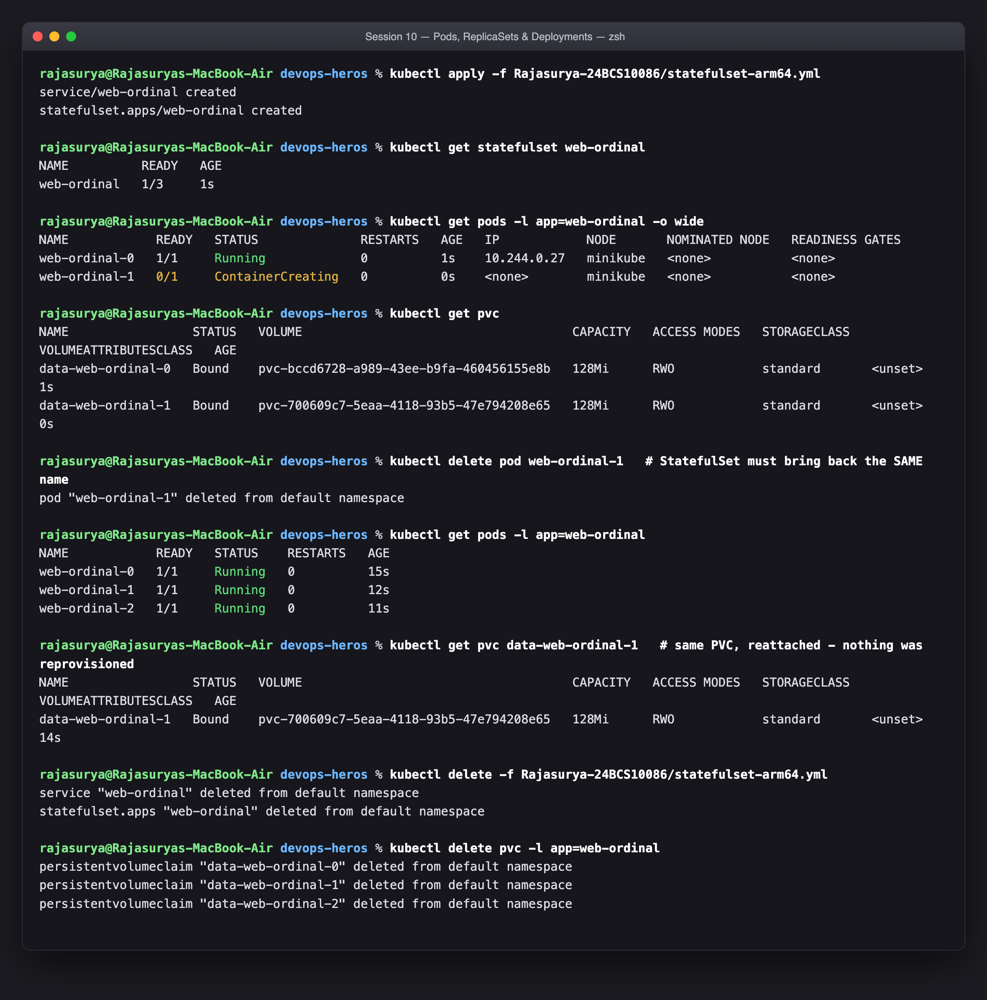

Here all three pods actually reach `Running` as `web-ordinal-0/1/2`, each with
its own bound PVC — and deleting `web-ordinal-1` brings back a pod with the
**same name** and the **same volume**, which is the whole point of a StatefulSet
and the exact opposite of the ReplicaSet behaviour above.

---

## Task 7 — DaemonSet architecture & host agent deployment

**Description:** Deploy a host-level agent DaemonSet and verify exactly one pod runs per eligible node.

```bash
kubectl apply -f daemonset/node-agent-ds.yaml
kubectl get ds node-logging-agent
kubectl get pods -l app=node-logging-agent -o wide
```

```text
rajasurya@Rajasuryas-MacBook-Air devops-heros % kubectl apply -f daemonset/node-agent-ds.yaml
daemonset.apps/node-logging-agent created

rajasurya@Rajasuryas-MacBook-Air devops-heros % kubectl get ds node-logging-agent
NAME                 DESIRED   CURRENT   READY   UP-TO-DATE   AVAILABLE   NODE SELECTOR   AGE
node-logging-agent   1         1         1       1            1           <none>          2s

rajasurya@Rajasuryas-MacBook-Air devops-heros % kubectl get pods -l app=node-logging-agent -o wide
NAME                       READY   STATUS    RESTARTS   AGE   IP            NODE       NOMINATED NODE   READINESS GATES
node-logging-agent-nzmsk   1/1     Running   0          2s    10.244.0.30   minikube   <none>           <none>

rajasurya@Rajasuryas-MacBook-Air devops-heros % kubectl get nodes --no-headers | wc -l   # one agent pod per node
       1

rajasurya@Rajasuryas-MacBook-Air devops-heros % kubectl logs -l app=node-logging-agent --tail=2

rajasurya@Rajasuryas-MacBook-Air devops-heros % kubectl get ds node-logging-agent -o jsonpath='replicas field present: {.spec.replicas}{"\n"}'
replicas field present: 

rajasurya@Rajasuryas-MacBook-Air devops-heros % kubectl delete -f daemonset/node-agent-ds.yaml
daemonset.apps "node-logging-agent" deleted from default namespace
```

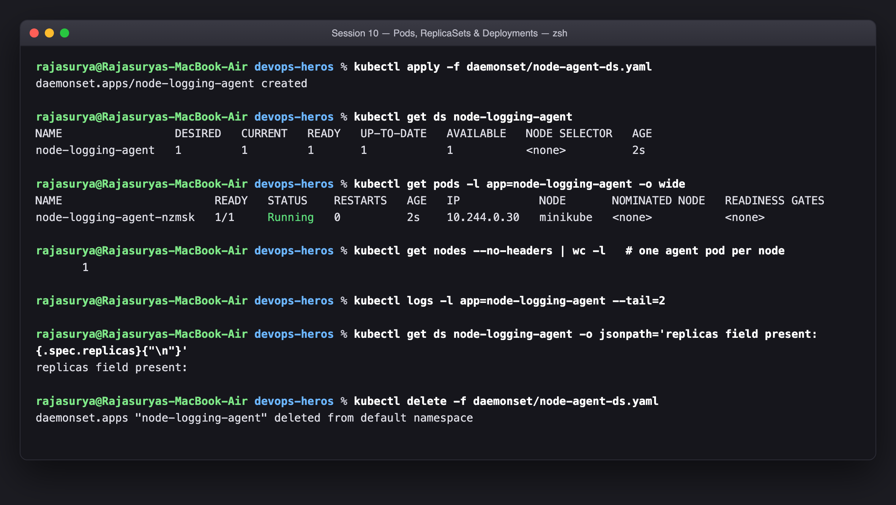

A DaemonSet has **no `replicas` field** — that is the giveaway. Its desired
count is not a number you choose, it is "however many eligible nodes exist".
`DESIRED`, `CURRENT` and `READY` all read **1** here because this cluster has
one node; add a node with `minikube node add` and the DaemonSet controller
schedules a pod onto it automatically, with no edit to the manifest.

By default DaemonSet pods also tolerate more taints than ordinary pods, which is
how agents still land on control-plane nodes that would otherwise repel
workloads. Real-world uses: `node-exporter` (metrics), Fluent Bit / Filebeat
(log shipping), Falco (runtime security), and the CNI and `kube-proxy`
components themselves.

---

## Task 8 — Deployment upgrades, rolling updates & instant rollbacks

**Description:** Roll 4 replicas from v1 to v2 with `maxSurge: 1` / `maxUnavailable: 0`, watch the rollout, then roll back.

```bash
kubectl apply -f deployment-v1.yaml -f service.yaml
kubectl rollout status deployment/app-rolling
kubectl apply -f deployment-v2.yaml
kubectl rollout status deployment/app-rolling
kubectl rollout history deployment/app-rolling
kubectl rollout undo deployment/app-rolling
```

```text
rajasurya@Rajasuryas-MacBook-Air devops-heros % grep -A4 'strategy:' deployment-v1.yaml
  strategy:
    type: RollingUpdate
    rollingUpdate:
      maxSurge: 1
      maxUnavailable: 0

rajasurya@Rajasuryas-MacBook-Air devops-heros % kubectl apply -f deployment-v1.yaml -f service.yaml
deployment.apps/app-rolling created
service/app-rolling-service created

rajasurya@Rajasuryas-MacBook-Air devops-heros % kubectl rollout status deployment/app-rolling
Waiting for deployment "app-rolling" rollout to finish: 0 out of 4 new replicas have been updated...
Waiting for deployment "app-rolling" rollout to finish: 0 of 4 updated replicas are available...
Waiting for deployment "app-rolling" rollout to finish: 1 of 4 updated replicas are available...
Waiting for deployment "app-rolling" rollout to finish: 2 of 4 updated replicas are available...
Waiting for deployment "app-rolling" rollout to finish: 3 of 4 updated replicas are available...
deployment "app-rolling" successfully rolled out

rajasurya@Rajasuryas-MacBook-Air devops-heros % kubectl get pods -l app=app-rolling --show-labels
NAME                           READY   STATUS    RESTARTS   AGE   LABELS
app-rolling-86d7d44d5b-52rgz   1/1     Running   0          8s    app=app-rolling,pod-template-hash=86d7d44d5b,version=v1
app-rolling-86d7d44d5b-gcw5g   1/1     Running   0          8s    app=app-rolling,pod-template-hash=86d7d44d5b,version=v1
app-rolling-86d7d44d5b-qkvbv   1/1     Running   0          8s    app=app-rolling,pod-template-hash=86d7d44d5b,version=v1
app-rolling-86d7d44d5b-xm65z   1/1     Running   0          8s    app=app-rolling,pod-template-hash=86d7d44d5b,version=v1

rajasurya@Rajasuryas-MacBook-Air devops-heros % curl -s http://192.168.64.2:30010 | grep -o 'VERSION: v[0-9]'
VERSION: v1

rajasurya@Rajasuryas-MacBook-Air devops-heros % kubectl apply -f deployment-v2.yaml
deployment.apps/app-rolling configured

rajasurya@Rajasuryas-MacBook-Air devops-heros % kubectl rollout status deployment/app-rolling
Waiting for deployment "app-rolling" rollout to finish: 1 out of 4 new replicas have been updated...
Waiting for deployment "app-rolling" rollout to finish: 1 out of 4 new replicas have been updated...
Waiting for deployment "app-rolling" rollout to finish: 1 out of 4 new replicas have been updated...
Waiting for deployment "app-rolling" rollout to finish: 2 out of 4 new replicas have been updated...
Waiting for deployment "app-rolling" rollout to finish: 2 out of 4 new replicas have been updated...
Waiting for deployment "app-rolling" rollout to finish: 2 out of 4 new replicas have been updated...
Waiting for deployment "app-rolling" rollout to finish: 2 out of 4 new replicas have been updated...
Waiting for deployment "app-rolling" rollout to finish: 3 out of 4 new replicas have been updated...
Waiting for deployment "app-rolling" rollout to finish: 3 out of 4 new replicas have been updated...
Waiting for deployment "app-rolling" rollout to finish: 3 out of 4 new replicas have been updated...
Waiting for deployment "app-rolling" rollout to finish: 3 out of 4 new replicas have been updated...
Waiting for deployment "app-rolling" rollout to finish: 1 old replicas are pending termination...
Waiting for deployment "app-rolling" rollout to finish: 1 old replicas are pending termination...
Waiting for deployment "app-rolling" rollout to finish: 1 old replicas are pending termination...
deployment "app-rolling" successfully rolled out

rajasurya@Rajasuryas-MacBook-Air devops-heros % kubectl get pods -l app=app-rolling --show-labels
NAME                           READY   STATUS        RESTARTS   AGE   LABELS
app-rolling-56bff6d88c-c6cw9   1/1     Running       0          6s    app=app-rolling,pod-template-hash=56bff6d88c,version=v2
app-rolling-56bff6d88c-jhz6s   1/1     Running       0          27s   app=app-rolling,pod-template-hash=56bff6d88c,version=v2
app-rolling-56bff6d88c-qzdxw   1/1     Running       0          19s   app=app-rolling,pod-template-hash=56bff6d88c,version=v2
app-rolling-56bff6d88c-zkmv5   1/1     Running       0          13s   app=app-rolling,pod-template-hash=56bff6d88c,version=v2
app-rolling-86d7d44d5b-gcw5g   1/1     Terminating   0          35s   app=app-rolling,pod-template-hash=86d7d44d5b,version=v1

rajasurya@Rajasuryas-MacBook-Air devops-heros % curl -s http://192.168.64.2:30010 | grep -o 'VERSION: v[0-9]'
VERSION: v2

rajasurya@Rajasuryas-MacBook-Air devops-heros % kubectl get rs -l app=app-rolling
NAME                     DESIRED   CURRENT   READY   AGE
app-rolling-56bff6d88c   4         4         4       27s
app-rolling-86d7d44d5b   0         0         0       35s

rajasurya@Rajasuryas-MacBook-Air devops-heros % kubectl rollout history deployment/app-rolling
deployment.apps/app-rolling 
REVISION  CHANGE-CAUSE
1         <none>
2         <none>


rajasurya@Rajasuryas-MacBook-Air devops-heros % kubectl rollout undo deployment/app-rolling
Warning: resource deployments/app-rolling was previously managed with 'kubectl apply'. Rolling back will not update the kubectl.kubernetes.io/last-applied-configuration annotation, which may cause unexpected behavior on future 'kubectl apply' operations. Consider using 'kubectl apply' with your previous configuration file instead.
deployment.apps/app-rolling rolled back

rajasurya@Rajasuryas-MacBook-Air devops-heros % kubectl rollout status deployment/app-rolling
Waiting for deployment "app-rolling" rollout to finish: 1 out of 4 new replicas have been updated...
Waiting for deployment "app-rolling" rollout to finish: 1 out of 4 new replicas have been updated...
Waiting for deployment "app-rolling" rollout to finish: 1 out of 4 new replicas have been updated...
Waiting for deployment "app-rolling" rollout to finish: 2 out of 4 new replicas have been updated...
Waiting for deployment "app-rolling" rollout to finish: 2 out of 4 new replicas have been updated...
Waiting for deployment "app-rolling" rollout to finish: 2 out of 4 new replicas have been updated...
Waiting for deployment "app-rolling" rollout to finish: 2 out of 4 new replicas have been updated...
Waiting for deployment "app-rolling" rollout to finish: 3 out of 4 new replicas have been updated...
Waiting for deployment "app-rolling" rollout to finish: 3 out of 4 new replicas have been updated...
Waiting for deployment "app-rolling" rollout to finish: 3 out of 4 new replicas have been updated...
Waiting for deployment "app-rolling" rollout to finish: 3 out of 4 new replicas have been updated...
Waiting for deployment "app-rolling" rollout to finish: 1 old replicas are pending termination...
Waiting for deployment "app-rolling" rollout to finish: 1 old replicas are pending termination...
Waiting for deployment "app-rolling" rollout to finish: 1 old replicas are pending termination...
deployment "app-rolling" successfully rolled out

rajasurya@Rajasuryas-MacBook-Air devops-heros % curl -s http://192.168.64.2:30010 | grep -o 'VERSION: v[0-9]'
VERSION: v1

rajasurya@Rajasuryas-MacBook-Air devops-heros % kubectl rollout history deployment/app-rolling
deployment.apps/app-rolling 
REVISION  CHANGE-CAUSE
2         <none>
3         <none>


rajasurya@Rajasuryas-MacBook-Air devops-heros % kubectl delete -f service.yaml -f deployment-v1.yaml
service "app-rolling-service" deleted from default namespace
deployment.apps "app-rolling" deleted from default namespace
```

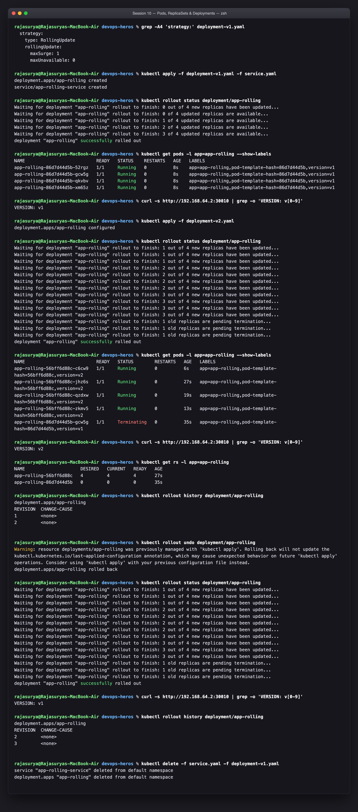

### What the rollout output is telling you

`maxUnavailable: 0` is the important setting. Read the `rollout status` lines in
order and you can see Kubernetes refusing to ever drop below 4 serving pods:

- it first creates a **5th** pod (that is `maxSurge: 1` being spent),
- waits for it to pass its **readiness probe**,
- and only *then* terminates one old pod.

Hence lines like `2 out of 4 new replicas have been updated` alongside
`3 old replicas are pending termination`. The cost of this safety is that both
versions serve traffic simultaneously for the duration, so the app must be
backward/forward compatible.

`kubectl rollout history` shows the revisions. **Rollback is not a redeploy** —
the Deployment keeps the old ReplicaSet around, scaled to 0, so
`kubectl rollout undo` just scales the old one back up and the new one down.
That is why it is near-instant and needs no registry access. Notice the revision
numbers do not go backwards: undoing to revision 1 creates **revision 3** with
revision 1's pod template.

---

## Task 9 — Real-world troubleshooting scenarios

### Drill 1 — a rollout halted by an unresolvable image tag

**Description:** Diagnose a stalled rollout caused by a bad image tag, confirm the old pods stay healthy, then recover.

```bash
kubectl apply -f troubleshooting/broken-image.yaml
kubectl rollout status deployment/yatri-backend --timeout=30s
kubectl get pods -l app=yatri-backend
kubectl rollout undo deployment/yatri-backend
```

```text
rajasurya@Rajasuryas-MacBook-Air devops-heros % kubectl apply -f Rajasurya-24BCS10086/yatri-backend-v1.yaml
deployment.apps/yatri-backend created

rajasurya@Rajasuryas-MacBook-Air devops-heros % kubectl get pods -l app=yatri-backend
NAME                             READY   STATUS    RESTARTS   AGE
yatri-backend-7dc6f9b865-62vth   1/1     Running   0          7s
yatri-backend-7dc6f9b865-g9rhd   1/1     Running   0          7s
yatri-backend-7dc6f9b865-ztm6r   1/1     Running   0          7s

rajasurya@Rajasuryas-MacBook-Air devops-heros % kubectl apply -f troubleshooting/broken-image.yaml
deployment.apps/yatri-backend configured

rajasurya@Rajasuryas-MacBook-Air devops-heros % kubectl rollout status deployment/yatri-backend --timeout=40s
Waiting for deployment "yatri-backend" rollout to finish: 1 out of 3 new replicas have been updated...
error: timed out waiting for the condition

rajasurya@Rajasuryas-MacBook-Air devops-heros % kubectl get pods -l app=yatri-backend
NAME                             READY   STATUS         RESTARTS   AGE
yatri-backend-77dbb657cd-plwxx   0/1     ErrImagePull   0          40s
yatri-backend-7dc6f9b865-62vth   1/1     Running        0          47s
yatri-backend-7dc6f9b865-g9rhd   1/1     Running        0          47s
yatri-backend-7dc6f9b865-ztm6r   1/1     Running        0          47s

rajasurya@Rajasuryas-MacBook-Air devops-heros % kubectl get deployment yatri-backend
NAME            READY   UP-TO-DATE   AVAILABLE   AGE
yatri-backend   3/3     1            3           47s

rajasurya@Rajasuryas-MacBook-Air devops-heros % kubectl describe pod -l version=broken-v3 | grep -E 'Failed|Back-off' | head -3
  Warning  Failed     22s (x2 over 38s)  kubelet            spec.containers{backend}: Failed to pull image "yatri-backend:non-existent-tag-v999": failed to pull and unpack image "docker.io/library/yatri-backend:non-existent-tag-v999": failed to resolve reference "docker.io/library/yatri-backend:non-existent-tag-v999": pull access denied, repository does not exist or may require authorization: server message: insufficient_scope: authorization failed
  Warning  Failed     22s (x2 over 38s)  kubelet            spec.containers{backend}: Error: ErrImagePull
  Normal   BackOff    12s (x2 over 37s)  kubelet            spec.containers{backend}: Back-off pulling image "yatri-backend:non-existent-tag-v999"

rajasurya@Rajasuryas-MacBook-Air devops-heros % kubectl rollout undo deployment/yatri-backend
Warning: resource deployments/yatri-backend was previously managed with 'kubectl apply'. Rolling back will not update the kubectl.kubernetes.io/last-applied-configuration annotation, which may cause unexpected behavior on future 'kubectl apply' operations. Consider using 'kubectl apply' with your previous configuration file instead.
deployment.apps/yatri-backend rolled back

rajasurya@Rajasuryas-MacBook-Air devops-heros % kubectl get pods -l app=yatri-backend
NAME                             READY   STATUS        RESTARTS   AGE
yatri-backend-77dbb657cd-plwxx   0/1     Terminating   0          41s
yatri-backend-7dc6f9b865-62vth   1/1     Running       0          48s
yatri-backend-7dc6f9b865-g9rhd   1/1     Running       0          48s
yatri-backend-7dc6f9b865-ztm6r   1/1     Running       0          48s

rajasurya@Rajasuryas-MacBook-Air devops-heros % kubectl delete deployment yatri-backend
deployment.apps "yatri-backend" deleted from default namespace
```

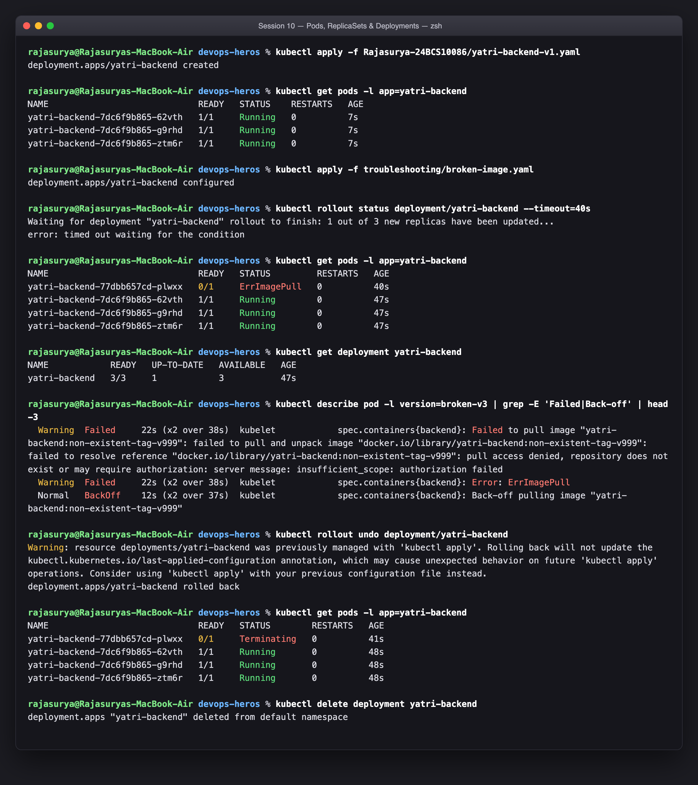

The reassuring part is what *didn't* break. With `maxUnavailable: 0`, the
surged pod goes `ImagePullBackOff`, never becomes `Ready`, and therefore the
Deployment **refuses to terminate any old pod**. `rollout status` times out
instead of succeeding, and the service keeps serving from the healthy old
ReplicaSet. A failed deploy became a stalled deploy rather than an outage —
which is precisely what that setting is for.

`kubectl rollout undo` then removes the broken revision. In a real incident the
sequence is exactly this: `rollout status` (is it stuck?) → `get pods` (which
pods are unhealthy?) → `describe pod` (why?) → `rollout undo` (stop the
bleeding), and only then fix the tag.

### Drill 2 — the immutable selector mismatch

**Description:** Diagnose the API server rejecting a Deployment whose `spec.selector.matchLabels` doesn't match its pod template labels, then fix it.

```bash
kubectl apply -f troubleshooting/selector-mismatch.yaml
```

```text
rajasurya@Rajasuryas-MacBook-Air devops-heros % grep -B2 -A8 'selector:' troubleshooting/selector-mismatch.yaml | head -18
spec:
  replicas: 1
  selector:
    matchLabels:
      app: correct-app-name
  template:
    metadata:
      labels:
        # BUG: Label does not match selector.matchLabels above!
        app: wrong-app-name
    spec:

rajasurya@Rajasuryas-MacBook-Air devops-heros % kubectl apply -f troubleshooting/selector-mismatch.yaml
The Deployment "selector-error-demo" is invalid: spec.template.metadata.labels: Invalid value: {"app":"wrong-app-name"}: `selector` does not match template `labels`

rajasurya@Rajasuryas-MacBook-Air devops-heros % kubectl get deployment selector-error-demo
Error from server (NotFound): deployments.apps "selector-error-demo" not found
```

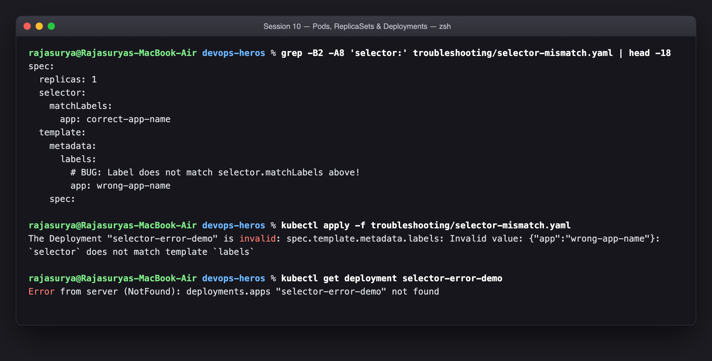

The manifest asks for `selector.matchLabels.app: correct-app-name` but labels
its pods `app: wrong-app-name`. This one fails differently from every other
error in this session: **nothing was ever created.** The rejection comes from
the API server's *validation* step, before anything reaches `etcd` — so there is
no pod to describe and no event to read, just a non-zero exit from `kubectl`.

It has to be rejected, because a Deployment manages pods by *finding them with
its selector*. A Deployment whose selector cannot match its own pods would
create pods, fail to find them, and create more — forever. Kubernetes closes
that loop at admission time.

`spec.selector` is also **immutable** after creation: you cannot repoint an
existing Deployment at different labels, you must delete and recreate it.

The fix is to make the two agree:

```diff
   template:
     metadata:
       labels:
-        app: wrong-app-name
+        app: correct-app-name
```

```text
rajasurya@Rajasuryas-MacBook-Air devops-heros % diff troubleshooting/selector-mismatch.yaml Rajasurya-24BCS10086/selector-mismatch-fixed.yaml
2c2
< # INTENTIONALLY BROKEN MANIFEST FOR IMMUTABLE SELECTOR DRILL
---
> # CORRECTED VERSION of troubleshooting/selector-mismatch.yaml
18,19c18,19
<         # BUG: Label does not match selector.matchLabels above!
<         app: wrong-app-name
---
>         # FIXED: label now matches spec.selector.matchLabels
>         app: correct-app-name

rajasurya@Rajasuryas-MacBook-Air devops-heros % kubectl apply -f Rajasurya-24BCS10086/selector-mismatch-fixed.yaml
deployment.apps/selector-error-demo created

rajasurya@Rajasuryas-MacBook-Air devops-heros % kubectl get deployment selector-error-demo
NAME                  READY   UP-TO-DATE   AVAILABLE   AGE
selector-error-demo   1/1     1            1           1s

rajasurya@Rajasuryas-MacBook-Air devops-heros % kubectl get pods -l app=correct-app-name
NAME                                   READY   STATUS    RESTARTS   AGE
selector-error-demo-54996d6787-s7f9b   1/1     Running   0          1s

rajasurya@Rajasuryas-MacBook-Air devops-heros % kubectl delete -f Rajasurya-24BCS10086/selector-mismatch-fixed.yaml
deployment.apps "selector-error-demo" deleted from default namespace
```

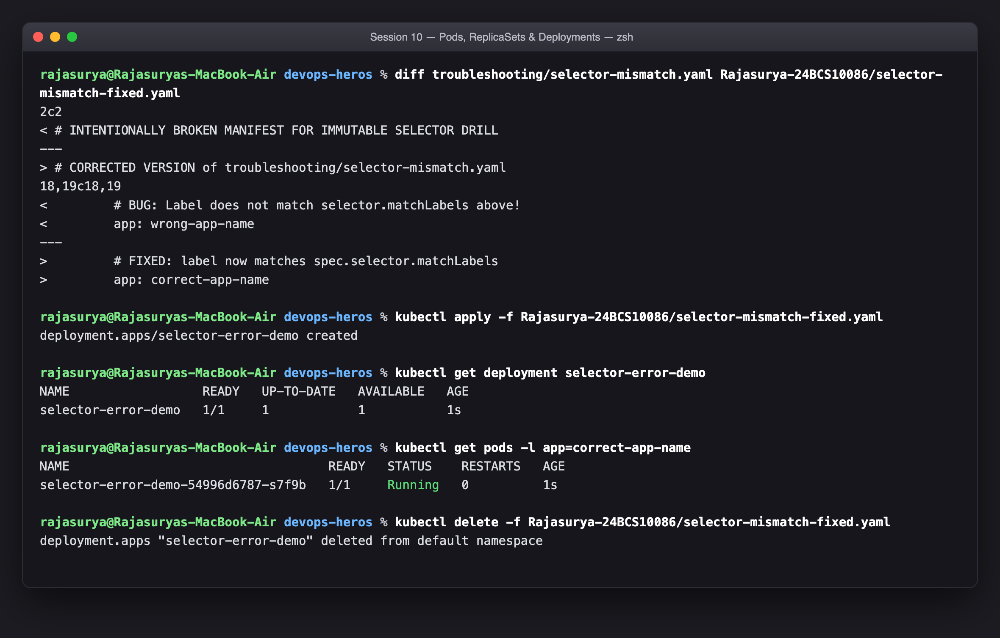

---

## Task 10 — Theoretical & architectural writeup

### 10.1 The four ports, clarified

The reason these are confusing is that they belong to **three different
objects** and are read by **three different components**.

```
   external client
        |
        v
 [ nodePort: 30010 ]   <- on EVERY node's IP; range 30000-32767; Service object
        |                 (programmed by kube-proxy)
        v
 [ port: 80 ]          <- the Service's own ClusterIP:port, the in-cluster address
        |                 (this is what other pods dial)
        v
 [ targetPort: 80 ]    <- the port ON THE POD the Service forwards to
        |                 (must match what the app really listens on)
        v
 [ containerPort: 80 ] <- declared in the PodSpec; DOCUMENTATION ONLY
                          (the app listens whether or not you declare it)
```

| Port | Lives on | Who reads it | Notes |
|---|---|---|---|
| `containerPort` | Pod → container | nobody, functionally | **Purely informational.** Omitting it does not block traffic; the process listens regardless. Useful for readers and for named ports. |
| `targetPort` | Service | kube-proxy | The pod-side destination. Defaults to `port` if omitted. Can be a **name** (`targetPort: web`) that resolves against `containerPort`'s name — which is how you change the pod's port without editing the Service. |
| `port` | Service | other pods | The Service's own port on its ClusterIP. `curl http://my-svc:80` uses this. |
| `nodePort` | Service (`type: NodePort`/`LoadBalancer`) | external clients | Opened on **every** node, not just the ones running pods. Restricted to `30000–32767`. Auto-assigned if you don't pick one. |

A concrete mapping from this session's `01-rolling-update/service.yaml`:
`nodePort: 30010` → `port: 80` → `targetPort: 80` → nginx's `containerPort: 80`.

### 10.2 Labels vs Selectors

- A **label** is a key/value pair *attached to* an object: `app: nginx`,
  `version: v1`, `slot: blue`. It is metadata, and an object can carry many.
- A **selector** is a *query over* labels, written by something that needs to
  find a set of objects: `selector: {app: nginx}`.

Labels are the data; selectors are the query. Nothing in Kubernetes points at a
pod by name — Services, ReplicaSets, Deployments and DaemonSets all find their
pods by selector. That indirection is what lets a pod be replaced without
reconfiguring anything, and it is the mechanism behind Task 11's blue-green
cutover (flip one selector, redirect all traffic) and Task 12's canary (one
selector deliberately matching two deployments).

Two forms exist:

```yaml
selector:                      # equality-based (Services, ReplicaSets)
  matchLabels:
    app: nginx
selector:                      # set-based (Deployments, more expressive)
  matchExpressions:
    - {key: version, operator: In, values: [v1, v2]}
```

### 10.3 The four deployment strategies

| Strategy | How it works | Downtime | Extra capacity | Both versions live? | Use when |
|---|---|---|---|---|---|
| **RollingUpdate** (default) | Replace pods incrementally, gated by readiness | None | `maxSurge` only (~1 pod) | **Yes** — unavoidably | The normal case; app tolerates mixed versions |
| **Recreate** | Kill *all* old pods, then start new ones | **Yes**, a real outage | None | No — guaranteed | Incompatible schema change, or a singleton that must not run twice |
| **Blue-Green** | Two full environments; flip a Service selector | None | **2×** — double the pods | No (instant switch) | You need instant, total rollback |
| **Canary** | Send a small % to the new version, watch metrics, then widen | None | Small (one extra pod) | Yes, deliberately | You want production signal before committing |

The trade-off axis is *capacity vs. confidence*: rolling update is cheap but
mixes versions, blue-green costs 2× but switches atomically, canary costs almost
nothing extra but needs real observability to be worth anything.

### 10.4 `maxSurge` vs `maxUnavailable` — the arithmetic

Both accept an absolute number **or** a percentage of `spec.replicas`.

- `maxSurge` — how many pods above the desired count may exist mid-rollout.
  Sets the **ceiling**: `replicas + maxSurge`.
- `maxUnavailable` — how many pods below the desired count may be unavailable.
  Sets the **floor**: `replicas − maxUnavailable`.

For this session's `deployment-v1.yaml` (`replicas: 4, maxSurge: 1, maxUnavailable: 0`):

```
ceiling = 4 + 1 = 5 pods may exist at once
floor   = 4 - 0 = 4 pods must stay available    -> 100% capacity, zero downtime
```

Percentages round in opposite directions, deliberately conservative both ways:
**`maxSurge` rounds up, `maxUnavailable` rounds down.**

| `replicas` | `maxSurge` | `maxUnavailable` | Ceiling | Floor |
|---|---|---|---|---|
| 4 | `1` | `0` | 5 | 4 |
| 10 | `25%` → 3 (2.5 ↑) | `25%` → 2 (2.5 ↓) | 13 | 8 |
| 3 | `25%` → 1 (0.75 ↑) | `25%` → 0 (0.75 ↓) | 4 | 3 |
| 4 | `50%` → 2 | `50%` → 2 | 6 | 2 |

Defaults are `25%` / `25%`. One rule: **both cannot be 0** — with no surge
allowed and no unavailability allowed, there is no legal move, so the API server
rejects it.

### 10.5 Resource requests vs limits, and GB vs GiB

| | `requests` | `limits` |
|---|---|---|
| Used by | the **scheduler** | the **kubelet / cgroups** on the node |
| Meaning | guaranteed minimum; reserved on the node | hard ceiling at runtime |
| Over CPU | (not enforced) | container is **throttled** — slow, survives |
| Over memory | (not enforced) | container is **OOM-killed** — dies, restarts |

The asymmetry matters: CPU is *compressible* (you get less of it), memory is
*not* (there is nothing to give back, so the kernel kills the process). Task 5's
`02-pending.yaml` shows the requests side — a 9Gi **request** made the pod
unschedulable, and no container was ever created.

Requests are also what the three QoS classes are derived from:

- **Guaranteed** — requests == limits for every container. Evicted last.
- **Burstable** — requests < limits. (Everything in this session.)
- **BestEffort** — neither set. Evicted first.

**Units.** Kubernetes accepts both SI (decimal) and binary suffixes, and they
are not the same number:

| Suffix | Meaning | Bytes |
|---|---|---|
| `M` | megabyte, 10⁶ | 1,000,000 |
| `Mi` | mebibyte, 2²⁰ | 1,048,576 |
| `G` | gigabyte, 10⁹ | 1,000,000,000 |
| `Gi` | gibibyte, 2³⁰ | 1,073,741,824 |

So `1Gi` is about **7.4% more memory** than `1G`. Always write `Mi`/`Gi` for
memory — it matches how the kernel and `free` actually count, and it is what
every example in the Kubernetes docs uses. A classic bug is writing `512M`
intending `512Mi` and getting an OOM kill 12 MiB early.

CPU is unrelated to either: `1` = one core, and `m` means **milli**cores, so
`500m` = half a core and `30m` = 3% of a core.

---

## Task 11 — Blue-Green deployment & instant selector cutover

**Description:** Run Blue (v1) and Green (v2) side by side, route live traffic to Blue, flip the Service selector to Green, verify the switch, then roll back instantly.

```bash
kubectl apply -f deployment-blue.yaml -f deployment-green.yaml
kubectl apply -f service-blue.yaml            # live traffic -> BLUE
curl -s http://$(minikube ip):30020 | grep ENVIRONMENT
kubectl apply -f service-green.yaml           # THE SWITCH -> GREEN
curl -s http://$(minikube ip):30020 | grep ENVIRONMENT
kubectl apply -f service-blue.yaml            # instant rollback -> BLUE
```

```text
rajasurya@Rajasuryas-MacBook-Air devops-heros % kubectl apply -f deployment-blue.yaml -f deployment-green.yaml
deployment.apps/app-blue created
deployment.apps/app-green created

rajasurya@Rajasuryas-MacBook-Air devops-heros % kubectl get pods -l app=myapp --show-labels
NAME                        READY   STATUS    RESTARTS   AGE   LABELS
app-blue-5c69d7785c-7rzbq   1/1     Running   0          12s   app=myapp,pod-template-hash=5c69d7785c,slot=blue,version=v1
app-blue-5c69d7785c-7sc22   1/1     Running   0          12s   app=myapp,pod-template-hash=5c69d7785c,slot=blue,version=v1
app-blue-5c69d7785c-m7pmm   1/1     Running   0          12s   app=myapp,pod-template-hash=5c69d7785c,slot=blue,version=v1
app-green-84df7f978-8vbtm   1/1     Running   0          12s   app=myapp,pod-template-hash=84df7f978,slot=green,version=v2
app-green-84df7f978-mgfp5   1/1     Running   0          12s   app=myapp,pod-template-hash=84df7f978,slot=green,version=v2
app-green-84df7f978-qxwzk   1/1     Running   0          12s   app=myapp,pod-template-hash=84df7f978,slot=green,version=v2

rajasurya@Rajasuryas-MacBook-Air devops-heros % kubectl apply -f service-blue.yaml
service/myapp-service created

rajasurya@Rajasuryas-MacBook-Air devops-heros % kubectl describe svc myapp-service | grep -E 'Selector|NodePort|Endpoints'
Selector:                 app=myapp,slot=blue
Type:                     NodePort
NodePort:                 http  30020/TCP
Endpoints:                10.244.0.89:80,10.244.0.90:80,10.244.0.87:80

rajasurya@Rajasuryas-MacBook-Air devops-heros % curl -s http://192.168.64.2:30020 | grep -o '[A-Z]* ENVIRONMENT'
BLUE ENVIRONMENT

rajasurya@Rajasuryas-MacBook-Air devops-heros % grep -A3 'selector:' service-green.yaml | tail -3
    app: myapp
    slot: green    # <-- NOW routing to GREEN (v2)
  ports:

rajasurya@Rajasuryas-MacBook-Air devops-heros % kubectl apply -f service-green.yaml   # THE SWITCH - one selector line
service/myapp-service configured

rajasurya@Rajasuryas-MacBook-Air devops-heros % kubectl describe svc myapp-service | grep -E 'Selector|Endpoints'
Selector:                 app=myapp,slot=green
Endpoints:                10.244.0.91:80,10.244.0.88:80,10.244.0.92:80

rajasurya@Rajasuryas-MacBook-Air devops-heros % curl -s http://192.168.64.2:30020 | grep -o '[A-Z]* ENVIRONMENT'
GREEN ENVIRONMENT

rajasurya@Rajasuryas-MacBook-Air devops-heros % kubectl apply -f service-blue.yaml    # instant rollback
service/myapp-service configured

rajasurya@Rajasuryas-MacBook-Air devops-heros % curl -s http://192.168.64.2:30020 | grep -o '[A-Z]* ENVIRONMENT'
BLUE ENVIRONMENT

rajasurya@Rajasuryas-MacBook-Air devops-heros % kubectl delete -f service-blue.yaml -f deployment-blue.yaml -f deployment-green.yaml
service "myapp-service" deleted from default namespace
deployment.apps "app-blue" deleted from default namespace
deployment.apps "app-green" deleted from default namespace
```

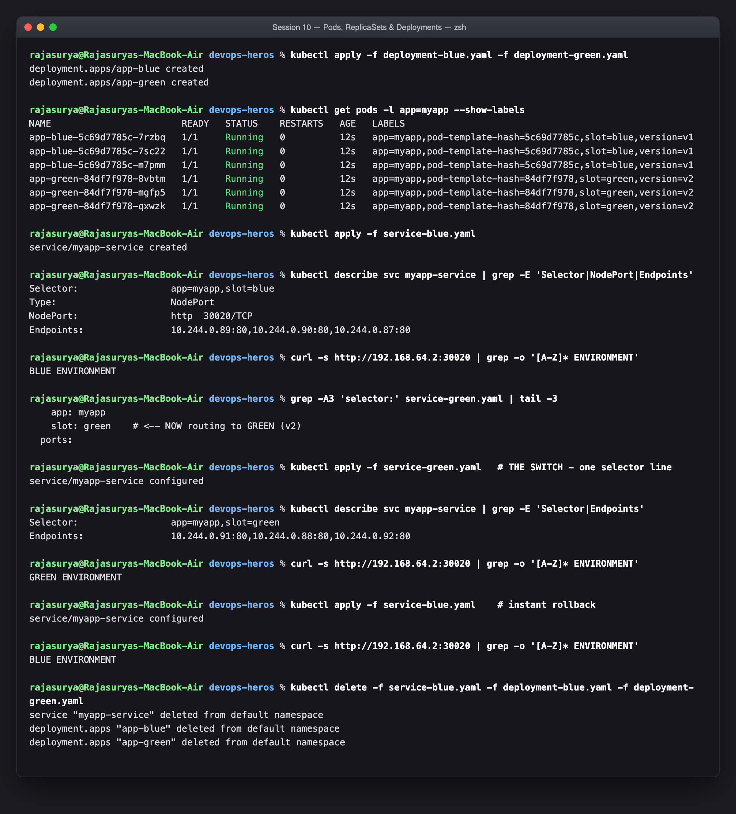

Both deployments carry `app: myapp` but differ on `slot: blue` / `slot: green`,
and the Service selects on **both** labels. So the cutover is a one-line change
to `spec.selector` — and because `EndpointSlice`s are recomputed the moment the
Service object changes, the endpoint IPs swap from the three Blue pod IPs to the
three Green ones in a single step. There is **no intermediate state where both
versions serve**, which is the property a rolling update cannot give you.

Rollback is the same operation in reverse and just as fast, because the Blue
pods were never deleted — they were only removed from the endpoint list. That is
also the cost: you are paying for **2× the pods** for the whole overlap window.
Clean up the old slot only once you are confident.

---

## Task 12 — Canary deployment & pod-ratio traffic splitting

**Description:** Run 9 stable pods and 1 canary pod behind one Service for a ~90/10 split, verify with a request loop, shift to 70/30, then roll the canary back to zero.

```bash
kubectl apply -f deployment-stable.yaml -f service.yaml   # 9 pods, v1
kubectl apply -f deployment-canary.yaml                   # 1 pod,  v2
for i in $(seq 1 20); do curl -s http://$(minikube ip):30030 | grep -o "STABLE v1\|CANARY v2"; done
kubectl scale deployment app-canary --replicas=3
kubectl scale deployment app-stable --replicas=7
kubectl scale deployment app-canary --replicas=0          # abort the canary
```

```text
rajasurya@Rajasuryas-MacBook-Air devops-heros % kubectl apply -f deployment-stable.yaml -f service.yaml
deployment.apps/app-stable created
service/myapp-canary-service created

rajasurya@Rajasuryas-MacBook-Air devops-heros % kubectl apply -f deployment-canary.yaml
deployment.apps/app-canary created

rajasurya@Rajasuryas-MacBook-Air devops-heros % kubectl get deploy app-stable app-canary
NAME         READY   UP-TO-DATE   AVAILABLE   AGE
app-stable   9/9     9            9           14s
app-canary   1/1     1            1           6s

rajasurya@Rajasuryas-MacBook-Air devops-heros % kubectl get endpoints myapp-canary-service -o jsonpath='{.subsets[0].addresses[*].ip}{"\n"}' | tr ' ' '\n' | wc -l
Warning: v1 Endpoints is deprecated in v1.33+; use discovery.k8s.io/v1 EndpointSlice
      10

rajasurya@Rajasuryas-MacBook-Air devops-heros % for i in $(seq 1 20); do curl -s http://192.168.64.2:30030 | grep -o 'STABLE v1\|CANARY v2'; done | sort | uniq -c
   1 CANARY v2
  19 STABLE v1

rajasurya@Rajasuryas-MacBook-Air devops-heros % kubectl scale deployment app-canary --replicas=3
deployment.apps/app-canary scaled

rajasurya@Rajasuryas-MacBook-Air devops-heros % kubectl scale deployment app-stable --replicas=7
deployment.apps/app-stable scaled

rajasurya@Rajasuryas-MacBook-Air devops-heros % kubectl get deploy app-stable app-canary
NAME         READY   UP-TO-DATE   AVAILABLE   AGE
app-stable   7/7     7            7           27s
app-canary   3/3     3            3           19s

rajasurya@Rajasuryas-MacBook-Air devops-heros % for i in $(seq 1 20); do curl -s http://192.168.64.2:30030 | grep -o 'STABLE v1\|CANARY v2'; done | sort | uniq -c   # now ~70/30
   7 CANARY v2
  13 STABLE v1

rajasurya@Rajasuryas-MacBook-Air devops-heros % kubectl scale deployment app-canary --replicas=0   # abort the canary
deployment.apps/app-canary scaled

rajasurya@Rajasuryas-MacBook-Air devops-heros % kubectl scale deployment app-stable --replicas=9
deployment.apps/app-stable scaled

rajasurya@Rajasuryas-MacBook-Air devops-heros % for i in $(seq 1 10); do curl -s http://192.168.64.2:30030 | grep -o 'STABLE v1\|CANARY v2'; done | sort | uniq -c   # 100% stable
  10 STABLE v1

rajasurya@Rajasuryas-MacBook-Air devops-heros % kubectl delete -f service.yaml -f deployment-canary.yaml -f deployment-stable.yaml
service "myapp-canary-service" deleted from default namespace
deployment.apps "app-canary" deleted from default namespace
deployment.apps "app-stable" deleted from default namespace
```

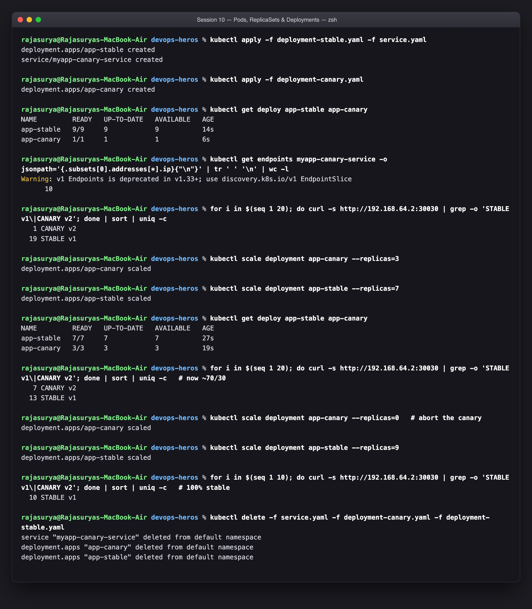

The mechanism is deliberately crude and worth understanding: the Service selects
only on the **shared** label `app: myapp-canary`, which both deployments carry.
So all 10 pods land in one endpoint list and `kube-proxy` spreads connections
across them roughly evenly. **The traffic split is just the pod-count ratio** —
9:1 ≈ 90/10, then 7:3 ≈ 70/30.

Two honest limitations of doing it this way:

1. **Granularity is bounded by pod count.** You cannot express 1% without 100
   pods. For fine-grained or header/cookie-based splitting you need an Ingress
   controller with canary annotations, or a service mesh (Istio, Linkerd) that
   splits at the request layer instead of the endpoint layer.
2. **It is per-connection, not per-user.** A given client can hit stable on one
   request and canary on the next, so the app must tolerate that. Session
   affinity (`sessionAffinity: ClientIP`) helps but is coarse.

Rollback is simply `--replicas=0` on the canary: its pods leave the endpoint
list and 100% of traffic returns to stable, with no image pull and no rollout.

---

## Task 13 — Recreate deployment & downtime outage demonstration

**Description:** Deploy 3 replicas with `strategy.type: Recreate`, run a polling loop through the update, and capture the deliberate outage window.

```bash
kubectl apply -f deployment-v1.yaml -f service.yaml
# polling loop in another terminal:
while true; do curl -s --connect-timeout 1 http://$(minikube ip):30040 \
  | grep -o 'VERSION: [^<]*' || echo "[OUTAGE] connection refused / 0 pods alive"; sleep 0.5; done
kubectl apply -f deployment-v2.yaml
kubectl rollout undo deployment/app-recreate
```

```text
rajasurya@Rajasuryas-MacBook-Air devops-heros % grep -A2 'strategy:' deployment-v1.yaml
  # Recreate strategy: Kubernetes terminates ALL old pods before creating any new pods.
  # This guarantees no two versions run concurrently, but causes a brief downtime.
  strategy:
    type: Recreate
  selector:

rajasurya@Rajasuryas-MacBook-Air devops-heros % kubectl apply -f deployment-v1.yaml -f service.yaml
deployment.apps/app-recreate created
service/app-recreate-service created
```

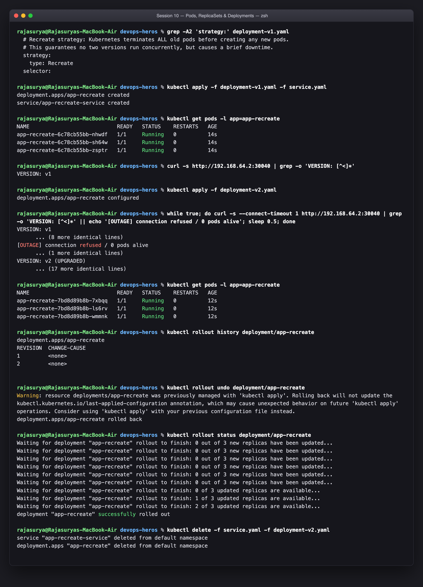

The outage is real and it is **the point of the strategy, not a bug**. With
`type: Recreate` the Deployment controller scales the old ReplicaSet to **0 and
waits for every pod to be gone** before scaling the new one up. For that window
the Service has zero endpoints, so connections are refused — visible as the
consecutive `[OUTAGE]` lines between the last `v1` and the first `v2`.

Why you would ever choose this:

- **A schema migration that v1 and v2 cannot both survive.** A rolling update
  guarantees mixed versions; `Recreate` guarantees they never coexist.
- **A singleton that must not run twice** — a leader process, an exclusive
  lock-holder, a `ReadWriteOnce` volume that only one pod can mount.

`rollout undo` back to v1 has the same cost — a second outage — because the
strategy, not the direction, is what forces the full stop. So `Recreate` is a
correctness tool bought with availability, which is why the default is
`RollingUpdate`.

---

## Summary — what each task demonstrated

| # | Task | Result |
|---|---|---|
| 1 | Cluster health | Control plane + CoreDNS reachable, node `Ready` |
| 2 | Pod deploy/inspect/delete | `1/1 Running`, pod IP `10.244.0.x`, logs read, deleted |
| 3 | `ErrImagePull` → `ImagePullBackOff` | API write succeeded; kubelet failed and backed off |
| 4 | Transient phases | `Pending` → `ContainerCreating` → `Running` → `Completed` (`Succeeded`, exit 0) |
| 5 | 12-manifest lifecycle lab | All states, 3 probe types, init container, `2/2` sidecar, `SIGTERM` trap |
| 6 | ReplicaSet / StatefulSet | Self-healing with new identity vs. stable ordinals + per-pod PVC |
| 7 | DaemonSet | One agent pod per node, no `replicas` field |
| 8 | Rolling update + rollback | 4→5→4 pods, never below 4 available; `undo` to a new revision |
| 9 | Troubleshooting drills | Stalled rollout (old pods safe) and an admission-time rejection |
| 10 | Theory writeup | Ports, labels/selectors, 4 strategies, surge math, requests/limits, GB vs GiB |
| 11 | Blue-green | Endpoints swapped atomically by flipping one selector |
| 12 | Canary | 90/10 then 70/30 by pod ratio; aborted with `--replicas=0` |
| 13 | Recreate | Measured outage window between v1 teardown and v2 readiness |

### Known environment deviations

| Manifest | Issue | How it was handled |
|---|---|---|
| `k8s-core-objects/statefulset.yml` | `mysql:5.7` has no arm64 build | Ran it anyway and documented the real failure; added [`statefulset-arm64.yml`](./statefulset-arm64.yml) to demonstrate the same concepts working |
| NodePort access | The `docker` driver's port binding does not work on macOS | Used the `vfkit` driver, whose VM IP (`minikube ip`) is reachable directly from the host — so `curl http://$(minikube ip):30020` works without a tunnel |

### Submission

| Field | Value |
|---|---|
| Session | 10 — Pods, ReplicaSets & Deployments |
| File | `session10-k8s-core-objects/Rajasurya-24BCS10086/README.md` |
| Screenshots | `session10-k8s-core-objects/Rajasurya-24BCS10086/images/` |
