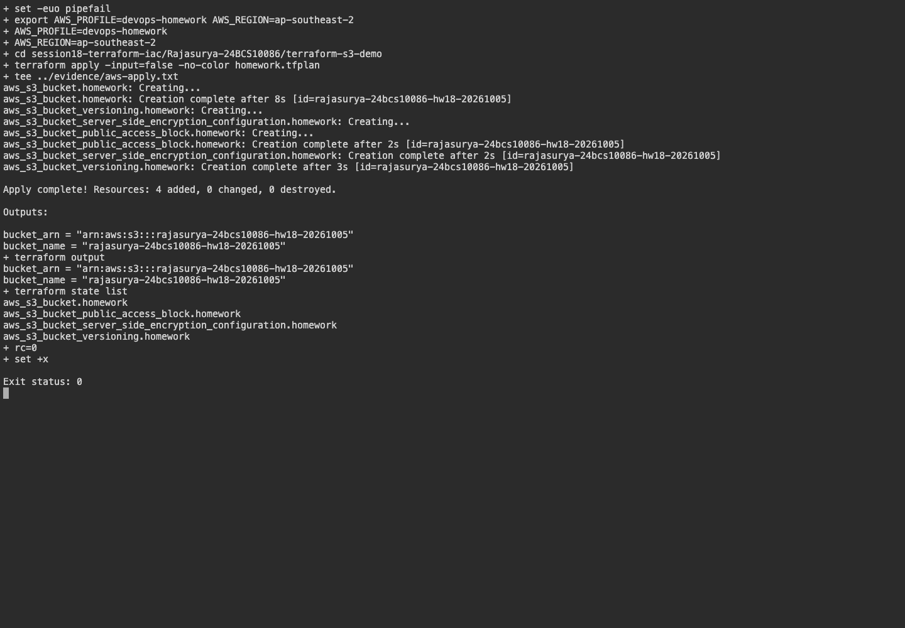
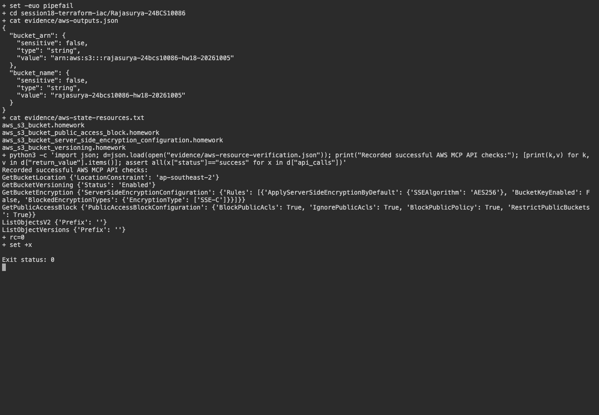
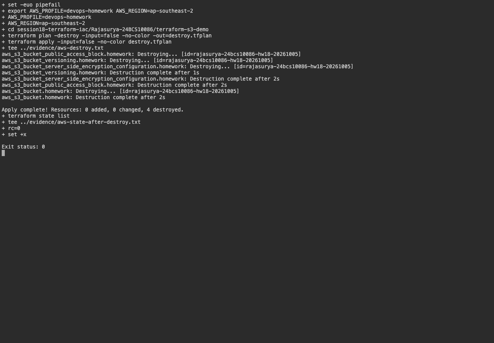

# Session 18 - Terraform and Infrastructure as Code

**Name:** Rajasurya J

**Enrollment number:** 24BCS10086

## Objective and actual status

The original Terraform S3 project was preserved and executed against AWS in `ap-southeast-2`.
The real plan created four resources: the bucket, public-access block, encryption and versioning.
AWS API checks confirmed the selected Region, Enabled versioning, AES256 encryption and all four
public-access blocks. The empty bucket was then destroyed, Terraform state became empty, and the AWS
bucket inventory confirmed its absence. The five AWS service research READMEs are linked below.

## Architecture

```text
Terraform → private S3 bucket → versioning / encryption / public-access block
```

## Environment

Terraform 1.16.4 runs on the macOS arm64 host. The initialized AWS provider is 6.67.0,
recorded in the project's `.terraform.lock.hcl`. AWS CLI 2.36.41 uses the browser-authenticated `devops-homework` profile.
AWS resources ran in the selected Region `ap-southeast-2`; Terraform commands ran on the macOS host. The `.terraform/` cache and all state/plan files are ignored by Git.

## Files

[terraform-s3-demo/](terraform-s3-demo/) contains providers, resources, typed variables, outputs, example values and tests.
Resource references connect the bucket to versioning, encryption and public-access controls.
No credentials appear in HCL, tfvars or evidence.

## Commands actually executed

```bash
cd terraform-s3-demo
terraform init -input=false
terraform fmt
terraform validate
terraform test
AWS_EC2_METADATA_DISABLED=true terraform plan -input=false
```

These earlier STS and plan attempts failed before browser authentication. Their original evidence is
preserved as execution history; the successful AWS run below supersedes that blocker.

[Initialization and validation output](evidence/validation.txt), [mock tests](evidence/mock-tests.txt),
[AWS identity attempt](evidence/aws-blocker.txt), and [real plan attempt](evidence/real-plan-attempt.txt)
contain actual outputs. The mock tests assert configuration properties using a mocked provider without
contacting AWS. Their generated identifiers are not real AWS resource identifiers.

## Verified AWS workflow

The project was verified to be on an ACTIVE FREE plan with available credits before provisioning.
No paid-plan upgrade, advanced-feature activation or paid commitment was requested. Resources can consume
AWS credits; [AWS's Free plan policy](https://aws.amazon.com/free/free-tier-faqs/) explains its billing behavior.
Authentication caches, state and plan files remain outside Git.

```bash
export AWS_PROFILE=devops-homework AWS_REGION=ap-southeast-2
cd terraform-s3-demo
terraform init -input=false
terraform fmt -check
terraform validate
terraform plan -input=false -out=homework.tfplan
terraform apply -input=false homework.tfplan
terraform show
terraform output
terraform state list
terraform plan -destroy -input=false -out=destroy.tfplan
terraform apply -input=false destroy.tfplan
terraform destroy -auto-approve -input=false
terraform state list
```

The saved destroy plan removed four resources. The subsequent `terraform destroy` check correctly reported
zero remaining resources, and the final state list was empty. No bucket was recreated for screenshots.

[Actual plan](evidence/aws-plan.txt), [apply](evidence/aws-apply.txt), [show](evidence/aws-show.txt),
[outputs](evidence/aws-outputs.json), [state resources](evidence/aws-state-resources.txt),
[AWS MCP resource checks](evidence/aws-resource-verification.json) and [destroy](evidence/aws-destroy.txt)
record genuine execution. The MCP JSON includes the successful API-call audit trail; terminal captures
read those recorded API responses and show actual Terraform/HTTP commands.

## Evidence


The original screenshot is retained as earlier offline-validation and authentication-failure evidence.

## Task 2: AWS services research

- [IAM - governance](aws-services/01-iam/README.md)
- [EC2 - compute](aws-services/02-ec2/README.md)
- [S3 - storage](aws-services/03-s3/README.md)
- [VPC - networking](aws-services/04-vpc/README.md)
- [DynamoDB and RDS](aws-services/05-dynamodb-rds/README.md)

The S3 project configures a private, versioned, encrypted bucket and disables forced object deletion.
`terraform.tfvars` contains only non-secret region and bucket-name settings.

## Genuine AWS screenshots





## Verified cleanup

[Post-destroy Terraform state](evidence/aws-state-after-destroy.txt) is empty.
[Actual AWS inventory check](evidence/aws-cleanup-verification.json) confirms the session resources were removed.
