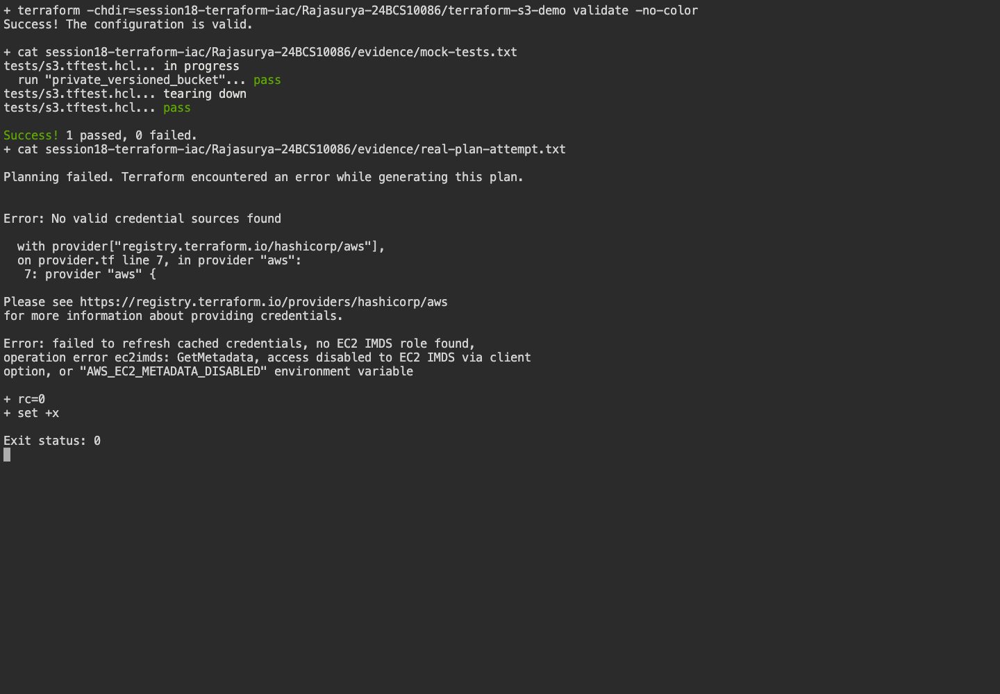

# Session 18 - Terraform and Infrastructure as Code

**Name:** Rajasurya J

**Enrollment number:** 24BCS10086

## Objective and actual status

The Terraform project is authored, initialized, formatted and validated. Its mock-provider tests pass.
Real AWS provisioning is **BLOCKED**: `aws sts get-caller-identity` reports no credentials, and the real
`terraform plan` reports `No valid credential sources found`. No AWS resources were created.
This is a partial assignment: AWS apply, deployed-resource screenshots, outputs from deployed resources,
and destroy verification remain outstanding. Mock tests do not count as an AWS deployment.

## Architecture

```text
Terraform → private S3 bucket → versioning / encryption / public-access block
```

## Environment

Terraform 1.16.4 runs on the macOS arm64 host. The initialized AWS provider is 6.67.0,
recorded in the project's `.terraform.lock.hcl`. AWS CLI 2.36.41 is installed, but no profile or ambient
credentials were available. The `.terraform/` cache and all state/plan files are ignored by Git.

## Files

[terraform-s3-demo/](terraform-s3-demo/) contains providers, resources, typed variables, outputs, example values and tests.
Resource references connect the bucket to versioning, encryption and public-access controls.
No credentials appear in HCL, tfvars or evidence.

## Commands actually executed

```bash
cd terraform-s3-demo
terraform init -input=false
terraform fmt
terraform validate
terraform test
AWS_EC2_METADATA_DISABLED=true terraform plan -input=false
```

The STS and plan attempts failed because credentials are absent; the plan was not applied.

[Initialization and validation output](evidence/validation.txt), [mock tests](evidence/mock-tests.txt),
[AWS identity attempt](evidence/aws-blocker.txt), and [real plan attempt](evidence/real-plan-attempt.txt)
contain actual outputs. The mock tests assert configuration properties using a mocked provider without
contacting AWS. Their generated identifiers are not real AWS resource identifiers.

## Required AWS workflow to finish

Authenticate locally using an authorized AWS profile or session. Verify `aws sts get-caller-identity`.
Choose the intended region, a globally unique bucket name, and the client CIDR where applicable.
Then run the following in this project's folder. These are remaining commands, not claimed execution evidence:

```bash
terraform init
terraform fmt -check
terraform validate
terraform plan -out=homework.tfplan
terraform apply homework.tfplan
terraform show
terraform output
terraform state list
terraform plan -destroy
terraform destroy
terraform state list
```

Inspect the plan before apply. Capture the real creation/output and destruction output in this README.
State can contain sensitive data and is kept out of Git. An appropriate protected remote state backend
can provide shared state and locking; this small project currently uses local state.

## Evidence



The screenshot captures a real terminal running validation and displaying the recorded real credential failure.
It does not show or claim a successful cloud deployment.

## Task 2: AWS services research

- [IAM - governance](aws-services/01-iam/README.md)
- [EC2 - compute](aws-services/02-ec2/README.md)
- [S3 - storage](aws-services/03-s3/README.md)
- [VPC - networking](aws-services/04-vpc/README.md)
- [DynamoDB and RDS](aws-services/05-dynamodb-rds/README.md)

The S3 project configures a private, versioned, encrypted bucket and disables forced object deletion.
`terraform.tfvars` contains only non-secret region and bucket-name settings.
