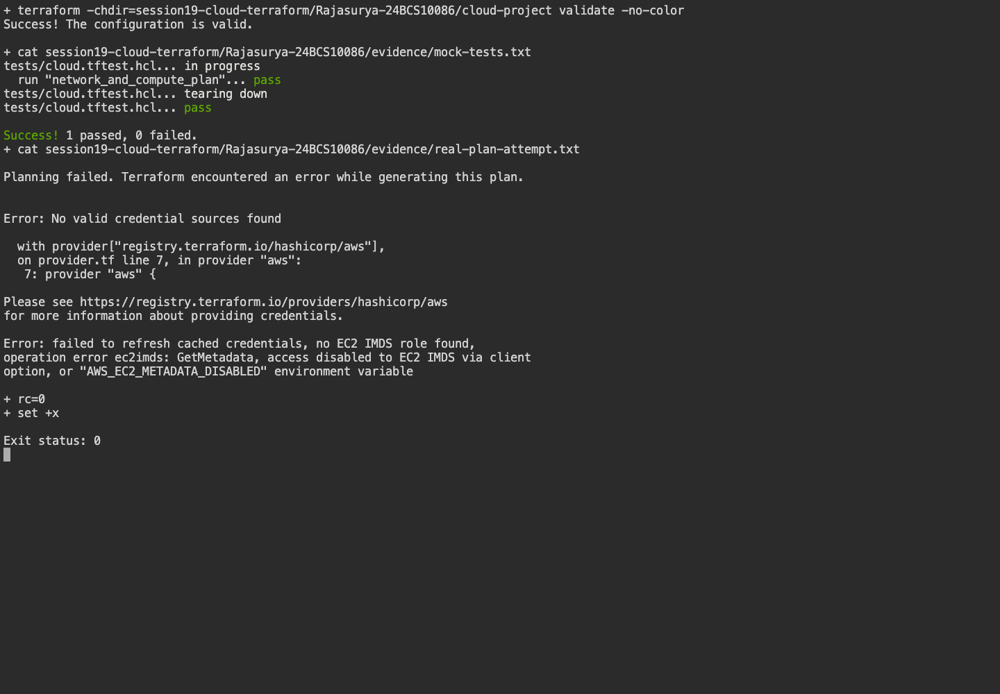
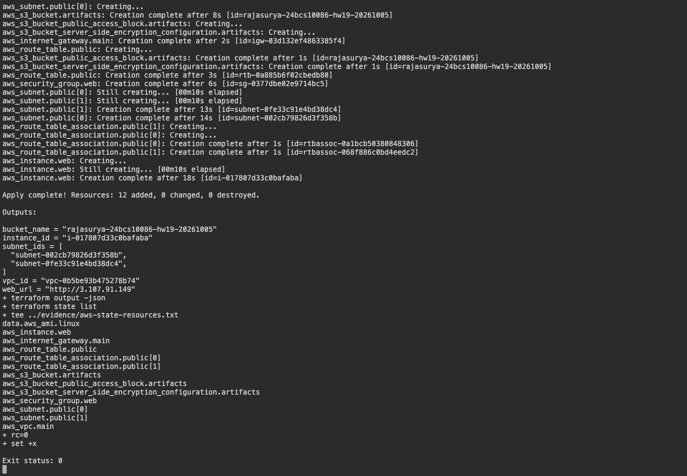
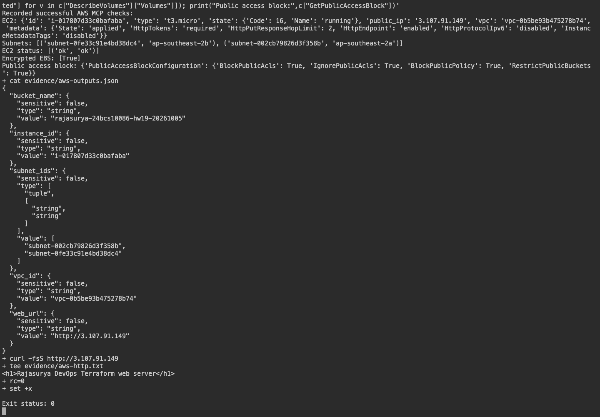
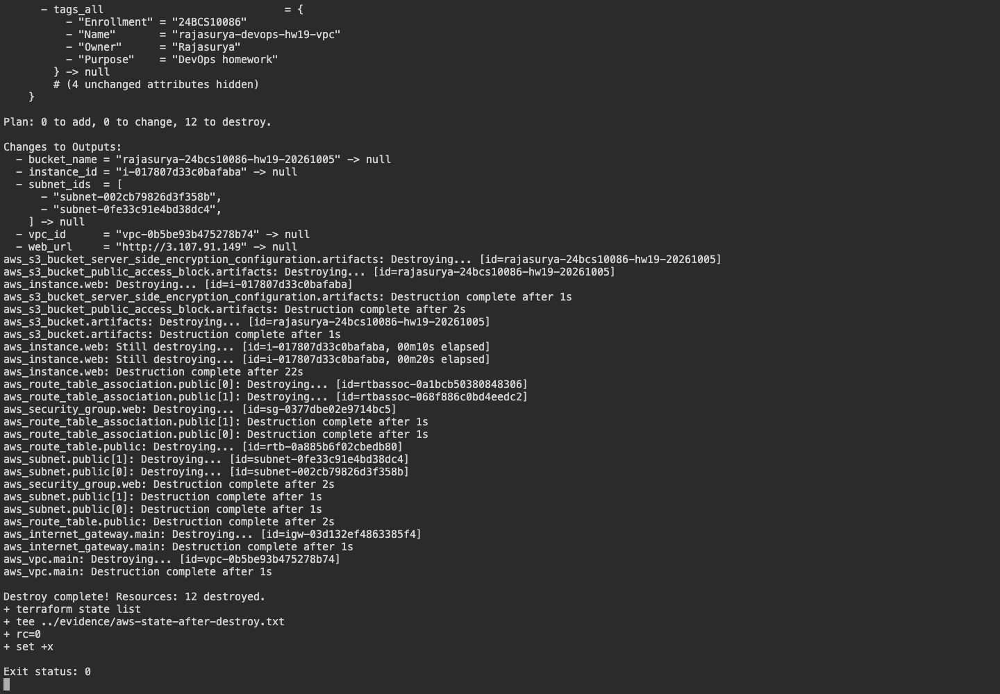

# Session 19 - Cloud and Terraform in Action

**Name:** Rajasurya J

**Enrollment number:** 24BCS10086

## Objective and actual status

The original VPC/EC2/S3 Terraform project was preserved and deployed to AWS in `ap-southeast-2`.
The reviewed plan added twelve homework resources. The nginx endpoint returned the configured page;
EC2 system/instance checks passed, encrypted EBS and IMDSv2 were verified, and HTTP was restricted to
the operator's public IPv4/32. The real destroy lifecycle and post-cleanup inventory are documented below.

## Architecture

```text
Terraform → VPC → two public subnets → route table / Internet Gateway → restricted Security Group → EC2
         └─ private encrypted S3 bucket
```

## Environment

Terraform 1.16.4 runs on the macOS arm64 host. The initialized AWS provider is 6.67.0,
recorded in the project's `.terraform.lock.hcl`. AWS CLI 2.36.41 uses the browser-authenticated `devops-homework` profile.
AWS resources ran in the selected Region `ap-southeast-2`; Terraform commands ran on the macOS host. The `.terraform/` cache and all state/plan files are ignored by Git.

## Files

[cloud-project/](cloud-project/) contains providers, resources, typed variables, outputs, example values and tests.
Resource references express dependencies so networking is available before compute.
No credentials appear in HCL, tfvars or evidence.

## Commands actually executed

```bash
cd cloud-project
terraform init -input=false
terraform fmt
terraform validate
terraform test
AWS_EC2_METADATA_DISABLED=true terraform plan -input=false -var=bucket_name=rajasurya-24bcs10086-hw19-20261005
```

These earlier STS and plan attempts failed before browser authentication. Their original evidence is
preserved as execution history; the successful AWS run below supersedes that blocker.

[Initialization and validation output](evidence/validation.txt), [mock tests](evidence/mock-tests.txt),
[AWS identity attempt](evidence/aws-blocker.txt), and [real plan attempt](evidence/real-plan-attempt.txt)
contain actual outputs. The mock tests assert configuration properties using a mocked provider without
contacting AWS. Their generated identifiers are not real AWS resource identifiers.

## Verified AWS workflow

The project was verified to be on an ACTIVE FREE plan with available credits before provisioning.
No paid-plan upgrade, advanced-feature activation or paid commitment was requested. Resources can consume
AWS credits; [AWS's Free plan policy](https://aws.amazon.com/free/free-tier-faqs/) explains its billing behavior.
Authentication caches, state and plan files remain outside Git.

```bash
export AWS_PROFILE=devops-homework AWS_REGION=ap-southeast-2
cd cloud-project
terraform init -input=false
terraform fmt -check
terraform validate
terraform plan -input=false -var-file=/tmp/devops-audit-20261005/hw19-vars.json -out=homework.tfplan
terraform apply -input=false homework.tfplan
terraform show
terraform output
terraform state list
terraform destroy -auto-approve -input=false -var-file=/tmp/devops-audit-20261005/hw19-vars.json
terraform state list
```

The external, non-secret var file supplied `region=ap-southeast-2`, a unique bucket name and the operator's
actual IPv4/32. The root instance uses Standard CPU credits to avoid unlimited-mode surplus credit usage.

[Actual plan](evidence/aws-plan.txt), [apply](evidence/aws-apply.txt), [show](evidence/aws-show.txt),
[outputs](evidence/aws-outputs.json), [state resources](evidence/aws-state-resources.txt),
[AWS MCP resource checks](evidence/aws-resource-verification.json) and [destroy](evidence/aws-destroy.txt)
record genuine execution. The MCP JSON includes the successful API-call audit trail; terminal captures
read those recorded API responses and show actual Terraform/HTTP commands.

## Evidence



The original screenshot is retained as earlier offline-validation and authentication-failure evidence.

## Infrastructure design

The cloud project defines one VPC, two public subnets in different availability zones, an Internet Gateway,
a public route table and associations, a Security Group, an Amazon Linux EC2 instance and private S3 storage.
The instance uses an AMI data source, encrypted EBS, IMDSv2 and an nginx user-data script.
HTTP is restricted to `web_cidr`; the example uses a documentation-only address and must be replaced
with the intended client IPv4/32. No SSH ingress or private key is committed.

`terraform.tfvars.example` is safe to copy locally. The original configuration is reused by the final
project through a local module reference. This project and the final project are executed independently with different names and state files.

## Genuine AWS screenshots





## Verified cleanup

[Post-destroy Terraform state](evidence/aws-state-after-destroy.txt) is empty.
[Actual AWS inventory check](evidence/aws-cleanup-verification.json) confirms the session resources were removed.
