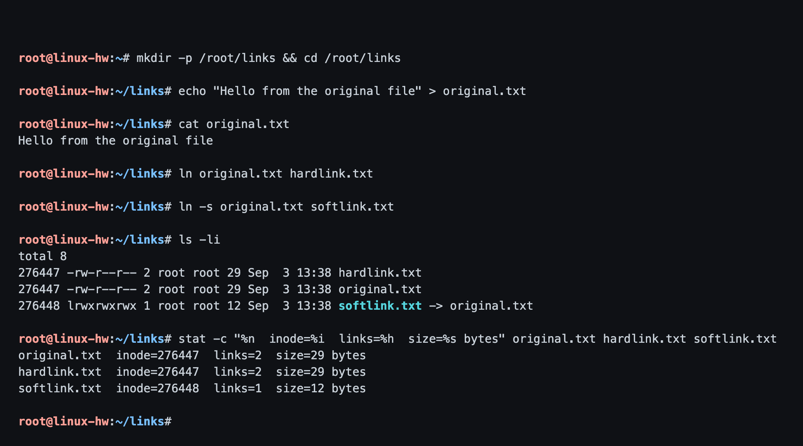
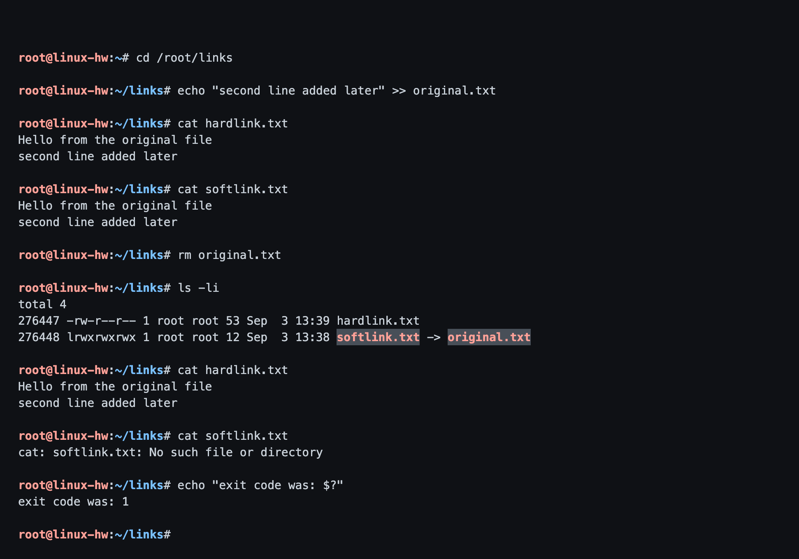
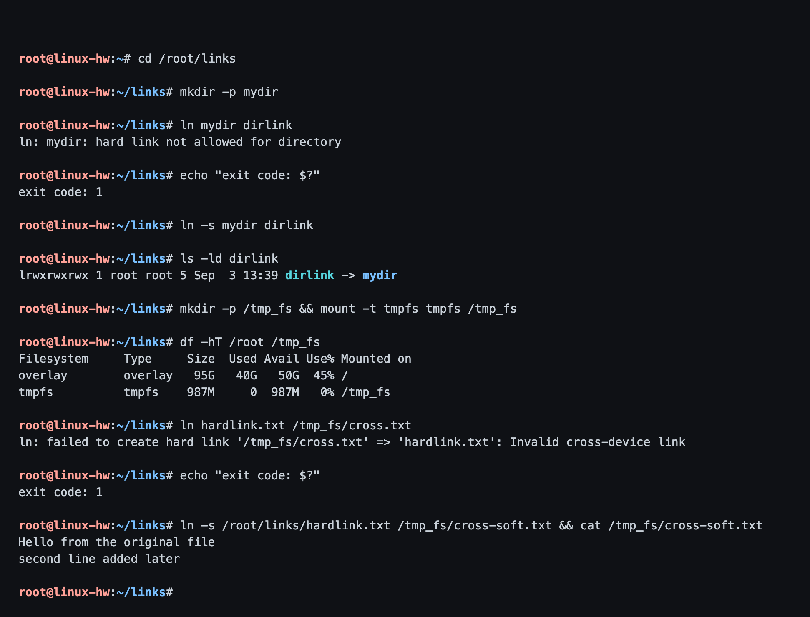
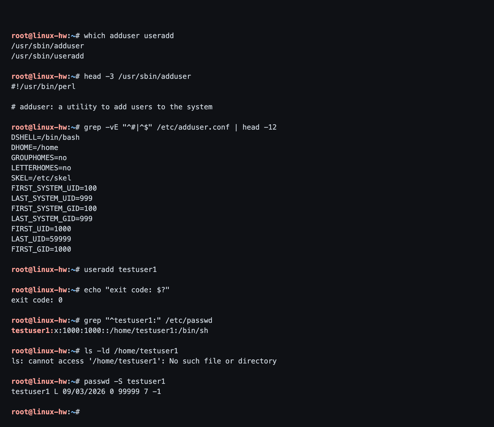
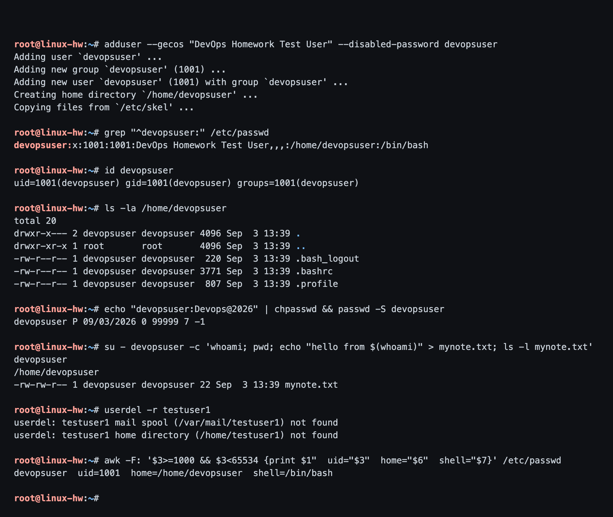
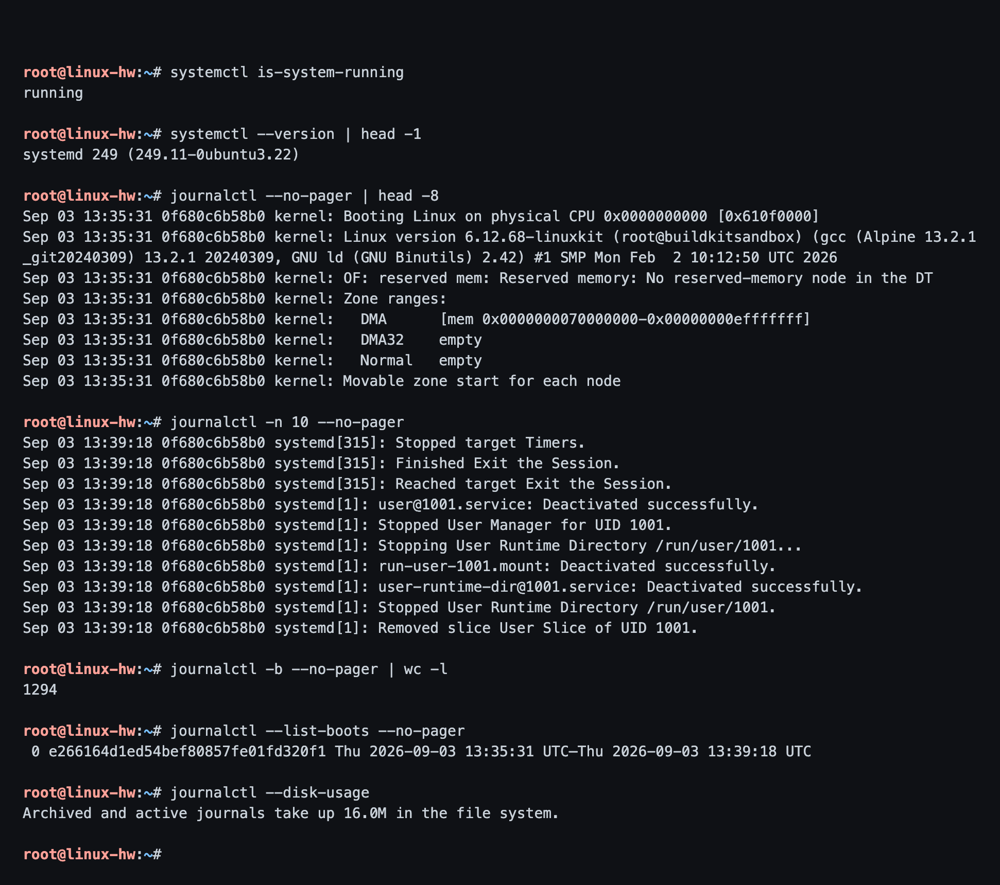
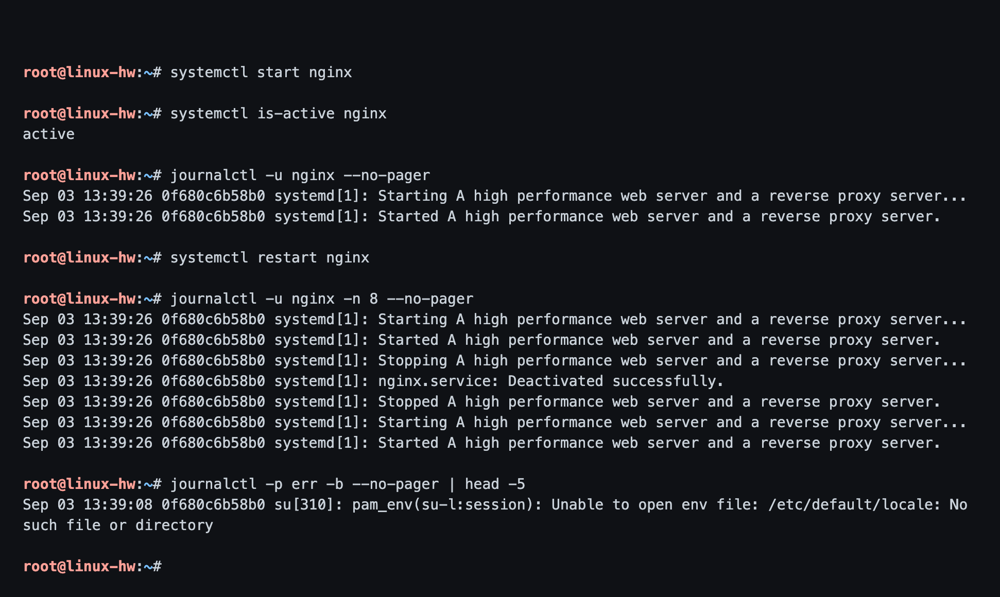
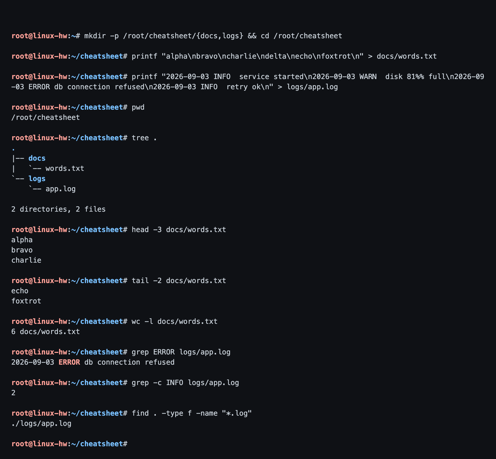
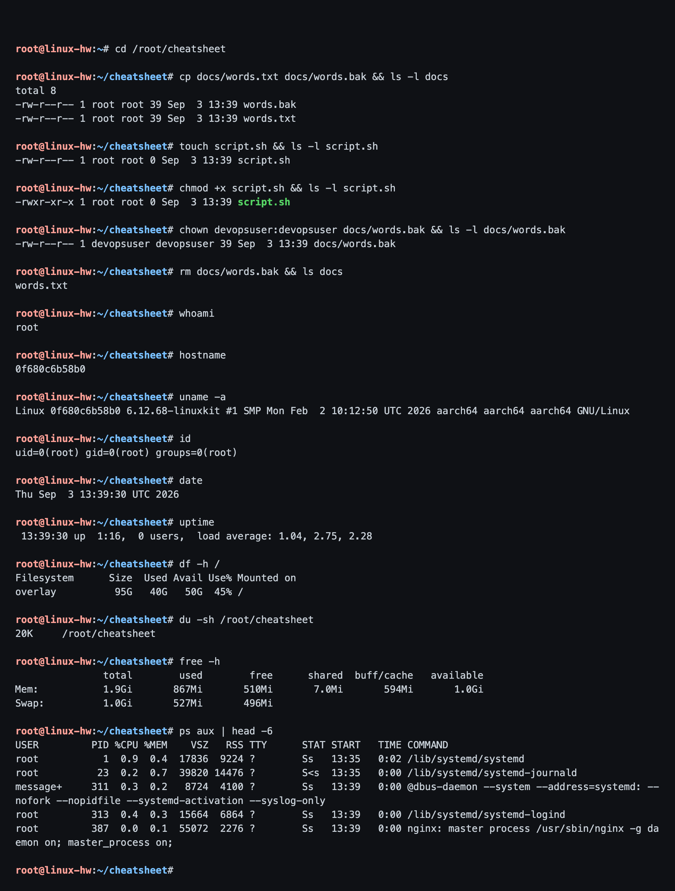

# Session 2 - Linux Fundamentals

**Name:** Rajasurya J
**Enrollment Number:** 24BCS10086

## Environment note (please read first)

My laptop is a MacBook Air (macOS 26.6, Apple Silicon). macOS is Unix but it is
**not** Linux - there is no `useradd`, no `adduser`, no `journalctl` and no `ip`
command. Rather than fake that output, I built a real **Ubuntu 22.04 container
with systemd actually running** and did the whole Linux homework inside it.

The Dockerfile for that practice box is [`Dockerfile`](Dockerfile).

```bash
docker build -t linux-hw:latest .

docker run -d --name linux-hw \
  --privileged --cgroupns=host \
  -v /sys/fs/cgroup:/sys/fs/cgroup:rw \
  --tmpfs /run --tmpfs /run/lock \
  linux-hw:latest

docker exec -it linux-hw bash
```

Every screenshot below is a real terminal session inside that container - the
prompt is `root@linux-hw`. The code blocks are the same sessions as text.

---

## Task 1: Soft Link & Hard Link

- Learn the difference between soft links and hard links.
- Learn the commands to create both.
- Practice creating and deleting soft and hard links.
- Prepare for this as an interview question.

### Commands

```bash
mkdir -p /root/links && cd /root/links
echo "Hello from the original file" > original.txt
ln    original.txt hardlink.txt     # hard link
ln -s original.txt softlink.txt     # soft link
ls -li
stat -c "%n  inode=%i  links=%h  size=%s bytes" original.txt hardlink.txt softlink.txt
```

### Output

```text
root@linux-hw:~# mkdir -p /root/links && cd /root/links
root@linux-hw:~/links# echo "Hello from the original file" > original.txt
root@linux-hw:~/links# cat original.txt
Hello from the original file

root@linux-hw:~/links# ln original.txt hardlink.txt
root@linux-hw:~/links# ln -s original.txt softlink.txt
root@linux-hw:~/links# ls -li
total 8
276447 -rw-r--r-- 2 root root 29 Sep  3 13:38 hardlink.txt
276447 -rw-r--r-- 2 root root 29 Sep  3 13:38 original.txt
276448 lrwxrwxrwx 1 root root 12 Sep  3 13:38 softlink.txt -> original.txt

root@linux-hw:~/links# stat -c "%n  inode=%i  links=%h  size=%s bytes" original.txt hardlink.txt softlink.txt
original.txt  inode=276447  links=2  size=29 bytes
hardlink.txt  inode=276447  links=2  size=29 bytes
softlink.txt  inode=276448  links=1  size=12 bytes

root@linux-hw:~/links#
```



This one screenshot shows almost everything:

- `original.txt` and `hardlink.txt` both have inode **276447** - the same file
  under two names - and their link count is **2**.
- `softlink.txt` has its own inode **276448**, link count 1, type `l`, and `ls`
  prints `-> original.txt`.
- The soft link is only **12 bytes**, exactly the length of the string
  `original.txt`. That is all it stores.

### Commands

Now append to the original, then delete it, and see what happens to each link:

```bash
echo "second line added later" >> original.txt
cat hardlink.txt
cat softlink.txt
rm original.txt
ls -li
cat hardlink.txt
cat softlink.txt
```

### Output

```text
root@linux-hw:~# cd /root/links
root@linux-hw:~/links# echo "second line added later" >> original.txt
root@linux-hw:~/links# cat hardlink.txt
Hello from the original file
second line added later

root@linux-hw:~/links# cat softlink.txt
Hello from the original file
second line added later

root@linux-hw:~/links# rm original.txt
root@linux-hw:~/links# ls -li
total 4
276447 -rw-r--r-- 1 root root 53 Sep  3 13:39 hardlink.txt
276448 lrwxrwxrwx 1 root root 12 Sep  3 13:38 softlink.txt -> original.txt

root@linux-hw:~/links# cat hardlink.txt
Hello from the original file
second line added later

root@linux-hw:~/links# cat softlink.txt
cat: softlink.txt: No such file or directory

root@linux-hw:~/links# echo "exit code was: $?"
exit code was: 1

root@linux-hw:~/links#
```



What happened:

- Both links saw the appended line while the original existed.
- After `rm original.txt` the **hard link still works** and still has all 53
  bytes, because inode 276447 still had one name pointing at it. The link count
  dropped from **2 to 1**.
- The **soft link is now dangling**. It still stores the text `original.txt`,
  but there is no such file, so `cat` fails with `No such file or directory`
  and exit code 1.

### Commands

The two limitations of hard links, tested rather than just quoted:

```bash
mkdir -p mydir
ln mydir dirlink                 # 1. cannot hard link a directory
ln -s mydir dirlink              # but a soft link to a directory is fine

mount -t tmpfs tmpfs /tmp_fs     # 2. a second filesystem to test against
df -hT /root /tmp_fs
ln hardlink.txt /tmp_fs/cross.txt
ln -s /root/links/hardlink.txt /tmp_fs/cross-soft.txt
```

### Output

```text
root@linux-hw:~# cd /root/links
root@linux-hw:~/links# mkdir -p mydir
root@linux-hw:~/links# ln mydir dirlink
ln: mydir: hard link not allowed for directory

root@linux-hw:~/links# echo "exit code: $?"
exit code: 1

root@linux-hw:~/links# ln -s mydir dirlink
root@linux-hw:~/links# ls -ld dirlink
lrwxrwxrwx 1 root root 5 Sep  3 13:39 dirlink -> mydir

root@linux-hw:~/links# mkdir -p /tmp_fs && mount -t tmpfs tmpfs /tmp_fs
root@linux-hw:~/links# df -hT /root /tmp_fs
Filesystem     Type     Size  Used Avail Use% Mounted on
overlay        overlay   95G   40G   50G  45% /
tmpfs          tmpfs    987M     0  987M   0% /tmp_fs

root@linux-hw:~/links# ln hardlink.txt /tmp_fs/cross.txt
ln: failed to create hard link '/tmp_fs/cross.txt' => 'hardlink.txt': Invalid cross-device link

root@linux-hw:~/links# echo "exit code: $?"
exit code: 1

root@linux-hw:~/links# ln -s /root/links/hardlink.txt /tmp_fs/cross-soft.txt && cat /tmp_fs/cross-soft.txt
Hello from the original file
second line added later

root@linux-hw:~/links#
```



- **`ln: mydir: hard link not allowed for directory`** - the kernel forbids it,
  because directory hard links could create loops in the filesystem tree and
  `find`/`fsck` would never terminate. A soft link to a directory works fine.
- **`Invalid cross-device link`** - inode numbers are only unique *within one
  filesystem*. Inode 276447 on the overlay filesystem has nothing to do with
  inode 276447 on the tmpfs, so the link would be meaningless. A soft link just
  stores a path string, so it crosses filesystems happily.

### Summary table

| | Hard link | Soft link (symbolic link) |
|---|---|---|
| Points to | the **inode** (the data on disk) | the **path**, stored as text |
| Command | `ln file link` | `ln -s file link` |
| Own inode? | no - shares the original's | yes |
| Original deleted | still works, data survives | breaks (dangling) |
| Across filesystems? | no | yes |
| Link a directory? | no | yes |
| `ls -l` type char | `-` | `l` |

**Interview answer:** a hard link is another directory entry pointing at the same
inode, so it is indistinguishable from the original and the data survives until
the last link is removed. A soft link is a small separate file whose contents are
a path; it can cross filesystems and point at directories, but it breaks if the
target is moved or deleted.

---

## Task 2: adduser vs useradd

- Learn the difference between `adduser` and `useradd`.
- Understand which is preferred on Ubuntu/Linux and why.
- Create a test user using the recommended command.

### Commands

First, what the two commands actually are, then plain `useradd`:

```bash
which adduser useradd
head -3 /usr/sbin/adduser
grep -vE "^#|^$" /etc/adduser.conf | head -12
useradd testuser1
grep "^testuser1:" /etc/passwd
ls -ld /home/testuser1
passwd -S testuser1
```

### Output

```text
root@linux-hw:~# which adduser useradd
/usr/sbin/adduser
/usr/sbin/useradd

root@linux-hw:~# head -3 /usr/sbin/adduser
#!/usr/bin/perl

# adduser: a utility to add users to the system

root@linux-hw:~# grep -vE "^#|^$" /etc/adduser.conf | head -12
DSHELL=/bin/bash
DHOME=/home
GROUPHOMES=no
LETTERHOMES=no
SKEL=/etc/skel
FIRST_SYSTEM_UID=100
LAST_SYSTEM_UID=999
FIRST_SYSTEM_GID=100
LAST_SYSTEM_GID=999
FIRST_UID=1000
LAST_UID=59999
FIRST_GID=1000

root@linux-hw:~# useradd testuser1
root@linux-hw:~# echo "exit code: $?"
exit code: 0

root@linux-hw:~# grep "^testuser1:" /etc/passwd
testuser1:x:1000:1000::/home/testuser1:/bin/sh

root@linux-hw:~# ls -ld /home/testuser1
ls: cannot access '/home/testuser1': No such file or directory

root@linux-hw:~# passwd -S testuser1
testuser1 L 09/03/2026 0 99999 7 -1

root@linux-hw:~#
```



Two things to notice:

- `head -3 /usr/sbin/adduser` prints `#!/usr/bin/perl` - **`adduser` is a Perl
  script**, a Debian/Ubuntu wrapper around the low-level `useradd` binary. It
  reads its defaults from `/etc/adduser.conf` (`DSHELL=/bin/bash`,
  `DHOME=/home`, `SKEL=/etc/skel`, `FIRST_UID=1000` ...).
- Plain `useradd testuser1` succeeded, **but**: `/home/testuser1` does not exist
  even though `/etc/passwd` claims it does, the shell defaulted to `/bin/sh`
  instead of bash, there is no full name, and `passwd -S` shows **`L`** = the
  account is **locked** and cannot log in.

To get a usable account out of `useradd` you have to spell everything out:
`useradd -m -s /bin/bash -c "Full Name" username && passwd username`.

### Commands

Now the recommended way on Ubuntu:

```bash
adduser --gecos "DevOps Homework Test User" --disabled-password devopsuser
grep "^devopsuser:" /etc/passwd
id devopsuser
ls -la /home/devopsuser
echo "devopsuser:Devops@2026" | chpasswd && passwd -S devopsuser
su - devopsuser -c 'whoami; pwd; echo "hello from $(whoami)" > mynote.txt; ls -l mynote.txt'
userdel -r testuser1
awk -F: '$3>=1000 && $3<65534 {print $1"  uid="$3"  home="$6"  shell="$7}' /etc/passwd
```

### Output

```text
root@linux-hw:~# adduser --gecos "DevOps Homework Test User" --disabled-password devopsuser
Adding user `devopsuser' ...
Adding new group `devopsuser' (1001) ...
Adding new user `devopsuser' (1001) with group `devopsuser' ...
Creating home directory `/home/devopsuser' ...
Copying files from `/etc/skel' ...

root@linux-hw:~# grep "^devopsuser:" /etc/passwd
devopsuser:x:1001:1001:DevOps Homework Test User,,,:/home/devopsuser:/bin/bash

root@linux-hw:~# id devopsuser
uid=1001(devopsuser) gid=1001(devopsuser) groups=1001(devopsuser)

root@linux-hw:~# ls -la /home/devopsuser
total 20
drwxr-x--- 2 devopsuser devopsuser 4096 Sep  3 13:39 .
drwxr-xr-x 1 root       root       4096 Sep  3 13:39 ..
-rw-r--r-- 1 devopsuser devopsuser  220 Sep  3 13:39 .bash_logout
-rw-r--r-- 1 devopsuser devopsuser 3771 Sep  3 13:39 .bashrc
-rw-r--r-- 1 devopsuser devopsuser  807 Sep  3 13:39 .profile

root@linux-hw:~# echo "devopsuser:Devops@2026" | chpasswd && passwd -S devopsuser
devopsuser P 09/03/2026 0 99999 7 -1

root@linux-hw:~# su - devopsuser -c 'whoami; pwd; echo "hello from $(whoami)" > mynote.txt; ls -l mynote.txt'
devopsuser
/home/devopsuser
-rw-rw-r-- 1 devopsuser devopsuser 22 Sep  3 13:39 mynote.txt

root@linux-hw:~# userdel -r testuser1
userdel: testuser1 mail spool (/var/mail/testuser1) not found
userdel: testuser1 home directory (/home/testuser1) not found

root@linux-hw:~# awk -F: '$3>=1000 && $3<65534 {print $1"  uid="$3"  home="$6"  shell="$7}' /etc/passwd
devopsuser  uid=1001  home=/home/devopsuser  shell=/bin/bash

root@linux-hw:~#
```



In one command `adduser` created the group, the user, the home directory, copied
the skeleton dotfiles from `/etc/skel` and gave a proper bash shell. Normally it
asks all of this interactively - I passed `--gecos` and `--disabled-password` so
it would run without prompts for the homework, then set the password separately
with `chpasswd`.

Then I actually **logged in as the new user** with `su - devopsuser` - it landed
in `/home/devopsuser`, ran `whoami` and wrote a file. The account genuinely works.

Finally I removed the throwaway `useradd` account and left only `devopsuser`.
The two `userdel` warnings are expected and are exactly the point of this task -
`useradd` never created the home directory or mail spool in the first place.

### Which one should I use?

On **Ubuntu/Debian: `adduser`**, because it is the friendly front end that does
the right thing by default. `useradd` is what you use **in scripts and
Dockerfiles**, or on RHEL/CentOS/Alpine where `adduser` either does not exist or
behaves differently. `adduser` is not portable; `useradd` is.

---

## Task 3: journalctl

- Learn what `journalctl` is used for.
- Learn how to view system and service logs.
- Practice checking logs for a specific service.

`journalctl` reads the **systemd journal**. `systemd-journald` collects the
kernel ring buffer, early boot messages, the stdout/stderr of every service and
syslog messages into one indexed binary journal, and `journalctl` queries it. It
replaces tailing a dozen different files under `/var/log`.

### Commands

```bash
systemctl is-system-running
journalctl --no-pager | head -8      # whole journal, oldest first
journalctl -n 10 --no-pager          # last 10 entries
journalctl -b --no-pager | wc -l     # entries in this boot
journalctl --list-boots --no-pager
journalctl --disk-usage
```

### Output

```text
root@linux-hw:~# systemctl is-system-running
running

root@linux-hw:~# systemctl --version | head -1
systemd 249 (249.11-0ubuntu3.22)

root@linux-hw:~# journalctl --no-pager | head -8
Sep 03 13:35:31 0f680c6b58b0 kernel: Booting Linux on physical CPU 0x0000000000 [0x610f0000]
Sep 03 13:35:31 0f680c6b58b0 kernel: Linux version 6.12.68-linuxkit (root@buildkitsandbox) (gcc (Alpine 13.2.1_git20240309) 13.2.1 20240309, GNU ld (GNU Binutils) 2.42) #1 SMP Mon Feb  2 10:12:50 UTC 2026
Sep 03 13:35:31 0f680c6b58b0 kernel: OF: reserved mem: Reserved memory: No reserved-memory node in the DT
Sep 03 13:35:31 0f680c6b58b0 kernel: Zone ranges:
Sep 03 13:35:31 0f680c6b58b0 kernel:   DMA      [mem 0x0000000070000000-0x00000000efffffff]
Sep 03 13:35:31 0f680c6b58b0 kernel:   DMA32    empty
Sep 03 13:35:31 0f680c6b58b0 kernel:   Normal   empty
Sep 03 13:35:31 0f680c6b58b0 kernel: Movable zone start for each node

root@linux-hw:~# journalctl -n 10 --no-pager
Sep 03 13:39:18 0f680c6b58b0 systemd[315]: Stopped target Timers.
Sep 03 13:39:18 0f680c6b58b0 systemd[315]: Finished Exit the Session.
Sep 03 13:39:18 0f680c6b58b0 systemd[315]: Reached target Exit the Session.
Sep 03 13:39:18 0f680c6b58b0 systemd[1]: user@1001.service: Deactivated successfully.
Sep 03 13:39:18 0f680c6b58b0 systemd[1]: Stopped User Manager for UID 1001.
Sep 03 13:39:18 0f680c6b58b0 systemd[1]: Stopping User Runtime Directory /run/user/1001...
Sep 03 13:39:18 0f680c6b58b0 systemd[1]: run-user-1001.mount: Deactivated successfully.
Sep 03 13:39:18 0f680c6b58b0 systemd[1]: user-runtime-dir@1001.service: Deactivated successfully.
Sep 03 13:39:18 0f680c6b58b0 systemd[1]: Stopped User Runtime Directory /run/user/1001.
Sep 03 13:39:18 0f680c6b58b0 systemd[1]: Removed slice User Slice of UID 1001.

root@linux-hw:~# journalctl -b --no-pager | wc -l
1294

root@linux-hw:~# journalctl --list-boots --no-pager
 0 e266164d1ed54bef80857fe01fd320f1 Thu 2026-09-03 13:35:31 UTC—Thu 2026-09-03 13:39:18 UTC

root@linux-hw:~# journalctl --disk-usage
Archived and active journals take up 16.0M in the file system.

root@linux-hw:~#
```



`systemctl is-system-running` says **`running`**, which is what makes all of this
work - systemd really is PID 1 in this container.

The nice accident here is in `journalctl -n 10`: the last entries are literally
the `su - devopsuser` and `userdel testuser1` I ran in **Task 2**. The journal
picked up my own work, which is a good demonstration that it logs everything
system-wide.

### Commands

Logs for one specific service - the command I will actually use in real life:

```bash
systemctl start nginx
systemctl is-active nginx
journalctl -u nginx --no-pager
systemctl restart nginx
journalctl -u nginx -n 8 --no-pager
journalctl -p err -b --no-pager | head -5
```

### Output

```text
root@linux-hw:~# systemctl start nginx
root@linux-hw:~# systemctl is-active nginx
active

root@linux-hw:~# journalctl -u nginx --no-pager
Sep 03 13:39:26 0f680c6b58b0 systemd[1]: Starting A high performance web server and a reverse proxy server...
Sep 03 13:39:26 0f680c6b58b0 systemd[1]: Started A high performance web server and a reverse proxy server.

root@linux-hw:~# systemctl restart nginx
root@linux-hw:~# journalctl -u nginx -n 8 --no-pager
Sep 03 13:39:26 0f680c6b58b0 systemd[1]: Starting A high performance web server and a reverse proxy server...
Sep 03 13:39:26 0f680c6b58b0 systemd[1]: Started A high performance web server and a reverse proxy server.
Sep 03 13:39:26 0f680c6b58b0 systemd[1]: Stopping A high performance web server and a reverse proxy server...
Sep 03 13:39:26 0f680c6b58b0 systemd[1]: nginx.service: Deactivated successfully.
Sep 03 13:39:26 0f680c6b58b0 systemd[1]: Stopped A high performance web server and a reverse proxy server.
Sep 03 13:39:26 0f680c6b58b0 systemd[1]: Starting A high performance web server and a reverse proxy server...
Sep 03 13:39:26 0f680c6b58b0 systemd[1]: Started A high performance web server and a reverse proxy server.

root@linux-hw:~# journalctl -p err -b --no-pager | head -5
Sep 03 13:39:08 0f680c6b58b0 su[310]: pam_env(su-l:session): Unable to open env file: /etc/default/locale: No such file or directory

root@linux-hw:~#
```



The restart is recorded as a full stop/start cycle. When a service will not come
up, `journalctl -u <service> -n 50` is the fastest way to find out why.

`journalctl -p err` filters to priority `err` and worse. The one error found is a
minor locale warning from my `su` in Task 2 - a slim container image has no
`/etc/default/locale`. Harmless, but it proves the filter works.

### Options I practised

| Command | What it does |
|---|---|
| `journalctl` | whole journal, oldest first |
| `journalctl -n 20` | last 20 lines |
| `journalctl -f` | follow live, like `tail -f` |
| `journalctl -b` / `-b -1` | this boot / the previous boot |
| `journalctl -u nginx` | one service |
| `journalctl -u nginx -f` | follow one service live |
| `journalctl -p err` | errors and worse |
| `journalctl --since "1 hour ago"` | time window |
| `journalctl -k` | kernel messages only (= `dmesg`) |
| `journalctl --disk-usage` | how big the journal is |
| `journalctl --vacuum-time=7d` | delete journal older than 7 days |
| `journalctl -o json-pretty` | structured output |

I did not run `-f` or `--vacuum-time` in the transcripts - `-f` never exits so
there would be nothing to capture, and I did not want to delete logs on the box I
was still using.

---

## Task 4: Linux Command Cheat Sheet

- Review the cheat sheet.
- Practice the important commands.
- Understand the purpose and basic usage of each.

### Commands

Files, directories, reading and searching:

```bash
mkdir -p /root/cheatsheet/{docs,logs} && cd /root/cheatsheet
printf "alpha\nbravo\ncharlie\ndelta\necho\nfoxtrot\n" > docs/words.txt
printf "...4 log lines..." > logs/app.log
pwd ; tree .
head -3 docs/words.txt ; tail -2 docs/words.txt ; wc -l docs/words.txt
grep ERROR logs/app.log ; grep -c INFO logs/app.log
find . -type f -name "*.log"
```

### Output

```text
root@linux-hw:~# mkdir -p /root/cheatsheet/{docs,logs} && cd /root/cheatsheet
root@linux-hw:~/cheatsheet# printf "alpha\nbravo\ncharlie\ndelta\necho\nfoxtrot\n" > docs/words.txt
root@linux-hw:~/cheatsheet# printf "2026-09-03 INFO  service started\n2026-09-03 WARN  disk 81%% full\n2026-09-
-03 ERROR db connection refused\n2026-09-03 INFO  retry ok\n" > logs/app.log

root@linux-hw:~/cheatsheet# pwd
/root/cheatsheet

root@linux-hw:~/cheatsheet# tree .
.
|-- docs
|   `-- words.txt
`-- logs
    `-- app.log

2 directories, 2 files

root@linux-hw:~/cheatsheet# head -3 docs/words.txt
alpha
bravo
charlie

root@linux-hw:~/cheatsheet# tail -2 docs/words.txt
echo
foxtrot

root@linux-hw:~/cheatsheet# wc -l docs/words.txt
6 docs/words.txt

root@linux-hw:~/cheatsheet# grep ERROR logs/app.log
2026-09-03 ERROR db connection refused

root@linux-hw:~/cheatsheet# grep -c INFO logs/app.log
2

root@linux-hw:~/cheatsheet# find . -type f -name "*.log"
./logs/app.log

root@linux-hw:~/cheatsheet#
```



### Commands

Copying, permissions, and system information:

```bash
cp docs/words.txt docs/words.bak ; touch script.sh
chmod +x script.sh
chown devopsuser:devopsuser docs/words.bak
rm docs/words.bak
whoami ; hostname ; uname -a ; id ; date ; uptime
df -h / ; du -sh /root/cheatsheet ; free -h ; ps aux | head -6
```

### Output

```text
root@linux-hw:~# cd /root/cheatsheet
root@linux-hw:~/cheatsheet# cp docs/words.txt docs/words.bak && ls -l docs
total 8
-rw-r--r-- 1 root root 39 Sep  3 13:39 words.bak
-rw-r--r-- 1 root root 39 Sep  3 13:39 words.txt

root@linux-hw:~/cheatsheet# touch script.sh && ls -l script.sh
-rw-r--r-- 1 root root 0 Sep  3 13:39 script.sh

root@linux-hw:~/cheatsheet# chmod +x script.sh && ls -l script.sh
-rwxr-xr-x 1 root root 0 Sep  3 13:39 script.sh

root@linux-hw:~/cheatsheet# chown devopsuser:devopsuser docs/words.bak && ls -l docs/words.bak
-rw-r--r-- 1 devopsuser devopsuser 39 Sep  3 13:39 docs/words.bak

root@linux-hw:~/cheatsheet# rm docs/words.bak && ls docs
words.txt

root@linux-hw:~/cheatsheet# whoami
root

root@linux-hw:~/cheatsheet# hostname
0f680c6b58b0

root@linux-hw:~/cheatsheet# uname -a
Linux 0f680c6b58b0 6.12.68-linuxkit #1 SMP Mon Feb  2 10:12:50 UTC 2026 aarch64 aarch64 aarch64 GNU/Linux

root@linux-hw:~/cheatsheet# id
uid=0(root) gid=0(root) groups=0(root)

root@linux-hw:~/cheatsheet# date
Thu Sep  3 13:39:30 UTC 2026

root@linux-hw:~/cheatsheet# uptime
 13:39:30 up  1:16,  0 users,  load average: 1.04, 2.75, 2.28

root@linux-hw:~/cheatsheet# df -h /
Filesystem      Size  Used Avail Use% Mounted on
overlay          95G   40G   50G  45% /

root@linux-hw:~/cheatsheet# du -sh /root/cheatsheet
20K	/root/cheatsheet

root@linux-hw:~/cheatsheet# free -h
               total        used        free      shared  buff/cache   available
Mem:           1.9Gi       867Mi       510Mi       7.0Mi       594Mi       1.0Gi
Swap:          1.0Gi       527Mi       496Mi

root@linux-hw:~/cheatsheet# ps aux | head -6
USER         PID %CPU %MEM    VSZ   RSS TTY      STAT START   TIME COMMAND
root           1  0.9  0.4  17836  9224 ?        Ss   13:35   0:02 /lib/systemd/systemd
root          23  0.2  0.7  39820 14476 ?        S<s  13:35   0:00 /lib/systemd/systemd-journald
message+     311  0.3  0.2   8724  4100 ?        Ss   13:39   0:00 @dbus-daemon --system --address=systemd: --nofork --nopidfile --systemd-activation --syslog-only
root         313  0.4  0.3  15664  6864 ?        Ss   13:39   0:00 /lib/systemd/systemd-logind
root         387  0.0  0.1  55072  2276 ?        Ss   13:39   0:00 nginx: master process /usr/sbin/nginx -g daemon on; master_process on;

root@linux-hw:~/cheatsheet#
```



Things worth pointing out in that output:

- `chmod +x` is visible in the `ls -l` before/after: `-rw-r--r--` becomes
  `-rwxr-xr-x`.
- `chown` changed the owner from `root` to **`devopsuser`** - the account I
  created back in Task 2.
- `uname -a` shows **`aarch64`** because my Mac is Apple Silicon, so the
  container runs ARM64 Linux.
- In `ps aux`, **PID 1 is `/lib/systemd/systemd`** and PID 23 is
  `systemd-journald` - the daemon behind Task 3. nginx is there too, from Task 3.
- `df` answers "is the disk full", `du` answers "what is eating it". Easy to mix
  up.

### Quick reference

| Command | Purpose |
|---|---|
| `pwd` | print working directory |
| `ls -l` / `-la` / `-li` | list; long / include hidden / show inodes |
| `cd path` | change directory (`..` up, `~` home, `-` previous) |
| `mkdir -p a/b/c` | create directories, `-p` makes parents |
| `touch file` | create empty file / update timestamp |
| `cp src dst` | copy (`-r` for directories) |
| `mv src dst` | move or rename |
| `rm file` | delete (`-r` recursive, `-f` force - careful) |
| `cat` / `less` | print a file / page through it |
| `head -n N` / `tail -n N` | first / last N lines (`tail -f` follows) |
| `grep pattern file` | search (`-i` ignore case, `-r` recursive, `-c` count) |
| `find . -name "*.log"` | find files by name/type/size/time |
| `wc -l` | count lines |
| `chmod` | change permissions (`+x`, or numeric like `755`) |
| `chown user:group` | change owner and group |
| `ps aux` / `top` | process snapshot / live view |
| `kill PID` | stop a process (`-9` to force) |
| `df -h` / `du -sh` | free space per filesystem / size of a directory |
| `free -h` | RAM and swap |
| `whoami` / `id` | current user / uid, gid, groups |
| `hostname` / `uname -a` | machine name / kernel and architecture |
| `uptime` / `date` | how long up + load / current time |
| `ip addr` / `ip route` | addresses / routing table |
| `ping` / `curl` | reachability / HTTP from the terminal |
| `history` / `man cmd` | previous commands / manual page |

---

## What I learned

- An inode is the real file and a filename is just a label pointing at it. That
  single idea explains hard links, link counts, why `rm` does not always free
  space, and why hard links cannot cross filesystems.
- `adduser` vs `useradd` is really "Debian convenience wrapper vs portable
  low-level tool". The `ls: cannot access '/home/testuser1'` line made the
  difference obvious in one second.
- `journalctl -u <service>` is the first thing to run when a service will not
  start, and everything on a systemd box lands in one queryable journal.
- macOS is not a substitute for Linux for this kind of work. Building a container
  with systemd took five minutes and gave me a genuine environment to practise in.
