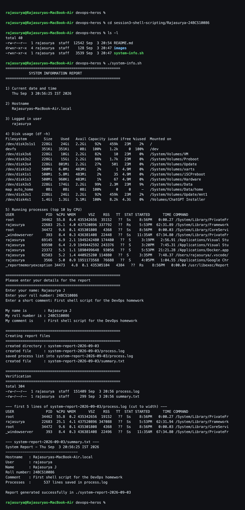
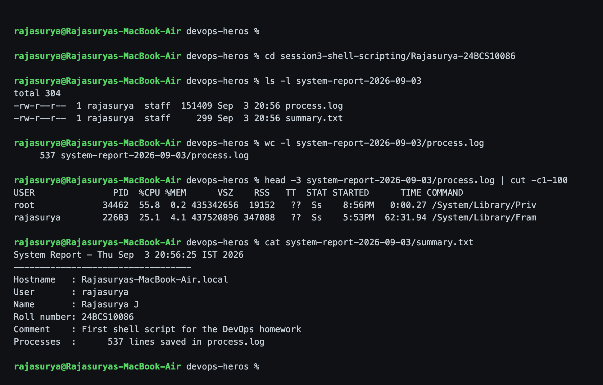

# Session 3 - Shell Scripting

**Name:** Rajasurya J
**Enrollment Number:** 24BCS10086

## Task: System Information Script

Write one script that:

- prints the current date, hostname, username, disk usage and running processes
- uses variables to store and use data
- takes user input using `read -p`
- creates a directory with `mkdir` and a file with `touch`
- stores the running-process information in that file using `>` redirection

**Script:** [`system-info.sh`](system-info.sh)

## Where each requirement is met

| Requirement | In the script |
|---|---|
| current date | `current_date=$(date)` |
| hostname | `host_name=$(hostname)` |
| username | `user_name=$(whoami)` |
| disk usage | `df -h` |
| running processes | `ps aux \| head -11` |
| variables | `current_date`, `host_name`, `user_name`, `report_dir`, `process_file`, `summary_file` |
| `read -p` | name, roll number, comment |
| `mkdir` | `mkdir -p "$report_dir"` |
| `touch` | `touch "$process_file"` |
| `>` redirection | `ps aux > "$process_file"` |
| `echo` | throughout, including building `summary.txt` |

## The parts that matter

```bash
# ---------- variables ----------
current_date=$(date)
current_day=$(date '+%Y-%m-%d')
host_name=$(hostname)
user_name=$(whoami)
report_dir="system-report-$current_day"
process_file="$report_dir/process.log"
summary_file="$report_dir/summary.txt"
```

`$( )` is **command substitution** - it runs a command and stores its output in a
variable instead of printing it. The report folder name is built from a variable,
so each run makes a folder named after that day.

```bash
# ---------- take user input ----------
read -p "Enter your name: " name
read -p "Enter your roll number: " roll_no
read -p "Enter a short comment: " comment
```

`read -p` prints the prompt and waits on the same line. Without `-p` you would
need a separate `echo -n` first.

```bash
# ---------- create the directory and files ----------
mkdir -p "$report_dir"
touch "$process_file"

# ---------- store the process list using > ----------
ps aux > "$process_file"

echo "System Report - $current_date"       > "$summary_file"
echo "----------------------------------" >> "$summary_file"
echo "Hostname   : $host_name"            >> "$summary_file"
```

`mkdir -p` does not fail if the directory already exists, so the script is safe
to re-run. `>` **overwrites** a file and `>>` **appends** - that is why the first
line of the summary uses `>` and the rest use `>>`. Every variable is in double
quotes so a path with a space could not break it.

## How I ran it

```bash
cd session3-shell-scripting/Rajasurya-24BCS10086
chmod +x system-info.sh
./system-info.sh
```

## Output

This is the whole run, including typing the three answers at the prompts:

```text
rajasurya@Rajasuryas-MacBook-Air devops-heros %

rajasurya@Rajasuryas-MacBook-Air devops-heros % cd session3-shell-scripting/Rajasurya-24BCS10086
rajasurya@Rajasuryas-MacBook-Air devops-heros % ls -l
total 40
-rw-r--r--  1 rajasurya  staff  12542 Sep  3 20:54 README.md
drwxr-xr-x  4 rajasurya  staff    128 Sep  3 20:47 images
-rwxr-xr-x  1 rajasurya  staff   3539 Sep  3 20:47 system-info.sh

rajasurya@Rajasuryas-MacBook-Air devops-heros % ./system-info.sh
======================================================
           SYSTEM INFORMATION REPORT
======================================================

1) Current date and time
   Thu Sep  3 20:56:25 IST 2026

2) Hostname
   Rajasuryas-MacBook-Air.local

3) Logged in user
   rajasurya

4) Disk usage (df -h)
Filesystem        Size    Used   Avail Capacity iused ifree %iused  Mounted on
/dev/disk3s1s1   228Gi    24Gi   2.2Gi    92%    459k   23M    2%   /
devfs            351Ki   351Ki     0Bi   100%    1.2k     0  100%   /dev
/dev/disk3s6     228Gi    10Gi   2.2Gi    82%      10   23M    0%   /System/Volumes/VM
/dev/disk3s2     228Gi    15Gi   2.2Gi    88%    1.7k   23M    0%   /System/Volumes/Preboot
/dev/disk3s4     228Gi   801Mi   2.2Gi    27%     501   23M    0%   /System/Volumes/Update
/dev/disk1s2     500Mi   6.0Mi   483Mi     2%       1  4.9M    0%   /System/Volumes/xarts
/dev/disk1s1     500Mi   5.8Mi   483Mi     2%      35  4.9M    0%   /System/Volumes/iSCPreboot
/dev/disk1s3     500Mi   960Ki   483Mi     1%      67  4.9M    0%   /System/Volumes/Hardware
/dev/disk3s5     228Gi   174Gi   2.2Gi    99%    2.3M   23M    9%   /System/Volumes/Data
map auto_home      0Bi     0Bi     0Bi   100%       0     0     -   /System/Volumes/Data/home
/dev/disk3s1     228Gi    24Gi   2.2Gi    92%    459k   23M    2%   /System/Volumes/Update/mnt1
/dev/disk4s1     1.4Gi   1.3Gi   3.1Mi   100%    8.2k  4.3G    0%   /Volumes/ChatGPT Installer

5) Running processes (top 10 by CPU)
USER               PID  %CPU %MEM      VSZ    RSS   TT  STAT STARTED      TIME COMMAND
root             34462  55.8  0.4 435342656  35152   ??  Ss    8:56PM   0:00.27 /System/Library/PrivateFr
rajasurya        22683  25.1  4.0 437520896 337792   ??  Rs    5:53PM  62:31.89 /System/Library/Framework
root             34472   9.6  0.1 435301808   4368   ??  Ss    8:56PM   0:00.03 /System/Library/CoreServi
_windowserver      393   8.4  0.3 436381408  22448   ??  Ss   11:35AM  67:34.80 /System/Library/PrivateFr
rajasurya        69145   6.9  2.1 1949242480 174480   ??  S     3:19PM   2:56.91 /Applications/Visual Stu
rajasurya        69590   6.4  2.9 1949442592 243376   ??  S     3:20PM   7:45.31 /Applications/Visual Stu
rajasurya        23372   5.5  1.1 1890499648  93056   ??  S     5:53PM  21:21.28 /Applications/Docker.app
rajasurya        82583   5.2  1.4 440925280 114880   ??  S     3:35PM   7:48.37 /Users/rajasurya/.vscode/
rajasurya         3566   5.0  0.9 1951173568  76688   ??  S     4:05PM   1:04.55 /Applications/Google Chr
_reportmemoryexception 34473   4.8  0.1 435305104   4384   ??  Rs    8:56PM   0:00.04 /usr/libexec/Report

======================================================
Please enter your details for the report
======================================================
Enter your name: Rajasurya J
Enter your roll number: 24BCS10086
Enter a short comment: First shell script for the DevOps homework

My name is        : Rajasurya J
My roll number is : 24BCS10086
My comment is     : First shell script for the DevOps homework

======================================================
Creating report files
======================================================
created directory : system-report-2026-09-03
created file      : system-report-2026-09-03/process.log
saved process list into system-report-2026-09-03/process.log
created file      : system-report-2026-09-03/summary.txt

======================================================
Verification
======================================================
total 304
-rw-r--r--  1 rajasurya  staff  151409 Sep  3 20:56 process.log
-rw-r--r--  1 rajasurya  staff     299 Sep  3 20:56 summary.txt

--- first 5 lines of system-report-2026-09-03/process.log (cut to width) ---
USER               PID  %CPU %MEM      VSZ    RSS   TT  STAT STARTED      TIME COMMAND
root             34462  55.8  0.2 435342656  19152   ??  Ss    8:56PM   0:00.27 /System/Library/PrivateFr
rajasurya        22683  25.1  4.1 437520896 347088   ??  Ss    5:53PM  62:31.94 /System/Library/Framework
root             34472   9.6  0.1 435301808   4368   ??  Ss    8:56PM   0:00.03 /System/Library/CoreServi
_windowserver      393   8.4  0.3 436381408  22496   ??  Ss   11:35AM  67:34.80 /System/Library/PrivateFr

--- system-report-2026-09-03/summary.txt ---
System Report - Thu Sep  3 20:56:25 IST 2026
----------------------------------
Hostname   : Rajasuryas-MacBook-Air.local
User       : rajasurya
Name       : Rajasurya J
Roll number: 24BCS10086
Comment    : First shell script for the DevOps homework
Processes  :      537 lines saved in process.log

Report generated successfully in ./system-report-2026-09-03

rajasurya@Rajasuryas-MacBook-Air devops-heros %
```



**Note on the `ps` lines:** macOS prints extremely long COMMAND lines (some
Electron apps are 2000+ characters), so the script pipes the on-screen list
through `cut -c1-105` to keep the report readable. The **file** still gets the
full untrimmed `ps aux` output, which is the part the task actually asks for.

## Verification - the files really were created

```bash
ls -l system-report-2026-09-03
wc -l system-report-2026-09-03/process.log
head -3 system-report-2026-09-03/process.log | cut -c1-100
cat system-report-2026-09-03/summary.txt
```

```text
rajasurya@Rajasuryas-MacBook-Air devops-heros %

rajasurya@Rajasuryas-MacBook-Air devops-heros % cd session3-shell-scripting/Rajasurya-24BCS10086
rajasurya@Rajasuryas-MacBook-Air devops-heros % ls -l system-report-2026-09-03
total 304
-rw-r--r--  1 rajasurya  staff  151409 Sep  3 20:56 process.log
-rw-r--r--  1 rajasurya  staff     299 Sep  3 20:56 summary.txt

rajasurya@Rajasuryas-MacBook-Air devops-heros % wc -l system-report-2026-09-03/process.log
     537 system-report-2026-09-03/process.log

rajasurya@Rajasuryas-MacBook-Air devops-heros % head -3 system-report-2026-09-03/process.log | cut -c1-100
USER               PID  %CPU %MEM      VSZ    RSS   TT  STAT STARTED      TIME COMMAND
root             34462  55.8  0.2 435342656  19152   ??  Ss    8:56PM   0:00.27 /System/Library/Priv
rajasurya        22683  25.1  4.1 437520896 347088   ??  Ss    5:53PM  62:31.94 /System/Library/Fram

rajasurya@Rajasuryas-MacBook-Air devops-heros % cat system-report-2026-09-03/summary.txt
System Report - Thu Sep  3 20:56:25 IST 2026
----------------------------------
Hostname   : Rajasuryas-MacBook-Air.local
User       : rajasurya
Name       : Rajasurya J
Roll number: 24BCS10086
Comment    : First shell script for the DevOps homework
Processes  :      537 lines saved in process.log

rajasurya@Rajasuryas-MacBook-Air devops-heros %
```



The directory exists, both files exist, and `process.log` is **537 lines /
151 KB** - it could only be that size if `>` really did redirect the output of
`ps aux` into it. The generated folder is committed here as
[`system-report-2026-09-03/`](system-report-2026-09-03/).

## Explanation of each required command

| Command | What it does | How I used it |
|---|---|---|
| `date` | current date and time | `$(date)`, and `date '+%Y-%m-%d'` for the folder name |
| `hostname` | the machine's name | `host_name=$(hostname)` |
| `whoami` | the current user | `user_name=$(whoami)` |
| `df -h` | free space per filesystem, `-h` human readable | section 4 |
| `ps aux` | all processes (`a` all users, `u` readable columns, `x` no-tty too) | printed, and redirected into `process.log` |
| `mkdir -p` | create a directory, `-p` makes parents and never errors | `mkdir -p "$report_dir"` |
| `touch` | create an empty file / update its timestamp | `touch "$process_file"` |
| `echo` | print a line | everywhere, including writing the summary |
| `read -p` | prompt and read one line into a variable | name, roll number, comment |
| variables | `name=value` to set (no spaces around `=`), `$name` to use | all of the above |
| `>` | redirect stdout to a file, **overwriting** | `ps aux > "$process_file"` |
| `>>` | redirect stdout to a file, **appending** | building `summary.txt` |
| `$( )` | command substitution | `$(date)`, `$(whoami)`, `$(wc -l < "$process_file")` |

## Problems I hit

- The first time I ran it I forgot `chmod +x` and got `permission denied`.
  Adding the execute bit fixed it.
- I originally wrote `ps aux > $process_file` unquoted. It worked, but I changed
  it to `"$process_file"` - if the path ever contained a space the shell would
  split it and the redirect would go somewhere else.
- In the summary I used `wc -l < "$process_file"` rather than
  `wc -l "$process_file"`, because passing the filename makes `wc` echo the
  filename too and I only wanted the number.

## What I learned

- Variables plus command substitution are what turn a list of commands into an
  actual script - compute the folder name once and reuse it everywhere.
- `>` vs `>>` is the thing to be careful about; `>` silently destroys whatever
  was in the file.
- `read -p` makes a script interactive, which also means it would hang forever in
  a cron job or a CI pipeline. Interactive input is only for scripts a human runs.
- `mkdir -p` and `touch` are both safe to repeat, which makes the whole script
  idempotent.
