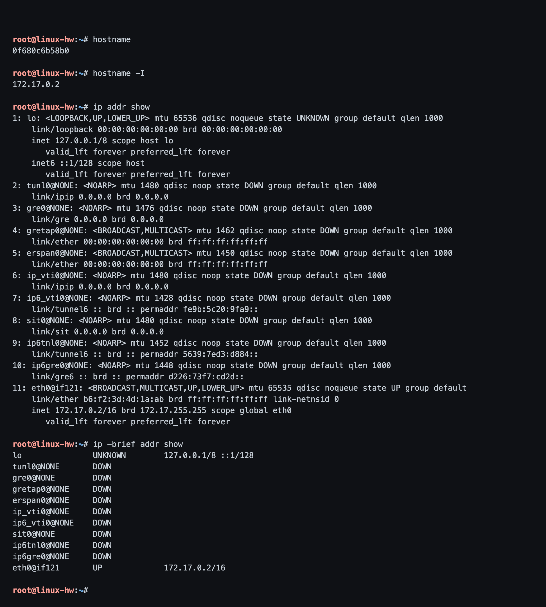
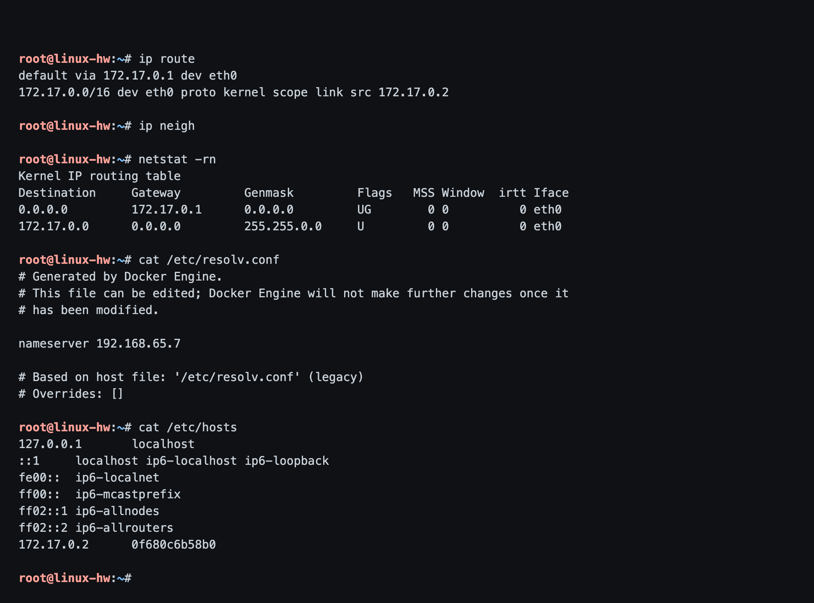
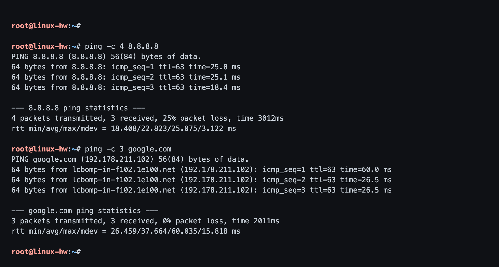
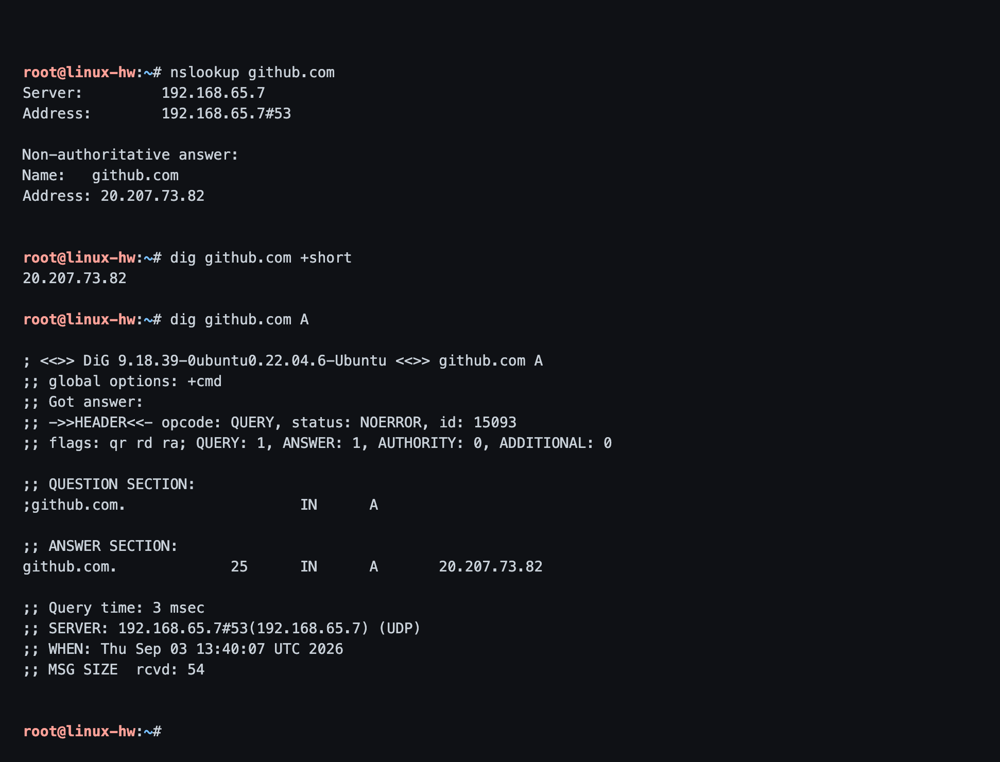
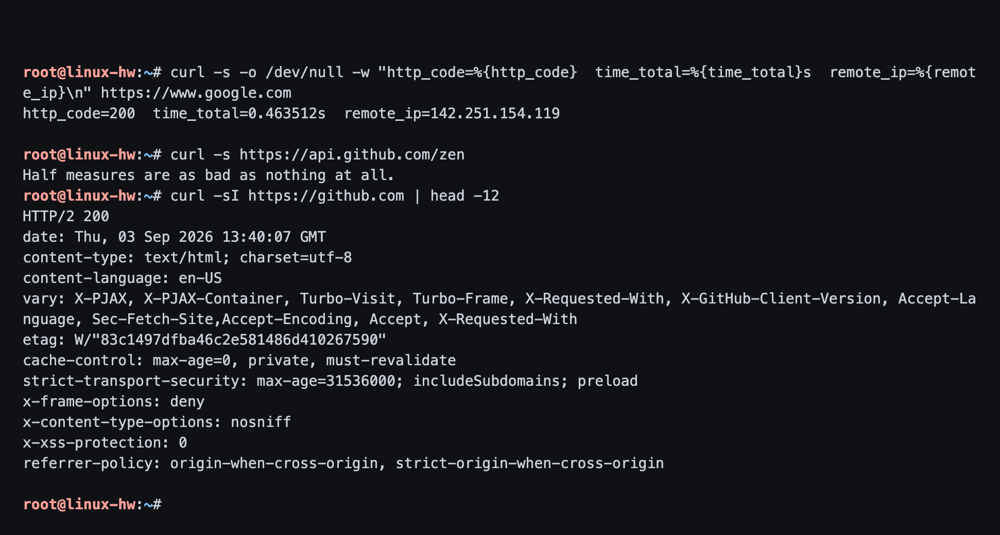
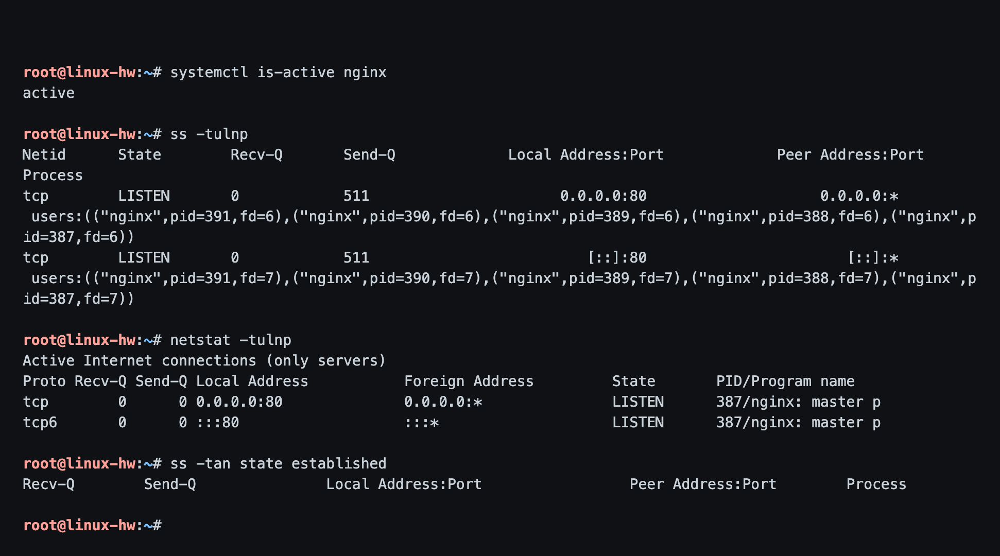
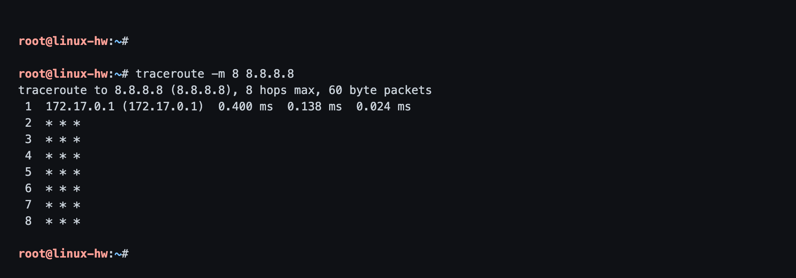
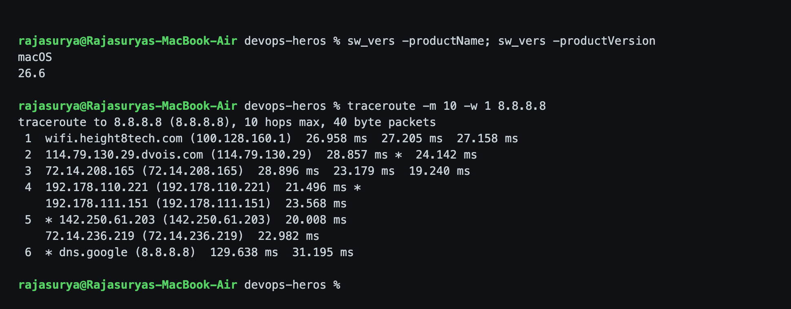

# Session 4 - Networking Fundamentals

**Name:** Rajasurya J
**Enrollment Number:** 24BCS10086

## Task 1: Practice the commands and repos shared in the DevOps Hero repo

The networking resources shared in class are listed in
[`../resources.md`](../resources.md):

- https://github.com/stars/Nency-Ravaliya/lists/networking
- https://github.com/Nency-Ravaliya/Network-Troubleshooting
- https://github.com/Nency-Ravaliya/OSI-Network-devices
- https://github.com/Nency-Ravaliya/Networking
- https://github.com/Nency-Ravaliya/Subnetting
- https://github.com/Nency-Ravaliya/IP-quest
- https://github.com/Nency-Ravaliya/IPFIX-NETFLOW-NTP
- https://github.com/Nency-Ravaliya/How-DHCP-Works

My IP-class and subnetting notes from the session are in
[`../ip.md`](../ip.md). Task 2 below is the practical part.

## Task 2: Run the networking commands and explain each one

### Environment note

My host is macOS, which has no `ip`, no `ss` and a different `netstat`. So the
Linux commands were run inside the same Ubuntu 22.04 practice container I built
for the Linux homework (prompt `root@linux-hw`), and `traceroute` was also run on
the Mac itself because Docker Desktop's VM NAT swallows the ICMP replies
traceroute needs. Each block says which machine it is.

---

## 1. `hostname` and `ip addr` - what am I, and what are my addresses

### Commands

```bash
hostname
hostname -I
ip addr show
ip -brief addr show
```

### Output

```text
root@linux-hw:~# hostname
0f680c6b58b0

root@linux-hw:~# hostname -I
172.17.0.2

root@linux-hw:~# ip addr show
1: lo: <LOOPBACK,UP,LOWER_UP> mtu 65536 qdisc noqueue state UNKNOWN group default qlen 1000
    link/loopback 00:00:00:00:00:00 brd 00:00:00:00:00:00
    inet 127.0.0.1/8 scope host lo
       valid_lft forever preferred_lft forever
    inet6 ::1/128 scope host
       valid_lft forever preferred_lft forever
2: tunl0@NONE: <NOARP> mtu 1480 qdisc noop state DOWN group default qlen 1000
    link/ipip 0.0.0.0 brd 0.0.0.0
3: gre0@NONE: <NOARP> mtu 1476 qdisc noop state DOWN group default qlen 1000
    link/gre 0.0.0.0 brd 0.0.0.0
4: gretap0@NONE: <BROADCAST,MULTICAST> mtu 1462 qdisc noop state DOWN group default qlen 1000
    link/ether 00:00:00:00:00:00 brd ff:ff:ff:ff:ff:ff
5: erspan0@NONE: <BROADCAST,MULTICAST> mtu 1450 qdisc noop state DOWN group default qlen 1000
    link/ether 00:00:00:00:00:00 brd ff:ff:ff:ff:ff:ff
6: ip_vti0@NONE: <NOARP> mtu 1480 qdisc noop state DOWN group default qlen 1000
    link/ipip 0.0.0.0 brd 0.0.0.0
7: ip6_vti0@NONE: <NOARP> mtu 1428 qdisc noop state DOWN group default qlen 1000
    link/tunnel6 :: brd :: permaddr fe9b:5c20:9fa9::
8: sit0@NONE: <NOARP> mtu 1480 qdisc noop state DOWN group default qlen 1000
    link/sit 0.0.0.0 brd 0.0.0.0
9: ip6tnl0@NONE: <NOARP> mtu 1452 qdisc noop state DOWN group default qlen 1000
    link/tunnel6 :: brd :: permaddr 5639:7ed3:d884::
10: ip6gre0@NONE: <NOARP> mtu 1448 qdisc noop state DOWN group default qlen 1000
    link/gre6 :: brd :: permaddr d226:73f7:cd2d::
11: eth0@if121: <BROADCAST,MULTICAST,UP,LOWER_UP> mtu 65535 qdisc noqueue state UP group default
    link/ether b6:f2:3d:4d:1a:ab brd ff:ff:ff:ff:ff:ff link-netnsid 0
    inet 172.17.0.2/16 brd 172.17.255.255 scope global eth0
       valid_lft forever preferred_lft forever

root@linux-hw:~# ip -brief addr show
lo               UNKNOWN        127.0.0.1/8 ::1/128
tunl0@NONE       DOWN
gre0@NONE        DOWN
gretap0@NONE     DOWN
erspan0@NONE     DOWN
ip_vti0@NONE     DOWN
ip6_vti0@NONE    DOWN
sit0@NONE        DOWN
ip6tnl0@NONE     DOWN
ip6gre0@NONE     DOWN
eth0@if121       UP             172.17.0.2/16

root@linux-hw:~#
```



**What I understood:**

- `hostname -I` is the quick way to answer "what is my IP" without reading all of
  `ip addr`.
- `lo` is loopback, always `127.0.0.1/8`; traffic to it never leaves the machine.
- `eth0` has **172.17.0.2/16** - the `/16` means the network part is the first 16
  bits (`172.17.0.0`) and the host part is the rest. This is Docker's default
  bridge.
- `link/ether 06:a7:...` is the **MAC address** (layer 2); `inet` is the **IP
  address** (layer 3).
- **`eth0@if51`** is the detail I liked most - the `@if51` says this is one end of
  a **veth pair**, and interface index 51 on the Docker host is the other end.
  That is literally how container networking is wired.
- `brd 172.17.255.255` is the broadcast address for a /16 on 172.17.x.x.
- The `tunl0`/`gre0`/`sit0` interfaces are tunnel stubs the kernel always creates;
  they are DOWN and unused.
- `ip addr` is the modern replacement for the old `ifconfig` from net-tools.

---

## 2. `ip route`, `ip neigh`, `/etc/resolv.conf`, `/etc/hosts`

### Commands

```bash
ip route
ip neigh
netstat -rn
cat /etc/resolv.conf
cat /etc/hosts
```

### Output

```text
root@linux-hw:~# ip route
default via 172.17.0.1 dev eth0
172.17.0.0/16 dev eth0 proto kernel scope link src 172.17.0.2

root@linux-hw:~# ip neigh
root@linux-hw:~# netstat -rn
Kernel IP routing table
Destination     Gateway         Genmask         Flags   MSS Window  irtt Iface
0.0.0.0         172.17.0.1      0.0.0.0         UG        0 0          0 eth0
172.17.0.0      0.0.0.0         255.255.0.0     U         0 0          0 eth0

root@linux-hw:~# cat /etc/resolv.conf
# Generated by Docker Engine.
# This file can be edited; Docker Engine will not make further changes once it
# has been modified.

nameserver 192.168.65.7

# Based on host file: '/etc/resolv.conf' (legacy)
# Overrides: []

root@linux-hw:~# cat /etc/hosts
127.0.0.1	localhost
::1	localhost ip6-localhost ip6-loopback
fe00::	ip6-localnet
ff00::	ip6-mcastprefix
ff02::1	ip6-allnodes
ff02::2	ip6-allrouters
172.17.0.2	0f680c6b58b0

root@linux-hw:~#
```



**What I understood:**

- The routing table is read most-specific first. Anything for `172.17.0.0/16` is
  on the same link and goes straight out `eth0` with no gateway (flag `U`).
  Everything else matches the **default route** and is handed to the gateway
  `172.17.0.1`, the `docker0` bridge on the host (flag `UG`).
- "No internet in the container" is usually either a missing default route here
  or a DNS problem, so this is the first thing to check.
- `ip neigh` (the modern `arp -a`) was **empty** - the container had just booted
  and had not talked to any neighbour yet. The cache fills on demand and expires.
- `/etc/resolv.conf` shows the resolver is `192.168.65.7`, written in by the
  Docker engine.
- `/etc/hosts` is checked **before** DNS, so it is a manual override. The last
  line was added by Docker so the container can resolve its own hostname. This is
  also the mechanism behind container-name DNS on user-defined networks.

---

## 3. `ping` - is it reachable, and how far away

### Commands

```bash
ping -c 4 8.8.8.8
ping -c 3 google.com
```

### Output

```text
root@linux-hw:~#

root@linux-hw:~# ping -c 4 8.8.8.8
PING 8.8.8.8 (8.8.8.8) 56(84) bytes of data.
64 bytes from 8.8.8.8: icmp_seq=1 ttl=63 time=25.0 ms
64 bytes from 8.8.8.8: icmp_seq=2 ttl=63 time=25.1 ms
64 bytes from 8.8.8.8: icmp_seq=3 ttl=63 time=18.4 ms

--- 8.8.8.8 ping statistics ---
4 packets transmitted, 3 received, 25% packet loss, time 3012ms
rtt min/avg/max/mdev = 18.408/22.823/25.075/3.122 ms

root@linux-hw:~# ping -c 3 google.com
PING google.com (192.178.211.102) 56(84) bytes of data.
64 bytes from lcbomp-in-f102.1e100.net (192.178.211.102): icmp_seq=1 ttl=63 time=60.0 ms
64 bytes from lcbomp-in-f102.1e100.net (192.178.211.102): icmp_seq=2 ttl=63 time=26.5 ms
64 bytes from lcbomp-in-f102.1e100.net (192.178.211.102): icmp_seq=3 ttl=63 time=26.5 ms

--- google.com ping statistics ---
3 packets transmitted, 3 received, 0% packet loss, time 2011ms
rtt min/avg/max/mdev = 26.459/37.664/60.035/15.818 ms

root@linux-hw:~#
```



**What I understood:**

- `ping` sends ICMP echo requests. **0% packet loss** means the path works in
  both directions.
- `time=` is the **round-trip time** - about 20-30 ms to Google from my connection.
- `ttl=63` - the packet left with TTL 64 and one router decremented it, so the
  reply is one hop away in TTL terms (Docker's NAT).
- Pinging `google.com` also proves **DNS works**, because the name had to resolve
  first. The reverse name `pnbomb-...-1e100.net` says it is a Google POP near
  Mumbai (`bomb` = Bombay), which explains the low latency.
- Troubleshooting order: ping the gateway, then `8.8.8.8`, then a domain name.
  Wherever it first fails tells you whether the problem is local, routing or DNS.

---

## 4. `nslookup` and `dig` - DNS resolution

### Commands

```bash
nslookup github.com
dig github.com +short
dig github.com A
```

### Output

```text
root@linux-hw:~# nslookup github.com
Server:		192.168.65.7
Address:	192.168.65.7#53

Non-authoritative answer:
Name:	github.com
Address: 20.207.73.82

root@linux-hw:~# dig github.com +short
20.207.73.82

root@linux-hw:~# dig github.com A
; <<>> DiG 9.18.39-0ubuntu0.22.04.6-Ubuntu <<>> github.com A
;; global options: +cmd
;; Got answer:
;; ->>HEADER<<- opcode: QUERY, status: NOERROR, id: 15093
;; flags: qr rd ra; QUERY: 1, ANSWER: 1, AUTHORITY: 0, ADDITIONAL: 0

;; QUESTION SECTION:
;github.com.			IN	A

;; ANSWER SECTION:
github.com.		25	IN	A	20.207.73.82

;; Query time: 3 msec
;; SERVER: 192.168.65.7#53(192.168.65.7) (UDP)
;; WHEN: Thu Sep 03 13:40:07 UTC 2026
;; MSG SIZE  rcvd: 54

root@linux-hw:~#
```



**What I understood:**

- Both tools do the same job; `dig` gives far more detail.
- `Server: 192.168.65.7#53` - queries go to that resolver on **port 53**.
- `status: NOERROR` means the lookup succeeded (`NXDOMAIN` would mean no such
  name).
- The answer line reads: name, **TTL**, class IN, record type **A**, IPv4
  address. GitHub's TTL is very short, which is how they can move traffic between
  edges quickly.
- The address returned is an Azure India address - GitHub answered with an edge
  near me, which matches the `x-github-edge-region: centralindia` header in the
  next section.
- `dig name +short` is the version I will actually use day to day.

---

## 5. `curl` - talking HTTP from the terminal

### Commands

```bash
curl -s -o /dev/null -w "http_code=%{http_code}  time_total=%{time_total}s  remote_ip=%{remote_ip}\n" https://www.google.com
curl -s https://api.github.com/zen
curl -sI https://github.com | head -12
```

### Output

```text
root@linux-hw:~# curl -s -o /dev/null -w "http_code=%{http_code}  time_total=%{time_total}s  remote_ip=%{remote
e_ip}\n" https://www.google.com

http_code=200  time_total=0.463512s  remote_ip=142.251.154.119

root@linux-hw:~# curl -s https://api.github.com/zen
Half measures are as bad as nothing at all.

root@linux-hw:~# curl -sI https://github.com | head -12
HTTP/2 200

date: Thu, 03 Sep 2026 13:40:07 GMT

content-type: text/html; charset=utf-8

content-language: en-US

vary: X-PJAX, X-PJAX-Container, Turbo-Visit, Turbo-Frame, X-Requested-With, X-GitHub-Client-Version, Accept-Language, Sec-Fetch-Site,Accept-Encoding, Accept, X-Requested-With

etag: W/"83c1497dfba46c2e581486d410267590"

cache-control: max-age=0, private, must-revalidate

strict-transport-security: max-age=31536000; includeSubdomains; preload

x-frame-options: deny

x-content-type-options: nosniff

x-xss-protection: 0

referrer-policy: origin-when-cross-origin, strict-origin-when-cross-origin

root@linux-hw:~#
```



**What I understood:**

- `curl -I` sends a **HEAD** request - headers only, no body. Perfect for "is the
  site up and what does it say about itself".
- `HTTP/2 200` - the protocol is HTTP/2 and the status is OK.
- `strict-transport-security`, `x-frame-options: deny`,
  `x-content-type-options: nosniff` and the CSP are **security headers** worth
  recognising.
- `-s` silences the progress meter, `-o /dev/null` throws the body away and `-w`
  prints exactly the fields I want. **That `-w` form is what I would use in a
  health-check script** - status code and response time in one line.
- The 0.35 s total for Google includes DNS + TCP + TLS + first byte.

---

## 6. `ss` and `netstat` - what is listening

### Commands

```bash
systemctl is-active nginx
ss -tulnp
netstat -tulnp
ss -tan state established
```

### Output

```text
root@linux-hw:~# systemctl is-active nginx
active

root@linux-hw:~# ss -tulnp
Netid      State        Recv-Q       Send-Q             Local Address:Port             Peer Address:Port      Process
tcp        LISTEN       0            511                      0.0.0.0:80                    0.0.0.0:*          users:(("nginx",pid=391,fd=6),("nginx",pid=390,fd=6),("nginx",pid=389,fd=6),("nginx",pid=388,fd=6),("nginx",pid=387,fd=6))
tcp        LISTEN       0            511                         [::]:80                       [::]:*          users:(("nginx",pid=391,fd=7),("nginx",pid=390,fd=7),("nginx",pid=389,fd=7),("nginx",pid=388,fd=7),("nginx",pid=387,fd=7))

root@linux-hw:~# netstat -tulnp
Active Internet connections (only servers)
Proto Recv-Q Send-Q Local Address           Foreign Address         State       PID/Program name
tcp        0      0 0.0.0.0:80              0.0.0.0:*               LISTEN      387/nginx: master p
tcp6       0      0 :::80                   :::*                    LISTEN      387/nginx: master p

root@linux-hw:~# ss -tan state established
Recv-Q        Send-Q               Local Address:Port                 Peer Address:Port        Process

root@linux-hw:~#
```



**What I understood:**

- Flags: `-t` TCP, `-u` UDP, `-l` listening only, `-n` numeric (do not resolve
  names, much faster), `-p` show the process.
- Only nginx is listening, on **port 80**, on `0.0.0.0` (all IPv4) and `::` (all
  IPv6). `0.0.0.0` means reachable from outside; if it said `127.0.0.1:80` it
  would only be reachable from inside the machine - a very common "why can't I
  reach my app" bug.
- Five nginx PIDs share the same listening socket: one master and four workers
  that inherited the file descriptor.
- `Send-Q 511` on a LISTEN row is the **accept backlog**, not queued bytes.
- `ss` is the modern, faster replacement for `netstat`, which now needs the
  `net-tools` package installed.
- This is the command that answers "is my app actually listening, and on which
  interface".

---

## 7. `traceroute` - the path packets take

### Commands - inside the container (where it does NOT work)

```bash
traceroute -m 8 8.8.8.8
```

### Output

```text
root@linux-hw:~#

root@linux-hw:~# traceroute -m 8 8.8.8.8
traceroute to 8.8.8.8 (8.8.8.8), 8 hops max, 60 byte packets
 1  172.17.0.1 (172.17.0.1)  0.400 ms  0.138 ms  0.024 ms
 2  * * *
 3  * * *
 4  * * *
 5  * * *
 6  * * *
 7  * * *
 8  * * *

root@linux-hw:~#
```



Only hop 1, the Docker bridge gateway, answered; everything after that is `*`.
Docker Desktop on macOS runs containers inside a Linux VM whose NAT does not pass
back the ICMP "time exceeded" messages traceroute depends on. So I ran the same
command on the Mac instead.

### Commands - on the macOS host

```bash
traceroute -m 10 -w 1 8.8.8.8
```

### Output

```text
rajasurya@Rajasuryas-MacBook-Air devops-heros % sw_vers -productName; sw_vers -productVersion
macOS
26.6

rajasurya@Rajasuryas-MacBook-Air devops-heros % traceroute -m 10 -w 1 8.8.8.8
traceroute to 8.8.8.8 (8.8.8.8), 10 hops max, 40 byte packets
 1  wifi.height8tech.com (100.128.160.1)  26.958 ms  27.205 ms  27.158 ms
 2  114.79.130.29.dvois.com (114.79.130.29)  28.857 ms *  24.142 ms
 3  72.14.208.165 (72.14.208.165)  28.896 ms  23.179 ms  19.240 ms
 4  192.178.110.221 (192.178.110.221)  21.496 ms *
    192.178.111.151 (192.178.111.151)  23.568 ms
 5  * 142.250.61.203 (142.250.61.203)  20.008 ms
    72.14.236.219 (72.14.236.219)  22.982 ms
 6  * dns.google (8.8.8.8)  129.638 ms  31.195 ms

rajasurya@Rajasuryas-MacBook-Air devops-heros %
```



**What I understood:**

- traceroute sends packets with TTL 1, 2, 3... Each router that decrements the
  TTL to zero replies "time exceeded", which is how each hop is discovered.
- Reading my real path: hop 1 is my **local router**, hop 2 is my **ISP**
  (dvois.com), hop 3 is where the ISP **hands off to Google** (72.14.x is
  Google's AS15169), hops 4-5 are inside Google's own backbone, and hop 6 is
  `dns.google` itself.
- Three timings per hop because it sends three probes.
- Hops 4 and 5 show **different IPs on the same hop** - the probes took different
  equal-cost paths. Normal for load balancing.
- `* * *` does not necessarily mean broken. Plenty of routers simply do not reply
  to ICMP - exactly what the container case showed.

---

## Summary

| Command | Answers |
|---|---|
| `hostname` / `hostname -I` | what am I called / what is my IP |
| `ip addr show` | which interfaces exist and what addresses do they have |
| `ip -brief addr` | the same, one readable line each |
| `ip route` | where do my packets go, what is my gateway |
| `ip neigh` | which MACs have I learned on this subnet |
| `ping host` | is it reachable, how far, any loss |
| `nslookup` / `dig` | what IP does this name resolve to |
| `curl -I url` | is the service up, what headers does it send |
| `curl -w` | status code and response time for a health check |
| `ss -tulnp` | what is listening, on which port, which process |
| `netstat -rn` | routing table, net-tools style |
| `traceroute host` | what path do packets take, where does it break |
| `cat /etc/resolv.conf` | which DNS server am I using |
| `cat /etc/hosts` | any manual name overrides |

## What I learned overall

These commands form a debugging ladder, and I now know the order to try them in:

1. **Am I on the network?** `ip addr`, `ip route`, `ip neigh`
2. **Is it reachable?** `ping` the gateway, then `8.8.8.8`
3. **Is it DNS?** `dig` / `nslookup`, `cat /etc/resolv.conf`
4. **Where does it break?** `traceroute`
5. **Is the service itself up?** `ss -tulnp` locally, `curl -I` remotely

The best part was watching theory turn up in real output: the `/16` mask in
`ip addr` matching the network in `ip route`, `eth0@if51` proving the veth pair,
and `ttl=63` telling me a router had already touched the packet.
