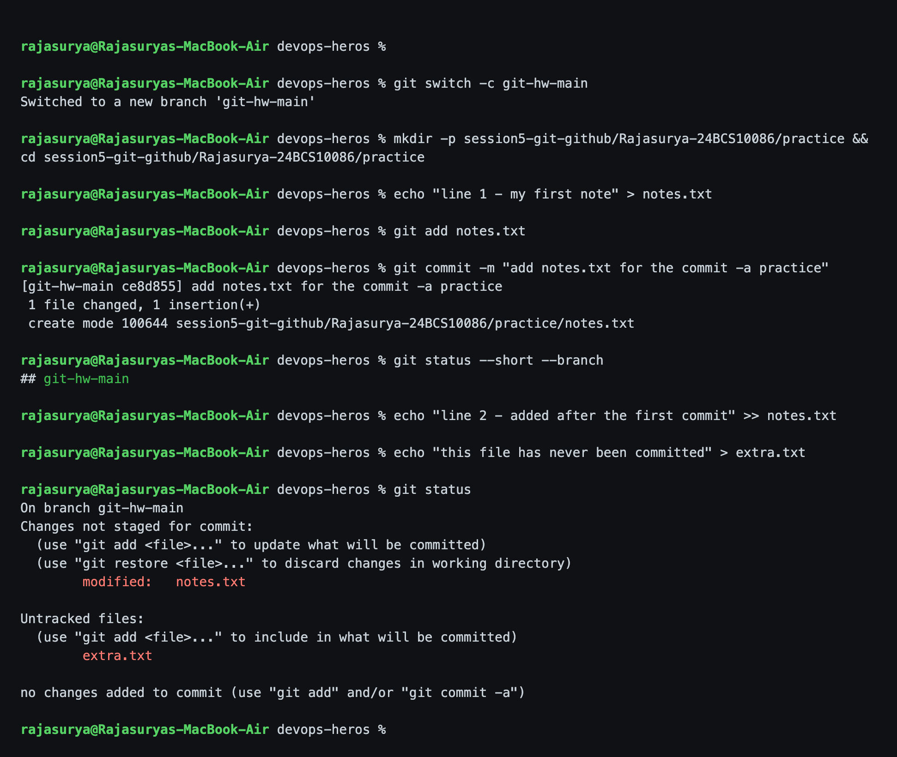
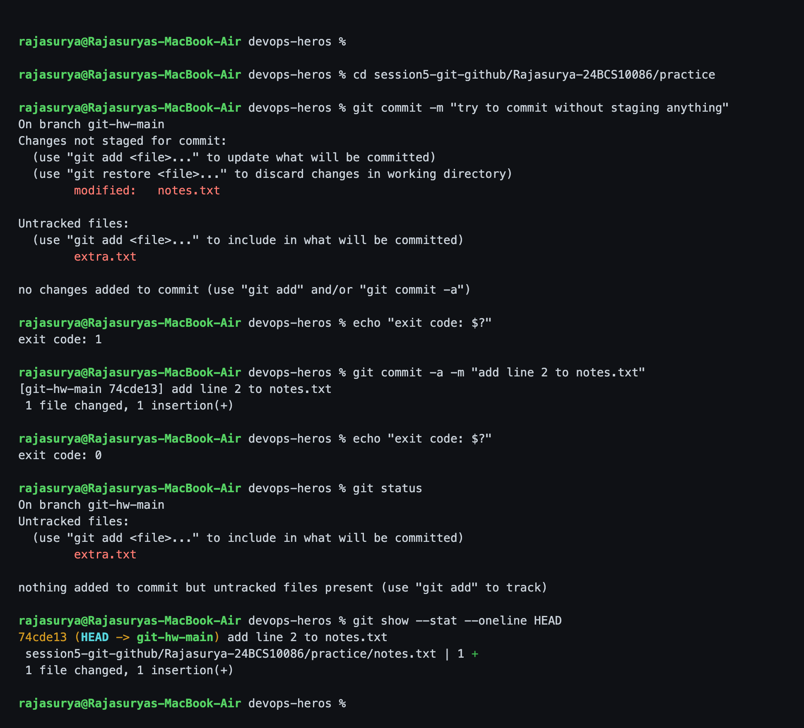
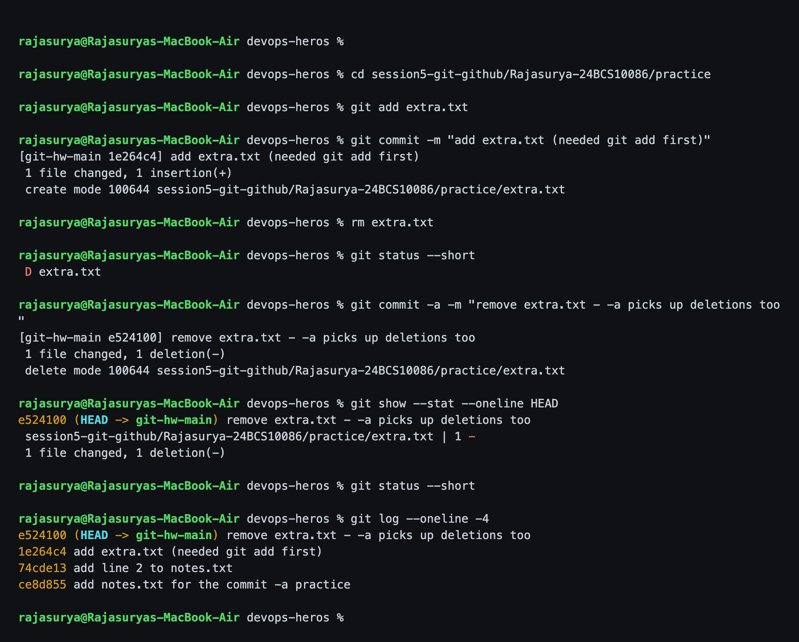
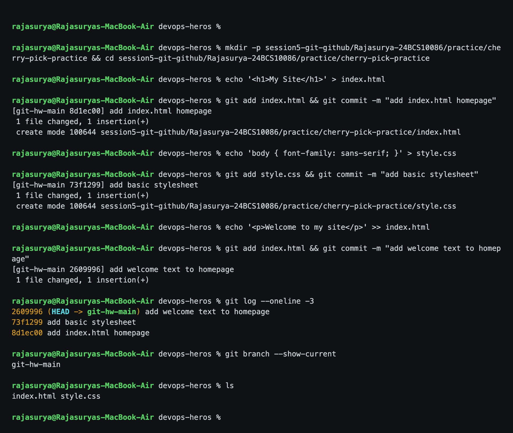
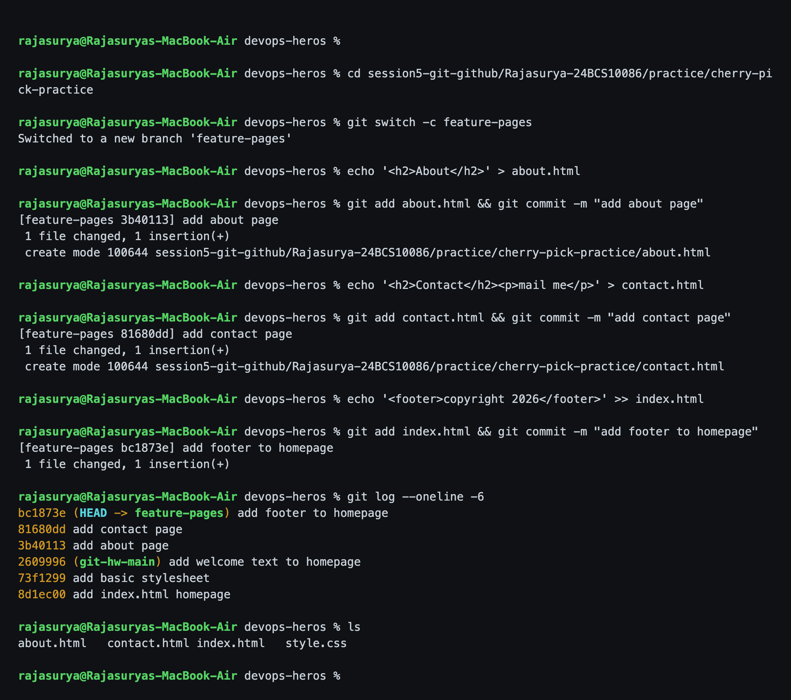
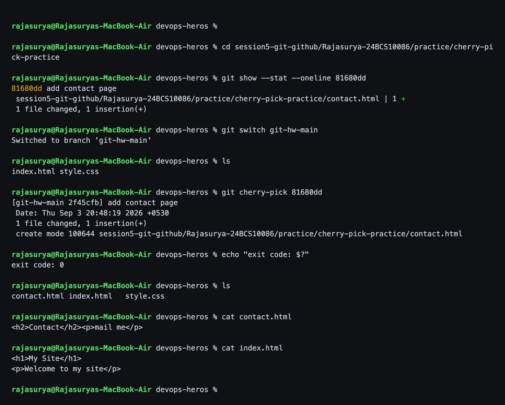
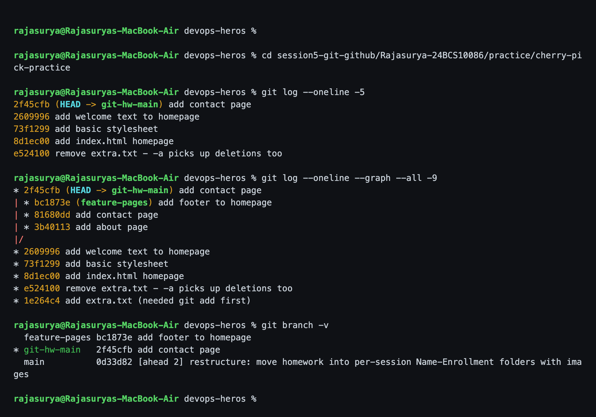

# Session 5 - Git and GitHub

**Name:** Rajasurya J
**Enrollment Number:** 24BCS10086

## Where I did this

Both tasks were done in this repository, on a separate branch called
**`git-hw-main`** so the practice commits do not clutter the real `main`. For the
cherry-pick task `git-hw-main` plays the role of "main" and `feature-pages` is
the new branch. Both branches are pushed, so every hash below can be checked:

- [`git-hw-main`](https://github.com/rajasurya-rjs/devops-heros/commits/git-hw-main)
- [`feature-pages`](https://github.com/rajasurya-rjs/devops-heros/commits/feature-pages)

```bash
git clone https://github.com/rajasurya-rjs/devops-heros.git
cd devops-heros
git log --oneline --graph --all
```

The practice files live in `session5-git-github/Rajasurya-24BCS10086/practice/`
on those two branches.

---

## Task 1: git commit -a -m

- Practice `git commit -a -m "message"`.
- Understand the difference between `git commit -a -m` and `git commit -m`.
- Test both commands and observe the difference.

### Commands

Set up a tracked file, then make **two different kinds of change** - modify the
tracked file *and* create a brand new untracked one:

```bash
git switch -c git-hw-main
mkdir -p session5-git-github/Rajasurya-24BCS10086/practice
cd session5-git-github/Rajasurya-24BCS10086/practice
echo "line 1 - my first note" > notes.txt
git add notes.txt
git commit -m "add notes.txt for the commit -a practice"

echo "line 2 - added after the first commit" >> notes.txt   # modify a TRACKED file
echo "this file has never been committed" > extra.txt       # create an UNTRACKED file
git status
```

### Output

```text
rajasurya@Rajasuryas-MacBook-Air devops-heros %

rajasurya@Rajasuryas-MacBook-Air devops-heros % git switch -c git-hw-main
Switched to a new branch 'git-hw-main'

rajasurya@Rajasuryas-MacBook-Air devops-heros % mkdir -p session5-git-github/Rajasurya-24BCS10086/practice &&
cd session5-git-github/Rajasurya-24BCS10086/practice

rajasurya@Rajasuryas-MacBook-Air devops-heros % echo "line 1 - my first note" > notes.txt
rajasurya@Rajasuryas-MacBook-Air devops-heros % git add notes.txt
rajasurya@Rajasuryas-MacBook-Air devops-heros % git commit -m "add notes.txt for the commit -a practice"
[git-hw-main ce8d855] add notes.txt for the commit -a practice
 1 file changed, 1 insertion(+)
 create mode 100644 session5-git-github/Rajasurya-24BCS10086/practice/notes.txt

rajasurya@Rajasuryas-MacBook-Air devops-heros % git status --short --branch
## git-hw-main

rajasurya@Rajasuryas-MacBook-Air devops-heros % echo "line 2 - added after the first commit" >> notes.txt
rajasurya@Rajasuryas-MacBook-Air devops-heros % echo "this file has never been committed" > extra.txt
rajasurya@Rajasuryas-MacBook-Air devops-heros % git status
On branch git-hw-main
Changes not staged for commit:
  (use "git add <file>..." to update what will be committed)
  (use "git restore <file>..." to discard changes in working directory)
	modified:   notes.txt

Untracked files:
  (use "git add <file>..." to include in what will be committed)
	extra.txt

no changes added to commit (use "git add" and/or "git commit -a")

rajasurya@Rajasuryas-MacBook-Air devops-heros %
```



`git status` shows them in two separate sections: `notes.txt` is **modified but
not staged**, `extra.txt` is **untracked**. That is the setup that makes the
difference visible.

### Commands

Now run both commands and compare:

```bash
git commit -m "try to commit without staging anything"
git commit -a -m "add line 2 to notes.txt"
git status
git show --stat --oneline HEAD
```

### Output

```text
rajasurya@Rajasuryas-MacBook-Air devops-heros %

rajasurya@Rajasuryas-MacBook-Air devops-heros % cd session5-git-github/Rajasurya-24BCS10086/practice
rajasurya@Rajasuryas-MacBook-Air devops-heros % git commit -m "try to commit without staging anything"
On branch git-hw-main
Changes not staged for commit:
  (use "git add <file>..." to update what will be committed)
  (use "git restore <file>..." to discard changes in working directory)
	modified:   notes.txt

Untracked files:
  (use "git add <file>..." to include in what will be committed)
	extra.txt

no changes added to commit (use "git add" and/or "git commit -a")

rajasurya@Rajasuryas-MacBook-Air devops-heros % echo "exit code: $?"
exit code: 1

rajasurya@Rajasuryas-MacBook-Air devops-heros % git commit -a -m "add line 2 to notes.txt"
[git-hw-main 74cde13] add line 2 to notes.txt
 1 file changed, 1 insertion(+)

rajasurya@Rajasuryas-MacBook-Air devops-heros % echo "exit code: $?"
exit code: 0

rajasurya@Rajasuryas-MacBook-Air devops-heros % git status
On branch git-hw-main
Untracked files:
  (use "git add <file>..." to include in what will be committed)
	extra.txt

nothing added to commit but untracked files present (use "git add" to track)

rajasurya@Rajasuryas-MacBook-Air devops-heros % git show --stat --oneline HEAD
74cde13 (HEAD -> git-hw-main) add line 2 to notes.txt
 session5-git-github/Rajasurya-24BCS10086/practice/notes.txt | 1 +
 1 file changed, 1 insertion(+)

rajasurya@Rajasuryas-MacBook-Air devops-heros %
```



This is the whole answer:

- **`git commit -m` refused** - `no changes added to commit`, **exit code 1**. It
  only commits what is already in the **staging area (index)**, and I had not run
  `git add`. Git even names the two ways out: `git add` or `git commit -a`.
- **`git commit -a -m` worked** - but look at `git show --stat`: **1 file
  changed**, and that file is `notes.txt`. Not two files.
- `git status` afterwards still shows **`extra.txt` untracked**. `-a` auto-stages
  **tracked** files, and a brand new file is not tracked yet, so `-a` ignores it
  completely.

### Commands

The new file needs an explicit `git add`. And `-a` also picks up **deletions**:

```bash
git add extra.txt
git commit -m "add extra.txt (needed git add first)"
rm extra.txt
git status --short
git commit -a -m "remove extra.txt - -a picks up deletions too"
git show --stat --oneline HEAD
git log --oneline -4
```

### Output

```text
rajasurya@Rajasuryas-MacBook-Air devops-heros %

rajasurya@Rajasuryas-MacBook-Air devops-heros % cd session5-git-github/Rajasurya-24BCS10086/practice
rajasurya@Rajasuryas-MacBook-Air devops-heros % git add extra.txt
rajasurya@Rajasuryas-MacBook-Air devops-heros % git commit -m "add extra.txt (needed git add first)"
[git-hw-main 1e264c4] add extra.txt (needed git add first)
 1 file changed, 1 insertion(+)
 create mode 100644 session5-git-github/Rajasurya-24BCS10086/practice/extra.txt

rajasurya@Rajasuryas-MacBook-Air devops-heros % rm extra.txt
rajasurya@Rajasuryas-MacBook-Air devops-heros % git status --short
 D extra.txt

rajasurya@Rajasuryas-MacBook-Air devops-heros % git commit -a -m "remove extra.txt - -a picks up deletions too
"
[git-hw-main e524100] remove extra.txt - -a picks up deletions too
 1 file changed, 1 deletion(-)
 delete mode 100644 session5-git-github/Rajasurya-24BCS10086/practice/extra.txt

rajasurya@Rajasuryas-MacBook-Air devops-heros % git show --stat --oneline HEAD
e524100 (HEAD -> git-hw-main) remove extra.txt - -a picks up deletions too
 session5-git-github/Rajasurya-24BCS10086/practice/extra.txt | 1 -
 1 file changed, 1 deletion(-)

rajasurya@Rajasuryas-MacBook-Air devops-heros % git status --short
rajasurya@Rajasuryas-MacBook-Air devops-heros % git log --oneline -4
e524100 (HEAD -> git-hw-main) remove extra.txt - -a picks up deletions too
1e264c4 add extra.txt (needed git add first)
74cde13 add line 2 to notes.txt
ce8d855 add notes.txt for the commit -a practice

rajasurya@Rajasuryas-MacBook-Air devops-heros %
```



I never ran `git rm` or `git add` for the deletion - `-a` staged it by itself,
because deleting a tracked file is a change to a tracked file.

### Summary

| | `git commit -m` | `git commit -a -m` |
|---|---|---|
| Modified tracked file | ignored unless you `git add` | **staged automatically** |
| Deleted tracked file | ignored unless you `git add`/`git rm` | **staged automatically** |
| **New untracked file** | ignored | **still ignored** |
| Needs `git add` first? | yes | only for new files |
| Nothing staged | fails, exit code 1 | commits the tracked changes |

**In one line:** `-a` means "stage every change to files git already knows about,
then commit". It is shorthand for `git add -u && git commit`, **not** for
`git add . && git commit`.

**Interview point:** `-a` is convenient but blunt - it sweeps up *every* modified
tracked file, so it is easy to commit a stray debug print or config change you
did not mean to include. `git status` before committing, and `git add` for
specific files, is the safer habit. And you can never rely on `-a` when you have
added new files.

---

## Task 2: Git Cherry-Pick

- Create 2-4 commits in the main branch.
- Use `git log` to view the commits.
- Create a new branch and make 2-3 commits there.
- Use `git log` to identify a specific commit.
- Cherry-pick one specific commit into the main branch.
- Verify the change is now in the main branch.

### Commands - three commits on the main branch

```bash
mkdir -p cherry-pick-practice && cd cherry-pick-practice
echo '<h1>My Site</h1>' > index.html
git add index.html && git commit -m "add index.html homepage"
echo 'body { font-family: sans-serif; }' > style.css
git add style.css && git commit -m "add basic stylesheet"
echo '<p>Welcome to my site</p>' >> index.html
git add index.html && git commit -m "add welcome text to homepage"
git log --oneline -3
```

### Output

```text
rajasurya@Rajasuryas-MacBook-Air devops-heros %

rajasurya@Rajasuryas-MacBook-Air devops-heros % mkdir -p session5-git-github/Rajasurya-24BCS10086/practice/che
rry-pick-practice && cd session5-git-github/Rajasurya-24BCS10086/practice/cherry-pick-practice

rajasurya@Rajasuryas-MacBook-Air devops-heros % echo '<h1>My Site</h1>' > index.html
rajasurya@Rajasuryas-MacBook-Air devops-heros % git add index.html && git commit -m "add index.html homepage"
[git-hw-main 8d1ec00] add index.html homepage
 1 file changed, 1 insertion(+)
 create mode 100644 session5-git-github/Rajasurya-24BCS10086/practice/cherry-pick-practice/index.html

rajasurya@Rajasuryas-MacBook-Air devops-heros % echo 'body { font-family: sans-serif; }' > style.css
rajasurya@Rajasuryas-MacBook-Air devops-heros % git add style.css && git commit -m "add basic stylesheet"
[git-hw-main 73f1299] add basic stylesheet
 1 file changed, 1 insertion(+)
 create mode 100644 session5-git-github/Rajasurya-24BCS10086/practice/cherry-pick-practice/style.css

rajasurya@Rajasuryas-MacBook-Air devops-heros % echo '<p>Welcome to my site</p>' >> index.html
rajasurya@Rajasuryas-MacBook-Air devops-heros % git add index.html && git commit -m "add welcome text to homep
age"
[git-hw-main 2609996] add welcome text to homepage
 1 file changed, 1 insertion(+)

rajasurya@Rajasuryas-MacBook-Air devops-heros % git log --oneline -3
2609996 (HEAD -> git-hw-main) add welcome text to homepage
73f1299 add basic stylesheet
8d1ec00 add index.html homepage

rajasurya@Rajasuryas-MacBook-Air devops-heros % git branch --show-current
git-hw-main

rajasurya@Rajasuryas-MacBook-Air devops-heros % ls
index.html style.css

rajasurya@Rajasuryas-MacBook-Air devops-heros %
```



### Commands - a new branch with three more commits

```bash
git switch -c feature-pages
echo '<h2>About</h2>' > about.html
git add about.html && git commit -m "add about page"
echo '<h2>Contact</h2><p>mail me</p>' > contact.html
git add contact.html && git commit -m "add contact page"
echo '<footer>copyright 2026</footer>' >> index.html
git add index.html && git commit -m "add footer to homepage"
git log --oneline -6
ls
```

### Output

```text
rajasurya@Rajasuryas-MacBook-Air devops-heros %

rajasurya@Rajasuryas-MacBook-Air devops-heros % cd session5-git-github/Rajasurya-24BCS10086/practice/cherry-pi
ck-practice

rajasurya@Rajasuryas-MacBook-Air devops-heros % git switch -c feature-pages
Switched to a new branch 'feature-pages'

rajasurya@Rajasuryas-MacBook-Air devops-heros % echo '<h2>About</h2>' > about.html
rajasurya@Rajasuryas-MacBook-Air devops-heros % git add about.html && git commit -m "add about page"
[feature-pages 3b40113] add about page
 1 file changed, 1 insertion(+)
 create mode 100644 session5-git-github/Rajasurya-24BCS10086/practice/cherry-pick-practice/about.html

rajasurya@Rajasuryas-MacBook-Air devops-heros % echo '<h2>Contact</h2><p>mail me</p>' > contact.html
rajasurya@Rajasuryas-MacBook-Air devops-heros % git add contact.html && git commit -m "add contact page"
[feature-pages 81680dd] add contact page
 1 file changed, 1 insertion(+)
 create mode 100644 session5-git-github/Rajasurya-24BCS10086/practice/cherry-pick-practice/contact.html

rajasurya@Rajasuryas-MacBook-Air devops-heros % echo '<footer>copyright 2026</footer>' >> index.html
rajasurya@Rajasuryas-MacBook-Air devops-heros % git add index.html && git commit -m "add footer to homepage"
[feature-pages bc1873e] add footer to homepage
 1 file changed, 1 insertion(+)

rajasurya@Rajasuryas-MacBook-Air devops-heros % git log --oneline -6
bc1873e (HEAD -> feature-pages) add footer to homepage
81680dd add contact page
3b40113 add about page
2609996 (git-hw-main) add welcome text to homepage
73f1299 add basic stylesheet
8d1ec00 add index.html homepage

rajasurya@Rajasuryas-MacBook-Air devops-heros % ls
about.html   contact.html index.html   style.css

rajasurya@Rajasuryas-MacBook-Air devops-heros %
```



Six commits now, and the branch has `about.html`, `contact.html` and a footer.

### Commands - identify one commit and cherry-pick it

I only want the **contact page** on main - not the about page, not the footer.
That is commit **`81680dd`**.

```bash
git show --stat --oneline 81680dd
git switch git-hw-main
ls                       # only the original two files
git cherry-pick 81680dd
ls                       # contact.html is now here
cat contact.html
cat index.html
```

### Output

```text
rajasurya@Rajasuryas-MacBook-Air devops-heros %

rajasurya@Rajasuryas-MacBook-Air devops-heros % cd session5-git-github/Rajasurya-24BCS10086/practice/cherry-pi
ck-practice

rajasurya@Rajasuryas-MacBook-Air devops-heros % git show --stat --oneline 81680dd
81680dd add contact page
 session5-git-github/Rajasurya-24BCS10086/practice/cherry-pick-practice/contact.html | 1 +
 1 file changed, 1 insertion(+)

rajasurya@Rajasuryas-MacBook-Air devops-heros % git switch git-hw-main
Switched to branch 'git-hw-main'

rajasurya@Rajasuryas-MacBook-Air devops-heros % ls
index.html style.css

rajasurya@Rajasuryas-MacBook-Air devops-heros % git cherry-pick 81680dd
[git-hw-main 2f45cfb] add contact page
 Date: Thu Sep 3 20:48:19 2026 +0530
 1 file changed, 1 insertion(+)
 create mode 100644 session5-git-github/Rajasurya-24BCS10086/practice/cherry-pick-practice/contact.html

rajasurya@Rajasuryas-MacBook-Air devops-heros % echo "exit code: $?"
exit code: 0

rajasurya@Rajasuryas-MacBook-Air devops-heros % ls
contact.html index.html   style.css

rajasurya@Rajasuryas-MacBook-Air devops-heros % cat contact.html
<h2>Contact</h2><p>mail me</p>

rajasurya@Rajasuryas-MacBook-Air devops-heros % cat index.html
<h1>My Site</h1>
<p>Welcome to my site</p>

rajasurya@Rajasuryas-MacBook-Air devops-heros %
```



### Commands - verify

```bash
git log --oneline -5
git log --oneline --graph --all -9
git branch -v
```

### Output

```text
rajasurya@Rajasuryas-MacBook-Air devops-heros %

rajasurya@Rajasuryas-MacBook-Air devops-heros % cd session5-git-github/Rajasurya-24BCS10086/practice/cherry-pi
ck-practice

rajasurya@Rajasuryas-MacBook-Air devops-heros % git log --oneline -5
2f45cfb (HEAD -> git-hw-main) add contact page
2609996 add welcome text to homepage
73f1299 add basic stylesheet
8d1ec00 add index.html homepage
e524100 remove extra.txt - -a picks up deletions too

rajasurya@Rajasuryas-MacBook-Air devops-heros % git log --oneline --graph --all -9
* 2f45cfb (HEAD -> git-hw-main) add contact page
| * bc1873e (feature-pages) add footer to homepage
| * 81680dd add contact page
| * 3b40113 add about page
|/
* 2609996 add welcome text to homepage
* 73f1299 add basic stylesheet
* 8d1ec00 add index.html homepage
* e524100 remove extra.txt - -a picks up deletions too
* 1e264c4 add extra.txt (needed git add first)

rajasurya@Rajasuryas-MacBook-Air devops-heros % git branch -v
  feature-pages bc1873e add footer to homepage
* git-hw-main   2f45cfb add contact page
  main          0d33d82 [ahead 2] restructure: move homework into per-session Name-Enrollment folders with ima ges

rajasurya@Rajasuryas-MacBook-Air devops-heros %
```



### What this proves

1. **Only one commit came across.** `ls` on `git-hw-main` shows `contact.html`
   but **not** `about.html`, and `cat index.html` has **no `<footer>` line**. The
   other two commits were left behind - exactly the one change I asked for.

2. **The hash changed: `81680dd` -> `2f45cfb`.** Same message, same diff, but a
   **different commit object**, because a commit hash is computed from its
   content *and its parent*, and the copy has a different parent. Cherry-pick
   does not move a commit; it **replays the diff as a brand new commit**.

3. The graph shows the two lines of history diverging at `2609996`, with
   `add contact page` appearing on **both** sides - once as the original
   `81680dd` and once as the replayed `2f45cfb`.

## Command reference from this homework

| Command | What it does |
|---|---|
| `git status` | what is modified / staged / untracked |
| `git status --short` | the compact two-column version |
| `git add <file>` | stage a specific file (the only way to add a new file) |
| `git commit -m "msg"` | commit **only what is staged** |
| `git commit -a -m "msg"` | auto-stage tracked modifications + deletions, then commit |
| `git log --oneline` | compact history |
| `git log --oneline --graph --all` | all branches with the branch structure |
| `git show --stat <hash>` | what one commit changed |
| `git switch -c <branch>` | create a branch and move to it |
| `git switch <branch>` | move to an existing branch |
| `git branch -v` | branches with their latest commit |
| `git cherry-pick <hash>` | replay one commit onto the current branch |
| `git cherry-pick --abort` | back out of a cherry-pick that hit a conflict |

## What I learned

- `-a` is `git add -u`, not `git add .`. It never picks up new files, and the
  `git show --stat` output proving "1 file changed" made that concrete.
- `git cherry-pick <hash>` means "take the change this one commit made and apply
  it here" - useful for pulling a single bugfix from a feature branch into a
  release branch without dragging the half-finished features along.
- The hash **always** changes, so the same change now exists twice in the repo.
  If the feature branch is merged later git usually notices the identical patch,
  but it can also conflict - which is why cherry-pick is for exceptions, not a
  substitute for merging.
- `git log --oneline --graph --all` is the command that makes any of this make
  sense. Without `--graph` I could not see that the branches had diverged.
- Mine applied cleanly because `contact.html` was a brand new file nothing else
  touched. If it conflicted I would fix the files and run
  `git cherry-pick --continue`, or `--abort` to back out.
