# Session 6 - Docker Fundamentals (Hello World Applications)

**Name:** Rajasurya J
**Enrollment Number:** 24BCS10086

## Task: Hello World Applications

Create simple Hello World web applications using Docker for Node.js, Python,
Java, Apache, React and Nginx. Each in its own folder, each with a Dockerfile,
each built, run and verified in a browser.

## Folder structure

```
session6-docker/Rajasurya-24BCS10086/
├── nodejs-app/     Express on node:22-alpine        -> container port 3000
├── python-app/     Flask on python:3.12-slim        -> container port 5000
├── java-app/       JDK built-in HTTP server          -> container port 8080
├── Apache-app/     httpd:2.4 + static HTML           -> container port 80
├── React-app/      Vite build -> nginx (multi-stage) -> container port 80
├── nginx-app/      nginx:alpine + static HTML        -> container port 80
└── images/         screenshots
```

## Ports

I ran all six at the same time, so each needed a different host port:

| App | Image | Container | Host port | URL |
|---|---|---|---|---|
| nodejs-app | `hw-nodejs-app` | `hw-nodejs` | 3001 | http://localhost:3001 |
| python-app | `hw-python-app` | `hw-python` | 3002 | http://localhost:3002 |
| java-app | `hw-java-app` | `hw-java` | 3003 | http://localhost:3003 |
| Apache-app | `hw-apache-app` | `hw-apache` | 3004 | http://localhost:3004 |
| React-app | `hw-react-app` | `hw-react` | 3005 | http://localhost:3005 |
| nginx-app | `hw-nginx-app` | `hw-nginx` | 3006 | http://localhost:3006 |

---

## Building the images

### Commands

```bash
cd session6-docker/Rajasurya-24BCS10086
docker build -t hw-nodejs-app nodejs-app
docker build -t hw-python-app python-app
```

### Output

```text
rajasurya@Rajasuryas-MacBook-Air devops-heros %

rajasurya@Rajasuryas-MacBook-Air devops-heros % cd session6-docker/Rajasurya-24BCS10086
rajasurya@Rajasuryas-MacBook-Air devops-heros % ls
Apache-app README.md  React-app  images     java-app   nginx-app  nodejs-app python-app

rajasurya@Rajasuryas-MacBook-Air devops-heros % docker build -t hw-nodejs-app nodejs-app
[+] Building 0.0s (0/1)                                                                  docker:desktop-linux
[+] Building 0.2s (2/2)                                                                  docker:desktop-linux
 => [internal] load build definition from Dockerfile                                                     0.0s
 => => transferring dockerfile: 297B                                                                     0.0s
 => [internal] load metadata for docker.io/library/node:22-alpine                                        0.1s
[+] Building 0.3s (9/10)                                                                 docker:desktop-linux
 => [internal] load build definition from Dockerfile                                                     0.0s
 => => transferring dockerfile: 297B                                                                     0.0s
 => [internal] load metadata for docker.io/library/node:22-alpine                                        0.1s
 => [internal] load .dockerignore                                                                        0.0s
 => => transferring context: 67B                                                                         0.0s
 => [1/5] FROM docker.io/library/node:22-alpine@sha256:c610fcdfb1d5b4740dd70c284ed3cb16bb857e0f7166196e  0.0s
 => => resolve docker.io/library/node:22-alpine@sha256:c610fcdfb1d5b4740dd70c284ed3cb16bb857e0f7166196e  0.0s
 => [internal] load build context                                                                        0.0s
 => => transferring context: 63B                                                                         0.0s
 => CACHED [2/5] WORKDIR /app                                                                            0.0s
 => CACHED [3/5] COPY package.json ./                                                                    0.0s
 => CACHED [4/5] RUN npm install --omit=dev                                                              0.0s
 => CACHED [5/5] COPY server.js ./                                                                       0.0s
 => exporting to image                                                                                   0.0s
 => => exporting layers                                                                                  0.0s
 => => exporting manifest sha256:593b9631155fe121b009942aa73454d651555b7e22e8a603244ff8ab82fe8ffb        0.0s
 => => exporting config sha256:4b2dbe175ee5e481cfeac9c441d226db834566d5a28bb9ed176c96dc238e8fdf          0.0s
[+] Building 0.5s (9/10)                                                                 docker:desktop-linux
 => [internal] load build definition from Dockerfile                                                     0.0s
 => => transferring dockerfile: 297B                                                                     0.0s
 => [internal] load metadata for docker.io/library/node:22-alpine                                        0.1s
 => [internal] load .dockerignore                                                                        0.0s
 => => transferring context: 67B                                                                         0.0s
 => [1/5] FROM docker.io/library/node:22-alpine@sha256:c610fcdfb1d5b4740dd70c284ed3cb16bb857e0f7166196e  0.0s
 => => resolve docker.io/library/node:22-alpine@sha256:c610fcdfb1d5b4740dd70c284ed3cb16bb857e0f7166196e  0.0s
 => [internal] load build context                                                                        0.0s
 => => transferring context: 63B                                                                         0.0s
 => CACHED [2/5] WORKDIR /app                                                                            0.0s
 => CACHED [3/5] COPY package.json ./                                                                    0.0s
 => CACHED [4/5] RUN npm install --omit=dev                                                              0.0s
 => CACHED [5/5] COPY server.js ./                                                                       0.0s
 => exporting to image                                                                                   0.2s
 => => exporting layers                                                                                  0.0s
 => => exporting manifest sha256:593b9631155fe121b009942aa73454d651555b7e22e8a603244ff8ab82fe8ffb        0.0s
 => => exporting config sha256:4b2dbe175ee5e481cfeac9c441d226db834566d5a28bb9ed176c96dc238e8fdf          0.0s
 => => exporting attestation manifest sha256:8fcae18bd5537a64516f7a8609456a764da0b0465f661b83fba18a663c  0.0s
 => => exporting manifest list sha256:f7f0ee84cf66f5fc74449b1a4d198292db196b4aeb34d63441a99eceb5347522   0.0s
 => => naming to docker.io/library/hw-nodejs-app:latest                                                  0.0s
 => => unpacking to docker.io/library/hw-nodejs-app:latest                                               0.2s
[+] Building 0.6s (9/10)                                                                 docker:desktop-linux
 => [internal] load build definition from Dockerfile                                                     0.0s
 => => transferring dockerfile: 297B                                                                     0.0s
 => [internal] load metadata for docker.io/library/node:22-alpine                                        0.1s
 => [internal] load .dockerignore                                                                        0.0s
 => => transferring context: 67B                                                                         0.0s
 => [1/5] FROM docker.io/library/node:22-alpine@sha256:c610fcdfb1d5b4740dd70c284ed3cb16bb857e0f7166196e  0.0s
 => => resolve docker.io/library/node:22-alpine@sha256:c610fcdfb1d5b4740dd70c284ed3cb16bb857e0f7166196e  0.0s
 => [internal] load build context                                                                        0.0s
 => => transferring context: 63B                                                                         0.0s
 => CACHED [2/5] WORKDIR /app                                                                            0.0s
 => CACHED [3/5] COPY package.json ./                                                                    0.0s
 => CACHED [4/5] RUN npm install --omit=dev                                                              0.0s
 => CACHED [5/5] COPY server.js ./                                                                       0.0s
 => exporting to image                                                                                   0.4s
 => => exporting layers                                                                                  0.0s
 => => exporting manifest sha256:593b9631155fe121b009942aa73454d651555b7e22e8a603244ff8ab82fe8ffb        0.0s
 => => exporting config sha256:4b2dbe175ee5e481cfeac9c441d226db834566d5a28bb9ed176c96dc238e8fdf          0.0s
 => => exporting attestation manifest sha256:8fcae18bd5537a64516f7a8609456a764da0b0465f661b83fba18a663c  0.0s
 => => exporting manifest list sha256:f7f0ee84cf66f5fc74449b1a4d198292db196b4aeb34d63441a99eceb5347522   0.0s
 => => naming to docker.io/library/hw-nodejs-app:latest                                                  0.0s
 => => unpacking to docker.io/library/hw-nodejs-app:latest                                               0.3s
[+] Building 0.6s (9/10)                                                                 docker:desktop-linux
 => [internal] load build definition from Dockerfile                                                     0.0s
 => => transferring dockerfile: 297B                                                                     0.0s
 => [internal] load metadata for docker.io/library/node:22-alpine                                        0.1s
 => [internal] load .dockerignore                                                                        0.0s
 => => transferring context: 67B                                                                         0.0s
 => [1/5] FROM docker.io/library/node:22-alpine@sha256:c610fcdfb1d5b4740dd70c284ed3cb16bb857e0f7166196e  0.0s
 => => resolve docker.io/library/node:22-alpine@sha256:c610fcdfb1d5b4740dd70c284ed3cb16bb857e0f7166196e  0.0s
 => [internal] load build context                                                                        0.0s
 => => transferring context: 63B                                                                         0.0s
 => CACHED [2/5] WORKDIR /app                                                                            0.0s
 => CACHED [3/5] COPY package.json ./                                                                    0.0s
 => CACHED [4/5] RUN npm install --omit=dev                                                              0.0s
 => CACHED [5/5] COPY server.js ./                                                                       0.0s
 => exporting to image                                                                                   0.4s
 => => exporting layers                                                                                  0.0s
 => => exporting manifest sha256:593b9631155fe121b009942aa73454d651555b7e22e8a603244ff8ab82fe8ffb        0.0s
 => => exporting config sha256:4b2dbe175ee5e481cfeac9c441d226db834566d5a28bb9ed176c96dc238e8fdf          0.0s
 => => exporting attestation manifest sha256:8fcae18bd5537a64516f7a8609456a764da0b0465f661b83fba18a663c  0.0s
 => => exporting manifest list sha256:f7f0ee84cf66f5fc74449b1a4d198292db196b4aeb34d63441a99eceb5347522   0.0s
 => => naming to docker.io/library/hw-nodejs-app:latest                                                  0.0s
 => => unpacking to docker.io/library/hw-nodejs-app:latest                                               0.3s
[+] Building 0.8s (10/10)                                                                docker:desktop-linux
 => [internal] load build definition from Dockerfile                                                     0.0s
 => => transferring dockerfile: 297B                                                                     0.0s
 => [internal] load metadata for docker.io/library/node:22-alpine                                        0.1s
 => [internal] load .dockerignore                                                                        0.0s
 => => transferring context: 67B                                                                         0.0s
 => [1/5] FROM docker.io/library/node:22-alpine@sha256:c610fcdfb1d5b4740dd70c284ed3cb16bb857e0f7166196e  0.0s
 => => resolve docker.io/library/node:22-alpine@sha256:c610fcdfb1d5b4740dd70c284ed3cb16bb857e0f7166196e  0.0s
 => [internal] load build context                                                                        0.0s
 => => transferring context: 63B                                                                         0.0s
 => CACHED [2/5] WORKDIR /app                                                                            0.0s
 => CACHED [3/5] COPY package.json ./                                                                    0.0s
 => CACHED [4/5] RUN npm install --omit=dev                                                              0.0s
 => CACHED [5/5] COPY server.js ./                                                                       0.0s
 => exporting to image                                                                                   0.4s
 => => exporting layers                                                                                  0.0s
 => => exporting manifest sha256:593b9631155fe121b009942aa73454d651555b7e22e8a603244ff8ab82fe8ffb        0.0s
 => => exporting config sha256:4b2dbe175ee5e481cfeac9c441d226db834566d5a28bb9ed176c96dc238e8fdf          0.0s
 => => exporting attestation manifest sha256:8fcae18bd5537a64516f7a8609456a764da0b0465f661b83fba18a663c  0.0s
 => => exporting manifest list sha256:f7f0ee84cf66f5fc74449b1a4d198292db196b4aeb34d63441a99eceb5347522   0.0s
 => => naming to docker.io/library/hw-nodejs-app:latest                                                  0.0s
 => => unpacking to docker.io/library/hw-nodejs-app:latest                                               0.3s
[+] Building 0.8s (10/10) FINISHED                                                       docker:desktop-linux
 => [internal] load build definition from Dockerfile                                                     0.0s
 => => transferring dockerfile: 297B                                                                     0.0s
 => [internal] load metadata for docker.io/library/node:22-alpine                                        0.1s
 => [internal] load .dockerignore                                                                        0.0s
 => => transferring context: 67B                                                                         0.0s
 => [1/5] FROM docker.io/library/node:22-alpine@sha256:c610fcdfb1d5b4740dd70c284ed3cb16bb857e0f7166196e  0.0s
 => => resolve docker.io/library/node:22-alpine@sha256:c610fcdfb1d5b4740dd70c284ed3cb16bb857e0f7166196e  0.0s
 => [internal] load build context                                                                        0.0s
 => => transferring context: 63B                                                                         0.0s
 => CACHED [2/5] WORKDIR /app                                                                            0.0s
 => CACHED [3/5] COPY package.json ./                                                                    0.0s
 => CACHED [4/5] RUN npm install --omit=dev                                                              0.0s
 => CACHED [5/5] COPY server.js ./                                                                       0.0s
 => exporting to image                                                                                   0.4s
 => => exporting layers                                                                                  0.0s
 => => exporting manifest sha256:593b9631155fe121b009942aa73454d651555b7e22e8a603244ff8ab82fe8ffb        0.0s
 => => exporting config sha256:4b2dbe175ee5e481cfeac9c441d226db834566d5a28bb9ed176c96dc238e8fdf          0.0s
 => => exporting attestation manifest sha256:8fcae18bd5537a64516f7a8609456a764da0b0465f661b83fba18a663c  0.0s
 => => exporting manifest list sha256:f7f0ee84cf66f5fc74449b1a4d198292db196b4aeb34d63441a99eceb5347522   0.0s
 => => naming to docker.io/library/hw-nodejs-app:latest                                                  0.0s
 => => unpacking to docker.io/library/hw-nodejs-app:latest                                               0.3s

View build details: docker-desktop://dashboard/build/desktop-linux/desktop-linux/pdsoufdsm2vowax06u9f6kjzs

rajasurya@Rajasuryas-MacBook-Air devops-heros % docker build -t hw-python-app python-app
[+] Building 0.0s (0/1)                                                                  docker:desktop-linux
[+] Building 0.1s (9/10)                                                                 docker:desktop-linux
 => [internal] load build definition from Dockerfile                                                     0.0s
 => => transferring dockerfile: 253B                                                                     0.0s
 => [internal] load metadata for docker.io/library/python:3.12-slim                                      0.0s
 => [internal] load .dockerignore                                                                        0.0s
 => => transferring context: 2B                                                                          0.0s
 => [1/5] FROM docker.io/library/python:3.12-slim@sha256:78387bc3881b8273120a12ebe6c1ab22b018ccc2c9adf5  0.0s
 => => resolve docker.io/library/python:3.12-slim@sha256:78387bc3881b8273120a12ebe6c1ab22b018ccc2c9adf5  0.0s
 => [internal] load build context                                                                        0.0s
 => => transferring context: 63B                                                                         0.0s
 => CACHED [2/5] WORKDIR /app                                                                            0.0s
 => CACHED [3/5] COPY requirements.txt ./                                                                0.0s
 => CACHED [4/5] RUN pip install --no-cache-dir -r requirements.txt                                      0.0s
 => CACHED [5/5] COPY app.py ./                                                                          0.0s
 => exporting to image                                                                                   0.0s
 => => exporting layers                                                                                  0.0s
[+] Building 0.3s (9/10)                                                                 docker:desktop-linux
 => [internal] load build definition from Dockerfile                                                     0.0s
 => => transferring dockerfile: 253B                                                                     0.0s
 => [internal] load metadata for docker.io/library/python:3.12-slim                                      0.0s
 => [internal] load .dockerignore                                                                        0.0s
 => => transferring context: 2B                                                                          0.0s
 => [1/5] FROM docker.io/library/python:3.12-slim@sha256:78387bc3881b8273120a12ebe6c1ab22b018ccc2c9adf5  0.0s
 => => resolve docker.io/library/python:3.12-slim@sha256:78387bc3881b8273120a12ebe6c1ab22b018ccc2c9adf5  0.0s
 => [internal] load build context                                                                        0.0s
 => => transferring context: 63B                                                                         0.0s
 => CACHED [2/5] WORKDIR /app                                                                            0.0s
 => CACHED [3/5] COPY requirements.txt ./                                                                0.0s
 => CACHED [4/5] RUN pip install --no-cache-dir -r requirements.txt                                      0.0s
 => CACHED [5/5] COPY app.py ./                                                                          0.0s
 => exporting to image                                                                                   0.2s
 => => exporting layers                                                                                  0.0s
 => => exporting manifest sha256:5aa71fc8fb999d2b7983e8c768f185e5ac4bb0cf42cf26d30c0712144cec31f3        0.0s
 => => exporting config sha256:91bb46068e85e4ec630157245c3aba95727d7fd126475f16da0cc3ccd2fb0b62          0.0s
 => => exporting attestation manifest sha256:4f4fa79bfc8b3b4ea4866201e4bac2dbbb8eee4655c5ebe861b0d073aa  0.0s
 => => exporting manifest list sha256:e5dfdce50128d552a06a2da10c6d70220cc9ef2d70467babcc4f05073c4ce88e   0.0s
 => => naming to docker.io/library/hw-python-app:latest                                                  0.0s
 => => unpacking to docker.io/library/hw-python-app:latest                                               0.1s
[+] Building 0.4s (9/10)                                                                 docker:desktop-linux
 => [internal] load build definition from Dockerfile                                                     0.0s
 => => transferring dockerfile: 253B                                                                     0.0s
 => [internal] load metadata for docker.io/library/python:3.12-slim                                      0.0s
 => [internal] load .dockerignore                                                                        0.0s
 => => transferring context: 2B                                                                          0.0s
 => [1/5] FROM docker.io/library/python:3.12-slim@sha256:78387bc3881b8273120a12ebe6c1ab22b018ccc2c9adf5  0.0s
 => => resolve docker.io/library/python:3.12-slim@sha256:78387bc3881b8273120a12ebe6c1ab22b018ccc2c9adf5  0.0s
 => [internal] load build context                                                                        0.0s
 => => transferring context: 63B                                                                         0.0s
 => CACHED [2/5] WORKDIR /app                                                                            0.0s
 => CACHED [3/5] COPY requirements.txt ./                                                                0.0s
 => CACHED [4/5] RUN pip install --no-cache-dir -r requirements.txt                                      0.0s
 => CACHED [5/5] COPY app.py ./                                                                          0.0s
 => exporting to image                                                                                   0.4s
 => => exporting layers                                                                                  0.0s
 => => exporting manifest sha256:5aa71fc8fb999d2b7983e8c768f185e5ac4bb0cf42cf26d30c0712144cec31f3        0.0s
 => => exporting config sha256:91bb46068e85e4ec630157245c3aba95727d7fd126475f16da0cc3ccd2fb0b62          0.0s
 => => exporting attestation manifest sha256:4f4fa79bfc8b3b4ea4866201e4bac2dbbb8eee4655c5ebe861b0d073aa  0.0s
 => => exporting manifest list sha256:e5dfdce50128d552a06a2da10c6d70220cc9ef2d70467babcc4f05073c4ce88e   0.0s
 => => naming to docker.io/library/hw-python-app:latest                                                  0.0s
 => => unpacking to docker.io/library/hw-python-app:latest                                               0.3s
[+] Building 0.6s (9/10)                                                                 docker:desktop-linux
 => [internal] load build definition from Dockerfile                                                     0.0s
 => => transferring dockerfile: 253B                                                                     0.0s
 => [internal] load metadata for docker.io/library/python:3.12-slim                                      0.0s
 => [internal] load .dockerignore                                                                        0.0s
 => => transferring context: 2B                                                                          0.0s
 => [1/5] FROM docker.io/library/python:3.12-slim@sha256:78387bc3881b8273120a12ebe6c1ab22b018ccc2c9adf5  0.0s
 => => resolve docker.io/library/python:3.12-slim@sha256:78387bc3881b8273120a12ebe6c1ab22b018ccc2c9adf5  0.0s
 => [internal] load build context                                                                        0.0s
 => => transferring context: 63B                                                                         0.0s
 => CACHED [2/5] WORKDIR /app                                                                            0.0s
 => CACHED [3/5] COPY requirements.txt ./                                                                0.0s
 => CACHED [4/5] RUN pip install --no-cache-dir -r requirements.txt                                      0.0s
 => CACHED [5/5] COPY app.py ./                                                                          0.0s
 => exporting to image                                                                                   0.5s
 => => exporting layers                                                                                  0.0s
 => => exporting manifest sha256:5aa71fc8fb999d2b7983e8c768f185e5ac4bb0cf42cf26d30c0712144cec31f3        0.0s
 => => exporting config sha256:91bb46068e85e4ec630157245c3aba95727d7fd126475f16da0cc3ccd2fb0b62          0.0s
 => => exporting attestation manifest sha256:4f4fa79bfc8b3b4ea4866201e4bac2dbbb8eee4655c5ebe861b0d073aa  0.0s
 => => exporting manifest list sha256:e5dfdce50128d552a06a2da10c6d70220cc9ef2d70467babcc4f05073c4ce88e   0.0s
 => => naming to docker.io/library/hw-python-app:latest                                                  0.0s
 => => unpacking to docker.io/library/hw-python-app:latest                                               0.4s
[+] Building 0.7s (10/10) FINISHED                                                       docker:desktop-linux
 => [internal] load build definition from Dockerfile                                                     0.0s
 => => transferring dockerfile: 253B                                                                     0.0s
 => [internal] load metadata for docker.io/library/python:3.12-slim                                      0.0s
 => [internal] load .dockerignore                                                                        0.0s
 => => transferring context: 2B                                                                          0.0s
 => [1/5] FROM docker.io/library/python:3.12-slim@sha256:78387bc3881b8273120a12ebe6c1ab22b018ccc2c9adf5  0.0s
 => => resolve docker.io/library/python:3.12-slim@sha256:78387bc3881b8273120a12ebe6c1ab22b018ccc2c9adf5  0.0s
 => [internal] load build context                                                                        0.0s
 => => transferring context: 63B                                                                         0.0s
 => CACHED [2/5] WORKDIR /app                                                                            0.0s
 => CACHED [3/5] COPY requirements.txt ./                                                                0.0s
 => CACHED [4/5] RUN pip install --no-cache-dir -r requirements.txt                                      0.0s
 => CACHED [5/5] COPY app.py ./                                                                          0.0s
 => exporting to image                                                                                   0.5s
 => => exporting layers                                                                                  0.0s
 => => exporting manifest sha256:5aa71fc8fb999d2b7983e8c768f185e5ac4bb0cf42cf26d30c0712144cec31f3        0.0s
 => => exporting config sha256:91bb46068e85e4ec630157245c3aba95727d7fd126475f16da0cc3ccd2fb0b62          0.0s
 => => exporting attestation manifest sha256:4f4fa79bfc8b3b4ea4866201e4bac2dbbb8eee4655c5ebe861b0d073aa  0.0s
 => => exporting manifest list sha256:e5dfdce50128d552a06a2da10c6d70220cc9ef2d70467babcc4f05073c4ce88e   0.0s
 => => naming to docker.io/library/hw-python-app:latest                                                  0.0s
 => => unpacking to docker.io/library/hw-python-app:latest                                               0.4s

View build details: docker-desktop://dashboard/build/desktop-linux/desktop-linux/nieapu7ehp21303d432oa0kk8

rajasurya@Rajasuryas-MacBook-Air devops-heros %
```

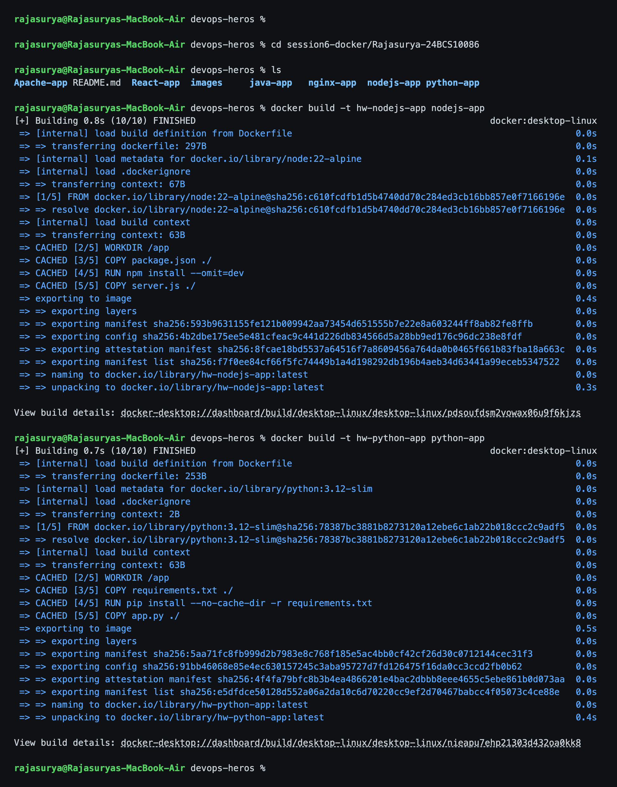

### Commands

```bash
docker build -t hw-java-app   java-app
docker build -t hw-apache-app Apache-app
```

### Output

```text
rajasurya@Rajasuryas-MacBook-Air devops-heros %

rajasurya@Rajasuryas-MacBook-Air devops-heros % cd session6-docker/Rajasurya-24BCS10086
rajasurya@Rajasuryas-MacBook-Air devops-heros % docker build -t hw-java-app java-app
[+] Building 0.0s (0/1)                                                                  docker:desktop-linux
[+] Building 0.1s (12/13)                                                                docker:desktop-linux
 => [internal] load build definition from Dockerfile                                                     0.0s
 => => transferring dockerfile: 433B                                                                     0.0s
 => [internal] load metadata for docker.io/library/eclipse-temurin:21-jdk-alpine                         0.0s
 => [internal] load metadata for docker.io/library/eclipse-temurin:21-jre-alpine                         0.0s
 => [internal] load .dockerignore                                                                        0.0s
 => => transferring context: 2B                                                                          0.0s
 => [build 1/4] FROM docker.io/library/eclipse-temurin:21-jdk-alpine@sha256:6ea5548706b60ac0a602eaf48af  0.0s
 => => resolve docker.io/library/eclipse-temurin:21-jdk-alpine@sha256:6ea5548706b60ac0a602eaf48af74792c  0.0s
 => [internal] load build context                                                                        0.0s
 => => transferring context: 65B                                                                         0.0s
 => [stage-1 1/3] FROM docker.io/library/eclipse-temurin:21-jre-alpine@sha256:974b08960c5d96694c780e65b  0.0s
 => => resolve docker.io/library/eclipse-temurin:21-jre-alpine@sha256:974b08960c5d96694c780e65b2d570526  0.0s
 => CACHED [stage-1 2/3] WORKDIR /app                                                                    0.0s
 => CACHED [build 2/4] WORKDIR /build                                                                    0.0s
 => CACHED [build 3/4] COPY src/HelloServer.java .                                                       0.0s
 => CACHED [build 4/4] RUN javac HelloServer.java                                                        0.0s
 => CACHED [stage-1 3/3] COPY --from=build /build/HelloServer.class .                                    0.0s
 => exporting to image                                                                                   0.0s
 => => exporting layers                                                                                  0.0s
 => => exporting manifest sha256:3a27467f96936dbb613d9b98d1c3695e33a1a4f683b9723721f4e547d5781a36        0.0s
 => => exporting config sha256:60f6c9ce3645e06e6ce91f9e2f3d4dbd44ac5aacb2f3de8473eea29ee8bb7bbd          0.0s
 => => exporting attestation manifest sha256:5304caf24a2a89da6aa9cb889f9b240fc86f31f0b93d06189c54df35af  0.0s
[+] Building 0.3s (13/13) FINISHED                                                       docker:desktop-linux
 => [internal] load build definition from Dockerfile                                                     0.0s
 => => transferring dockerfile: 433B                                                                     0.0s
 => [internal] load metadata for docker.io/library/eclipse-temurin:21-jdk-alpine                         0.0s
 => [internal] load metadata for docker.io/library/eclipse-temurin:21-jre-alpine                         0.0s
 => [internal] load .dockerignore                                                                        0.0s
 => => transferring context: 2B                                                                          0.0s
 => [build 1/4] FROM docker.io/library/eclipse-temurin:21-jdk-alpine@sha256:6ea5548706b60ac0a602eaf48af  0.0s
 => => resolve docker.io/library/eclipse-temurin:21-jdk-alpine@sha256:6ea5548706b60ac0a602eaf48af74792c  0.0s
 => [internal] load build context                                                                        0.0s
 => => transferring context: 65B                                                                         0.0s
 => [stage-1 1/3] FROM docker.io/library/eclipse-temurin:21-jre-alpine@sha256:974b08960c5d96694c780e65b  0.0s
 => => resolve docker.io/library/eclipse-temurin:21-jre-alpine@sha256:974b08960c5d96694c780e65b2d570526  0.0s
 => CACHED [stage-1 2/3] WORKDIR /app                                                                    0.0s
 => CACHED [build 2/4] WORKDIR /build                                                                    0.0s
 => CACHED [build 3/4] COPY src/HelloServer.java .                                                       0.0s
 => CACHED [build 4/4] RUN javac HelloServer.java                                                        0.0s
 => CACHED [stage-1 3/3] COPY --from=build /build/HelloServer.class .                                    0.0s
 => exporting to image                                                                                   0.1s
 => => exporting layers                                                                                  0.0s
 => => exporting manifest sha256:3a27467f96936dbb613d9b98d1c3695e33a1a4f683b9723721f4e547d5781a36        0.0s
 => => exporting config sha256:60f6c9ce3645e06e6ce91f9e2f3d4dbd44ac5aacb2f3de8473eea29ee8bb7bbd          0.0s
 => => exporting attestation manifest sha256:5304caf24a2a89da6aa9cb889f9b240fc86f31f0b93d06189c54df35af  0.0s
 => => exporting manifest list sha256:fd78d8132ddb505c32a84b34d9750c983743af74ebbae5d08c36502399e86a3f   0.0s
 => => naming to docker.io/library/hw-java-app:latest                                                    0.0s
 => => unpacking to docker.io/library/hw-java-app:latest                                                 0.0s

View build details: docker-desktop://dashboard/build/desktop-linux/desktop-linux/u58odo2ilmz3b2j016gwuksj8

rajasurya@Rajasuryas-MacBook-Air devops-heros % docker build -t hw-apache-app Apache-app
[+] Building 0.0s (0/1)                                                                  docker:desktop-linux
[+] Building 0.1s (7/8)                                                                  docker:desktop-linux
 => [internal] load build definition from Dockerfile                                                     0.0s
 => => transferring dockerfile: 314B                                                                     0.0s
 => [internal] load metadata for docker.io/library/httpd:2.4                                             0.0s
 => [internal] load .dockerignore                                                                        0.0s
 => => transferring context: 2B                                                                          0.0s
 => [1/3] FROM docker.io/library/httpd:2.4@sha256:979c38c2228d28c2edfd45c6e27dcee1c7b4a101a5526721ae8ec  0.0s
 => => resolve docker.io/library/httpd:2.4@sha256:979c38c2228d28c2edfd45c6e27dcee1c7b4a101a5526721ae8ec  0.0s
 => [internal] load build context                                                                        0.0s
 => => transferring context: 61B                                                                         0.0s
 => CACHED [2/3] COPY index.html /usr/local/apache2/htdocs/                                              0.0s
 => CACHED [3/3] COPY style.css  /usr/local/apache2/htdocs/                                              0.0s
 => exporting to image                                                                                   0.1s
 => => exporting layers                                                                                  0.0s
 => => exporting manifest sha256:f89cc55274a4dd4c6cbb729f424a2c73d94678d47ac72f2814e5e10ecbbae88f        0.0s
 => => exporting config sha256:e9e5173e06ec254f0279e4acab23fb77f927ec501d770ce80ef653ed5f415c4d          0.0s
 => => exporting attestation manifest sha256:f054694036cd76b0ac6cdb2679b08f561a04734170825ffe5598ec1ece  0.0s
 => => exporting manifest list sha256:c15aa5d01cb1836d1dcaa66f087333882c40740c7f3763f96b95a85e33a3af27   0.0s
 => => naming to docker.io/library/hw-apache-app:latest                                                  0.0s
 => => unpacking to docker.io/library/hw-apache-app:latest                                               0.0s
[+] Building 0.2s (8/8) FINISHED                                                         docker:desktop-linux
 => [internal] load build definition from Dockerfile                                                     0.0s
 => => transferring dockerfile: 314B                                                                     0.0s
 => [internal] load metadata for docker.io/library/httpd:2.4                                             0.0s
 => [internal] load .dockerignore                                                                        0.0s
 => => transferring context: 2B                                                                          0.0s
 => [1/3] FROM docker.io/library/httpd:2.4@sha256:979c38c2228d28c2edfd45c6e27dcee1c7b4a101a5526721ae8ec  0.0s
 => => resolve docker.io/library/httpd:2.4@sha256:979c38c2228d28c2edfd45c6e27dcee1c7b4a101a5526721ae8ec  0.0s
 => [internal] load build context                                                                        0.0s
 => => transferring context: 61B                                                                         0.0s
 => CACHED [2/3] COPY index.html /usr/local/apache2/htdocs/                                              0.0s
 => CACHED [3/3] COPY style.css  /usr/local/apache2/htdocs/                                              0.0s
 => exporting to image                                                                                   0.1s
 => => exporting layers                                                                                  0.0s
 => => exporting manifest sha256:f89cc55274a4dd4c6cbb729f424a2c73d94678d47ac72f2814e5e10ecbbae88f        0.0s
 => => exporting config sha256:e9e5173e06ec254f0279e4acab23fb77f927ec501d770ce80ef653ed5f415c4d          0.0s
 => => exporting attestation manifest sha256:f054694036cd76b0ac6cdb2679b08f561a04734170825ffe5598ec1ece  0.0s
 => => exporting manifest list sha256:c15aa5d01cb1836d1dcaa66f087333882c40740c7f3763f96b95a85e33a3af27   0.0s
 => => naming to docker.io/library/hw-apache-app:latest                                                  0.0s
 => => unpacking to docker.io/library/hw-apache-app:latest                                               0.0s

View build details: docker-desktop://dashboard/build/desktop-linux/desktop-linux/sdwn4g3tpz7njcqa2kla8fx5o

rajasurya@Rajasuryas-MacBook-Air devops-heros %
```

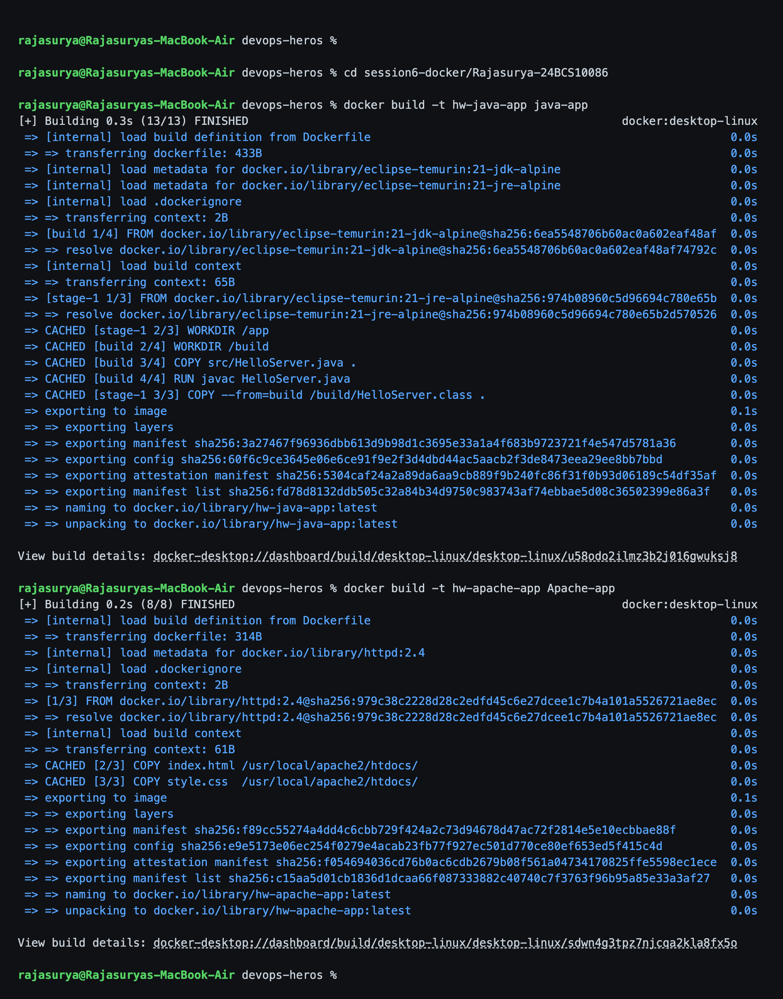

The Java build is the interesting one - you can see the `[build ...]` stage
running `javac` and then the `[stage-1 ...]` steps that copy only the compiled
`.class` file into a JRE image.

### Commands

```bash
docker build -t hw-react-app React-app
docker build -t hw-nginx-app nginx-app
```

### Output

```text
rajasurya@Rajasuryas-MacBook-Air devops-heros %

rajasurya@Rajasuryas-MacBook-Air devops-heros % cd session6-docker/Rajasurya-24BCS10086
rajasurya@Rajasuryas-MacBook-Air devops-heros % docker build -t hw-react-app React-app
[+] Building 0.0s (0/1)                                                                  docker:desktop-linux
[+] Building 0.1s (6/13)                                                                 docker:desktop-linux
 => [internal] load build definition from Dockerfile                                                     0.0s
 => => transferring dockerfile: 393B                                                                     0.0s
 => [internal] load metadata for docker.io/library/nginx:alpine                                          0.0s
 => [internal] load metadata for docker.io/library/node:22-alpine                                        0.0s
 => [internal] load .dockerignore                                                                        0.0s
 => => transferring context: 58B                                                                         0.0s
 => [stage-1 1/2] FROM docker.io/library/nginx:alpine@sha256:a9ae6f6d078d477e21323310498e5196cb2b7c0aed  0.0s
 => => resolve docker.io/library/nginx:alpine@sha256:a9ae6f6d078d477e21323310498e5196cb2b7c0aedd9e07b73  0.0s
 => [build 1/6] FROM docker.io/library/node:22-alpine@sha256:c610fcdfb1d5b4740dd70c284ed3cb16bb857e0f71  0.0s
 => => resolve docker.io/library/node:22-alpine@sha256:c610fcdfb1d5b4740dd70c284ed3cb16bb857e0f7166196e  0.0s
 => [internal] load build context                                                                        0.0s
[+] Building 0.3s (14/14) FINISHED                                                       docker:desktop-linux
 => [internal] load build definition from Dockerfile                                                     0.0s
 => => transferring dockerfile: 393B                                                                     0.0s
 => [internal] load metadata for docker.io/library/nginx:alpine                                          0.0s
 => [internal] load metadata for docker.io/library/node:22-alpine                                        0.0s
 => [internal] load .dockerignore                                                                        0.0s
 => => transferring context: 58B                                                                         0.0s
 => [stage-1 1/2] FROM docker.io/library/nginx:alpine@sha256:a9ae6f6d078d477e21323310498e5196cb2b7c0aed  0.0s
 => => resolve docker.io/library/nginx:alpine@sha256:a9ae6f6d078d477e21323310498e5196cb2b7c0aedd9e07b73  0.0s
 => [build 1/6] FROM docker.io/library/node:22-alpine@sha256:c610fcdfb1d5b4740dd70c284ed3cb16bb857e0f71  0.0s
 => => resolve docker.io/library/node:22-alpine@sha256:c610fcdfb1d5b4740dd70c284ed3cb16bb857e0f7166196e  0.0s
 => [internal] load build context                                                                        0.0s
 => => transferring context: 279B                                                                        0.0s
 => CACHED [build 2/6] WORKDIR /app                                                                      0.0s
 => CACHED [build 3/6] COPY package.json ./                                                              0.0s
 => CACHED [build 4/6] RUN npm install                                                                   0.0s
 => CACHED [build 5/6] COPY . .                                                                          0.0s
 => CACHED [build 6/6] RUN npm run build                                                                 0.0s
 => CACHED [stage-1 2/2] COPY --from=build /app/dist /usr/share/nginx/html                               0.0s
 => exporting to image                                                                                   0.0s
 => => exporting layers                                                                                  0.0s
 => => exporting manifest sha256:7515b6b685a27e4ea633751d419e976cb0477d9bd6bcc9e2d2612337175ff031        0.0s
 => => exporting config sha256:fd1cd45e9ea6b7ea7a8e63e214fdc1d1155898e40b0d29f3bfb2d0c2b2a2cf70          0.0s
 => => exporting attestation manifest sha256:dbbe16123915332ff56c88c8dcb5437ee0b960d8181ed256da856b8487  0.0s
 => => exporting manifest list sha256:8115f7f639aca7db74ee5fd7ed0521d2669b297f41ce77f3d542526137cf6a8a   0.0s
 => => naming to docker.io/library/hw-react-app:latest                                                   0.0s
 => => unpacking to docker.io/library/hw-react-app:latest                                                0.0s

View build details: docker-desktop://dashboard/build/desktop-linux/desktop-linux/resbwij2eu5qm85lqive01cx5

rajasurya@Rajasuryas-MacBook-Air devops-heros % docker build -t hw-nginx-app nginx-app
[+] Building 0.0s (0/1)                                                                  docker:desktop-linux
[+] Building 0.1s (7/8)                                                                  docker:desktop-linux
 => [internal] load build definition from Dockerfile                                                     0.0s
 => => transferring dockerfile: 233B                                                                     0.0s
 => [internal] load metadata for docker.io/library/nginx:alpine                                          0.0s
 => [internal] load .dockerignore                                                                        0.0s
 => => transferring context: 2B                                                                          0.0s
 => [1/3] FROM docker.io/library/nginx:alpine@sha256:a9ae6f6d078d477e21323310498e5196cb2b7c0aedd9e07b73  0.0s
 => => resolve docker.io/library/nginx:alpine@sha256:a9ae6f6d078d477e21323310498e5196cb2b7c0aedd9e07b73  0.0s
 => [internal] load build context                                                                        0.0s
 => => transferring context: 61B                                                                         0.0s
 => CACHED [2/3] COPY index.html /usr/share/nginx/html/                                                  0.0s
 => CACHED [3/3] COPY style.css  /usr/share/nginx/html/                                                  0.0s
 => exporting to image                                                                                   0.0s
 => => exporting layers                                                                                  0.0s
 => => exporting manifest sha256:ab0e98412894318f0227013c7cf725fa74eeb74f38b91e631087c285a3d6cc00        0.0s
 => => exporting config sha256:920ce61185eaea44ce9e43fdb3b59ce977aaaaa1a777770e7d588423a00b1911          0.0s
[+] Building 0.2s (7/8)                                                                  docker:desktop-linux
 => [internal] load build definition from Dockerfile                                                     0.0s
 => => transferring dockerfile: 233B                                                                     0.0s
 => [internal] load metadata for docker.io/library/nginx:alpine                                          0.0s
 => [internal] load .dockerignore                                                                        0.0s
 => => transferring context: 2B                                                                          0.0s
 => [1/3] FROM docker.io/library/nginx:alpine@sha256:a9ae6f6d078d477e21323310498e5196cb2b7c0aedd9e07b73  0.0s
 => => resolve docker.io/library/nginx:alpine@sha256:a9ae6f6d078d477e21323310498e5196cb2b7c0aedd9e07b73  0.0s
 => [internal] load build context                                                                        0.0s
 => => transferring context: 61B                                                                         0.0s
 => CACHED [2/3] COPY index.html /usr/share/nginx/html/                                                  0.0s
 => CACHED [3/3] COPY style.css  /usr/share/nginx/html/                                                  0.0s
 => exporting to image                                                                                   0.1s
 => => exporting layers                                                                                  0.0s
 => => exporting manifest sha256:ab0e98412894318f0227013c7cf725fa74eeb74f38b91e631087c285a3d6cc00        0.0s
 => => exporting config sha256:920ce61185eaea44ce9e43fdb3b59ce977aaaaa1a777770e7d588423a00b1911          0.0s
 => => exporting attestation manifest sha256:69393daa820d46c339ba276f43d22f1f04cedb24a85b4a9016082c6fdf  0.0s
 => => exporting manifest list sha256:a0d162000d04d52056ff81deb2a6e817aed213f2eed21657b6298e1b3657ddc9   0.0s
 => => naming to docker.io/library/hw-nginx-app:latest                                                   0.0s
 => => unpacking to docker.io/library/hw-nginx-app:latest                                                0.0s
[+] Building 0.3s (8/8) FINISHED                                                         docker:desktop-linux
 => [internal] load build definition from Dockerfile                                                     0.0s
 => => transferring dockerfile: 233B                                                                     0.0s
 => [internal] load metadata for docker.io/library/nginx:alpine                                          0.0s
 => [internal] load .dockerignore                                                                        0.0s
 => => transferring context: 2B                                                                          0.0s
 => [1/3] FROM docker.io/library/nginx:alpine@sha256:a9ae6f6d078d477e21323310498e5196cb2b7c0aedd9e07b73  0.0s
 => => resolve docker.io/library/nginx:alpine@sha256:a9ae6f6d078d477e21323310498e5196cb2b7c0aedd9e07b73  0.0s
 => [internal] load build context                                                                        0.0s
 => => transferring context: 61B                                                                         0.0s
 => CACHED [2/3] COPY index.html /usr/share/nginx/html/                                                  0.0s
 => CACHED [3/3] COPY style.css  /usr/share/nginx/html/                                                  0.0s
 => exporting to image                                                                                   0.2s
 => => exporting layers                                                                                  0.0s
 => => exporting manifest sha256:ab0e98412894318f0227013c7cf725fa74eeb74f38b91e631087c285a3d6cc00        0.0s
 => => exporting config sha256:920ce61185eaea44ce9e43fdb3b59ce977aaaaa1a777770e7d588423a00b1911          0.0s
 => => exporting attestation manifest sha256:69393daa820d46c339ba276f43d22f1f04cedb24a85b4a9016082c6fdf  0.0s
 => => exporting manifest list sha256:a0d162000d04d52056ff81deb2a6e817aed213f2eed21657b6298e1b3657ddc9   0.0s
 => => naming to docker.io/library/hw-nginx-app:latest                                                   0.0s
 => => unpacking to docker.io/library/hw-nginx-app:latest                                                0.0s

View build details: docker-desktop://dashboard/build/desktop-linux/desktop-linux/mlsgxjv5cknbbnlo9387ccld9

rajasurya@Rajasuryas-MacBook-Air devops-heros %
```

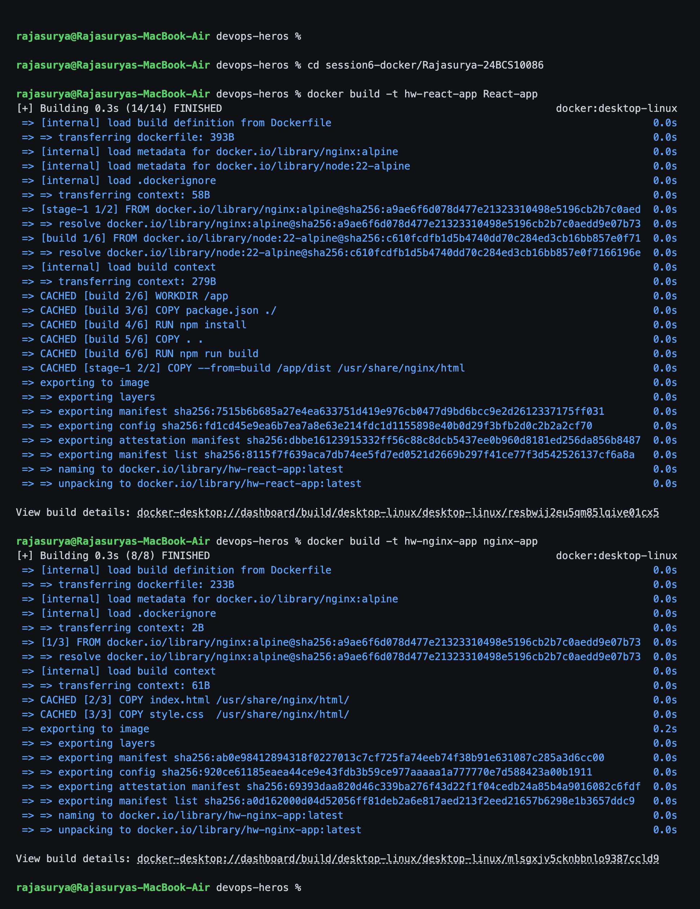

You can see Vite compiling the React app inside the builder stage
(`31 modules transformed`, `dist/assets/index-*.js 142.97 kB`) before the second
stage copies just `dist/` into nginx.

---

## Running all six at once

### Commands

```bash
docker run -d --name hw-nodejs -p 3001:3000 hw-nodejs-app
docker run -d --name hw-python -p 3002:5000 hw-python-app
docker run -d --name hw-java   -p 3003:8080 hw-java-app
docker run -d --name hw-apache -p 3004:80   hw-apache-app
docker run -d --name hw-react  -p 3005:80   hw-react-app
docker run -d --name hw-nginx  -p 3006:80   hw-nginx-app
docker ps
docker images --filter "reference=hw-*"
```

### Output

```text
rajasurya@Rajasuryas-MacBook-Air devops-heros %

rajasurya@Rajasuryas-MacBook-Air devops-heros % docker run -d --name hw-nodejs -p 3001:3000 hw-nodejs-app
1a672d956c9a2bbadc1101bf0b5ab2c81fbdaf2305ad855480f30245d2ebae43

rajasurya@Rajasuryas-MacBook-Air devops-heros % docker run -d --name hw-python -p 3002:5000 hw-python-app
74fb144fb2ef23eae7799e8098dd3e665841061d21c9d0154adf80bfbf18f89d

rajasurya@Rajasuryas-MacBook-Air devops-heros % docker run -d --name hw-java   -p 3003:8080 hw-java-app
75f2938578dec21bfb85e590b9c16c468dd3653d60b336d26541cf1100f1897e

rajasurya@Rajasuryas-MacBook-Air devops-heros % docker run -d --name hw-apache -p 3004:80   hw-apache-app
7029cfba1c32f0defeedb1ccbcc4ac439961f107ede7a281b07170aaa00c2767

rajasurya@Rajasuryas-MacBook-Air devops-heros % docker run -d --name hw-react  -p 3005:80   hw-react-app
e2bfe2d6918694b9507475f1c675daf2e62044f95fad5ad7d96f980868d3e493

rajasurya@Rajasuryas-MacBook-Air devops-heros % docker run -d --name hw-nginx  -p 3006:80   hw-nginx-app
f60879cce260ed7833bab6d096ecd5d96f0120344555fbd5236b5b783ce90f7e

rajasurya@Rajasuryas-MacBook-Air devops-heros % docker ps --filter "name=hw-" --format "table {{.Names}}\t{{.I
mage}}\t{{.Status}}\t{{.Ports}}"
NAMES       IMAGE           STATUS                  PORTS
hw-nginx    hw-nginx-app    Up Less than a second   0.0.0.0:3006->80/tcp, [::]:3006->80/tcp
hw-react    hw-react-app    Up 1 second             0.0.0.0:3005->80/tcp, [::]:3005->80/tcp
hw-apache   hw-apache-app   Up 1 second             0.0.0.0:3004->80/tcp, [::]:3004->80/tcp
hw-java     hw-java-app     Up 3 seconds            0.0.0.0:3003->8080/tcp, [::]:3003->8080/tcp
hw-python   hw-python-app   Up 3 seconds            0.0.0.0:3002->5000/tcp, [::]:3002->5000/tcp
hw-nodejs   hw-nodejs-app   Up 4 seconds            0.0.0.0:3001->3000/tcp, [::]:3001->3000/tcp

rajasurya@Rajasuryas-MacBook-Air devops-heros % docker images --filter "reference=hw-*" --format "table {{.Rep
ository}}\t{{.Tag}}\t{{.ID}}\t{{.Size}}"
REPOSITORY      TAG       IMAGE ID       SIZE
hw-react-app    latest    8115f7f639ac   102MB
hw-nginx-app    latest    a0d162000d04   102MB
hw-java-app     latest    fd78d8132ddb   286MB
hw-apache-app   latest    c15aa5d01cb1   205MB
hw-python-app   latest    e5dfdce50128   234MB
hw-nodejs-app   latest    f7f0ee84cf66   248MB

rajasurya@Rajasuryas-MacBook-Air devops-heros %
```

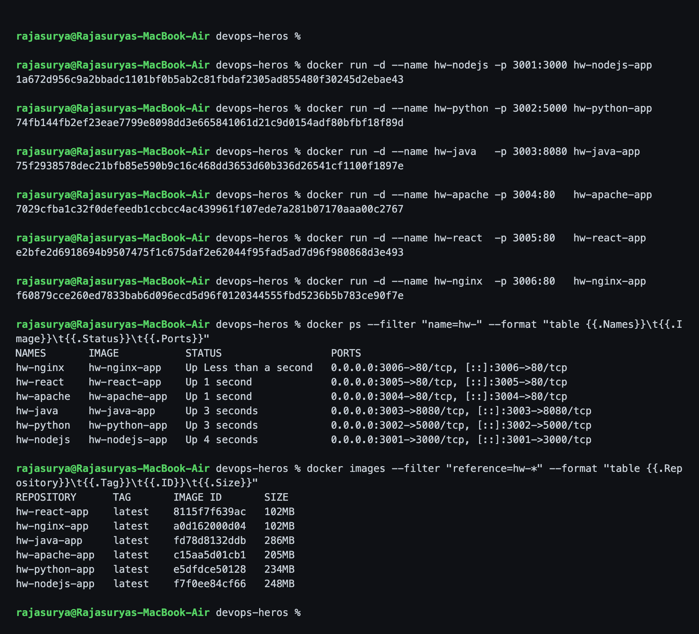

---

## Verifying Hello World on every port

### Commands

```bash
curl -s http://localhost:3001 | grep -E "h1|hostname|version"
curl -s http://localhost:3002 | grep -E "h1|hostname|version"
curl -s http://localhost:3003 | grep -E "h1|hostname|version"
curl -s http://localhost:3004 | grep h1
curl -s http://localhost:3005 | grep -E "title|root"
curl -s http://localhost:3006 | grep h1
for p in 3001 3002 3003 3004 3005 3006; do
  echo -n "port $p -> "; curl -s -o /dev/null -w "HTTP %{http_code}\n" http://localhost:$p
done
```

### Output

```text
rajasurya@Rajasuryas-MacBook-Air devops-heros %

rajasurya@Rajasuryas-MacBook-Air devops-heros % curl -s http://localhost:3001 | grep -E "h1|hostname|version"
    <h1>Hello World from Node.js!</h1>
    <p>container hostname: 1a672d956c9a</p>
    <p>node version: v22.23.2</p>

rajasurya@Rajasuryas-MacBook-Air devops-heros % curl -s http://localhost:3002 | grep -E "h1|hostname|version"
    <h1>Hello World from Python!</h1>
    <p>container hostname: 74fb144fb2ef</p>
    <p>python version: 3.12.14</p>

rajasurya@Rajasuryas-MacBook-Air devops-heros % curl -s http://localhost:3003 | grep -E "h1|hostname|version"
    <h1>Hello World from Java!</h1>
    <p>container hostname: 75f2938578de</p>
    <p>java version: 21.0.12</p>

rajasurya@Rajasuryas-MacBook-Air devops-heros % curl -s http://localhost:3004 | grep h1
    <h1>Hello World from Apache!</h1>

rajasurya@Rajasuryas-MacBook-Air devops-heros % curl -s http://localhost:3005 | grep -E "title|root"
    <title>React Hello World</title>
    <div id="root"></div>

rajasurya@Rajasuryas-MacBook-Air devops-heros % curl -s http://localhost:3006 | grep h1
    <h1>Hello World from Nginx!</h1>

rajasurya@Rajasuryas-MacBook-Air devops-heros % for p in 3001 3002 3003 3004 3005 3006; do echo -n "port $p ->
 "; curl -s -o /dev/null -w "HTTP %{http_code}\n" http://localhost:$p; done
port 3001 -> HTTP 200
port 3002 -> HTTP 200
port 3003 -> HTTP 200
port 3004 -> HTTP 200
port 3005 -> HTTP 200
port 3006 -> HTTP 200

rajasurya@Rajasuryas-MacBook-Air devops-heros %
```

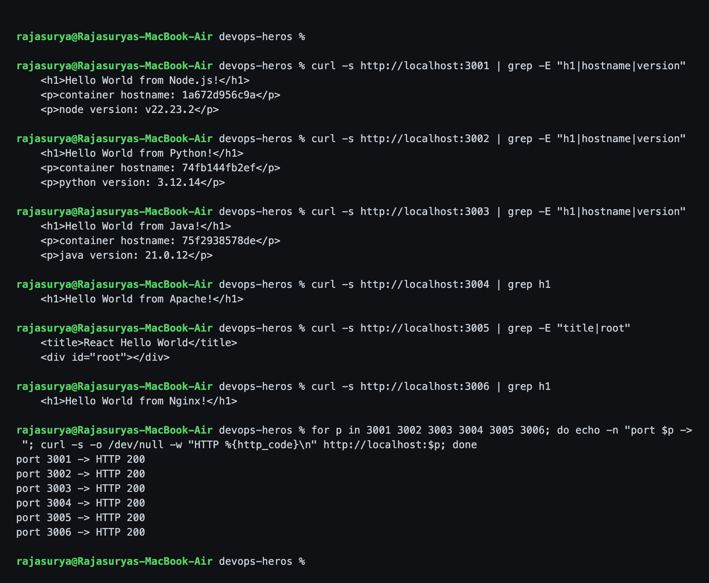

All six return **HTTP 200**. The Node, Python and Java pages print
`os.hostname()` / `socket.gethostname()` / `InetAddress.getLocalHost()`, which
inside a container is the **container ID** - a cheap proof the response really
came from inside the container.

---

## The six applications

### 1. nodejs-app

```dockerfile
FROM node:22-alpine
WORKDIR /app
# copy package.json first so this layer is cached when only the code changes
COPY package.json ./
RUN npm install --omit=dev
COPY server.js ./
EXPOSE 3000
CMD ["node", "server.js"]
```

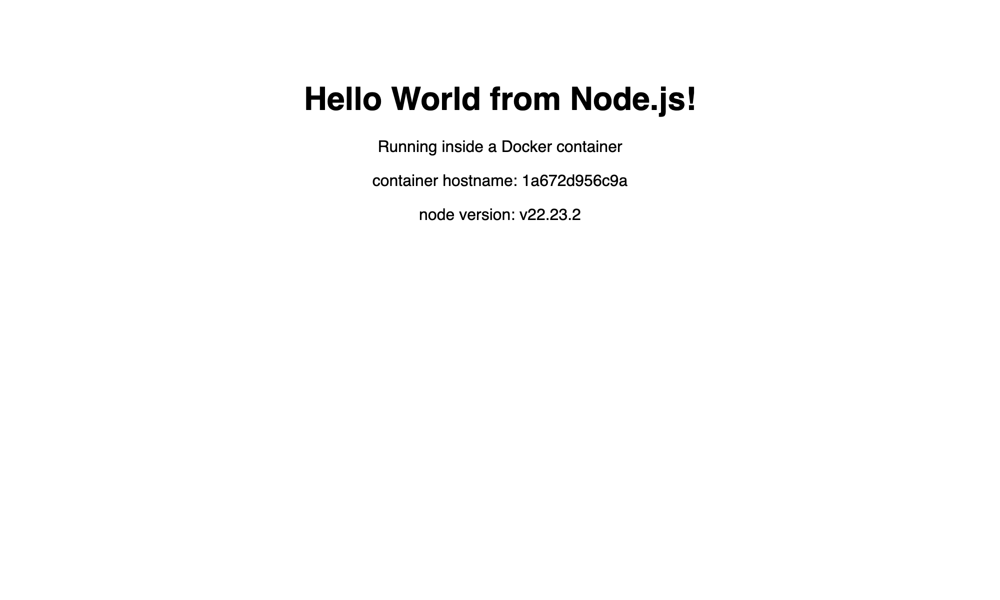

**Why `COPY package.json` before `COPY server.js`:** every instruction is a
cached layer. If I copied everything at once, changing one line of `server.js`
would invalidate the cache and re-run `npm install` on every build.

The server binds to `0.0.0.0`, not `localhost` - `app.listen(PORT, '0.0.0.0')`.
A server bound to `127.0.0.1` inside a container cannot be reached through the
published port.

### 2. python-app

```dockerfile
FROM python:3.12-slim
WORKDIR /app
COPY requirements.txt ./
RUN pip install --no-cache-dir -r requirements.txt
COPY app.py ./
EXPOSE 5000
CMD ["python", "app.py"]
```

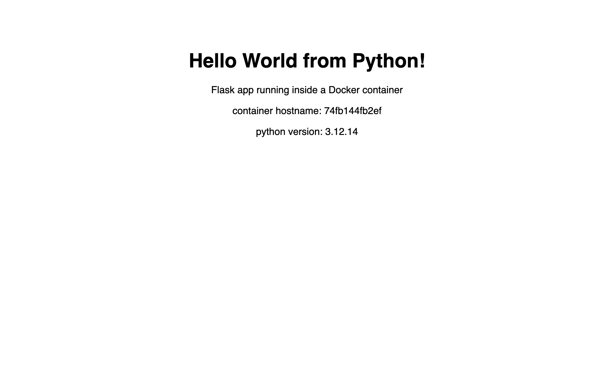

`--no-cache-dir` stops pip keeping the downloaded wheels in the image, and
`python:3.12-slim` instead of the full image - both free size savings. Same
`0.0.0.0` rule: `app.run(host="0.0.0.0", port=5000)`, because Flask defaults to
`127.0.0.1`.

### 3. java-app

I used the HTTP server that ships with the JDK (`com.sun.net.httpserver`), so
there is no Maven or Gradle and nothing to download. Two stages: compile with the
**JDK**, ship only the **JRE** plus the compiled class.

```dockerfile
FROM eclipse-temurin:21-jdk-alpine AS build
WORKDIR /build
COPY src/HelloServer.java .
RUN javac HelloServer.java

FROM eclipse-temurin:21-jre-alpine
WORKDIR /app
COPY --from=build /build/HelloServer.class .
EXPOSE 8080
CMD ["java", "HelloServer"]
```

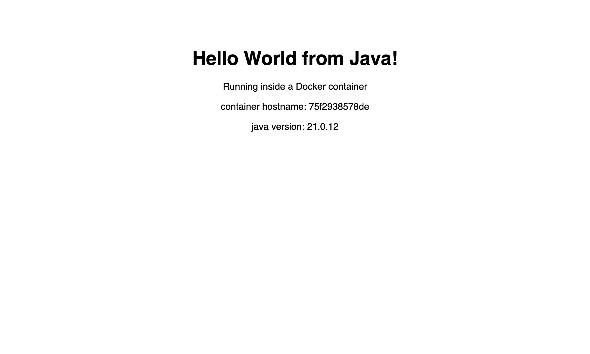

The final image contains no `javac`, no compiler and no `.java` source - only
`HelloServer.class` and a JRE.

### 4. Apache-app

```dockerfile
FROM httpd:2.4
# httpd serves everything in this directory by default
COPY index.html /usr/local/apache2/htdocs/
COPY style.css  /usr/local/apache2/htdocs/
EXPOSE 80
```

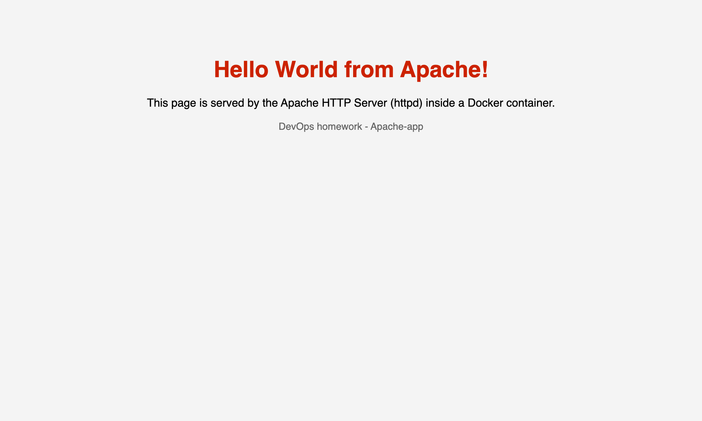

No `CMD` needed - the base image already has one (`httpd-foreground`) that runs
Apache in the foreground. A container lives only as long as PID 1, so a web
server in a container must **not** daemonize itself.

Apache's document root is `/usr/local/apache2/htdocs/`, which is the only real
difference between this Dockerfile and the nginx one.

### 5. React-app

A real Vite + React app, built for production and served as static files by
nginx - a **multi-stage build**, which is the production way to ship React.

```dockerfile
FROM node:22-alpine AS build
WORKDIR /app
COPY package.json ./
RUN npm install
COPY . .
RUN npm run build

FROM nginx:alpine
COPY --from=build /app/dist /usr/share/nginx/html
EXPOSE 80
```

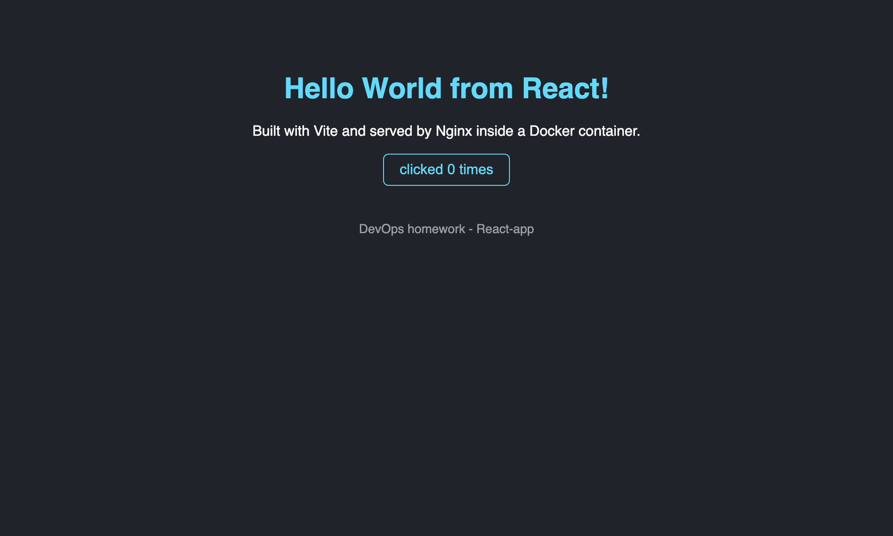

**The most useful thing I learned here:** `curl` shows an *empty*
`<div id="root">`. That is not a bug - React renders on the client, so the HTML
off the wire is just a shell and the JS bundle fills it in. `curl` alone cannot
prove this app works, which is exactly why the browser screenshot matters for
this one. The screenshot shows the rendered heading and the working counter.

Multi-stage is worth a lot here: the same app built as a single stage is
**449 MB**, this one is **102 MB** - see
[the Session 7 write-up](../../session7-dockerfiles-images/Rajasurya-24BCS10086/README.md)
for that comparison.

### 6. nginx-app

```dockerfile
FROM nginx:alpine
COPY index.html /usr/share/nginx/html/
COPY style.css  /usr/share/nginx/html/
EXPOSE 80
```

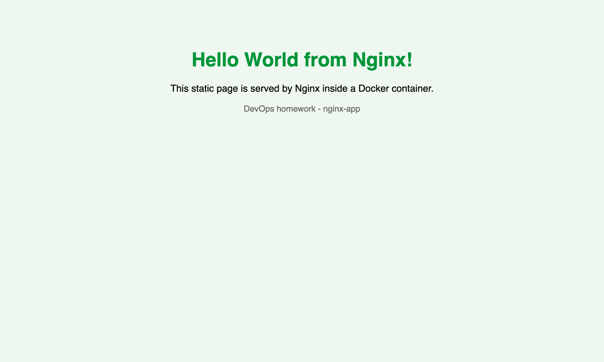

The simplest of the six. For a static site this is all you need.

---

## Reproducing this

```bash
cd session6-docker/Rajasurya-24BCS10086

docker build -t hw-nodejs-app nodejs-app
docker build -t hw-python-app python-app
docker build -t hw-java-app   java-app
docker build -t hw-apache-app Apache-app
docker build -t hw-react-app  React-app
docker build -t hw-nginx-app  nginx-app

docker run -d --name hw-nodejs -p 3001:3000 hw-nodejs-app
docker run -d --name hw-python -p 3002:5000 hw-python-app
docker run -d --name hw-java   -p 3003:8080 hw-java-app
docker run -d --name hw-apache -p 3004:80   hw-apache-app
docker run -d --name hw-react  -p 3005:80   hw-react-app
docker run -d --name hw-nginx  -p 3006:80   hw-nginx-app

docker ps

# cleanup
docker rm -f hw-nodejs hw-python hw-java hw-apache hw-react hw-nginx
```

## What I learned

- **The Dockerfile pattern is the same in every language:** pick a base image,
  set a workdir, copy the dependency manifest, install, copy the code, `EXPOSE`,
  `CMD`. Only the base image and the paths change.
- **`-p host:container` order matters.** `-p 3003:8080` means "host 3003 goes to
  container 8080". I got this backwards once and got connection refused.
- **Bind to `0.0.0.0` inside a container**, never `127.0.0.1`, or the published
  port cannot reach the app.
- **The process must stay in the foreground.** If PID 1 exits, the container dies.
- **Layer order is a caching decision**, not just style - manifest first, source
  last.
- **`curl` is not always enough to verify.** For a client-rendered SPA you need a
  real browser.
