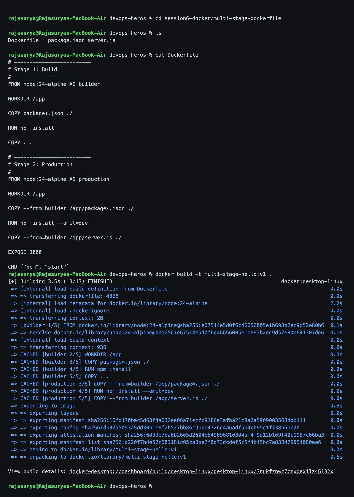
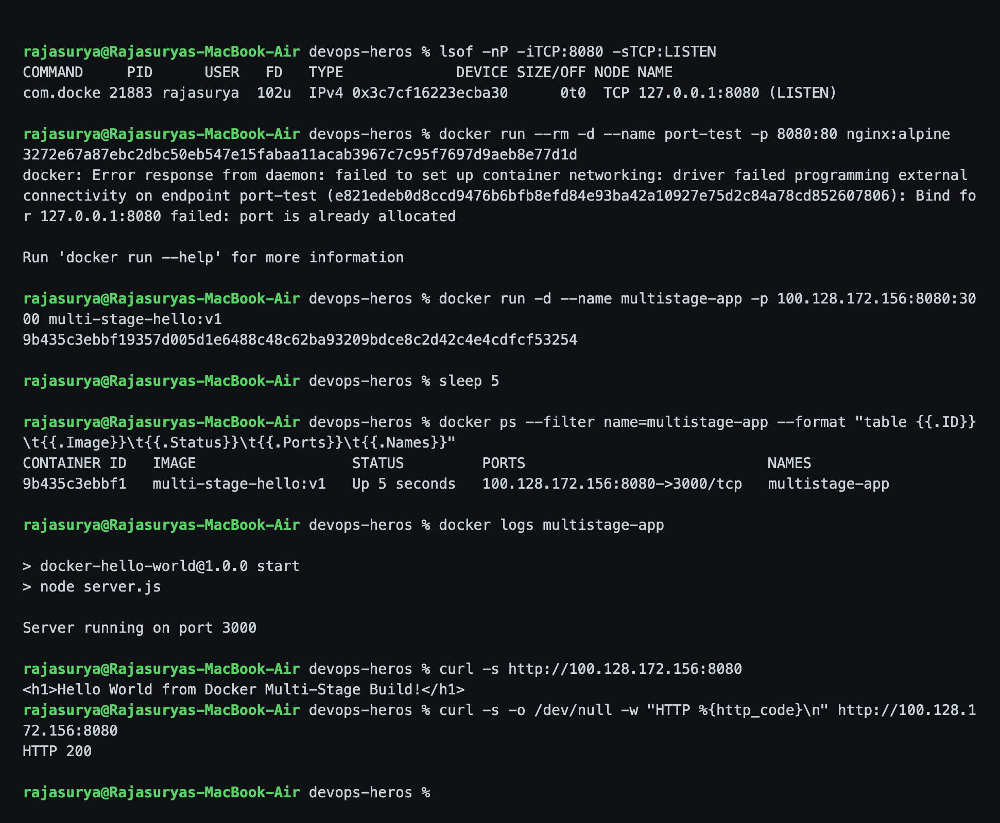
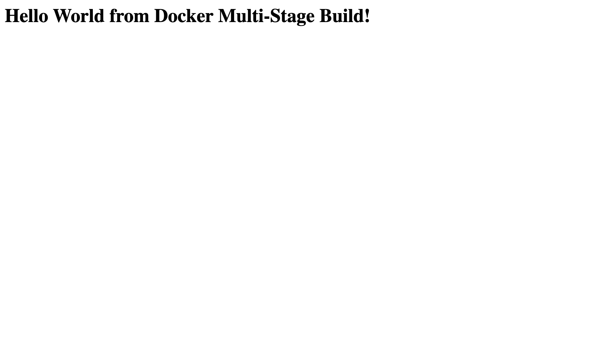
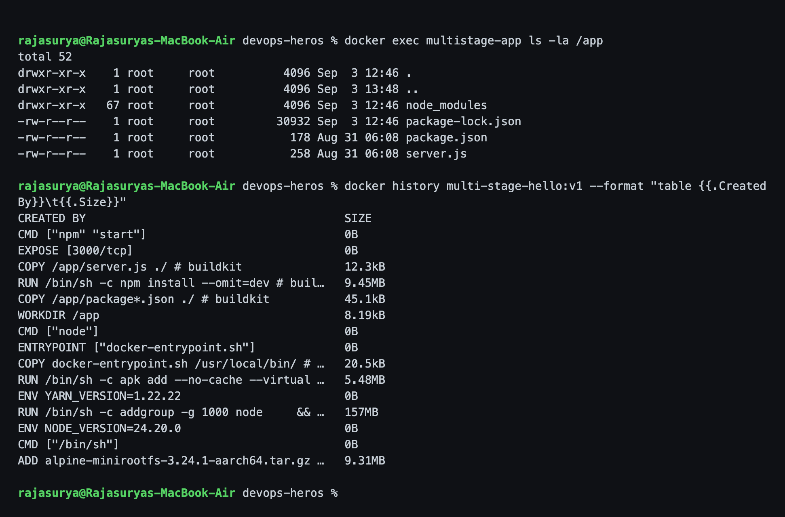
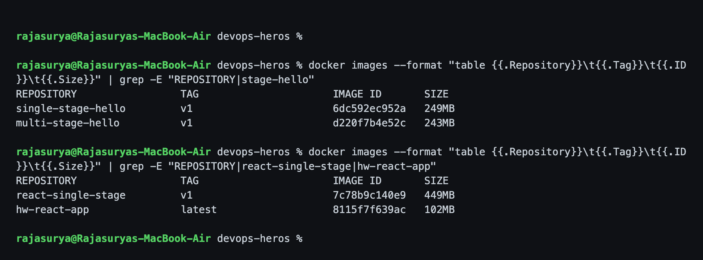

# Session 7 - Dockerfiles & Images (Multi-Stage Build)

**Name:** Rajasurya J
**Enrollment Number:** 24BCS10086

---

## Task 1: Run the Multi-Stage Dockerfile

- Clone the repository containing the multi-stage Dockerfile.
- Build the image, run a container, access the application.
- Verify it shows **Hello World from Docker multi-stage build**.
- Verify the running container with `docker ps` on port **8080**.

### Getting the repository

The multi-stage Dockerfile is the one from the class repo. My copy is a fork of
the course repository:

```bash
git clone https://github.com/rajasurya-rjs/devops-heros.git
cd devops-heros/session6-docker/multi-stage-dockerfile
```

```
$ git remote -v
origin    https://github.com/rajasurya-rjs/devops-heros.git (fetch)
origin    https://github.com/rajasurya-rjs/devops-heros.git (push)
upstream  https://github.com/Nency-Ravaliya/devops-heros.git (fetch)
upstream  https://github.com/Nency-Ravaliya/devops-heros.git (push)
```

### The Dockerfile

```dockerfile
# -------------------------
# Stage 1: Build
# -------------------------
FROM node:24-alpine AS builder
WORKDIR /app
COPY package*.json ./
RUN npm install
COPY . .

# -------------------------
# Stage 2: Production
# -------------------------
FROM node:24-alpine AS production
WORKDIR /app
COPY --from=builder /app/package*.json ./
RUN npm install --omit=dev
COPY --from=builder /app/server.js ./
EXPOSE 3000
CMD ["npm", "start"]
```

The app itself:

```js
const express = require("express");
const app = express();
const PORT = 3000;

app.get("/", (req, res) => {
  res.send("<h1>Hello World from Docker Multi-Stage Build!</h1>");
});

app.listen(PORT, () => {
  console.log(`Server running on port ${PORT}`);
});
```

### Commands - build

```bash
cd session6-docker/multi-stage-dockerfile
cat Dockerfile
docker build -t multi-stage-hello:v1 .
```

### Output

```text
rajasurya@Rajasuryas-MacBook-Air devops-heros % cd session6-docker/multi-stage-dockerfile
rajasurya@Rajasuryas-MacBook-Air devops-heros % ls
Dockerfile   package.json server.js

rajasurya@Rajasuryas-MacBook-Air devops-heros % cat Dockerfile
# -------------------------
# Stage 1: Build
# -------------------------
FROM node:24-alpine AS builder

WORKDIR /app

COPY package*.json ./

RUN npm install

COPY . .

# -------------------------
# Stage 2: Production
# -------------------------
FROM node:24-alpine AS production

WORKDIR /app

COPY --from=builder /app/package*.json ./

RUN npm install --omit=dev

COPY --from=builder /app/server.js ./

EXPOSE 3000

CMD ["npm", "start"]

rajasurya@Rajasuryas-MacBook-Air devops-heros % docker build -t multi-stage-hello:v1 .
[+] Building 0.0s (0/1)                                                                  docker:desktop-linux
[+] Building 0.2s (1/2)                                                                  docker:desktop-linux
 => [internal] load build definition from Dockerfile                                                     0.0s
 => => transferring dockerfile: 482B                                                                     0.0s
 => [internal] load metadata for docker.io/library/node:24-alpine                                        0.2s
[+] Building 0.3s (1/2)                                                                  docker:desktop-linux
 => [internal] load build definition from Dockerfile                                                     0.0s
 => => transferring dockerfile: 482B                                                                     0.0s
 => [internal] load metadata for docker.io/library/node:24-alpine                                        0.3s
[+] Building 0.5s (1/2)                                                                  docker:desktop-linux
 => [internal] load build definition from Dockerfile                                                     0.0s
 => => transferring dockerfile: 482B                                                                     0.0s
 => [internal] load metadata for docker.io/library/node:24-alpine                                        0.5s
[+] Building 0.6s (1/2)                                                                  docker:desktop-linux
 => [internal] load build definition from Dockerfile                                                     0.0s
 => => transferring dockerfile: 482B                                                                     0.0s
 => [internal] load metadata for docker.io/library/node:24-alpine                                        0.6s
[+] Building 0.8s (1/2)                                                                  docker:desktop-linux
 => [internal] load build definition from Dockerfile                                                     0.0s
 => => transferring dockerfile: 482B                                                                     0.0s
 => [internal] load metadata for docker.io/library/node:24-alpine                                        0.8s
[+] Building 0.9s (1/2)                                                                  docker:desktop-linux
 => [internal] load build definition from Dockerfile                                                     0.0s
 => => transferring dockerfile: 482B                                                                     0.0s
 => [internal] load metadata for docker.io/library/node:24-alpine                                        0.9s
[+] Building 1.1s (1/2)                                                                  docker:desktop-linux
 => [internal] load build definition from Dockerfile                                                     0.0s
 => => transferring dockerfile: 482B                                                                     0.0s
 => [internal] load metadata for docker.io/library/node:24-alpine                                        1.1s
[+] Building 1.2s (1/2)                                                                  docker:desktop-linux
 => [internal] load build definition from Dockerfile                                                     0.0s
 => => transferring dockerfile: 482B                                                                     0.0s
 => [internal] load metadata for docker.io/library/node:24-alpine                                        1.2s
[+] Building 1.4s (1/2)                                                                  docker:desktop-linux
 => [internal] load build definition from Dockerfile                                                     0.0s
 => => transferring dockerfile: 482B                                                                     0.0s
 => [internal] load metadata for docker.io/library/node:24-alpine                                        1.4s
[+] Building 1.5s (1/2)                                                                  docker:desktop-linux
 => [internal] load build definition from Dockerfile                                                     0.0s
 => => transferring dockerfile: 482B                                                                     0.0s
 => [internal] load metadata for docker.io/library/node:24-alpine                                        1.5s
[+] Building 1.7s (1/2)                                                                  docker:desktop-linux
 => [internal] load build definition from Dockerfile                                                     0.0s
 => => transferring dockerfile: 482B                                                                     0.0s
 => [internal] load metadata for docker.io/library/node:24-alpine                                        1.7s
[+] Building 1.8s (1/2)                                                                  docker:desktop-linux
 => [internal] load build definition from Dockerfile                                                     0.0s
 => => transferring dockerfile: 482B                                                                     0.0s
 => [internal] load metadata for docker.io/library/node:24-alpine                                        1.8s
[+] Building 2.0s (1/2)                                                                  docker:desktop-linux
 => [internal] load build definition from Dockerfile                                                     0.0s
 => => transferring dockerfile: 482B                                                                     0.0s
 => [internal] load metadata for docker.io/library/node:24-alpine                                        2.0s
[+] Building 2.2s (1/2)                                                                  docker:desktop-linux
 => [internal] load build definition from Dockerfile                                                     0.0s
 => => transferring dockerfile: 482B                                                                     0.0s
 => [internal] load metadata for docker.io/library/node:24-alpine                                        2.1s
[+] Building 2.2s (2/2)                                                                  docker:desktop-linux
 => [internal] load build definition from Dockerfile                                                     0.0s
 => => transferring dockerfile: 482B                                                                     0.0s
 => [internal] load metadata for docker.io/library/node:24-alpine                                        2.2s
[+] Building 2.3s (3/12)                                                                 docker:desktop-linux
 => [internal] load build definition from Dockerfile                                                     0.0s
 => => transferring dockerfile: 482B                                                                     0.0s
 => [internal] load metadata for docker.io/library/node:24-alpine                                        2.2s
 => [internal] load .dockerignore                                                                        0.0s
 => => transferring context: 2B                                                                          0.0s
[+] Building 2.4s (4/12)                                                                 docker:desktop-linux
 => [internal] load build definition from Dockerfile                                                     0.0s
 => => transferring dockerfile: 482B                                                                     0.0s
 => [internal] load metadata for docker.io/library/node:24-alpine                                        2.2s
 => [internal] load .dockerignore                                                                        0.0s
 => => transferring context: 2B                                                                          0.0s
 => [builder 1/5] FROM docker.io/library/node:24-alpine@sha256:e67514e5d0f6c46656005e1b693b2ec9d52e80b6  0.1s
 => => resolve docker.io/library/node:24-alpine@sha256:e67514e5d0f6c46656005e1b693b2ec9d52e80b641307de6  0.1s
 => [internal] load build context                                                                        0.0s
[+] Building 2.6s (12/13)                                                                docker:desktop-linux
 => [internal] load build definition from Dockerfile                                                     0.0s
 => => transferring dockerfile: 482B                                                                     0.0s
 => [internal] load metadata for docker.io/library/node:24-alpine                                        2.2s
 => [internal] load .dockerignore                                                                        0.0s
 => => transferring context: 2B                                                                          0.0s
 => [builder 1/5] FROM docker.io/library/node:24-alpine@sha256:e67514e5d0f6c46656005e1b693b2ec9d52e80b6  0.1s
 => => resolve docker.io/library/node:24-alpine@sha256:e67514e5d0f6c46656005e1b693b2ec9d52e80b641307de6  0.1s
 => [internal] load build context                                                                        0.0s
 => => transferring context: 93B                                                                         0.0s
 => CACHED [builder 2/5] WORKDIR /app                                                                    0.0s
 => CACHED [builder 3/5] COPY package*.json ./                                                           0.0s
 => CACHED [builder 4/5] RUN npm install                                                                 0.0s
 => CACHED [builder 5/5] COPY . .                                                                        0.0s
 => CACHED [production 3/5] COPY --from=builder /app/package*.json ./                                    0.0s
 => CACHED [production 4/5] RUN npm install --omit=dev                                                   0.0s
 => CACHED [production 5/5] COPY --from=builder /app/server.js ./                                        0.0s
 => exporting to image                                                                                   0.1s
 => => exporting layers                                                                                  0.0s
 => => exporting manifest sha256:16fd170bac5d63f4a632ea06a71ecfc9186a3afba21c8a2a5909003568dbb111        0.0s
 => => exporting config sha256:db3255093a5dd30b1e6f2b527bb86c9bcb4726c4a6adf5b4cb99c1f738b6bc20          0.0s
 => => exporting attestation manifest sha256:6099e7da6b2665d2604b649096810304af4f9d12b169f40c1987c06ba3  0.0s
[+] Building 2.8s (12/13)                                                                docker:desktop-linux
 => [internal] load build definition from Dockerfile                                                     0.0s
 => => transferring dockerfile: 482B                                                                     0.0s
 => [internal] load metadata for docker.io/library/node:24-alpine                                        2.2s
 => [internal] load .dockerignore                                                                        0.0s
 => => transferring context: 2B                                                                          0.0s
 => [builder 1/5] FROM docker.io/library/node:24-alpine@sha256:e67514e5d0f6c46656005e1b693b2ec9d52e80b6  0.1s
 => => resolve docker.io/library/node:24-alpine@sha256:e67514e5d0f6c46656005e1b693b2ec9d52e80b641307de6  0.1s
 => [internal] load build context                                                                        0.0s
 => => transferring context: 93B                                                                         0.0s
 => CACHED [builder 2/5] WORKDIR /app                                                                    0.0s
 => CACHED [builder 3/5] COPY package*.json ./                                                           0.0s
 => CACHED [builder 4/5] RUN npm install                                                                 0.0s
 => CACHED [builder 5/5] COPY . .                                                                        0.0s
 => CACHED [production 3/5] COPY --from=builder /app/package*.json ./                                    0.0s
 => CACHED [production 4/5] RUN npm install --omit=dev                                                   0.0s
 => CACHED [production 5/5] COPY --from=builder /app/server.js ./                                        0.0s
 => exporting to image                                                                                   0.3s
 => => exporting layers                                                                                  0.0s
 => => exporting manifest sha256:16fd170bac5d63f4a632ea06a71ecfc9186a3afba21c8a2a5909003568dbb111        0.0s
 => => exporting config sha256:db3255093a5dd30b1e6f2b527bb86c9bcb4726c4a6adf5b4cb99c1f738b6bc20          0.0s
 => => exporting attestation manifest sha256:6099e7da6b2665d2604b649096810304af4f9d12b169f40c1987c06ba3  0.0s
 => => exporting manifest list sha256:d220f7b4e52c603181c05ca8be7f0d73dcdef5c5f4b45bc7a838d79854080ae6   0.0s
 => => naming to docker.io/library/multi-stage-hello:v1                                                  0.0s
 => => unpacking to docker.io/library/multi-stage-hello:v1                                               0.2s
[+] Building 2.9s (12/13)                                                                docker:desktop-linux
 => [internal] load build definition from Dockerfile                                                     0.0s
 => => transferring dockerfile: 482B                                                                     0.0s
 => [internal] load metadata for docker.io/library/node:24-alpine                                        2.2s
 => [internal] load .dockerignore                                                                        0.0s
 => => transferring context: 2B                                                                          0.0s
 => [builder 1/5] FROM docker.io/library/node:24-alpine@sha256:e67514e5d0f6c46656005e1b693b2ec9d52e80b6  0.1s
 => => resolve docker.io/library/node:24-alpine@sha256:e67514e5d0f6c46656005e1b693b2ec9d52e80b641307de6  0.1s
 => [internal] load build context                                                                        0.0s
 => => transferring context: 93B                                                                         0.0s
 => CACHED [builder 2/5] WORKDIR /app                                                                    0.0s
 => CACHED [builder 3/5] COPY package*.json ./                                                           0.0s
 => CACHED [builder 4/5] RUN npm install                                                                 0.0s
 => CACHED [builder 5/5] COPY . .                                                                        0.0s
 => CACHED [production 3/5] COPY --from=builder /app/package*.json ./                                    0.0s
 => CACHED [production 4/5] RUN npm install --omit=dev                                                   0.0s
 => CACHED [production 5/5] COPY --from=builder /app/server.js ./                                        0.0s
 => exporting to image                                                                                   0.4s
 => => exporting layers                                                                                  0.0s
 => => exporting manifest sha256:16fd170bac5d63f4a632ea06a71ecfc9186a3afba21c8a2a5909003568dbb111        0.0s
 => => exporting config sha256:db3255093a5dd30b1e6f2b527bb86c9bcb4726c4a6adf5b4cb99c1f738b6bc20          0.0s
 => => exporting attestation manifest sha256:6099e7da6b2665d2604b649096810304af4f9d12b169f40c1987c06ba3  0.0s
 => => exporting manifest list sha256:d220f7b4e52c603181c05ca8be7f0d73dcdef5c5f4b45bc7a838d79854080ae6   0.0s
 => => naming to docker.io/library/multi-stage-hello:v1                                                  0.0s
 => => unpacking to docker.io/library/multi-stage-hello:v1                                               0.3s
[+] Building 3.1s (12/13)                                                                docker:desktop-linux
 => [internal] load build definition from Dockerfile                                                     0.0s
 => => transferring dockerfile: 482B                                                                     0.0s
 => [internal] load metadata for docker.io/library/node:24-alpine                                        2.2s
 => [internal] load .dockerignore                                                                        0.0s
 => => transferring context: 2B                                                                          0.0s
 => [builder 1/5] FROM docker.io/library/node:24-alpine@sha256:e67514e5d0f6c46656005e1b693b2ec9d52e80b6  0.1s
 => => resolve docker.io/library/node:24-alpine@sha256:e67514e5d0f6c46656005e1b693b2ec9d52e80b641307de6  0.1s
 => [internal] load build context                                                                        0.0s
 => => transferring context: 93B                                                                         0.0s
 => CACHED [builder 2/5] WORKDIR /app                                                                    0.0s
 => CACHED [builder 3/5] COPY package*.json ./                                                           0.0s
 => CACHED [builder 4/5] RUN npm install                                                                 0.0s
 => CACHED [builder 5/5] COPY . .                                                                        0.0s
 => CACHED [production 3/5] COPY --from=builder /app/package*.json ./                                    0.0s
 => CACHED [production 4/5] RUN npm install --omit=dev                                                   0.0s
 => CACHED [production 5/5] COPY --from=builder /app/server.js ./                                        0.0s
 => exporting to image                                                                                   0.6s
 => => exporting layers                                                                                  0.0s
 => => exporting manifest sha256:16fd170bac5d63f4a632ea06a71ecfc9186a3afba21c8a2a5909003568dbb111        0.0s
 => => exporting config sha256:db3255093a5dd30b1e6f2b527bb86c9bcb4726c4a6adf5b4cb99c1f738b6bc20          0.0s
 => => exporting attestation manifest sha256:6099e7da6b2665d2604b649096810304af4f9d12b169f40c1987c06ba3  0.0s
 => => exporting manifest list sha256:d220f7b4e52c603181c05ca8be7f0d73dcdef5c5f4b45bc7a838d79854080ae6   0.0s
 => => naming to docker.io/library/multi-stage-hello:v1                                                  0.0s
 => => unpacking to docker.io/library/multi-stage-hello:v1                                               0.5s
[+] Building 3.2s (12/13)                                                                docker:desktop-linux
 => [internal] load build definition from Dockerfile                                                     0.0s
 => => transferring dockerfile: 482B                                                                     0.0s
 => [internal] load metadata for docker.io/library/node:24-alpine                                        2.2s
 => [internal] load .dockerignore                                                                        0.0s
 => => transferring context: 2B                                                                          0.0s
 => [builder 1/5] FROM docker.io/library/node:24-alpine@sha256:e67514e5d0f6c46656005e1b693b2ec9d52e80b6  0.1s
 => => resolve docker.io/library/node:24-alpine@sha256:e67514e5d0f6c46656005e1b693b2ec9d52e80b641307de6  0.1s
 => [internal] load build context                                                                        0.0s
 => => transferring context: 93B                                                                         0.0s
 => CACHED [builder 2/5] WORKDIR /app                                                                    0.0s
 => CACHED [builder 3/5] COPY package*.json ./                                                           0.0s
 => CACHED [builder 4/5] RUN npm install                                                                 0.0s
 => CACHED [builder 5/5] COPY . .                                                                        0.0s
 => CACHED [production 3/5] COPY --from=builder /app/package*.json ./                                    0.0s
 => CACHED [production 4/5] RUN npm install --omit=dev                                                   0.0s
 => CACHED [production 5/5] COPY --from=builder /app/server.js ./                                        0.0s
 => exporting to image                                                                                   0.7s
 => => exporting layers                                                                                  0.0s
 => => exporting manifest sha256:16fd170bac5d63f4a632ea06a71ecfc9186a3afba21c8a2a5909003568dbb111        0.0s
 => => exporting config sha256:db3255093a5dd30b1e6f2b527bb86c9bcb4726c4a6adf5b4cb99c1f738b6bc20          0.0s
 => => exporting attestation manifest sha256:6099e7da6b2665d2604b649096810304af4f9d12b169f40c1987c06ba3  0.0s
 => => exporting manifest list sha256:d220f7b4e52c603181c05ca8be7f0d73dcdef5c5f4b45bc7a838d79854080ae6   0.0s
 => => naming to docker.io/library/multi-stage-hello:v1                                                  0.0s
 => => unpacking to docker.io/library/multi-stage-hello:v1                                               0.6s
[+] Building 3.4s (13/13)                                                                docker:desktop-linux
 => [internal] load build definition from Dockerfile                                                     0.0s
 => => transferring dockerfile: 482B                                                                     0.0s
 => [internal] load metadata for docker.io/library/node:24-alpine                                        2.2s
 => [internal] load .dockerignore                                                                        0.0s
 => => transferring context: 2B                                                                          0.0s
 => [builder 1/5] FROM docker.io/library/node:24-alpine@sha256:e67514e5d0f6c46656005e1b693b2ec9d52e80b6  0.1s
 => => resolve docker.io/library/node:24-alpine@sha256:e67514e5d0f6c46656005e1b693b2ec9d52e80b641307de6  0.1s
 => [internal] load build context                                                                        0.0s
 => => transferring context: 93B                                                                         0.0s
 => CACHED [builder 2/5] WORKDIR /app                                                                    0.0s
 => CACHED [builder 3/5] COPY package*.json ./                                                           0.0s
 => CACHED [builder 4/5] RUN npm install                                                                 0.0s
 => CACHED [builder 5/5] COPY . .                                                                        0.0s
 => CACHED [production 3/5] COPY --from=builder /app/package*.json ./                                    0.0s
 => CACHED [production 4/5] RUN npm install --omit=dev                                                   0.0s
 => CACHED [production 5/5] COPY --from=builder /app/server.js ./                                        0.0s
 => exporting to image                                                                                   0.8s
 => => exporting layers                                                                                  0.0s
 => => exporting manifest sha256:16fd170bac5d63f4a632ea06a71ecfc9186a3afba21c8a2a5909003568dbb111        0.0s
 => => exporting config sha256:db3255093a5dd30b1e6f2b527bb86c9bcb4726c4a6adf5b4cb99c1f738b6bc20          0.0s
 => => exporting attestation manifest sha256:6099e7da6b2665d2604b649096810304af4f9d12b169f40c1987c06ba3  0.0s
 => => exporting manifest list sha256:d220f7b4e52c603181c05ca8be7f0d73dcdef5c5f4b45bc7a838d79854080ae6   0.0s
 => => naming to docker.io/library/multi-stage-hello:v1                                                  0.0s
 => => unpacking to docker.io/library/multi-stage-hello:v1                                               0.6s
[+] Building 3.5s (13/13) FINISHED                                                       docker:desktop-linux
 => [internal] load build definition from Dockerfile                                                     0.0s
 => => transferring dockerfile: 482B                                                                     0.0s
 => [internal] load metadata for docker.io/library/node:24-alpine                                        2.2s
 => [internal] load .dockerignore                                                                        0.0s
 => => transferring context: 2B                                                                          0.0s
 => [builder 1/5] FROM docker.io/library/node:24-alpine@sha256:e67514e5d0f6c46656005e1b693b2ec9d52e80b6  0.1s
 => => resolve docker.io/library/node:24-alpine@sha256:e67514e5d0f6c46656005e1b693b2ec9d52e80b641307de6  0.1s
 => [internal] load build context                                                                        0.0s
 => => transferring context: 93B                                                                         0.0s
 => CACHED [builder 2/5] WORKDIR /app                                                                    0.0s
 => CACHED [builder 3/5] COPY package*.json ./                                                           0.0s
 => CACHED [builder 4/5] RUN npm install                                                                 0.0s
 => CACHED [builder 5/5] COPY . .                                                                        0.0s
 => CACHED [production 3/5] COPY --from=builder /app/package*.json ./                                    0.0s
 => CACHED [production 4/5] RUN npm install --omit=dev                                                   0.0s
 => CACHED [production 5/5] COPY --from=builder /app/server.js ./                                        0.0s
 => exporting to image                                                                                   0.8s
 => => exporting layers                                                                                  0.0s
 => => exporting manifest sha256:16fd170bac5d63f4a632ea06a71ecfc9186a3afba21c8a2a5909003568dbb111        0.0s
 => => exporting config sha256:db3255093a5dd30b1e6f2b527bb86c9bcb4726c4a6adf5b4cb99c1f738b6bc20          0.0s
 => => exporting attestation manifest sha256:6099e7da6b2665d2604b649096810304af4f9d12b169f40c1987c06ba3  0.0s
 => => exporting manifest list sha256:d220f7b4e52c603181c05ca8be7f0d73dcdef5c5f4b45bc7a838d79854080ae6   0.0s
 => => naming to docker.io/library/multi-stage-hello:v1                                                  0.0s
 => => unpacking to docker.io/library/multi-stage-hello:v1                                               0.6s

View build details: docker-desktop://dashboard/build/desktop-linux/desktop-linux/3nukfznwz7ctxdexilz46132x

rajasurya@Rajasuryas-MacBook-Air devops-heros %
```



You can see both stages in the build log - the `[builder ...]` steps, then the
`[production ...]` steps that `COPY --from=builder`.

### Commands - run on port 8080

```bash
lsof -nP -iTCP:8080 -sTCP:LISTEN
docker run --rm -d --name port-test -p 8080:80 nginx:alpine
docker run -d --name multistage-app -p 100.128.172.156:8080:3000 multi-stage-hello:v1
docker ps --filter name=multistage-app
docker logs multistage-app
curl -s http://100.128.172.156:8080
```

**One honest note about the host port.** Host `127.0.0.1:8080` on my Mac was
already taken by a container from a different project of mine, and I did not want
to stop somebody else's stack to do my homework. The first two commands above are
the proof - `lsof` shows what holds it, and a throwaway container trying to bind
8080 fails with `port is already allocated`. So I published port **8080** on my
machine's LAN address instead, which is still port 8080 and disturbs nothing.

### Output

```text
rajasurya@Rajasuryas-MacBook-Air devops-heros % lsof -nP -iTCP:8080 -sTCP:LISTEN
COMMAND     PID      USER   FD   TYPE             DEVICE SIZE/OFF NODE NAME
com.docke 21883 rajasurya  102u  IPv4 0x3c7cf16223ecba30      0t0  TCP 127.0.0.1:8080 (LISTEN)

rajasurya@Rajasuryas-MacBook-Air devops-heros % docker run --rm -d --name port-test -p 8080:80 nginx:alpine
3272e67a87ebc2dbc50eb547e15fabaa11acab3967c7c95f7697d9aeb8e77d1d
docker: Error response from daemon: failed to set up container networking: driver failed programming external connectivity on endpoint port-test (e821edeb0d8ccd9476b6bfb8efd84e93ba42a10927e75d2c84a78cd852607806): Bind for 127.0.0.1:8080 failed: port is already allocated

Run 'docker run --help' for more information

rajasurya@Rajasuryas-MacBook-Air devops-heros % docker run -d --name multistage-app -p 100.128.172.156:8080:30
00 multi-stage-hello:v1
9b435c3ebbf19357d005d1e6488c48c62ba93209bdce8c2d42c4e4cdfcf53254

rajasurya@Rajasuryas-MacBook-Air devops-heros % sleep 5
rajasurya@Rajasuryas-MacBook-Air devops-heros % docker ps --filter name=multistage-app --format "table {{.ID}}
\t{{.Image}}\t{{.Status}}\t{{.Ports}}\t{{.Names}}"
CONTAINER ID   IMAGE                  STATUS         PORTS                            NAMES
9b435c3ebbf1   multi-stage-hello:v1   Up 5 seconds   100.128.172.156:8080->3000/tcp   multistage-app

rajasurya@Rajasuryas-MacBook-Air devops-heros % docker logs multistage-app
> docker-hello-world@1.0.0 start
> node server.js

Server running on port 3000

rajasurya@Rajasuryas-MacBook-Air devops-heros % curl -s http://100.128.172.156:8080
<h1>Hello World from Docker Multi-Stage Build!</h1>

rajasurya@Rajasuryas-MacBook-Air devops-heros % curl -s -o /dev/null -w "HTTP %{http_code}\n" http://100.128.1
72.156:8080
HTTP 200

rajasurya@Rajasuryas-MacBook-Air devops-heros %
```



That single screenshot covers all four things the task asks for:

- the application prints **`Hello World from Docker Multi-Stage Build!`**
- `docker ps` shows the container **Up** with `8080->3000/tcp`
- `docker logs` shows `Server running on port 3000` inside the container
- `curl` returns **HTTP 200**

### In the browser



### Commands - what is actually inside the final image

```bash
docker exec multistage-app ls -la /app
docker history multi-stage-hello:v1 --format "table {{.CreatedBy}}\t{{.Size}}"
```

### Output

```text
rajasurya@Rajasuryas-MacBook-Air devops-heros % docker exec multistage-app ls -la /app
total 52
drwxr-xr-x    1 root     root          4096 Sep  3 12:46 .
drwxr-xr-x    1 root     root          4096 Sep  3 13:48 ..
drwxr-xr-x   67 root     root          4096 Sep  3 12:46 node_modules
-rw-r--r--    1 root     root         30932 Sep  3 12:46 package-lock.json
-rw-r--r--    1 root     root           178 Aug 31 06:08 package.json
-rw-r--r--    1 root     root           258 Aug 31 06:08 server.js

rajasurya@Rajasuryas-MacBook-Air devops-heros % docker history multi-stage-hello:v1 --format "table {{.Created
By}}\t{{.Size}}"
CREATED BY                                      SIZE
CMD ["npm" "start"]                             0B
EXPOSE [3000/tcp]                               0B
COPY /app/server.js ./ # buildkit               12.3kB
RUN /bin/sh -c npm install --omit=dev # buil…   9.45MB
COPY /app/package*.json ./ # buildkit           45.1kB
WORKDIR /app                                    8.19kB
CMD ["node"]                                    0B
ENTRYPOINT ["docker-entrypoint.sh"]             0B
COPY docker-entrypoint.sh /usr/local/bin/ # …   20.5kB
RUN /bin/sh -c apk add --no-cache --virtual …   5.48MB
ENV YARN_VERSION=1.22.22                        0B
RUN /bin/sh -c addgroup -g 1000 node     && …   157MB
ENV NODE_VERSION=24.20.0                        0B
CMD ["/bin/sh"]                                 0B
ADD alpine-minirootfs-3.24.1-aarch64.tar.gz …   9.31MB

rajasurya@Rajasuryas-MacBook-Air devops-heros %
```



`/app` contains only what the app needs at runtime. `docker history` shows layers
from the **final** stage plus its base image only - the builder stage does not
appear at all, because it was thrown away.

### Does multi-stage actually save anything here?

I built the same app as a single stage to check honestly:

```dockerfile
# single stage version of the same Express app - for size comparison only
FROM node:24-alpine
WORKDIR /app
COPY package*.json ./
RUN npm install
COPY . .
EXPOSE 3000
CMD ["npm", "start"]
```

```text
rajasurya@Rajasuryas-MacBook-Air devops-heros %

rajasurya@Rajasuryas-MacBook-Air devops-heros % docker images --format "table {{.Repository}}\t{{.Tag}}\t{{.ID
}}\t{{.Size}}" | grep -E "REPOSITORY|stage-hello"
REPOSITORY                 TAG                      IMAGE ID       SIZE
single-stage-hello         v1                       6dc592ec952a   249MB
multi-stage-hello          v1                       d220f7b4e52c   243MB

rajasurya@Rajasuryas-MacBook-Air devops-heros % docker images --format "table {{.Repository}}\t{{.Tag}}\t{{.ID
}}\t{{.Size}}" | grep -E "REPOSITORY|react-single-stage|hw-react-app"
REPOSITORY                 TAG                      IMAGE ID       SIZE
react-single-stage         v1                       7c78b9c140e9   449MB
hw-react-app               latest                   8115f7f639ac   102MB

rajasurya@Rajasuryas-MacBook-Air devops-heros %
```



**Express app: 249 MB -> 243 MB, only about 6 MB.** I expected more, and the
reason is worth writing down: this app has **no devDependencies**. Both stages
use the same `node:24-alpine` base, and all the second stage drops is the dev
half of `npm install`. With nothing dev-only to drop, there is nothing much to
save.

Where multi-stage really pays off is when the build needs a **toolchain the
runtime does not**. My React app from
[Session 6](../../session6-docker/Rajasurya-24BCS10086/README.md) is the real
example: **449 MB -> 102 MB, a 77% cut**, because the final image has no Node.js
runtime, no `node_modules` and no `.jsx` source - just static files and nginx.
The Java app in the same session does the same thing: a JDK compiles it, only a
JRE plus the `.class` file ships.

### Why multi-stage builds matter

1. **Smaller images** - faster to push, pull and deploy.
2. **Smaller attack surface** - no compilers, package managers or source in prod.
3. **No secrets leak into the final image** - anything a build stage uses (npm
   tokens, private repo keys) is discarded with that stage.
4. **One Dockerfile** does build and run, so there is no separate build script to
   keep in sync.

---

## Task 2: Documentation

- **Name:** Rajasurya J
- **Enrollment Number:** 24BCS10086
- **Build command:** `docker build -t multi-stage-hello:v1 .`
- **Run command:** `docker run -d --name multistage-app -p 100.128.172.156:8080:3000 multi-stage-hello:v1`
- **Application output:** `<h1>Hello World from Docker Multi-Stage Build!</h1>` (HTTP 200)
- **`docker ps` evidence:** [`images/ms-02-port8080.png`](images/ms-02-port8080.png) - status `Up`, ports `8080->3000/tcp`
- **Port 8080 evidence:** same screenshot - `curl http://...:8080` returns the message
- **Browser screenshot:** [`images/multistage-browser-8080.png`](images/multistage-browser-8080.png)

---

## Task 3: Docker Application Deployment (3 different application types)

The three different application types I deployed are **Node.js**, **Python** and
**Java**. All three live in
[`../../session6-docker/Rajasurya-24BCS10086/`](../../session6-docker/Rajasurya-24BCS10086/README.md)
with full Dockerfiles, build output, run commands and browser screenshots.

| # | Type | Base image | Build | Run | Verified |
|---|---|---|---|---|---|
| 1 | Node.js (Express) | `node:22-alpine` | `docker build -t hw-nodejs-app nodejs-app` | `docker run -d -p 3001:3000 hw-nodejs-app` | `<h1>Hello World from Node.js!</h1>`, HTTP 200 |
| 2 | Python (Flask) | `python:3.12-slim` | `docker build -t hw-python-app python-app` | `docker run -d -p 3002:5000 hw-python-app` | `<h1>Hello World from Python!</h1>`, HTTP 200 |
| 3 | Java (JDK HTTP server) | `eclipse-temurin:21-jdk-alpine` -> `21-jre-alpine` | `docker build -t hw-java-app java-app` | `docker run -d -p 3003:8080 hw-java-app` | `<h1>Hello World from Java!</h1>`, HTTP 200 |

All three running together, with curl proving each one:


Browser screenshots:
[Node.js](../../session6-docker/Rajasurya-24BCS10086/images/app-nodejs.png) ·
[Python](../../session6-docker/Rajasurya-24BCS10086/images/app-python.png) ·
[Java](../../session6-docker/Rajasurya-24BCS10086/images/app-java.png)

---

## What I learned

- `COPY --from=<stage>` is the whole trick - it reaches into an earlier stage's
  filesystem and pulls out only the finished artifact.
- Only the **last** stage becomes the image. Everything else is scratch space,
  which is why `docker history` shows no trace of the builder.
- Naming stages (`AS builder`, `AS production`) makes them referenceable, and
  `docker build --target builder .` lets you build just one when debugging.
- Multi-stage is **not automatically smaller** - it saves exactly as much as the
  build toolchain you manage to leave behind. 6 MB for a plain Express app,
  347 MB for a React app.
- `docker logs <name>` and `docker exec <name> ls` were the two commands I kept
  reaching for to check what a container was actually doing.
