# Session 8 - Docker Networking & Volumes

**Name:** Rajasurya J
**Enrollment Number:** 24BCS10086

All four tasks were run on Docker Engine 29.2.1 (Docker Desktop, macOS 26.6).
Every screenshot below is a real terminal session and every code block is that
same session as text.

---

## Task 1: Docker Container Networking

- Create 3 containers: Frontend, Backend, Database.
- Use Nginx or Alpine for the frontend and backend, MySQL for the database.
- Create 3 different Docker networks.
- Add the backend container to 2 networks.
- Check connectivity between the containers.

### The topology I built

```
        frontend-net (172.21.0.0/16)      backend-net (172.22.0.0/16)     database-net (172.23.0.0/16)
       ┌───────────────────────────┐   ┌───────────────────────────┐   ┌────────────────────────┐
       │                           │   │                           │   │                        │
 frontend-container ────────── backend-container ───────────── db-container ────────────────────┘
    (nginx:alpine)              (alpine:3.20)                   (mysql:8.0)
     172.21.0.2             172.22.0.2 / 172.21.0.3        172.22.0.3 / 172.23.0.2
                              ON TWO NETWORKS
```

- **frontend** is only on `frontend-net`
- **backend** is on **two** networks - `frontend-net` and `backend-net`
- **database** is on `backend-net` and `database-net`
- so frontend can reach backend, backend can reach the database, and **frontend
  cannot reach the database at all**. The backend is the only way through. That
  is the whole point of splitting the networks.

### Commands

```bash
docker network create frontend-net
docker network create backend-net
docker network create database-net
docker network ls
```

### Output

```text
rajasurya@Rajasuryas-MacBook-Air devops-heros % docker network create frontend-net
f073b414a67b2a6fb6f492240409a71c652fedd709c6faaf7ea18ccee57dfd2a

rajasurya@Rajasuryas-MacBook-Air devops-heros % docker network create backend-net
4635fc8064d6d3a67b31ebb470ec83b9a4db63878f955ab0c112d42b5637e8a9

rajasurya@Rajasuryas-MacBook-Air devops-heros % docker network create database-net
bcadb7e9879f2eac0d40eb0b71bc25cf6aa42a1faa58b370338dc3d2bcd26151

rajasurya@Rajasuryas-MacBook-Air devops-heros % docker network ls
NETWORK ID     NAME                   DRIVER    SCOPE
4635fc8064d6   backend-net            bridge    local
b44f256cbe23   bridge                 bridge    local
bcadb7e9879f   database-net           bridge    local
c9df3bee4f31   docker_gwbridge        bridge    local
f073b414a67b   frontend-net           bridge    local
9338f9730cbf   healixlabs_default     bridge    local
a8ec5aba019a   host                   host      local
1a3ad8001614   infra_default          bridge    local
ab90e3959af8   none                   null      local
2dea4ed02bb0   tiler-server_default   bridge    local

rajasurya@Rajasuryas-MacBook-Air devops-heros %
```

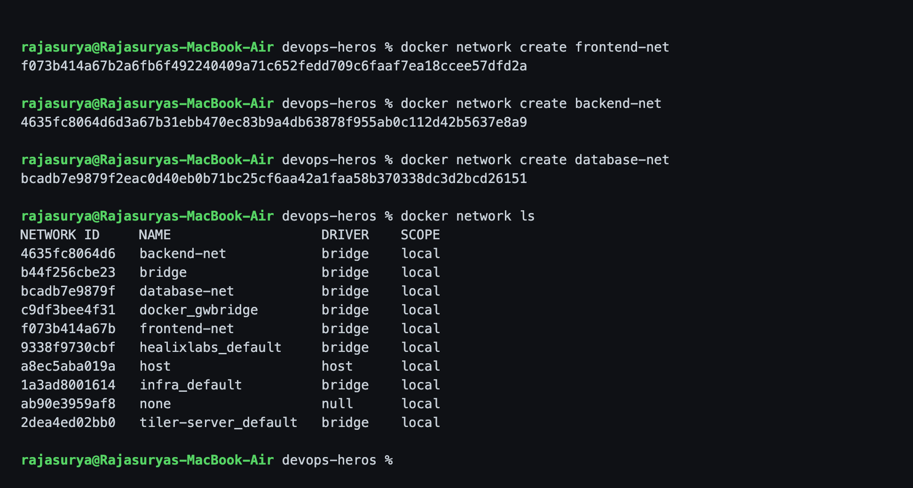

(`healixlabs_default`, `infra_default` and `tiler-server_default` are from other
projects already on my machine, not part of this homework.)

### Commands

```bash
docker run -d --name db-container --network database-net \
  -e MYSQL_ROOT_PASSWORD=DevopsHW@2026 -e MYSQL_DATABASE=studentdb mysql:8.0
docker run -d --name backend-container --network backend-net alpine:3.20 sleep infinity
docker run -d --name frontend-container --network frontend-net nginx:alpine
docker ps
```

### Output

```text
rajasurya@Rajasuryas-MacBook-Air devops-heros % docker run -d --name db-container --network database-net -e MY
SQL_ROOT_PASSWORD=DevopsHW@2026 -e MYSQL_DATABASE=studentdb mysql:8.0
84392342a3479a3061d242c501bc22eec69b32eb8b9c64cc103985022c1aaf07

rajasurya@Rajasuryas-MacBook-Air devops-heros % docker run -d --name backend-container --network backend-net a
lpine:3.20 sleep infinity
3fa517e13d690bfd187860d04597baa31fa27b71433df41a48b3e018abe2cb9f

rajasurya@Rajasuryas-MacBook-Air devops-heros % docker run -d --name frontend-container --network frontend-net
 nginx:alpine
a9cc15803f3ddf2e5262c5daf10cdab928653990cfeb083c60b52581218cad2d

rajasurya@Rajasuryas-MacBook-Air devops-heros % docker ps --filter "name=-container" --format "table {{.Names}
}\t{{.Image}}\t{{.Status}}"
NAMES                IMAGE          STATUS
frontend-container   nginx:alpine   Up Less than a second
backend-container    alpine:3.20    Up 2 seconds
db-container         mysql:8.0      Up 4 seconds

rajasurya@Rajasuryas-MacBook-Air devops-heros %
```

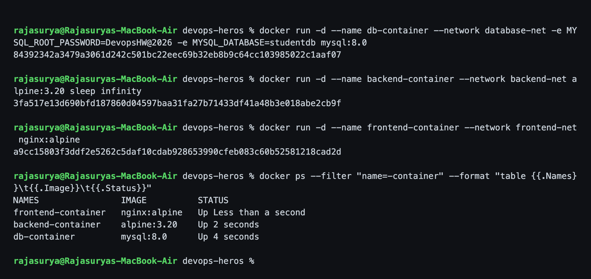

`MYSQL_ROOT_PASSWORD` is **required** by the mysql image - without it the
container exits immediately. `MYSQL_DATABASE=studentdb` makes it create an empty
database on first boot. The alpine backend needs `sleep infinity` as its command,
otherwise it would have nothing to run, exit straight away, and the container
would stop.

### Commands - put the backend on a second network

```bash
docker network connect frontend-net backend-container
docker network connect backend-net db-container
docker inspect -f '{{range $k,$v := .NetworkSettings.Networks}}{{$k}} -> {{$v.IPAddress}}{{println}}{{end}}' backend-container
docker exec frontend-container ip -o addr show | grep "inet "
docker exec backend-container  ip -o addr show | grep "inet "
```

### Output

```text
rajasurya@Rajasuryas-MacBook-Air devops-heros %

rajasurya@Rajasuryas-MacBook-Air devops-heros % docker network connect frontend-net backend-container
rajasurya@Rajasuryas-MacBook-Air devops-heros % docker network connect backend-net db-container
rajasurya@Rajasuryas-MacBook-Air devops-heros % docker inspect -f '{{range $k,$v := .NetworkSettings.Networks}
}{{$k}} -> {{$v.IPAddress}}{{println}}{{end}}' frontend-container
frontend-net -> 172.21.0.2

rajasurya@Rajasuryas-MacBook-Air devops-heros % docker inspect -f '{{range $k,$v := .NetworkSettings.Networks}
}{{$k}} -> {{$v.IPAddress}}{{println}}{{end}}' backend-container
backend-net -> 172.22.0.2
frontend-net -> 172.21.0.3

rajasurya@Rajasuryas-MacBook-Air devops-heros % docker inspect -f '{{range $k,$v := .NetworkSettings.Networks}
}{{$k}} -> {{$v.IPAddress}}{{println}}{{end}}' db-container
backend-net -> 172.22.0.3
database-net -> 172.23.0.2

rajasurya@Rajasuryas-MacBook-Air devops-heros % docker exec frontend-container ip -o addr show | grep "inet "
1: lo    inet 127.0.0.1/8 scope host lo\       valid_lft forever preferred_lft forever
11: eth0    inet 172.21.0.2/16 brd 172.21.255.255 scope global eth0\       valid_lft forever preferred_lft forever

rajasurya@Rajasuryas-MacBook-Air devops-heros % docker exec backend-container ip -o addr show | grep "inet "
1: lo    inet 127.0.0.1/8 scope host lo\       valid_lft forever preferred_lft forever
11: eth0    inet 172.22.0.2/16 brd 172.22.255.255 scope global eth0\       valid_lft forever preferred_lft forever
13: eth1    inet 172.21.0.3/16 brd 172.21.255.255 scope global eth1\       valid_lft forever preferred_lft forever

rajasurya@Rajasuryas-MacBook-Air devops-heros %
```

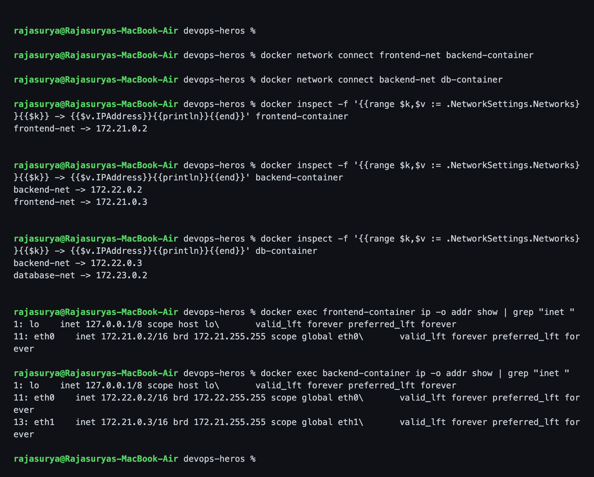

The backend really does have two addresses on two different subnets, and you can
see it as **two network interfaces inside the container**: `eth0` on
`backend-net` and `eth1` on `frontend-net`. The frontend only has `eth0`.

### Commands

```bash
docker network inspect frontend-net
docker network inspect backend-net
docker network inspect database-net
```

### Output

```text
rajasurya@Rajasuryas-MacBook-Air devops-heros %

rajasurya@Rajasuryas-MacBook-Air devops-heros % docker network inspect frontend-net --format 'network: {{.Name
}}  subnet: {{range .IPAM.Config}}{{.Subnet}}{{end}}{{println}}{{range .Containers}}  - {{.Name}} {{.IPv4Addre
ss}}{{println}}{{end}}'
network: frontend-net  subnet: 172.21.0.0/16
  - backend-container 172.21.0.3/16
  - frontend-container 172.21.0.2/16

rajasurya@Rajasuryas-MacBook-Air devops-heros % docker network inspect backend-net --format 'network: {{.Name}
}  subnet: {{range .IPAM.Config}}{{.Subnet}}{{end}}{{println}}{{range .Containers}}  - {{.Name}} {{.IPv4Addres
s}}{{println}}{{end}}'
network: backend-net  subnet: 172.22.0.0/16
  - backend-container 172.22.0.2/16
  - db-container 172.22.0.3/16

rajasurya@Rajasuryas-MacBook-Air devops-heros % docker network inspect database-net --format 'network: {{.Name
}}  subnet: {{range .IPAM.Config}}{{.Subnet}}{{end}}{{println}}{{range .Containers}}  - {{.Name}} {{.IPv4Addre
ss}}{{println}}{{end}}'
network: database-net  subnet: 172.23.0.0/16
  - db-container 172.23.0.2/16

rajasurya@Rajasuryas-MacBook-Air devops-heros %
```

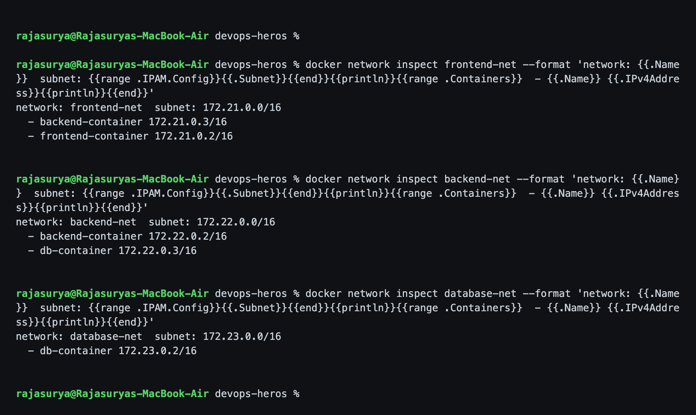

Each user-defined network got its own subnet, and each container appears in
exactly the networks it is attached to.

### Commands - connectivity between the containers

```bash
docker exec frontend-container ping -c 3 backend-container
docker exec backend-container curl -s -I http://frontend-container
docker exec backend-container ping -c 3 db-container
```

### Output

```text
rajasurya@Rajasuryas-MacBook-Air devops-heros %

rajasurya@Rajasuryas-MacBook-Air devops-heros % docker exec frontend-container ping -c 3 backend-container
PING backend-container (172.21.0.3): 56 data bytes
64 bytes from 172.21.0.3: seq=0 ttl=64 time=0.753 ms
64 bytes from 172.21.0.3: seq=1 ttl=64 time=0.397 ms
64 bytes from 172.21.0.3: seq=2 ttl=64 time=0.178 ms

--- backend-container ping statistics ---
3 packets transmitted, 3 packets received, 0% packet loss
round-trip min/avg/max = 0.178/0.442/0.753 ms

rajasurya@Rajasuryas-MacBook-Air devops-heros % docker exec backend-container curl -s -I http://frontend-conta
iner
HTTP/1.1 200 OK

Server: nginx/1.31.5

Date: Thu, 03 Sep 2026 13:51:45 GMT

Content-Type: text/html

Content-Length: 896

Last-Modified: Wed, 02 Sep 2026 17:23:39 GMT

Connection: keep-alive

ETag: "6a985b9b-380"

Accept-Ranges: bytes

rajasurya@Rajasuryas-MacBook-Air devops-heros % docker exec backend-container ping -c 3 db-container
PING db-container (172.22.0.3): 56 data bytes
64 bytes from 172.22.0.3: seq=0 ttl=64 time=0.201 ms
64 bytes from 172.22.0.3: seq=1 ttl=64 time=0.410 ms
64 bytes from 172.22.0.3: seq=2 ttl=64 time=1.147 ms

--- db-container ping statistics ---
3 packets transmitted, 3 packets received, 0% packet loss
round-trip min/avg/max = 0.201/0.586/1.147 ms

rajasurya@Rajasuryas-MacBook-Air devops-heros %
```

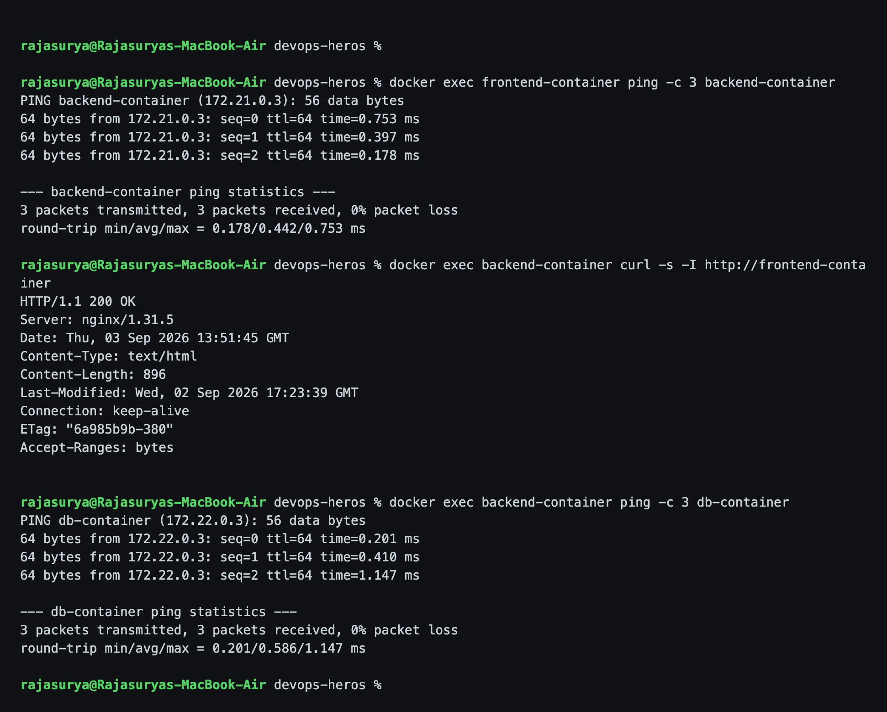

**0% packet loss** both ways, and nginx answers **HTTP/1.1 200 OK**. Notice it
resolved the **container name** to an IP - that is Docker's built-in DNS, and it
only works on **user-defined** networks, not the default `bridge`.

### Commands - the backend actually queries the database

```bash
docker exec backend-container apk add --no-cache curl mysql-client
docker exec backend-container mysql -h db-container -u root -pDevopsHW@2026 -e "SHOW DATABASES;"
```

### Output

```text
rajasurya@Rajasuryas-MacBook-Air devops-heros %

rajasurya@Rajasuryas-MacBook-Air devops-heros % docker exec backend-container mysql -h db-container -u root -p
DevopsHW@2026 -e "SHOW DATABASES;"
ERROR 1045 (28000): Plugin caching_sha2_password could not be loaded: Error loading shared library /usr/lib/mariadb/plugin/caching_sha2_password.so: No such file or directory

rajasurya@Rajasuryas-MacBook-Air devops-heros %
```

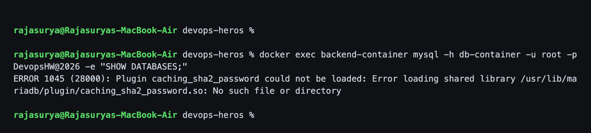

**This first attempt failed, and the error is worth keeping.** Alpine's
`mysql-client` package is actually the **MariaDB** client, and MySQL 8 defaults
to the `caching_sha2_password` authentication plugin, which the MariaDB client
cannot do. Nothing to do with networking - the connection got all the way to the
**auth stage**, which actually proves the network path works.

### Commands - the fix

```bash
docker exec db-container mysql -u root -pDevopsHW@2026 -e "
  CREATE USER IF NOT EXISTS 'appuser'@'%' IDENTIFIED WITH mysql_native_password BY 'AppPass@2026';
  GRANT ALL PRIVILEGES ON studentdb.* TO 'appuser'@'%';
  FLUSH PRIVILEGES;
  SELECT user, host, plugin FROM mysql.user WHERE user IN ('root','appuser');"

docker exec backend-container mysql -h db-container -u appuser -pAppPass@2026 -e "SHOW DATABASES;"

docker exec backend-container mysql -h db-container -u appuser -pAppPass@2026 studentdb -e "
  CREATE TABLE IF NOT EXISTS students (id INT PRIMARY KEY, name VARCHAR(50));
  INSERT IGNORE INTO students VALUES (1,'Rajasurya J'),(2,'test student');
  SELECT * FROM students;"
```

### Output

```text
rajasurya@Rajasuryas-MacBook-Air devops-heros %

rajasurya@Rajasuryas-MacBook-Air devops-heros % docker exec db-container mysql -u root -pDevopsHW@2026 -e "CRE
ATE USER IF NOT EXISTS 'appuser'@'%' IDENTIFIED WITH mysql_native_password BY 'AppPass@2026'; GRANT ALL PRIVIL
EGES ON studentdb.* TO 'appuser'@'%'; FLUSH PRIVILEGES; SELECT user, host, plugin FROM mysql.user WHERE user I
N ('root','appuser');"
mysql: [Warning] Using a password on the command line interface can be insecure.
user	host	plugin
appuser	%	mysql_native_password
root	%	caching_sha2_password
root	localhost	caching_sha2_password

rajasurya@Rajasuryas-MacBook-Air devops-heros % docker exec backend-container mysql -h db-container -u appuser
 -pAppPass@2026 -e "SHOW DATABASES;"
Database
information_schema
performance_schema
studentdb

rajasurya@Rajasuryas-MacBook-Air devops-heros % docker exec backend-container mysql -h db-container -u appuser
 -pAppPass@2026 studentdb -e "CREATE TABLE IF NOT EXISTS students (id INT PRIMARY KEY, name VARCHAR(50)); INSE
RT IGNORE INTO students VALUES (1,'Rajasurya J'),(2,'test student'); SELECT * FROM students;"
id	name
1	Rajasurya J
2	test student

rajasurya@Rajasuryas-MacBook-Air devops-heros %
```

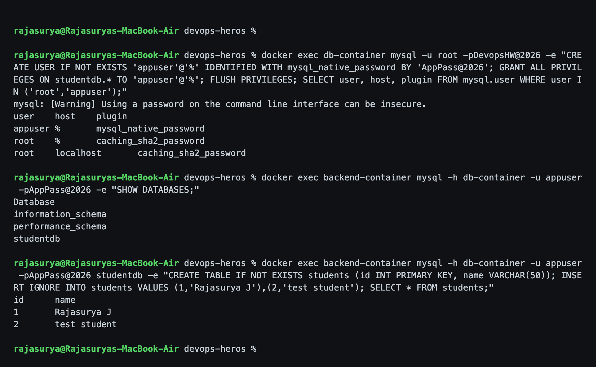

The backend container created a table and read the rows back out of MySQL over
`backend-net`, addressing it purely by the name `db-container`.

### Commands - and the negative case

```bash
docker exec frontend-container ping -c 2 db-container
docker exec frontend-container ping -c 2 -W 2 172.22.0.3
```

### Output

```text
rajasurya@Rajasuryas-MacBook-Air devops-heros %

rajasurya@Rajasuryas-MacBook-Air devops-heros % docker exec frontend-container ping -c 2 db-container
ping: bad address 'db-container'

rajasurya@Rajasuryas-MacBook-Air devops-heros % echo "exit code: $?"
exit code: 1

rajasurya@Rajasuryas-MacBook-Air devops-heros % docker exec frontend-container ping -c 2 -W 2 172.22.0.3
PING 172.22.0.3 (172.22.0.3): 56 data bytes

--- 172.22.0.3 ping statistics ---
2 packets transmitted, 0 packets received, 100% packet loss

rajasurya@Rajasuryas-MacBook-Air devops-heros % echo "exit code: $?"
exit code: 1

rajasurya@Rajasuryas-MacBook-Air devops-heros %
```

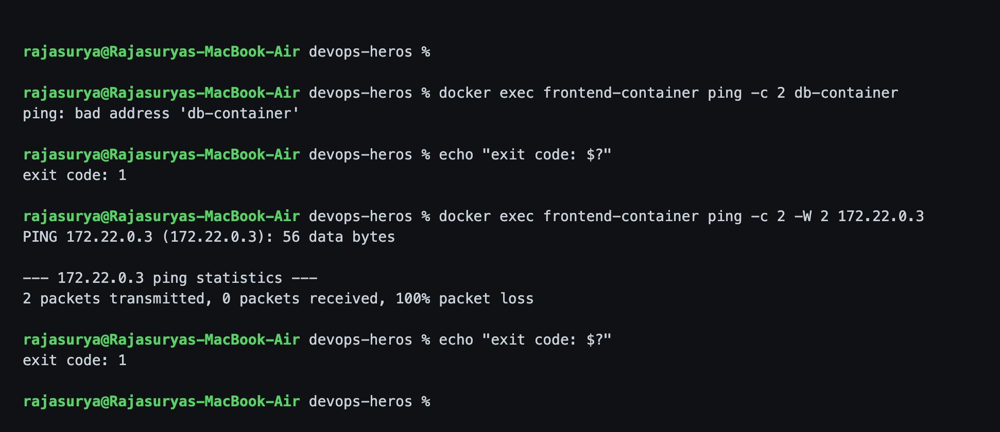

The frontend cannot even **resolve the name** - Docker's DNS only tells a
container about others on networks it shares. And it is not just DNS: pinging the
database's IP directly gives **100% packet loss**. That is real layer-3
isolation between the two bridge networks, and it is the security benefit - even
if the frontend is compromised, the database is not directly reachable.

### Connectivity matrix

| From | To | Same network? | Result |
|---|---|---|---|
| frontend | backend | yes (frontend-net) | ping OK, HTTP 200 |
| backend | frontend | yes (frontend-net) | HTTP 200 |
| backend | database | yes (backend-net) | ping OK, SQL query OK |
| frontend | database | **no** | name does not resolve, 100% packet loss |

---

## Task 2: Host Network

- Pull the Apache2 image from Docker Hub.
- Create an Apache2 container using the host network.
- Access the Apache website directly on port 80.

### Commands

```bash
docker pull httpd:2.4
docker run -d --name apache-host --network host httpd:2.4
docker ps --filter name=apache-host
docker inspect -f 'NetworkMode={{.HostConfig.NetworkMode}}   Networks={{range $k,$v := .NetworkSettings.Networks}}{{$k}}{{end}}' apache-host
docker logs apache-host
```

### Output

```text
rajasurya@Rajasuryas-MacBook-Air devops-heros %

rajasurya@Rajasuryas-MacBook-Air devops-heros % docker pull httpd:2.4
2.4: Pulling from library/httpd
Digest: sha256:979c38c2228d28c2edfd45c6e27dcee1c7b4a101a5526721ae8ece454e89e99e
Status: Image is up to date for httpd:2.4
docker.io/library/httpd:2.4

rajasurya@Rajasuryas-MacBook-Air devops-heros % docker run -d --name apache-host --network host httpd:2.4
51ebb35600d3040db90c16235a8a085d719a3e42770131b1cace31807fa06129

rajasurya@Rajasuryas-MacBook-Air devops-heros % sleep 3
rajasurya@Rajasuryas-MacBook-Air devops-heros % docker ps --filter name=apache-host --format "table {{.ID}}\t{
{.Image}}\t{{.Command}}\t{{.Status}}\t{{.Ports}}\t{{.Names}}"
CONTAINER ID   IMAGE       COMMAND              STATUS         PORTS     NAMES
51ebb35600d3   httpd:2.4   "httpd-foreground"   Up 3 seconds             apache-host

rajasurya@Rajasuryas-MacBook-Air devops-heros % docker inspect -f 'NetworkMode={{.HostConfig.NetworkMode}}   N
etworks={{range $k,$v := .NetworkSettings.Networks}}{{$k}}{{end}}' apache-host
NetworkMode=host   Networks=host

rajasurya@Rajasuryas-MacBook-Air devops-heros % docker logs apache-host
AH00558: httpd: Could not reliably determine the server's fully qualified domain name, using 192.168.65.3. Set the 'ServerName' directive globally to suppress this message
AH00558: httpd: Could not reliably determine the server's fully qualified domain name, using 192.168.65.3. Set the 'ServerName' directive globally to suppress this message
[Thu Sep 03 13:52:35.212397 2026] [mpm_event:notice] [pid 1:tid 1] AH00489: Apache/2.4.68 (Unix) configured -- resuming normal operations
[Thu Sep 03 13:52:35.215936 2026] [core:notice] [pid 1:tid 1] AH00094: Command line: 'httpd -D FOREGROUND'

rajasurya@Rajasuryas-MacBook-Air devops-heros %
```

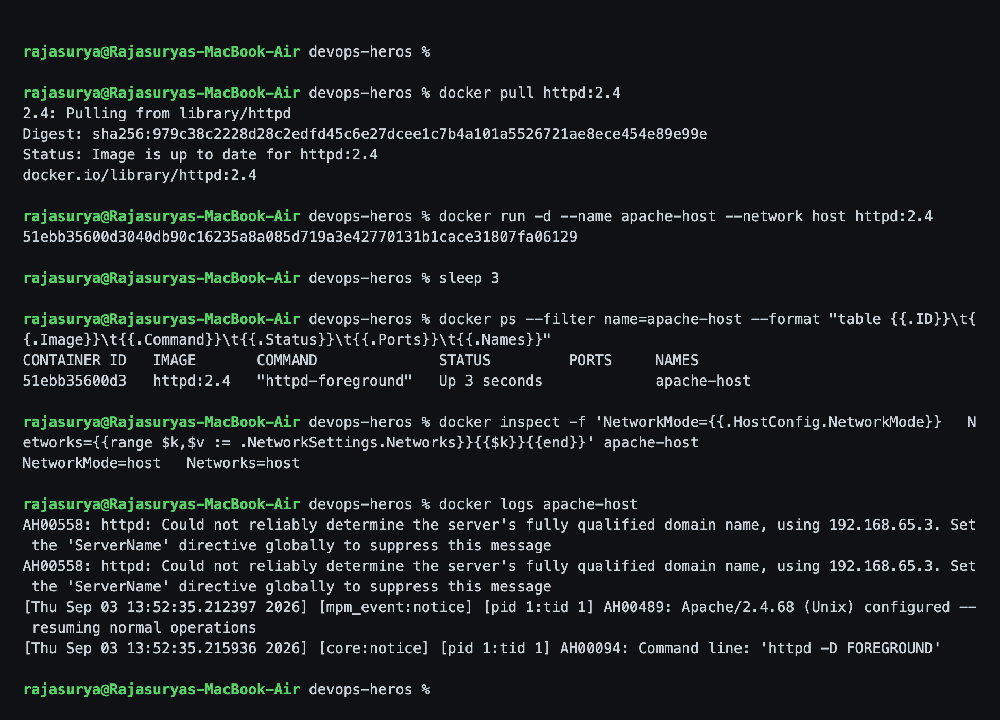

Two things confirm it is really on the host network:

- The **PORTS column is empty** and there is no `-p` flag. With `--network host`
  the container shares the host's network namespace, so there is nothing to map.
- `NetworkMode=host`, and Apache's own log says it picked up **192.168.65.3** as
  its server name - the Docker host's IP, not a `172.x` bridge address.

### Commands - access the site on port 80

```bash
docker run --rm --network host alpine:3.20 wget -qO- http://localhost:80
docker run --rm --network host alpine:3.20 netstat -tln | grep ":80 "
docker run --rm --network host alpine:3.20 ip -o addr show | grep "inet "
curl -s -m 5 -o /dev/null -w "from macOS: HTTP %{http_code}\n" http://localhost:80
```

### Output

```text
rajasurya@Rajasuryas-MacBook-Air devops-heros %

rajasurya@Rajasuryas-MacBook-Air devops-heros % docker run --rm --network host alpine:3.20 wget -qO- http://lo
calhost:80
<!DOCTYPE HTML PUBLIC "-//W3C//DTD HTML 4.01//EN" "http://www.w3.org/TR/html4/strict.dtd">
<html>
<head>
<title>It works! Apache httpd</title>
</head>
<body>
<p>It works!</p>
</body>
</html>

rajasurya@Rajasuryas-MacBook-Air devops-heros % docker run --rm --network host alpine:3.20 netstat -tln | grep
 ":80 "
tcp        0      0 :::80                   :::*                    LISTEN

rajasurya@Rajasuryas-MacBook-Air devops-heros % docker run --rm --network host alpine:3.20 ip -o addr show | g
rep "inet "
1: lo    inet 127.0.0.1/8 scope host lo\       valid_lft forever preferred_lft forever
4: eth0    inet 192.168.65.3/24 brd 192.168.65.255 scope global eth0\       valid_lft forever preferred_lft forever
15: services1    inet 192.168.65.6/32 scope global services1\       valid_lft forever preferred_lft forever
16: docker0    inet 172.17.0.1/16 brd 172.17.255.255 scope global docker0\       valid_lft forever preferred_lft forever
17: br-1a3ad8001614    inet 172.18.0.1/16 brd 172.18.255.255 scope global br-1a3ad8001614\       valid_lft forever preferred_lft forever
18: br-2dea4ed02bb0    inet 172.20.0.1/16 brd 172.20.255.255 scope global br-2dea4ed02bb0\       valid_lft forever preferred_lft forever
19: br-9338f9730cbf    inet 172.19.0.1/16 brd 172.19.255.255 scope global br-9338f9730cbf\       valid_lft forever preferred_lft forever
95: docker_gwbridge    inet 172.24.0.1/16 brd 172.24.255.255 scope global docker_gwbridge\       valid_lft forever preferred_lft forever
166: br-f073b414a67b    inet 172.21.0.1/16 brd 172.21.255.255 scope global br-f073b414a67b\       valid_lft forever preferred_lft forever
167: br-4635fc8064d6    inet 172.22.0.1/16 brd 172.22.255.255 scope global br-4635fc8064d6\       valid_lft forever preferred_lft forever
168: br-bcadb7e9879f    inet 172.23.0.1/16 brd 172.23.255.255 scope global br-bcadb7e9879f\       valid_lft forever preferred_lft forever

rajasurya@Rajasuryas-MacBook-Air devops-heros % curl -s -m 5 -o /dev/null -w "from macOS: HTTP %{http_code}\n"
 http://localhost:80
from macOS: HTTP 000

rajasurya@Rajasuryas-MacBook-Air devops-heros %
```

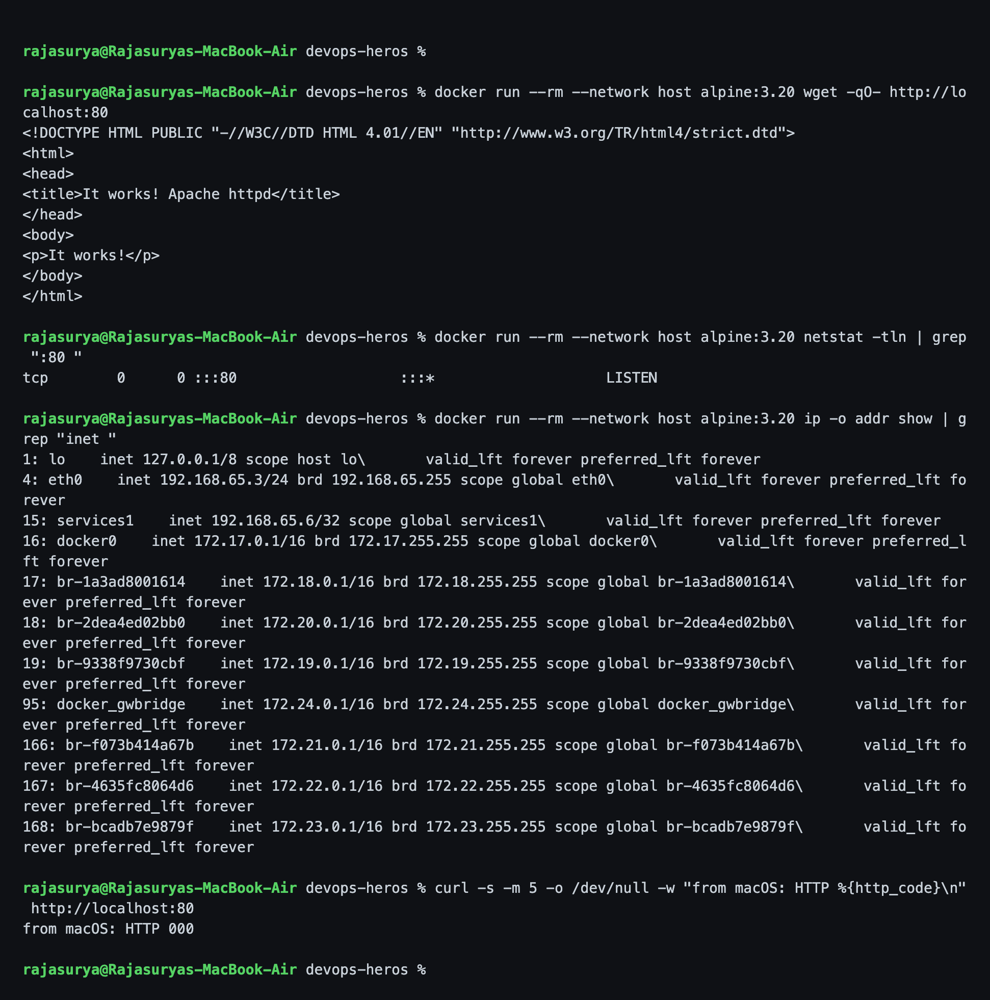

Apache serves **`It works!`** on **port 80**, and `netstat` confirms `:::80
LISTEN`.

The `ip addr` output is the strongest proof: a container on the host network sees
**every interface on the host**, including `docker0` and all the `br-*` bridges -
one of which is the gateway side of my `frontend-net` from Task 1. A bridge
container only ever sees `lo` and its own `eth0`. That is only possible if this
container is genuinely inside the host's network namespace.

### Honest note about my machine

My host is a **MacBook Air**, and Docker Desktop runs all containers inside a
Linux VM. `--network host` gives the container the **Linux VM's** network stack,
not macOS's - which is why the last line reads `from macOS: HTTP 000`. That is
**not** the container failing; it is proven above to be serving on port 80. macOS
just cannot route into the VM's host network unless the "host networking" feature
is switched on in Docker Desktop's settings, and turning that on requires
restarting Docker Desktop, which would have killed the other projects running on
my machine. On a native Linux host, `curl http://localhost:80` from the terminal
would have worked directly.

### Host network vs bridge network

| | bridge (default) | host |
|---|---|---|
| Network namespace | its own | shares the host's |
| Needs `-p` to publish | yes | no - already on the host's ports |
| Container IP | e.g. 172.21.0.2 | the host's IP |
| Port conflicts | no | yes - two containers cannot both take :80 |
| Isolation | good | none |
| Performance | slight NAT overhead | no NAT, slightly faster |
| Container-name DNS | yes, on user-defined networks | no |
| Platform | works everywhere | full support on Linux |

Use host networking when you need raw performance or the container must see the
real network (monitoring agents, load balancers). Otherwise bridge - isolation is
worth more than the small NAT cost.

---

## Task 3: Bind Mount

- Create a folder on your local machine with an `index.html` containing
  **Hello students**.
- Bind mount the folder into an Nginx container and check the site.
- Modify `index.html` and verify the change is reflected **without restarting**
  the container.

### Commands

```bash
cd session8-docker-networking-volume/Rajasurya-24BCS10086
cat bind-mount-site/index.html
docker run -d --name nginx-bind -p 3007:80 \
  -v "$(pwd)/bind-mount-site":/usr/share/nginx/html:ro nginx:alpine
docker inspect -f '{{range .Mounts}}Type={{.Type}} Source={{.Source}} Destination={{.Destination}} RW={{.RW}}{{end}}' nginx-bind
curl -s http://localhost:3007
docker inspect -f 'StartedAt={{.State.StartedAt}}  RestartCount={{.RestartCount}}  PID={{.State.Pid}}' nginx-bind
```

The source path **must be absolute** - that is why I used `$(pwd)/...`. With a
relative path Docker would treat it as a named volume instead.

### Output - before

```text
rajasurya@Rajasuryas-MacBook-Air devops-heros %

rajasurya@Rajasuryas-MacBook-Air devops-heros % cd session8-docker-networking-volume/Rajasurya-24BCS10086
rajasurya@Rajasuryas-MacBook-Air devops-heros % pwd
/Users/rajasurya/devops-heros/session8-docker-networking-volume/Rajasurya-24BCS10086

rajasurya@Rajasuryas-MacBook-Air devops-heros % cat bind-mount-site/index.html
<!DOCTYPE html>
<html>
  <head><title>Bind Mount Demo</title></head>
  <body style="font-family: sans-serif; text-align: center; margin-top: 100px;">
    <h1>Hello students</h1>
  </body>
</html>

rajasurya@Rajasuryas-MacBook-Air devops-heros % docker run -d --name nginx-bind -p 3007:80 -v "$(pwd)/bind-mou
nt-site":/usr/share/nginx/html:ro nginx:alpine
94d607cd3e644371668d68d343aa4ddf20b72f07f0feafed81bccc4c4d9a80a3

rajasurya@Rajasuryas-MacBook-Air devops-heros % sleep 3
rajasurya@Rajasuryas-MacBook-Air devops-heros % docker inspect -f '{{range .Mounts}}Type={{.Type}}  Source={{.
Source}}  Destination={{.Destination}}  RW={{.RW}}{{end}}' nginx-bind
Type=bind  Source=/Users/rajasurya/devops-heros/session8-docker-networking-volume/Rajasurya-24BCS10086/bind-mount-site  Destination=/usr/share/nginx/html  RW=false

rajasurya@Rajasuryas-MacBook-Air devops-heros % curl -s http://localhost:3007
<!DOCTYPE html>
<html>
  <head><title>Bind Mount Demo</title></head>
  <body style="font-family: sans-serif; text-align: center; margin-top: 100px;">
    <h1>Hello students</h1>
  </body>
</html>

rajasurya@Rajasuryas-MacBook-Air devops-heros % docker inspect -f 'StartedAt={{.State.StartedAt}}  RestartCoun
t={{.RestartCount}}  PID={{.State.Pid}}' nginx-bind
StartedAt=2026-09-03T15:18:33.952543543Z  RestartCount=0  PID=52643

rajasurya@Rajasuryas-MacBook-Air devops-heros %
```

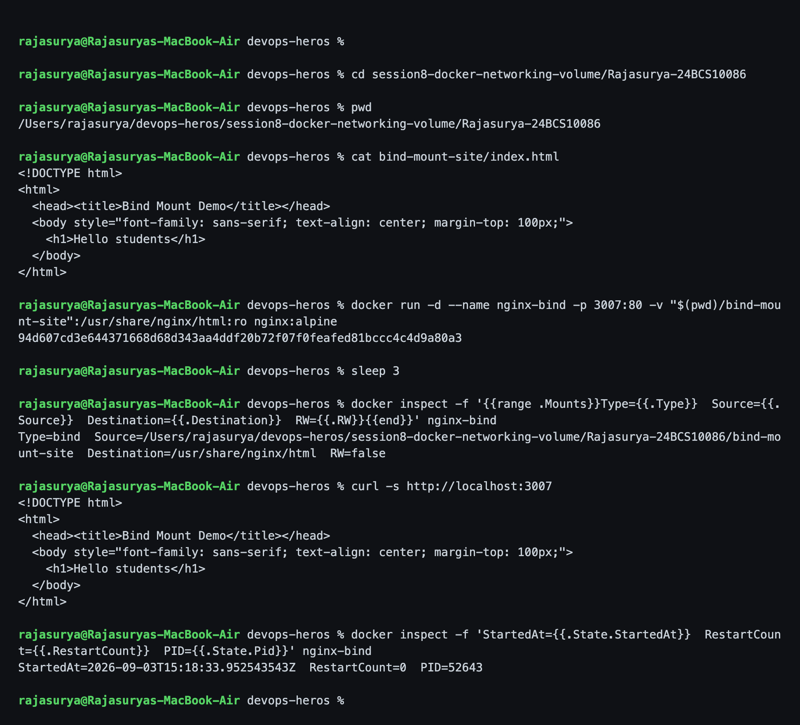


The folder is committed here: [`bind-mount-site/`](bind-mount-site/).

### Then I edited index.html on my Mac

In my normal editor. **No docker command was run** - no `restart`, no `stop`, no
`cp`, no `exec`.

### Commands - after

```bash
cat bind-mount-site/index.html
curl -s http://localhost:3007
docker inspect -f 'StartedAt={{.State.StartedAt}}  RestartCount={{.RestartCount}}  PID={{.State.Pid}}' nginx-bind
docker exec nginx-bind sh -c "echo hacked > /usr/share/nginx/html/index.html"
```

### Output - after

```text
rajasurya@Rajasuryas-MacBook-Air devops-heros %

rajasurya@Rajasuryas-MacBook-Air devops-heros % cd session8-docker-networking-volume/Rajasurya-24BCS10086
rajasurya@Rajasuryas-MacBook-Air devops-heros % cat bind-mount-site/index.html
<!DOCTYPE html>
<html>
  <head><title>Bind Mount Demo</title></head>
  <body style="font-family: sans-serif; text-align: center; margin-top: 100px;">
    <h1>Hello students - edited on my Mac, no restart</h1>
    <p>The nginx container is still the same process.</p>
    <p>edited at: 2026-09-03 20:05 IST</p>
  </body>
</html>

rajasurya@Rajasuryas-MacBook-Air devops-heros % curl -s http://localhost:3007
<!DOCTYPE html>
<html>
  <head><title>Bind Mount Demo</title></head>
  <body style="font-family: sans-serif; text-align: center; margin-top: 100px;">
    <h1>Hello students - edited on my Mac, no restart</h1>
    <p>The nginx container is still the same process.</p>
    <p>edited at: 2026-09-03 20:05 IST</p>
  </body>
</html>

rajasurya@Rajasuryas-MacBook-Air devops-heros % docker inspect -f 'StartedAt={{.State.StartedAt}}  RestartCoun
t={{.RestartCount}}  PID={{.State.Pid}}' nginx-bind
StartedAt=2026-09-03T15:18:33.952543543Z  RestartCount=0  PID=52643

rajasurya@Rajasuryas-MacBook-Air devops-heros % docker exec nginx-bind sh -c "echo hacked > /usr/share/nginx/h
tml/index.html"
sh: can't create /usr/share/nginx/html/index.html: Read-only file system

rajasurya@Rajasuryas-MacBook-Air devops-heros % echo "exit code: $?"
exit code: 1

rajasurya@Rajasuryas-MacBook-Air devops-heros %
```

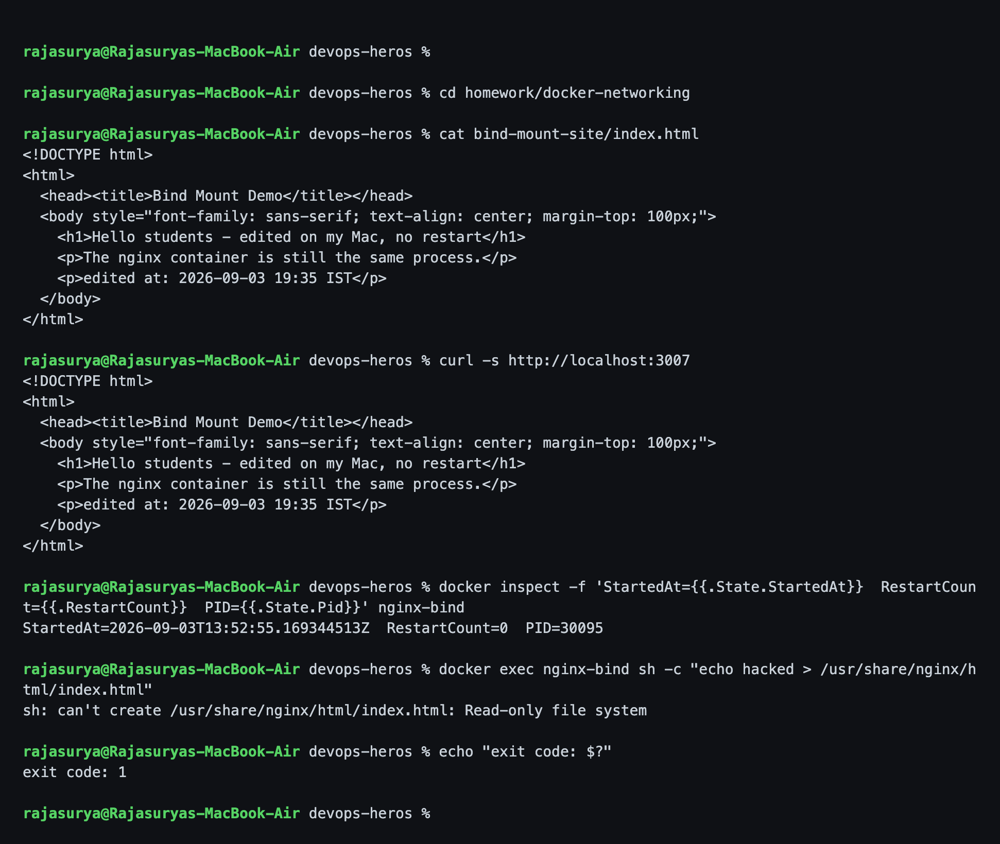


**The proof is the `docker inspect` line.** Before the edit and after the edit it
reads **`PID=52643`**, the same `StartedAt` timestamp, and **`RestartCount=0`**.
The new content was served by the exact same running nginx process.

### The `:ro` flag

I mounted it read-only, and the last command tests that:

```
sh: can't create /usr/share/nginx/html/index.html: Read-only file system
exit code: 1
```

`RW=false` in the inspect output matches. For a web server that only needs to
*read* static files this is the right thing to do - a compromised container
cannot rewrite my source files.

### Bind mount vs named volume

| | Bind mount | Named volume |
|---|---|---|
| Where the data lives | a path I choose on the host | Docker-managed (`/var/lib/docker/volumes`) |
| Syntax | `-v /abs/host/path:/container/path` | `-v myvolume:/container/path` |
| Edit from the host | yes, with any editor | awkward |
| Portable across machines | no - depends on my paths | yes |
| Best for | **development** - live-editing code/config | **production data** - databases, uploads |

---

## Task 4: Overlay Network

- Research Docker overlay networks, their use cases, and how they work across
  multiple Docker hosts.

### What an overlay network is

A **bridge** network is a virtual switch that exists on **one** Docker host.
Containers on the same bridge can talk to each other, but a container on machine
A can never reach a bridge network on machine B.

An **overlay** network spans **multiple Docker hosts**. It creates one flat
virtual layer-2 network that containers on different physical machines share, so
`containerA` on host 1 can reach `containerB` on host 2 by name, as if they were
plugged into the same switch.

### How it works

- Docker builds a **VXLAN tunnel** between the hosts. A container's ethernet
  frame is wrapped inside a UDP packet, sent over the real physical network to
  the other host, unwrapped there and delivered. The containers never know they
  crossed a machine boundary.
- The swarm managers keep a **distributed key-value store** (built into swarm)
  holding which container has which overlay IP and which host it lives on. That
  is how routing decisions are made.
- Ports used: **2377/tcp** (cluster management), **7946/tcp+udp** (node discovery
  / gossip), **4789/udp** (the VXLAN data plane).
- Encryption is optional: `docker network create --opt encrypted` turns on IPsec
  for the data plane.

### Why they exist

Because containers have to be able to move. In a cluster the scheduler decides
which machine a container runs on, and it can move at any time. Hard-coding IPs
or ports would fall apart immediately. The overlay gives every service a stable
name and a stable virtual IP no matter which host it lands on.

### Commands - proof that overlay needs swarm

```bash
docker info | grep -i "Swarm:"
docker network create --driver overlay test-overlay
```

### Output

```text
rajasurya@Rajasuryas-MacBook-Air devops-heros %

rajasurya@Rajasuryas-MacBook-Air devops-heros % docker info | grep -i "Swarm:"
 Swarm: inactive

rajasurya@Rajasuryas-MacBook-Air devops-heros % docker network create --driver overlay test-overlay
Error response from daemon: This node is not a swarm manager. Use "docker swarm init" or "docker swarm join" to connect this node to swarm and try again.

rajasurya@Rajasuryas-MacBook-Air devops-heros % echo "exit code: $?"
exit code: 1

rajasurya@Rajasuryas-MacBook-Air devops-heros %
```

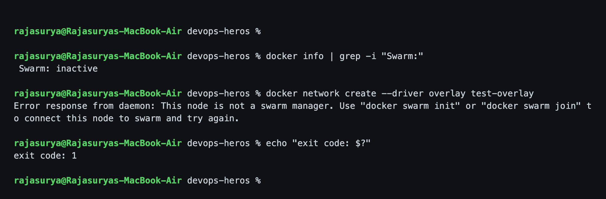

Overlay networks are a **swarm feature** - they need a swarm cluster (or, in the
old pre-1.12 setup, an external KV store like Consul/etcd), because something has
to hold the cluster-wide map of container to host.

### Commands - create a real overlay

```bash
docker swarm init
docker info | grep -E "Swarm:|NodeID:|Is Manager:|Nodes:|Managers:"
docker node ls
docker network create --driver overlay --attachable app-overlay
docker network ls --filter driver=overlay
docker network inspect app-overlay
```

### Output

```text
rajasurya@Rajasuryas-MacBook-Air devops-heros %

rajasurya@Rajasuryas-MacBook-Air devops-heros % docker swarm init
Swarm initialized: current node (swov6yugdv8lmk4hru58kmp0s) is now a manager.

To add a worker to this swarm, run the following command:

    docker swarm join --token SWMTKN-1-2prfoxli79s49i9qpttvcs4f3vh98wbf4e2jsnuvtcdquyru6r-e6fsppo2ltbyk7y4nknzjbgm0 192.168.65.3:2377

To add a manager to this swarm, run 'docker swarm join-token manager' and follow the instructions.

rajasurya@Rajasuryas-MacBook-Air devops-heros % docker info | grep -E "Swarm:|NodeID:|Is Manager:|Nodes:|Manag
ers:"
 Swarm: active
  NodeID: swov6yugdv8lmk4hru58kmp0s
  Is Manager: true
  Managers: 1
  Nodes: 1
  Autolock Managers: false

rajasurya@Rajasuryas-MacBook-Air devops-heros % docker node ls
ID                            HOSTNAME         STATUS    AVAILABILITY   MANAGER STATUS   ENGINE VERSION
swov6yugdv8lmk4hru58kmp0s *   docker-desktop   Ready     Active         Leader           29.2.1

rajasurya@Rajasuryas-MacBook-Air devops-heros % docker network create --driver overlay --attachable app-overla
y
56v96ukl0wcwk5w13ehm8acs3

rajasurya@Rajasuryas-MacBook-Air devops-heros % docker network ls --filter driver=overlay
NETWORK ID     NAME          DRIVER    SCOPE
56v96ukl0wcw   app-overlay   overlay   swarm
u8ihk866jzi0   ingress       overlay   swarm

rajasurya@Rajasuryas-MacBook-Air devops-heros % docker network inspect app-overlay --format 'Name={{.Name}}  D
river={{.Driver}}  Scope={{.Scope}}  Attachable={{.Attachable}}  Subnet={{range .IPAM.Config}}{{.Subnet}}{{end
}}'
Name=app-overlay  Driver=overlay  Scope=swarm  Attachable=true  Subnet=10.0.1.0/24

rajasurya@Rajasuryas-MacBook-Air devops-heros %
```

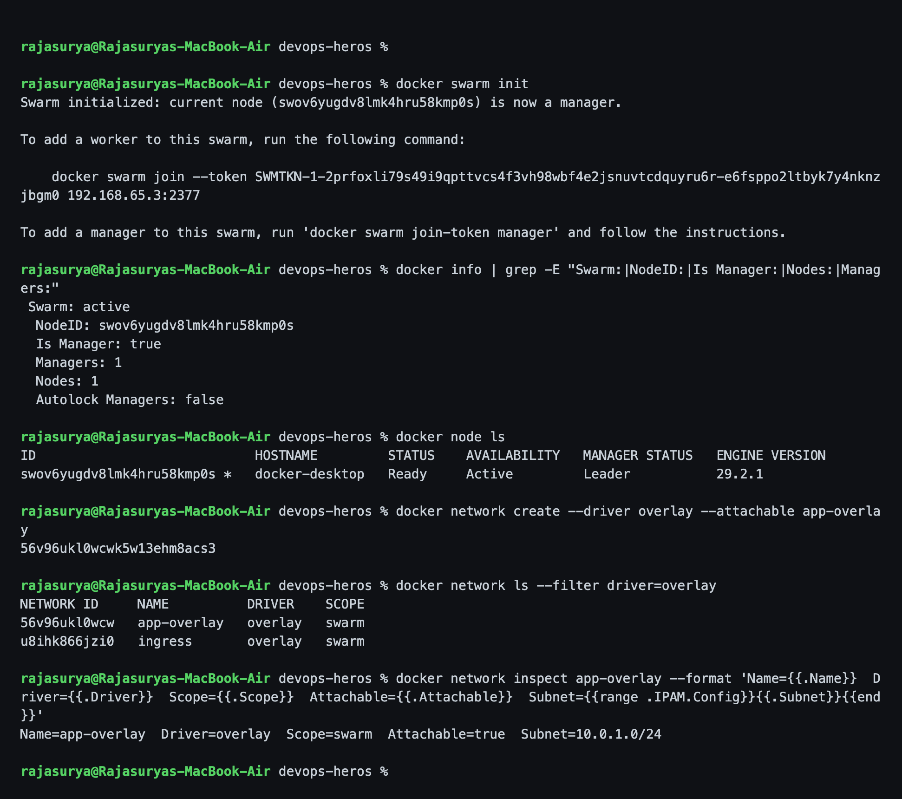

**The SCOPE column is the key difference** - my Task 1 bridge networks are
`local` (this host only), overlay networks are `swarm` (cluster-wide). The
`ingress` overlay is created automatically by swarm for the routing mesh.

`--attachable` is what lets a plain `docker run` container join an overlay;
without it only swarm services can.

The `docker swarm join --token SWMTKN-1-...` line in that output is exactly what
I would run on a second machine to make the overlay actually span two hosts.

### Commands - a service on the overlay, and its DNS

```bash
docker service create --name web --network app-overlay --replicas 2 nginx:alpine
docker service ls
docker service ps web
docker run -d --name overlay-client --network app-overlay alpine:3.20 sleep 300
docker exec overlay-client nslookup web
docker exec overlay-client nslookup tasks.web
docker exec overlay-client wget -qO- http://web | head -5
```

### Output

```text
rajasurya@Rajasuryas-MacBook-Air devops-heros %

rajasurya@Rajasuryas-MacBook-Air devops-heros % docker service create --name web --network app-overlay --repli
cas 2 nginx:alpine
gdxggs9copm66n29vw6fpju6x

overall progress: 0 out of 2 tasks

1/2:

2/2:

1/2: pending

2/2: pending

overall progress: 0 out of 2 tasks

1/2: assigned

2/2: assigned

overall progress: 0 out of 2 tasks

1/2: starting

2/2: starting

overall progress: 0 out of 2 tasks

1/2: starting

2/2: starting

overall progress: 0 out of 2 tasks

2/2: running

1/2: running

overall progress: 2 out of 2 tasks

verify: Waiting 5 seconds to verify that tasks are stable...

verify: Waiting 5 seconds to verify that tasks are stable...

verify: Waiting 5 seconds to verify that tasks are stable...

verify: Waiting 5 seconds to verify that tasks are stable...

verify: Waiting 5 seconds to verify that tasks are stable...

verify: Waiting 4 seconds to verify that tasks are stable...

verify: Waiting 4 seconds to verify that tasks are stable...

verify: Waiting 4 seconds to verify that tasks are stable...

verify: Waiting 4 seconds to verify that tasks are stable...

verify: Waiting 4 seconds to verify that tasks are stable...

verify: Waiting 3 seconds to verify that tasks are stable...

verify: Waiting 3 seconds to verify that tasks are stable...

verify: Waiting 3 seconds to verify that tasks are stable...

verify: Waiting 3 seconds to verify that tasks are stable...

verify: Waiting 2 seconds to verify that tasks are stable...

verify: Waiting 2 seconds to verify that tasks are stable...

verify: Waiting 2 seconds to verify that tasks are stable...

verify: Waiting 2 seconds to verify that tasks are stable...

verify: Waiting 2 seconds to verify that tasks are stable...

verify: Waiting 1 seconds to verify that tasks are stable...

verify: Waiting 1 seconds to verify that tasks are stable...

verify: Waiting 1 seconds to verify that tasks are stable...

verify: Waiting 1 seconds to verify that tasks are stable...

verify: Waiting 1 seconds to verify that tasks are stable...

verify: Service gdxggs9copm66n29vw6fpju6x converged

rajasurya@Rajasuryas-MacBook-Air devops-heros % docker service ls
ID             NAME      MODE         REPLICAS   IMAGE          PORTS
gdxggs9copm6   web       replicated   2/2        nginx:alpine

rajasurya@Rajasuryas-MacBook-Air devops-heros % docker service ps web --format "table {{.Name}}\t{{.Node}}\t{{
.CurrentState}}"
NAME      NODE             CURRENT STATE
web.1     docker-desktop   Running 5 seconds ago
web.2     docker-desktop   Running 5 seconds ago

rajasurya@Rajasuryas-MacBook-Air devops-heros % docker run -d --name overlay-client --network app-overlay alpi
ne:3.20 sleep 300
fffdd7507cdab0152b9659af26ab524675518342c4334d41d3630575469814c1

rajasurya@Rajasuryas-MacBook-Air devops-heros % sleep 3
rajasurya@Rajasuryas-MacBook-Air devops-heros % docker exec overlay-client nslookup web
Server:		127.0.0.11
Address:	127.0.0.11:53

Non-authoritative answer:

Non-authoritative answer:
Name:	web
Address: 10.0.1.2

rajasurya@Rajasuryas-MacBook-Air devops-heros % docker exec overlay-client nslookup tasks.web
Server:		127.0.0.11
Address:	127.0.0.11:53

Non-authoritative answer:

Non-authoritative answer:
Name:	tasks.web
Address: 10.0.1.4
Name:	tasks.web
Address: 10.0.1.3

rajasurya@Rajasuryas-MacBook-Air devops-heros % docker exec overlay-client wget -qO- http://web | head -5
<!DOCTYPE html>
<html>
<head>
<title>Welcome to nginx!</title>
<style>

rajasurya@Rajasuryas-MacBook-Air devops-heros %
```

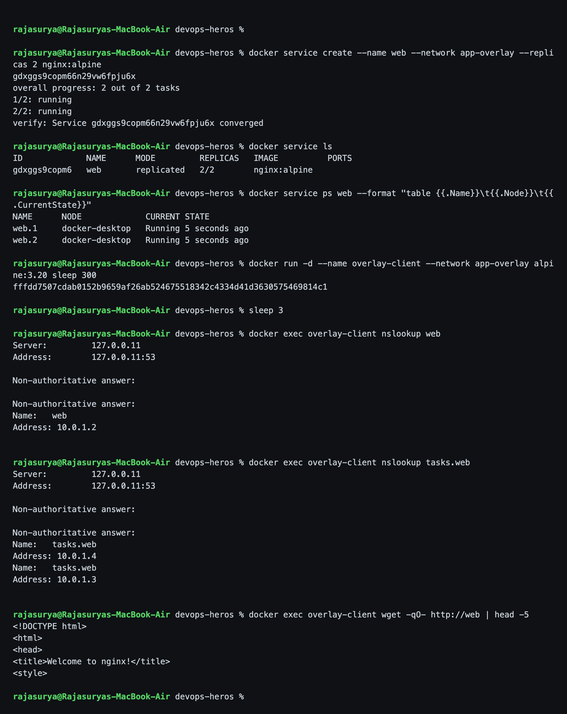

This shows swarm's two DNS names:

- **`web` -> 10.0.1.2** is the service's **Virtual IP (VIP)**. Traffic to it is
  load-balanced across the replicas by IPVS in the kernel.
- **`tasks.web` -> 10.0.1.3 and 10.0.1.4** are the **individual task
  containers**, for when you want to reach each replica yourself.

And `wget http://web` really serves nginx through the overlay.

### Honest limitation

I only have one laptop, so both replicas landed on the same node
(`docker-desktop`) and I **cannot** genuinely demonstrate multi-host networking -
that needs two or more machines. Everything above is a real overlay network with
a real swarm and real service DNS, but on a single host. In a real two-host
swarm, `10.0.1.3` might be on host 1 and `10.0.1.4` on host 2, and
`wget http://web` would work identically - that is the whole value of the overlay.

### Commands - cleanup

```bash
docker rm -f overlay-client
docker service rm web
docker network rm app-overlay
docker swarm leave --force
docker info | grep -i "Swarm:"
```

### Output

```text
rajasurya@Rajasuryas-MacBook-Air devops-heros % docker network ls | grep -E "NETWORK|overlay|frontend-net|back
end-net|database-net"
NETWORK ID     NAME                   DRIVER    SCOPE
56v96ukl0wcw   app-overlay            overlay   swarm
4635fc8064d6   backend-net            bridge    local
bcadb7e9879f   database-net           bridge    local
f073b414a67b   frontend-net           bridge    local
u8ihk866jzi0   ingress                overlay   swarm

rajasurya@Rajasuryas-MacBook-Air devops-heros % docker rm -f overlay-client
overlay-client

rajasurya@Rajasuryas-MacBook-Air devops-heros % docker service rm web
web

rajasurya@Rajasuryas-MacBook-Air devops-heros % sleep 5
rajasurya@Rajasuryas-MacBook-Air devops-heros % docker network rm app-overlay
app-overlay

rajasurya@Rajasuryas-MacBook-Air devops-heros % docker swarm leave --force
Node left the swarm.

rajasurya@Rajasuryas-MacBook-Air devops-heros % docker info | grep -i "Swarm:"
 Swarm: inactive

rajasurya@Rajasuryas-MacBook-Air devops-heros %
```

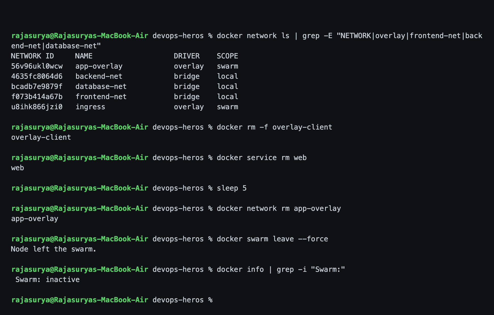

I put my machine back the way I found it - `Swarm: inactive`.

### Use cases

- **Multi-host container clusters** - Docker Swarm, and conceptually the same
  idea as Kubernetes CNI plugins like Flannel VXLAN.
- **Microservices spread across machines** that need to talk by service name.
- **Scaling out** - add a host and the overlay stretches to it, no
  reconfiguration.
- **Cross-host service discovery and load balancing** via the VIP.
- **Encrypted east-west traffic** with `--opt encrypted` when the underlying
  network is not trusted.

### Limitations

- **Needs swarm mode** (or an external KV store) - not usable on a standalone
  Docker host, as my error above shows.
- **VXLAN adds overhead**: 50 bytes of encapsulation per packet, so the effective
  MTU drops (typically 1500 -> 1450). Apps that assume 1500 can hit odd
  fragmentation problems.
- **Slower than bridge or host** - encapsulate/decapsulate every packet, and
  `--opt encrypted` costs more again.
- **Firewall requirements** - 2377/tcp, 7946/tcp+udp and 4789/udp must be open
  between every pair of nodes. This is the usual reason an overlay silently fails.
- **Not encrypted by default** - the control plane is, the data plane is not
  until you ask for it.
- **Harder to debug** - `tcpdump` on the host shows UDP 4789 packets, not your
  application traffic.
- **Docker Swarm itself is much less used now** than Kubernetes, so overlay in
  the Docker-native sense is less common in new projects - though the underlying
  VXLAN idea is exactly what Kubernetes network plugins use.

---

## What I learned overall

- **User-defined networks give you DNS by container name**; the default `bridge`
  network does not. That alone is a reason to always create a network.
- **Isolation is real and cheap.** Splitting into three networks meant the
  frontend genuinely could not reach the database - name did not resolve, 100%
  packet loss to the IP. That is a security boundary for one
  `docker network create`.
- **A container can hold several networks**, and each one adds an interface
  (`eth0`, `eth1`) with its own IP. That is how you build a tiered app.
- **`--network host` removes the network namespace entirely** - no `-p`, no
  mapping, no isolation, and you can prove it because the container can see the
  host's own `docker0` and `br-*` interfaces.
- **Bind mounts are live** - the same PID served both versions of the file - and
  `:ro` is a one-word security improvement.
- **Overlay is bridge-across-machines**, built on VXLAN, and it needs swarm
  because something has to store the cluster-wide map.
- Reading errors carefully pays off. The MySQL `caching_sha2_password` failure
  looked like a networking problem and was actually an auth-plugin mismatch -
  and the fact that it reached an auth error was itself proof the network was fine.
