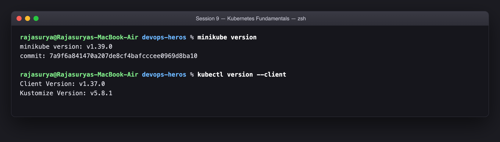
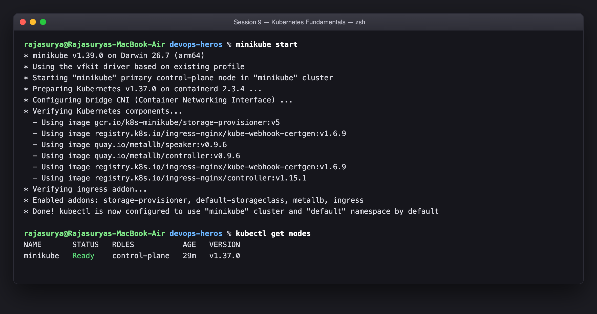
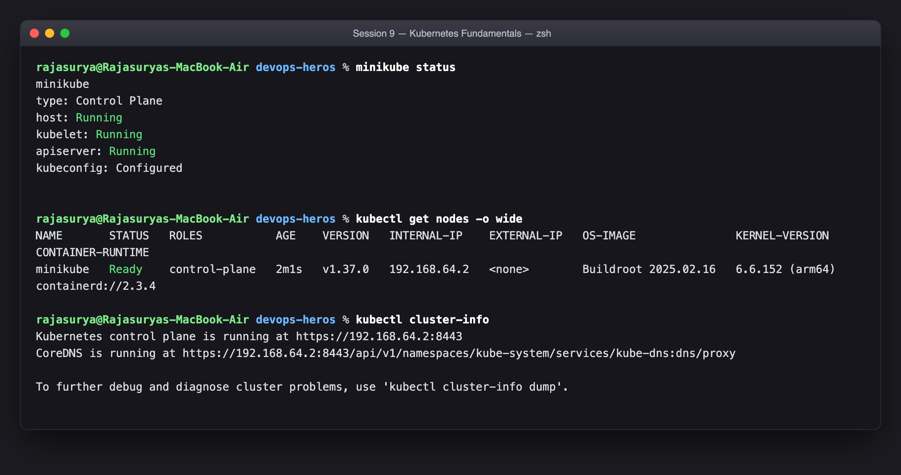
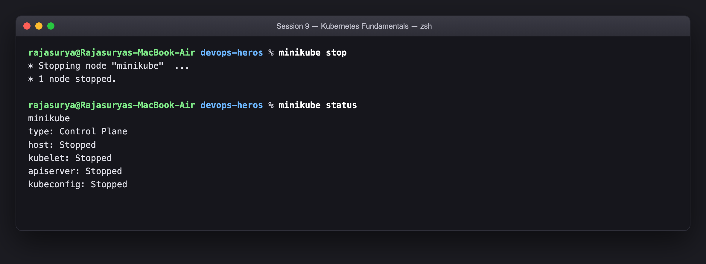

# Session 9 — Kubernetes Fundamentals & Cluster Architecture

**Name:** Rajasurya J
**Enrollment Number:** 24BCS10086
**Course:** SST DevOps & Cloud [SWE]
**Repository:** `devops-heros` / `session9-k8s`

---

## Environment this was actually run on

| Item | Value |
|---|---|
| Host | MacBook Air, Apple Silicon (arm64), macOS 26.7 |
| minikube | v1.39.0 |
| kubectl | v1.37.0 |
| Kubernetes | v1.37.0 |
| Container runtime (in-cluster) | containerd 2.3.4 |
| minikube driver | **`vfkit`** (Apple Virtualization framework) |

> **Why `vfkit` and not the usual `docker` driver.** Docker Desktop on this
> machine only has ~1.9 GiB allocated to its VM, and other project containers
> were already using a large part of that — not enough headroom for a
> Kubernetes control plane. The `vfkit` driver boots its own lightweight VM
> straight off host RAM using Apple's Virtualization framework, so minikube got
> a clean 3 GB / 3 vCPU without touching Docker Desktop. Every `kubectl`
> command below is otherwise identical to the `docker` driver.

Every code block on this page is a real terminal transcript from this machine,
and every screenshot is that same transcript.

---

## Task 1: Minikube & kubectl installation verification

**Description:** Confirm that `minikube` and the Kubernetes CLI `kubectl` are installed on the local system and report their versions.

**Commands:**

```bash
minikube version
kubectl version --client
```

**Output:**

```text
rajasurya@Rajasuryas-MacBook-Air devops-heros % minikube version
minikube version: v1.39.0
commit: 7a9f6a841470a207de8cf4bafcccee0969d8ba10

rajasurya@Rajasuryas-MacBook-Air devops-heros % kubectl version --client
Client Version: v1.37.0
Kustomize Version: v5.8.1
```

**Screenshot:**



---

## Task 2: Starting the Minikube Kubernetes cluster

**Description:** Boot a single-node Kubernetes control plane locally with `minikube start`.

**Command:**

```bash
# first time - this is what created the cluster
minikube start --driver=vfkit --memory=3000 --cpus=3

# afterwards - minikube remembers the profile, so no flags are needed
minikube start
```

The transcript below is the **restart** (Task 4 stopped it first). Because the
profile, the VM disk and the boot image already existed, there is no
`Downloading VM boot image` or `Creating VM` step — it resumes the same cluster.

**Output:**

```text
rajasurya@Rajasuryas-MacBook-Air devops-heros % minikube start
* minikube v1.39.0 on Darwin 26.7 (arm64)
* Using the vfkit driver based on existing profile
* Starting "minikube" primary control-plane node in "minikube" cluster
* Preparing Kubernetes v1.37.0 on containerd 2.3.4 ...
* Configuring bridge CNI (Container Networking Interface) ...
* Verifying Kubernetes components...
  - Using image gcr.io/k8s-minikube/storage-provisioner:v5
  - Using image registry.k8s.io/ingress-nginx/kube-webhook-certgen:v1.6.9
  - Using image quay.io/metallb/speaker:v0.9.6
  - Using image quay.io/metallb/controller:v0.9.6
  - Using image registry.k8s.io/ingress-nginx/kube-webhook-certgen:v1.6.9
  - Using image registry.k8s.io/ingress-nginx/controller:v1.15.1
* Verifying ingress addon...
* Enabled addons: storage-provisioner, default-storageclass, metallb, ingress
* Done! kubectl is now configured to use "minikube" cluster and "default" namespace by default

rajasurya@Rajasuryas-MacBook-Air devops-heros % kubectl get nodes
NAME       STATUS   ROLES           AGE   VERSION
minikube   Ready    control-plane   29m   v1.37.0
```

**Screenshot:**



**What each line of that output means:**

| minikube line | What actually happened |
|---|---|
| `Using the vfkit driver based on existing profile` | The VM hypervisor was read back from the saved profile — no flags needed on a restart. |
| `Starting "minikube" primary control-plane node` | The node that holds **both** the control plane and the workloads was booted. |
| `Preparing Kubernetes v1.37.0 on containerd 2.3.4` | `kubeadm` brought the control plane back up; containerd is the CRI runtime. |
| `Configuring bridge CNI` | The pod network was reinstalled, so pods get IPs out of `10.244.0.0/16`. |
| `Verifying Kubernetes components` | minikube waited for `kube-apiserver`, `etcd`, `kube-scheduler`, `kube-controller-manager` and `kubelet` to report healthy. |
| `Enabled addons: storage-provisioner, default-storageclass, metallb, ingress` | Addons were re-enabled. `metallb` and `ingress` were added later, during Sessions 11 and 12 — this restart proves addon state survives a stop. |
| `kubectl is now configured to use "minikube" cluster` | minikube wrote the cluster, user and context back into `~/.kube/config`. |

`kubectl get nodes` afterwards reports `AGE 29m`, not `0s` — the node object was
read back out of `etcd` rather than recreated. The cluster was **resumed**, not
rebuilt.

---

## Task 3: Verifying cluster status and node health

**Description:** Check that the control plane, kubelet, API server and CoreDNS are up, and that the node has reached `Ready`.

**Commands:**

```bash
minikube status
kubectl get nodes -o wide
kubectl cluster-info
```

**Output:**

```text
rajasurya@Rajasuryas-MacBook-Air devops-heros % minikube status
minikube
type: Control Plane
host: Running
kubelet: Running
apiserver: Running
kubeconfig: Configured


rajasurya@Rajasuryas-MacBook-Air devops-heros % kubectl get nodes -o wide
NAME       STATUS   ROLES           AGE    VERSION   INTERNAL-IP    EXTERNAL-IP   OS-IMAGE               KERNEL-VERSION    CONTAINER-RUNTIME
minikube   Ready    control-plane   2m1s   v1.37.0   192.168.64.2   <none>        Buildroot 2025.02.16   6.6.152 (arm64)   containerd://2.3.4

rajasurya@Rajasuryas-MacBook-Air devops-heros % kubectl cluster-info
Kubernetes control plane is running at https://192.168.64.2:8443
CoreDNS is running at https://192.168.64.2:8443/api/v1/namespaces/kube-system/services/kube-dns:dns/proxy

To further debug and diagnose cluster problems, use 'kubectl cluster-info dump'.
```

**Screenshot:**



Reading that output:

- `host: Running` — the VM itself is powered on.
- `kubelet: Running` — the node agent is alive and posting heartbeats.
- `apiserver: Running` — the control plane is accepting API requests.
- `kubeconfig: Configured` — the local `kubectl` is pointed at this cluster.
- `STATUS Ready` — the kubelet's `Ready` condition is `True`, so the scheduler is allowed to place pods on it.
- `ROLES control-plane` — this is a single-node cluster, so the control-plane node also runs workloads (it carries no `NoSchedule` taint in minikube).

---

## Task 4: Stopping the Minikube cluster

**Description:** Shut the cluster down gracefully so the VM releases its CPU and memory back to the host.

**Commands:**

```bash
minikube stop
minikube status
```

**Output:**

```text
rajasurya@Rajasuryas-MacBook-Air devops-heros % minikube stop
* Stopping node "minikube"  ...
* 1 node stopped.

rajasurya@Rajasuryas-MacBook-Air devops-heros % minikube status
minikube
type: Control Plane
host: Stopped
kubelet: Stopped
apiserver: Stopped
kubeconfig: Stopped
```

**Screenshot:**



After `stop`, every line reads `Stopped` — `host`, `kubelet`, `apiserver` and
`kubeconfig`. The VM is powered off, so nothing is listening and `kubectl`
commands will fail until it is started again.

What is **not** destroyed is the important part: the VM's disk, and with it
`etcd`, still hold every object in the cluster. `minikube start` resumes the
same cluster (Task 2 above shows the node coming back with its original age),
which is why `stop` is the right command when you just want your RAM back.
**`minikube delete` is the destructive one** — that removes the profile, the
disk and the whole cluster state.

---

## Task 5: Kubernetes cluster architecture & core components

**Description:** Document the Control Plane and Worker Node components from the [official Kubernetes architecture documentation](https://kubernetes.io/docs/concepts/architecture/), and explain how they interact.

### The picture

```
+-------------------------------------------------------------------------------+
|                            CONTROL PLANE (MASTER)                             |
|                                                                               |
|   +-------------------+       +--------------------+      +---------------+   |
|   |       etcd        |<----->|  kube-apiserver    |<---->| kube-scheduler|   |
|   | (cluster state DB)|       |   (the front door) |      | (pod placement)|  |
|   +-------------------+       +---------+----------+      +---------------+   |
|                                         ^                                     |
|                                         |                                     |
|                            +------------+-------------+                       |
|                            | kube-controller-manager  |                       |
|                            |  (reconciliation loops)  |                       |
|                            +--------------------------+                       |
+-----------------------------------------+-------------------------------------+
                                          |  (kubelet watches the API server)
                        +-----------------+-----------------+
                        v                                   v
+------------------------------------+ +------------------------------------+
|            WORKER NODE 1           | |            WORKER NODE 2           |
|   +------------+  +------------+   | |   +------------+  +------------+   |
|   |  kubelet   |  | kube-proxy |   | |   |  kubelet   |  | kube-proxy |   |
|   +-----+------+  +-----+------+   | |   +-----+------+  +-----+------+   |
|         v               v          | |         v               v          |
|   +----------------------------+   | |   +----------------------------+   |
|   | CRI runtime (containerd)   |   | |   | CRI runtime (containerd)   |   |
|   +----------------------------+   | |   +----------------------------+   |
|         v                          | |         v                          |
|   +------------+  +------------+   | |   +------------+  +------------+   |
|   |   Pod 1    |  |   Pod 2    |   | |   |   Pod 3    |  |   Pod 4    |   |
|   | [container]|  | [container]|   | |   | [container]|  | [container]|   |
|   +------------+  +------------+   | |   +------------+  +------------+   |
+------------------------------------+ +------------------------------------+
```

On this single-node minikube cluster, **both** boxes are the same VM — which is
exactly why `kubectl get nodes` shows one node with the `control-plane` role.

### 1. Control Plane components

**`kube-apiserver` — the front door**
The only component anything else talks to. It exposes the Kubernetes REST API, authenticates and authorises every request (RBAC), validates the object, and persists it. `kubectl`, the dashboard, controllers and every kubelet all go through it. Nothing else in the cluster is allowed to talk to `etcd` directly — the API server is the single writer. That is what makes it the choke point *and* the audit point.

**`etcd` — the cluster's memory**
A distributed, strongly consistent key-value store (Raft). It holds the entire desired state of the cluster: every Deployment, Service, ConfigMap, Secret and node record. Two consequences worth remembering: everything in Kubernetes is an API object with a *declarative desired state* stored here, and **backing up `etcd` is backing up the cluster**.

**`kube-scheduler` — placement**
Watches for Pods that have been admitted but have `spec.nodeName` empty. For each one it runs two phases — *filtering* (which nodes are even feasible: enough allocatable CPU/memory, matching `nodeSelector`/affinity, tolerating the node's taints, required volumes attachable) and *scoring* (of the feasible nodes, which is best). It then writes the chosen node back to the Pod object. Note it only *decides*; it never starts a container.

**`kube-controller-manager` — the reconciliation loops**
One binary running many controllers, each a loop asking *"does current state match desired state? if not, act."* Examples:
- *Node controller* — notices a node stopped heartbeating and evicts its pods.
- *ReplicaSet controller* — if desired is 3 and 2 are running, it creates one more.
- *Deployment controller* — drives rolling updates by managing ReplicaSets.
- *EndpointSlice controller* — keeps the list of healthy Pod IPs behind each Service current.

**`cloud-controller-manager`** (not present here) — on a real cloud this is what turns a `type: LoadBalancer` Service into an actual cloud load balancer, and attaches cloud disks. On minikube there is no cloud, which is why `minikube tunnel` has to fake it.

### 2. Worker Node components

**`kubelet` — the node's agent**
The only component that actually runs containers. It watches the API server for Pods assigned to *its* node, then tells the CRI runtime to pull images and start containers to match that `PodSpec`. It runs the liveness/readiness/startup probes, reports container status and node conditions back up, and restarts containers per `restartPolicy`. Important detail: the kubelet manages containers that came from a PodSpec — it will not touch containers you started by hand.

**`kube-proxy` — Service networking**
Maintains the packet-forwarding rules (`iptables`, or `IPVS` at scale) that make a Service's virtual IP work. A Service's ClusterIP is not bound to any process anywhere — it is a rule that rewrites the destination to one of the backing Pod IPs. That rewrite is what gives you in-cluster load balancing, and it is why a Service keeps working when pods are replaced.

**Container runtime (CRI)**
The software that actually pulls images and runs containers, spoken to over the Container Runtime Interface. This cluster uses **containerd 2.3.4**. Historically the kubelet talked to the Docker daemon through a shim; that shim (`dockershim`) was removed in Kubernetes 1.24, so modern clusters use `containerd` or `CRI-O` directly. Images built by Docker still run fine — they are OCI images.

**`Pod` — the smallest deployable unit**
One or more containers that are always scheduled together and share a network namespace (so one IP and one port space — they reach each other on `localhost`) plus any volumes. You almost never create bare Pods in production; you let a Deployment/StatefulSet/DaemonSet create them, so something is responsible for replacing them.

### 3. How a `kubectl apply` actually flows through all of it

This is the interaction the docs ask you to explain:

```
kubectl apply -f pod.yml
   |
   1. HTTPS request to kube-apiserver
   |
   2. apiserver: authenticate -> authorise (RBAC) -> admission -> validate
   |
   3. apiserver writes the object to etcd          [desired state now stored]
   |
   4. kube-scheduler sees a Pod with no node, filters + scores nodes,
      and PATCHes spec.nodeName = minikube
   |
   5. the kubelet on that node is watching for pods bound to it, sees this one
   |
   6. kubelet -> CRI (containerd): pull image, create sandbox, start container
   |
   7. kubelet reports status back to the apiserver -> stored in etcd
   |
   8. kube-proxy programs iptables rules if a Service selects this pod
   |
   9. kubectl get pods reads that status back out of the apiserver
```

The thing to notice: **no component calls another component directly.** The
scheduler does not call the kubelet; it writes to the API server and the kubelet
notices. Everything is a watch on shared state. That is why the control plane
survives any single component restarting — the desired state is in `etcd`, not
in anyone's memory.

---

## Submission

| Field | Value |
|---|---|
| Session | 09 — Kubernetes Fundamentals |
| File | `session9-k8s/Rajasurya-24BCS10086/README.md` |
| Screenshots | `session9-k8s/Rajasurya-24BCS10086/images/` |

### Reference material used

- <https://kubernetes.io/docs/concepts/architecture/>
- <https://kubernetes.io/docs/tutorials/kubernetes-basics/>
- <https://minikube.sigs.k8s.io/docs/start/>
